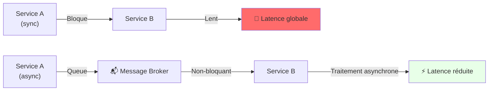
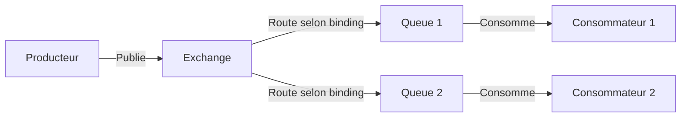
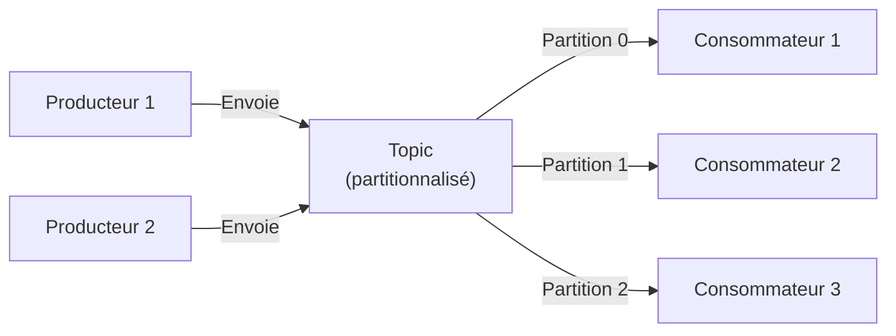
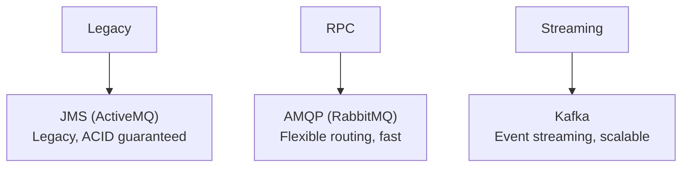

# 📨 Messaging Asynchrone

---

## Pourquoi Async Messaging ?



### Avantages
- ✅ **Découplage**: Services indépendants, pas de dépendance directe
- ✅ **Résilience**: Si consommateur down, messages en attente
- ✅ **Scalabilité**: Producteur rapide, consommateurs à leur rythme
- ✅ **Buffering**: Pics de charge absorbés par la queue

---

## JMS (Java Message Service)

### Concepts

**Point-to-Point (Queues)**

```
Producteur → [Queue] → Consommateur 1
                     (Un seul reçoit)
```

**Publish/Subscribe (Topics)**

```
Producteur → [Topic] → Consommateur 1
                    → Consommateur 2
                    → Consommateur N (tous reçoivent)
```

---

### Exemple Spring: Envoi & Réception

```java
@Configuration
@EnableJms
public class JmsConfig {
    
    @Bean
    public JmsTemplate jmsTemplate(ConnectionFactory connectionFactory) {
        return new JmsTemplate(connectionFactory);
    }
}

// Producteur
@Component
public class OrderProducer {
    @Autowired
    private JmsTemplate jmsTemplate;
    
    public void sendOrder(Order order) {
        jmsTemplate.convertAndSend("order-queue", order);
    }
}

// Consommateur
@Component
public class OrderConsumer {
    
    @JmsListener(destination = "order-queue")
    public void receiveOrder(Order order) {
        System.out.println("Processing order: " + order.getId());
        // Logique métier
    }
}
```

### Implémentations
- **ActiveMQ** (Apache, open-source, fiable)
- **IBM MQ** (Enterprise)
- **Oracle WebLogic** (Enterprise)

---

## AMQP (Advanced Message Queuing Protocol)

### Architecture



### Concepts clés
- **Exchange**: Reçoit messages, les route selon type (direct, topic, fanout)
- **Queue**: Stocke messages
- **Binding**: Règle qui lie exchange ↔ queue

### Exemple Spring: RabbitMQ

```java
@Configuration
public class RabbitConfig {
    
    // Déclarer queue, exchange, binding
    @Bean
    public Queue orderQueue() {
        return new Queue("order.queue", true);  // durable
    }
    
    @Bean
    public DirectExchange orderExchange() {
        return new DirectExchange("order.exchange", true, false);
    }
    
    @Bean
    public Binding binding(Queue orderQueue, DirectExchange orderExchange) {
        return BindingBuilder.bind(orderQueue)
            .to(orderExchange)
            .with("order.created");
    }
}

// Producteur
@Component
public class OrderProducer {
    @Autowired
    private RabbitTemplate rabbitTemplate;
    
    public void publishOrder(Order order) {
        rabbitTemplate.convertAndSend(
            "order.exchange",
            "order.created",
            order
        );
    }
}

// Consommateur
@Component
public class OrderConsumer {
    
    @RabbitListener(queues = "order.queue")
    public void handleOrderCreated(Order order) {
        System.out.println("Order received: " + order.getId());
        // Logique métier
    }
}
```

### Implémentations
- **RabbitMQ** (populaire, performant, open-source)
- **Apache Qpid** (AMQP natif)

---

## Apache Kafka

### Architecture



### Concepts clés
- **Topic**: Flux d'événements partitionnalisé
- **Partition**: Garantit ordre dans partition; scalabilité horizontale
- **Consumer Group**: Groupe de consommateurs, parallélisation
- **Offset**: Position dans le stream; replay possible

### Exemple Spring: Kafka

```java
@Configuration
public class KafkaConfig {
    // Auto-configuration par Spring Boot suffisante
}

// Producteur
@Component
public class OrderEventProducer {
    @Autowired
    private KafkaTemplate<String, Order> kafkaTemplate;
    
    public void publishOrderEvent(Order order) {
        kafkaTemplate.send("order-events", order.getId(), order);
    }
}

// Consommateur
@Component
public class OrderEventConsumer {
    
    @KafkaListener(topics = "order-events", groupId = "order-service")
    public void consumeOrderEvent(Order order) {
        System.out.println("Event received: " + order.getId());
        // Logique métier
    }
}
```

### Cas d'usage
- **Event Streaming**: Log d'événements durables
- **Metrics/Logs**: Centralisation (audit, analytique)
- **Real-time Analytics**: Traitement continu de flux
- **Broadcast**: Tous consommateurs reçoivent

---

## Comparaison: JMS vs AMQP vs Kafka

| Critère | JMS | AMQP (RabbitMQ) | Kafka |
|---------|-----|-----------------|-------|
| **Latence (p50)** | 5-50 ms | 1-10 ms | 5-20 ms |
| **Throughput** | 10k-100k msg/s | 100k-1M msg/s | 100k-1M+ msg/s |
| **Persistence** | Configurable | ✅ Queue durable | ✅ Durée configurable |
| **Replay** | ❌ Non | ❌ Non | ✅ Oui (offset) |
| **Ordering** | Par queue | Par queue | Par partition |
| **Cas d'usage** | Legacy, transactions | RPC, RPC-like | Event streaming, logs |



---

## Recommandations

| Scénario | Choix | Raison |
|----------|-------|--------|
| API synchrone, transactionnel | ❌ Ne pas utiliser | Async != sync |
| Microservices, RPC-like | RabbitMQ (AMQP) | Routing flexible, latence basse |
| Event sourcing, audit log | Kafka | Replay, durabilité, scalabilité |
| Legacy J2EE, ACID garanti | JMS + ActiveMQ | Écosystème établi |
| Pics de charge, buffering | Kafka ou RabbitMQ | Absorber surcharge |

---

## Bonnes pratiques

- ✅ **Idempotence**: Consommateur doit gérer duplicates
- ✅ **Dead Letter Queue**: Gérer messages non-traités
- ✅ **Monitoring**: Lag de queues, consumer lag (Kafka)
- ✅ **Sérialisation**: JSON ou Avro (schéma évolutif)
- ✅ **Timeouts**: Configurer selon latence réseau
- ✅ **Partitionnement** (Kafka): Clé = stable pour ordre

