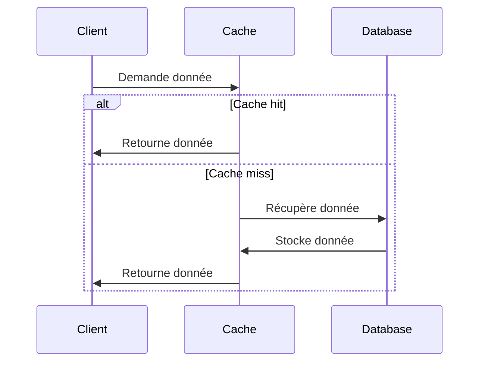
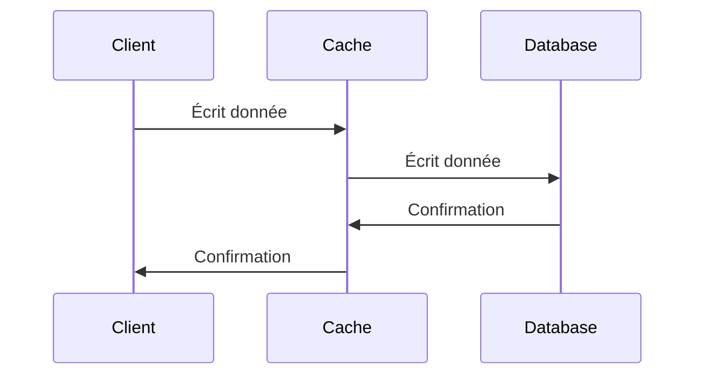
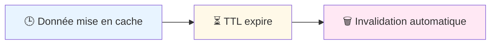
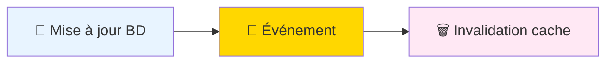

# 🚀 Caching Avancé

---

## Patterns de Cache

### Cache-Aside (Lazy Loading)

### Write-Through

---

## Stratégies d'Invalidation

### 1. Time-based (TTL)

### 2. Event-based

---

## Comparaison Redis vs Memcached

| Critère | Redis | Memcached |
|---|---|---|
| **Persistance** | ✅ Oui | ❌ Non |
| **Structures** | ✅ Riches | ❌ Clé-valeur |
| **Réplication** | ✅ Master-Slave | ❌ Basique |
| **Performance** | ⚠️ Très élevée | ✅ Extrême |
| **Utilisation** | Cache + BD | Cache pur |

### Cas d'usage

- **Redis**: Sessions, leaderboards, pub/sub
- **Memcached**: Cache simple, performances pures