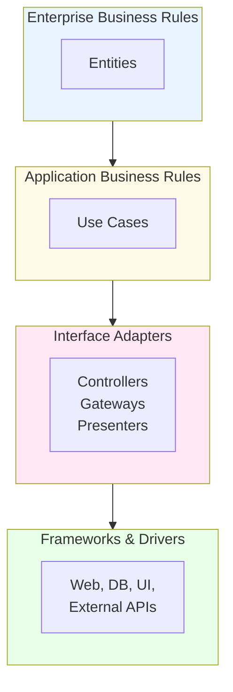

# ✨ Clean Code & Architecture

---

## Clean Code: Introduction

### Pourquoi le Clean Code ?

> "Any fool can write code that a computer can understand. Good programmers write code that humans can understand." — **Robert C. Martin**, Clean Code


- Réduction des bugs: Code clair = moins d'erreurs
- Maintenabilité: Facile à modifier et à déboguer
- Collaboration: Équipes comprennent rapidement le code
- Évolutivité: Ajout de fonctionnalités sans refonte
- Productivité: Développeurs plus rapides et efficaces

---

## Code sale vs Code propre

#### ❌ Code sale (mauvais)


```plaintext
function calc(c) {
    let p = 0;
    if (c.age < 25)
        p = c.sal * 0.15;
    else if (c.age < 65)
        p = c.sal * 0.1;
    else
        p = c.sal * 0.2;
    
    // TODO: ajouter taxes
    // FIXME: bug ici
    return p;
}
```

#### ✅ Code propre (bon)

```plaintext
double calculateInsurancePremium(
    Customer customer) {
    int age = customer.getAge();
    double salary = customer.getSalary();
    
    PremiumRate rate = 
        determinePremiumRate(age);
    
    return salary * rate.getPercentage();
}

PremiumRate determinePremiumRate(
    int age) {
    if (age < 25) return YOUNG_RATE;
    if (age < 65) return STANDARD_RATE;
    return SENIOR_RATE;
}
```

---

## Règle 1: Nommage clair

### Noms révélateurs d'intention

| ❌ Mauvais | ✅ Bon | Raison |
| --- | --- | --- |
| d | elapsedTimeInDays | Spécifique et clair |
| calcP() | calculatePremium() | Verbe + nom explicite |
| list1, list2 | activeContracts, expiredContracts | Contexte et utilité clairs |
| Manager | ContractManager | Plus précis et domaine-spécifique |

---

## Règle 2: Fonctions courtes (SRP)

Single Responsibility Principle: Une fonction = une seule raison de changer

### Fonction trop grosse (mauvais):

```plaintext
public void processContract(Contract c) {
    // Validation
    if (c.getSalary() < 0) throw new Exception(...);
    
    // Calcul de prime
    double premium = c.getSalary() * 0.1;
    
    // Enregistrement
    database.save(c);
    
    // Envoi email
    emailService.send(c.getEmail(), premium);
    
    // Logging
    logger.info("Contrat traité: " + c.getId());
}
```
### Fonctions courtes et focalisées (bon):

```plaintext
public void processContract(Contract c) {
    validateContract(c);
    double premium = calculatePremium(c);
    saveContract(c);
    notifyCustomer(c, premium);
}

private void validateContract(Contract c) { ... }
private double calculatePremium(Contract c) { ... }
private void saveContract(Contract c) { ... }
private void notifyCustomer(Contract c, double p) { ... }
```

---

## Règle 3: Gestion des erreurs

### Préférer les exceptions aux codes de retour:

#### ❌ Code de retour

```plaintext
int status = 
    contractService.save(c);
    
if (status == 0) {
    System.err.println("Erreur!");
} else if (status == 1) {
    System.out.println("Saved");
}
```

#### ✅ Exception

```plaintext
try {
    contractService.save(c);
    logger.info("Contrat sauvé");
} catch (
    InvalidContractException e) {
    logger.error(
        "Contrat invalide: "
        + e.getMessage()
    );
}
```

---

## Règle 4: DRY (Don't Repeat Yourself)

Éliminer les répétitions de code.

#### ❌ Code répété

```plaintext
// ContractService
double premium = salary * 0.1;
if (premium < 100) premium = 100;
return premium;

// CustomerService
double amount = salary * 0.1;
if (amount < 100) amount = 100;
return amount;

// BenefitService
double benefit = salary * 0.1;
if (benefit < 100) benefit = 100;
return benefit;
```

#### ✅ Extraction en méthode

```plaintext
// PricingCalculator
private double calculateAmount(
    double salary) {
    double amount = salary * 0.1;
    return Math.max(amount, 100);
}

// Utilisation
ContractService uses 
    calculateAmount();
    
CustomerService uses 
    calculateAmount();
    
BenefitService uses 
    calculateAmount();
```

---

## Règle 5: Commentaires

Le code doit se commenter lui-même. Les commentaires ne doivent expliquer que le POURQUOI, pas le QUOI.

<div class="grid grid-cols-2 gap-4">
  <div>

#### ❌ Commentaires inutiles

```plaintext
// Incrémenter i
i++;

// Vérifier si la liste 
// n'est pas vide
if (list.size() > 0) {
    // Boucler sur les éléments
    for (Item item : list) {
        // Ajouter à total
        total += item.getValue();
    }
}
```
</div>
<div>

#### ✅ Commentaires utiles

```plaintext
// Limite minimale définie par
// la régulation assurance (2024)
final double MINIMUM_PREMIUM = 100;

// Algorithme de pricing Bayésien
// basé sur historique client
// Source: ACME-2023 Paper
private double 
    calculateAdaptivePremium(
        Customer c) {
    ...
}
```
</div>
</div>

---

## Règle 6: Formatage et style

### La cohérence est clé

- Indentation: 2 ou 4 espaces (pas de tabs)
- Longueur de ligne: Max 100-120 caractères
- Noms de classes: PascalCase (ContractService)
- Noms de variables: camelCase (myVariable)
- Noms de constantes: UPPER_SNAKE_CASE (MAX_SIZE)
- Espaces: Autour des opérateurs (x = y + z)

---

## Règle 7: Testabilité

### Propriétés d'un code testable:

#### Exemple: Test unitaire simple

Code testable = code découplé

- ✅ Dépendances injectées (pas "new Database()")
- ✅ Logique métier indépendante du framework
- ✅ Pas de singletons globaux
- ✅ Pas d'appels à des APIs externes en dur
- ✅ Méthodes courtes et déterministes

```plaintext
@Test
public void testCalculatePremiumForYoungDriver() {
    Customer young = new Customer(20, 30000);
    double premium = service.calculatePremium(young);
    assertEquals(4500, premium, 0.01);
}
```

---

## Récapitulatif: quelques règles du Clean Code

| # | Règle | Bénéfice |
| --- | --- | --- |
| 1 | Nommage clair | Comprendre rapidement l'intention |
| 2 | Fonctions courtes (SRP) | Facile à tester et maintenir |
| 3 | Gestion des erreurs | Code plus lisible et robuste |
| 4 | DRY (pas de répétition) | Modifications en un seul endroit |
| 5 | Commentaires utiles | Comprendre le POURQUOI |
| 6 | Formatage cohérent | Équipe sur la même longueur d'onde |
| 7 | Testabilité | Confiance dans le code |

---

## Clean Architecture: Introduction

> "A software architect is a programmer who has stopped programming and has started thinking about programs." — **Robert C. Martin**, Clean Architecture


Structure logicielle indépendante des frameworks, testable et maintenable.

Principe: Les couches intérieures ne dépendent jamais des couches extérieures



---

## Les 4 couches de Clean Architecture 1/2

#### 1️⃣ Entities (Cœur métier)

Objets métiers purs, pas de frameworks

```plaintext
public class Contract {
    private String id;
    private Customer customer;
    private double premium;
    public boolean isValid() {
        return premium > 0 
            && customer != null;
    }
}
```

#### 2️⃣ Use Cases (Logique applicative)

Règles métier spécifiques à l'app

public class CreateContractUseCase {
    private ContractRepository repo;
    public void execute(
        CreateContractRequest req) {
        Contract c = new Contract(...);
        validateContract(c);
        repo.save(c);
    }
}

---

## Les 4 couches de Clean Architecture 2/2

#### 3️⃣ Interface Adapters

Controllers, Gateways, Presenters

```plaintext

@RestController
public class ContractController {
    @PostMapping("/contracts")
    public void create(
        @RequestBody Request req) {
        useCase.execute(req);
    }
}
```

#### 4️⃣ Frameworks & Drivers

Spring, Hibernate, PostgreSQL, etc.

Détails techniques, facilement remplaçables

```plaintext
@RestController
public class ContractController {
    @PostMapping("/contracts")
    public void create(
        @RequestBody Request req) {
        useCase.execute(req);
    }
}
```

---

## Direction des dépendances

Règle d'or: Les dépendances pointent toujours vers l'intérieur

```mermaid
graph LR
                            Frameworks["🔴 Frameworks/Drivers<br/>(Spring, Hibernate, DB)"]
                            Interface["🟠 Interface Adapters<br/>(Controllers, Presenters)"]
                            UseCase["🟡 Use Cases<br/>(Règles métier applicatives)"]
                            Entities["🟢 Entities<br/>(Objets métiers purs)"]
                            
                            Frameworks -->|Dépend de| Interface
                            Interface -->|Dépend de| UseCase
                            UseCase -->|Dépend de| Entities
                            Entities -->|Ne dépend de PERSONNE| X["(Aucun appel sortant)"]
                            
                            style Frameworks fill:#ffcccc
                            style Interface fill:#ffe8cc
                            style UseCase fill:#ffffcc
                            style Entities fill:#ccffcc
                            style X fill:#ffffff,stroke:#999,stroke-dasharray: 5 5
```



---

## Structure de projet Clean Architecture

<div class="grid grid-cols-2 gap-4">
  <div>
```plaintext
src/
├── main/java/com/myapp/
│   │
│   ├── domain/               # 🟢 Entities
│   │   ├── Contract.java
│   │   ├── Customer.java
│   │   └── ContractRepository.java (interface)
│   │
│   ├── application/          # 🟡 Use Cases
│   │   ├── CreateContractUseCase.java
│   │   ├── UpdateContractUseCase.java
│   │   └── dto/
│   │       └── CreateContractRequest.java
│   │
│   ├── infrastructure/       # 🟠 Adapters & Drivers
│   │   ├── controller/
│   │   │   └── ContractController.java
│   │   ├── persistence/
│   │   │   ├── PostgresContractRepository.java
│   │   │   └── ContractEntity.java (JPA)
│   │   └── external/
│   │       └── EmailServiceAdapter.java
│   │
│   └── config/
│       └── DependencyInjectionConfig.java
```
</div>
<div>

```plaintext
│
└── test/
    └── java/com/myapp/
        ├── domain/
        ├── application/
        └── infrastructure/
```
</div>
</div>

---

## Cas d'usage: CreateContractUseCase

### Étapes du processus:

#### Code complet:

<div class="grid grid-cols-2 gap-4">
  <div>
```plaintext
@Service
public class CreateContractUseCase {
    private final ContractRepository repo;
    private final EmailService emailService;
    private final PremiumCalculator calculator;
    
    @Inject // Dependency Injection
    public CreateContractUseCase(
        ContractRepository repo,
        EmailService emailService,
        PremiumCalculator calculator) {
        this.repo = repo;
        this.emailService = emailService;
        this.calculator = calculator;
    }
```
</div>
<div>

```plaintext
    public ContractResponse execute(
        CreateContractRequest request) {
        // 1. Validation
        validateRequest(request);
        
        // 2. Création entité
        Contract contract = new Contract(
            request.getCustomerId(),
            request.getType()
        );
        
        // 3. Calcul de prime
        double premium = calculator
            .calculate(contract);
        contract.setPremium(premium);
        
        // 4. Persistance
        Contract saved = repo.save(contract);
        
        // 5. Notification
        emailService.sendConfirmation(
            saved.getCustomer().getEmail(),
            saved
        );
        
        return new ContractResponse(saved);
    }
    
    private void validateRequest(
        CreateContractRequest request) {
        if (request.getCustomerId() == null)
            throw new InvalidRequestException(
                "Customer ID required"
            );
        // Plus de validations...
    }
}
```
</div>
</div>

---

## Tests unitaires faciles

#### Test du CreateContractUseCase

Un avantage clé de Clean Architecture: testabilité.

<div class="grid grid-cols-2 gap-4">
  <div>
```plaintext
public class CreateContractUseCaseTest {
    private CreateContractUseCase useCase;
    private ContractRepository mockRepo;
    private EmailService mockEmail;
    private PremiumCalculator mockCalc;
    
    @Before
    public void setup() {
        // Créer des mocks (faux objets)
        mockRepo = mock(ContractRepository.class);
        mockEmail = mock(EmailService.class);
        mockCalc = mock(PremiumCalculator.class);
        
        // Injector les dépendances
        useCase = new CreateContractUseCase(
            mockRepo, mockEmail, mockCalc
        );
    }
```

</div>
<div>
    
```plaintext 
    @Test
    public void shouldCreateContractWithValidData() {
        // Given
        CreateContractRequest req = 
            new CreateContractRequest("cust-1", "AUTO");
        when(mockCalc.calculate(any()))
            .thenReturn(1200.0);
        when(mockRepo.save(any()))
            .thenReturn(new Contract(...));
        
        // When
        ContractResponse response = useCase.execute(req);
        
        // Then
        assertNotNull(response);
        verify(mockEmail).sendConfirmation(...);
        verify(mockRepo).save(...);
    }
}
```
</div>
</div>


---

## Avantages de Clean Architecture

<div class="grid grid-cols-2 gap-4">
  <div>

#### ✅ Pour le développement

- Logique métier isolée
- Tests unitaires simples
- Code découplé
- Facile à naviguer


#### ✅ Pour la maintenance

- Changements localisés
- Moins de bugs
- Évolution facilitée
- Refactoring sûr
</div>
<div>

#### ✅ Pour le business

- Réduction des coûts
- Time-to-market amélioré
- Moins de bugs en prod
- Équipes plus productives

#### ✅ Pour l'architecture

- Framework agnostique
- Technologie replaceable
- Scalabilité intégrée
- Future-proof
</div>
</div>
---

## Pièges à éviter

<div class="grid grid-cols-2 gap-4">
  <div>


#### ❌ Over-engineering

- Trop de couches
- Abstractions inutiles
- Code complexe pour du simple

Conseil: Adapter la complexité aux besoins

#### ❌ Entities contaminées

- Annotations JPA/Spring
- Logique métier dispersée
- Dépendances externes

Conseil: Entities = POJO purs
</div>
<div>

#### ❌ DTOs oubliés

- Entities retournées au client
- Leaks d'implémentation
- Couplage fort

Conseil: Toujours utiliser des DTOs

#### ❌ Tests négligés


- Tests intégration lents
- Pas de tests unitaires
- Coverage faible

Conseil: 70%+ du code couvert
</div>
</div>
---

## Comparaison: Approches d'architecture

| Aspect | Architecture simple | Clean Architecture |
| --- | --- | --- |
| Testabilité | Difficile (couplage fort) | Facile (découplage) |
| Complexité initiale | Faible | Modérée à élevée |
| Maintenance long terme | Difficile (dette tech) | Facile (structure claire) |
| Scalabilité | Limitée | Excellente |
| Changement technologie | Coûteux (réécriture) | Simple (adaptateurs) |
| Productivité équipe | Diminue avec la taille | Stable et prévisible |
| Idéal pour | Projet simples ou courts termes | Projets stratégiques long terme |
