# 🗃️ Database Sharding et Partitioning

---

## Définitions

### Sharding Horizontal

```mermaid
graph TB
    A["📊 Données"] --> B["🔪 Partitionnement"]
    B --> C["Shard 1"]
    B --> D["Shard 2"]
    B --> E["Shard N"]

    style A fill:#e8f4ff
    style B fill:#ff6b6b
    style C fill:#fff9e8
    style D fill:#ffe8f4
    style E fill:#e8ffe8
```

### Partitioning Vertical

```mermaid
graph TB
    A["📊 Table"] --> B["🔪 Séparation"]
    B --> C["Colonnes A-B"]
    B --> D["Colonnes C-D"]
    B --> E["Colonnes E-F"]

    style A fill:#e8f4ff
    style B fill:#ff6b6b
    style C fill:#fff9e8
    style D fill:#ffe8f4
    style E fill:#e8ffe8
```

---

## Stratégies de Sharding

### 1. Key-Based Sharding

```mermaid
graph LR
    A["🔑 Clé"] -->|Hash| B["📊 Shard"]
    B --> C["🗄️ Stockage"]

    style A fill:#e8f4ff
    style B fill:#fff9e8
    style C fill:#ffe8f4
```

### 2. Range-Based Sharding

```mermaid
graph LR
    A["📏 Plage de valeurs"] --> B["📊 Shard 1"]
    C["📏 Plage suivante"] --> D["📊 Shard 2"]

    style A fill:#e8f4ff
    style B fill:#fff9e8
    style C fill:#ffe8f4
    style D fill:#e8ffe8
```

---

## Implémentation Pratique

### PostgreSQL avec Citus

```mermaid
graph LR
    A["📱 Application"] --> B["🔄 Coordinateur"]
    B --> C["🗄️ Worker 1"]
    B --> D["🗄️ Worker 2"]
    B --> E["🗄️ Worker N"]

    style A fill:#e8f4ff
    style B fill:#ffd700
    style C fill:#fff9e8
    style D fill:#ffe8f4
    style E fill:#e8ffe8
```

### MongoDB Sharding

```mermaid
graph LR
    A["📱 Client"] --> B["🎯 Mongos"]
    B --> C["🗄️ Config Servers"]
    B --> D["📊 Shard 1"]
    B --> E["📊 Shard 2"]

    style A fill:#e8f4ff
    style B fill:#ffd700
    style C fill:#fff9e8
    style D fill:#ffe8f4
    style E fill:#e8ffe8
```

