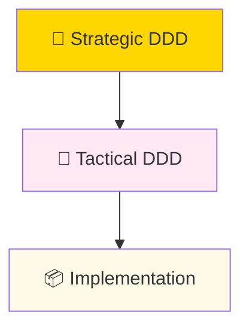
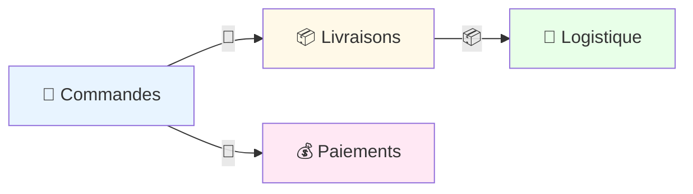
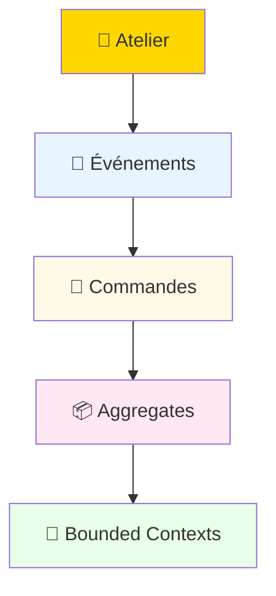

# 🎯 Domain-Driven Design

---
layout: two-cols
---

## Pourquoi le DDD ?

::right::

Au début des années 2000, les projets logiciels complexes souffraient souvent d'un fossé entre besoins métier et implémentations techniques, malgré l'essor de l'orienté objet.

Eric Evans synthétise ses expériences pour proposer un cadre structuré centré sur le domaine métier, langage ubiquitaire et modélisation collaborative, influencé par l'agilité naissante (XP) et visant à rendre les gros systèmes maintenables.

---

## Strategic vs Tactical DDD

### Niveaux de DDD

### Strategic DDD

- **Bounded Contexts**: Frontières claires
- **Context Mapping**: Relations entre contextes
- **Ubiquitous Language**: Langage commun

### Tactical DDD

- **Aggregates**: Cohérence transactionnelle
- **Domain Events**: Communication asynchrone
- **Entities vs Value Objects**: Modélisation fine

---

## Bounded Contexts et Context Mapping

### Exemple d'Architecture

### Types de Relations
- Shared Kernel : Deux équipes partagent un petit morceau de code métier commun (ex. : définition d'un "Client").
- Customer/Supplier : Un module utilise l'API d'un autre (le "fournisseur"), en acceptant ses règles.
- Partnership : Collaboration étroite bidirectionnelle entre deux modules égaux.
- Conformist : Un module s'adapte complètement aux règles d'un dominant.
- Anticorruption Layer : Une "barrière" traduit un modèle externe vers le vôtre, sans pollution.

---

## Event Storming

### Processus Collaboratif

### Étapes Clés

1. **Événements métiers**: "CommandePayée", "LivraisonPlanifiée"
2. **Commandes**: Actions déclenchantes
3. **Aggregates**: Groupes cohérents
4. **Bounded Contexts**: Frontières logiques

---

## Exemple (source : https://draft.io/fr/example/eventstorming)

---

## Récapitulatif DDD

### Avantages

- **Alignement métier / tech**: Langage commun
- **Modularité**: Contextes indépendants
- **Maintenabilité**: Modèle clair
- **Évolutivité**: Adaptation facile
