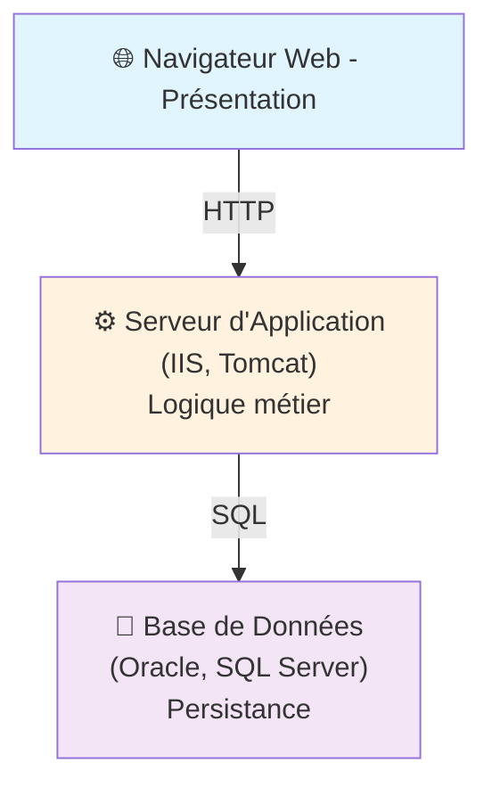
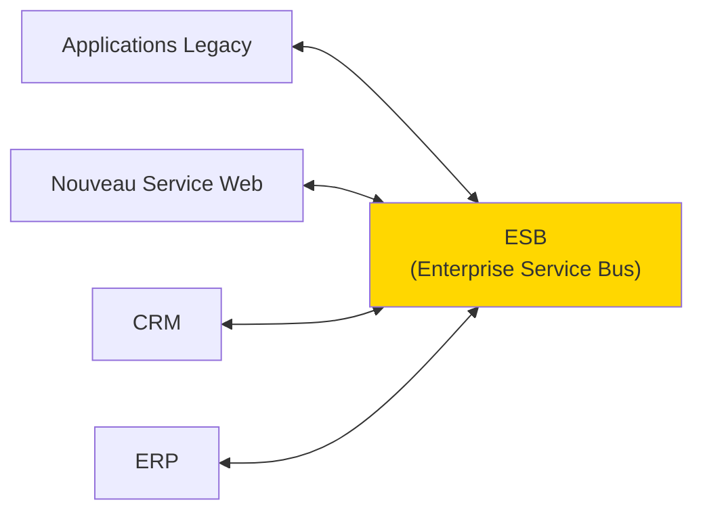
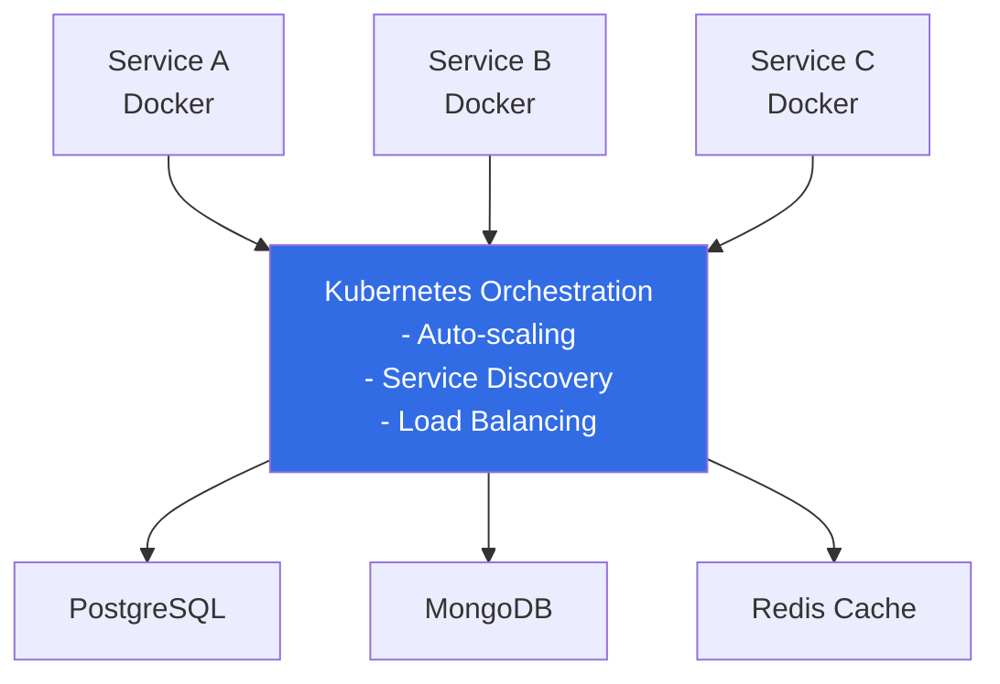
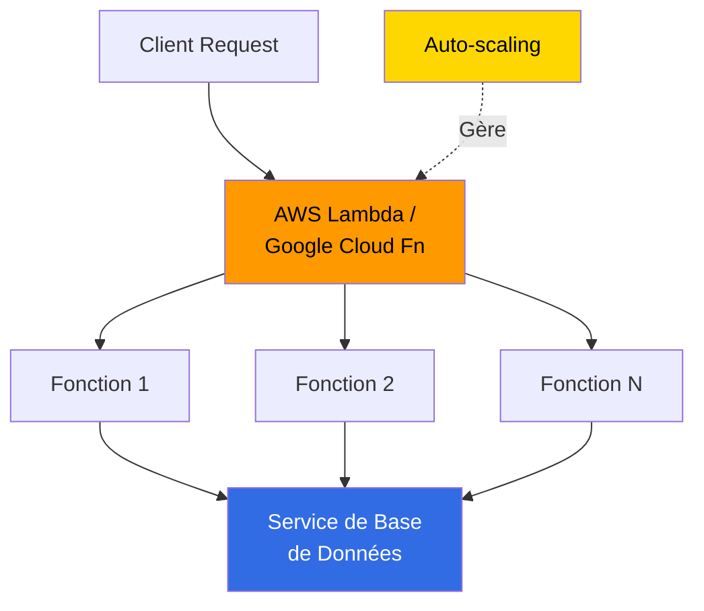
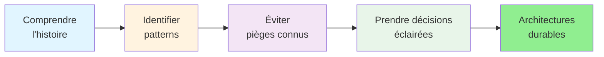

## 📜 Historique des architectures de SI

---
layout: two-cols
---

# 📺 L'Ère des Mainframes (1960-1980)

## Caractéristiques

- **Architecture** : Entièrement centralisée
- **Accès** : Via terminaux "bêtes" (pas de calcul local)
- **Coûts** : Énormes investissements initiaux
- **Fiabilité** : Uptime critique, équipes dédiées

## Impact sur l'architecture moderne

✅ **Héritage** : Respect de la sécurité, transactions ACID, contrôle centralisé


::right::

```
┌─────────────────────┐
│   MAINFRAME CPU     │ ← Toute la puissance
├─────────────────────┤
│   Base de données   │
├─────────────────────┤
│   Logique métier    │
├─────────────────────┤
│   Présentation      │
└─────────────────────┘
     ↑ ↑ ↑
  Terminaux
```


---
layout: two-cols
---

## 💻 Révolution PC et Client-Serveur (1980-1990)

### La Décentralisation Commence

| Aspect | Avant | Après |
|--------|-------|-------|
| Calcul | Centralisé | Distribué (PC + Serveur) |
| Données | Mainframe | Débat : où stocker ? |
| Responsabilité | Unique entité | Partagée |
| Scalabilité | Verticale uniquement | Horizontale possible |

🔑 **Innovation clé** : TCP/IP et protocoles réseau standardisés


::right::

### Architecture Émergente

```
┌──────────────┐     ┌──────────────┐
│   PC Client  │     │   PC Client  │
│  + Calcul    │────→│  + Calcul    │
└──────────────┘     └──────────────┘
        ↓                    ↓
    ┌───────────────────────────┐
    │  Serveur d'application    │
    │  + Base de données        │
    └───────────────────────────┘
```


---
layout: two-cols
---

## 🌐 Ère Web et Serveurs d'Applications (1990-2000)

### Architecture 3-Tiers


::right::

### Middlewares et Frameworks

- **J2EE** (Java 2 Enterprise Edition)
- **.NET Framework** (Microsoft)
- **Application Servers** (WebLogic, JBoss, WebSphere)

### Avantages & Défis

✅ Séparation claire des couches

✅ Scalabilité horizontale du web tier

❌ Monolithes deviennent énormes

❌ Déploiement complexe

---
layout: two-cols
---

## 📊 L'Ère des Services (2000-2010)

### Évolution vers l'Intégration d'Entreprise


::right::

### Protocoles & Standards

| Standard | Usage | Problèmes |
|----------|-------|-----------|
| SOAP | Intégration complexe | Verbeux, lent |
| WSDL | Description de services | Difficile à maintenir |
| XML-RPC | RPC distribué | Pas de typage fort |
| **REST** (émergent) | Simplicité HTTP | Pas encore dominant |

### Problèmes Récurrents

- ⚠️ **Couplage fort** entre services
- ⚠️ **Versioning** des APIs très complexe
- ⚠️ **Monitoring** difficile à grande échelle

---
layout: two-cols
---

## 🔀 L'Ère Distribuée (2010-2020)

### Microservices & Cloud Native


::right::
### Paradigme Shift

| Aspect | Avant | Maintenant |
|--------|-------|-----------|
| **Déploiement** | Monolithe unique | Services indépendants |
| **Langage** | Homogène | Polyglotte |
| **BD** | Base centralisée | BD par service |
| **Communication** | RPC synchrone | REST/gRPC asynchrone |

### Outils Révolutionnaires

🐳 **Docker** - Containerisation
☸️ **Kubernetes** - Orchestration
📊 **Prometheus** - Monitoring
🔍 **ELK** - Logging centralisé

---
layout: two-cols
---

## ⚡ Paradigmes Récents (2020+)

### Serverless & Functions-as-a-Service



::right::

**Caractéristiques**
- ✅ Pas de gestion d'infrastructure
- ✅ Paiement à l'usage
- ✅ Scaling instantané
- ❌ Vendor lock-in
- ❌ Latence imprévisible
- ❌ Debugging compliqué

---

### Autres Tendances

- 🧠 **IA/ML intégré** dans l'architecture (LLMs, embeddings)
- 🌍 **Edge Computing** (calcul près de l'utilisateur)
- 📡 **5G & IoT** (milliards de devices)
- 🔗 **Web3 & Blockchain** (architectures décentralisées)

---
layout: two-cols
---

## 🎲 Matrice de Décision Architecturale

### Choisir la bonne architecture selon le contexte

| Architecture | Complexité | Coûts Infra | Scalabilité |
|------------|-----------|-----------|-----------|
| **Monolithe** | ⭐ Basse | ⭐ Basse | ⭐ Faible |
| **Microservices** | ⭐⭐⭐⭐ Haute | ⭐⭐⭐ Moyenne | ⭐⭐⭐⭐⭐ Excellente |
| **Serverless** | ⭐⭐ Moyenne | ⭐⭐⭐ Haute (variable) | ⭐⭐⭐⭐⭐ Instantanée |


::right::

<div style="margin: 140px 20px;">

```
Peu de complexité métier      → Monolithe simple
↓
Croissance rapide + équipes   → Monolithe modulaire
↓
Scaling horizontal requis     → Microservices
↓
Pas de gestion infra + coûts  → Serverless
↓
Latence ultra-faible          → Edge + On-Premise
```
</div>
---

## 🚀 De l'Histoire à la Pratique

### Appliquer l'historique à vos décisions



### Exemples de questions à se poser

- 📊 Quel stage de maturité pour mon système ?
- 👥 Quelle taille et organisation d'équipe ?
- 💰 Quel budget infrastructure ?
- 📈 Quel taux de croissance prévu ?

**L'histoire nous enseigne : il n'y a pas une seule bonne réponse, mais la bonne réponse pour VOTRE contexte.**
