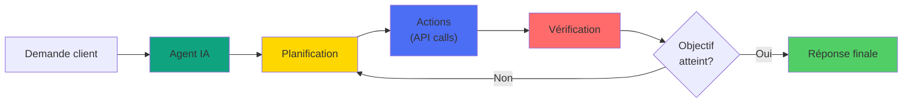

# 🎯 MCP & Intégration IA

---

## MCP & Intégration IA: Nouvelle ère

#### Cas d'usage:

Connecter les backends avec les modèles d'IA

- 📋 Assurance: Analyse automatique des sinistres avec Claude
- 🏥 Santé: Diagnostic assistance basé sur données patients
- 📝 Génération contenu: Documents, email, rapports automatisés
- 🔍 Recherche: Sémantique sur base de données

```mermaid
graph LR
                            LLM["LLM (ChatGPT, Claude)"]
                            MCP["MCP Server<br/>(Votre API)"]
                            Backend["Backend<br/>(Node.js, Spring)"]
                            DB["Database<br/>(PostgreSQL)"]
                            
                            LLM -->|Appel fonction| MCP
                            MCP -->|Récupère données| Backend
                            Backend -->|Query| DB
                            DB -->|Résultat| Backend
                            Backend -->|JSON| MCP
                            MCP -->|Réponse structurée| LLM
                            
                            style LLM fill:#10a37f
                            style MCP fill:#ffd700
                            style Backend fill:#4c6ef5
                            style DB fill:#868e96
```



---
layout: two-cols
---

## MCP: Model Context Protocol

### Architecture MCP:

#### MCP Server (côté backend):

Standard ouvert pour connecter LLMs aux tools/APIs

```plaintext
# server.py
from fastmcp import FastMCP
from pydantic import BaseModel
from typing import Dict, Any, List
import logging

logging.basicConfig(level=logging.INFO)
logger = logging.getLogger(__name__)

# Modèle pour l'utilisateur
class UserProfile(BaseModel):
    name: str
    role: str
    department: str = "Engineering"
    years_experience: int = 0

mcp = FastMCP(
    name="user-db-server",
    version="1.0.0",
    description="Serveur MCP pour gestion users"
)
```

::right::

```
# Ressource : liste statique d'utilisateurs
@mcp.resource("user_profiles")
def fetch_users() -> List[Dict[str, Any]]:
    """Retourne la liste des profils utilisateurs."""
    return [
        {"name": "Alice", "role": "Dev", "department": "Engineering", "years_experience": 5},
        {"name": "Bob", "role": "PM", "department": "Product", "years_experience": 3}
    ]

# Outil : créer un utilisateur
@mcp.tool()
def create_user(name: str, role: str, department: str = "Engineering", years_experience: int = 0) -> str:
    """Crée un nouveau profil utilisateur."""
    user = UserProfile(name=name, role=role, department=department, years_experience=years_experience)
    logger.info(f"User créé : {user}")
    return f"User {user.name} créé avec succès !"

if __name__ == "__main__":
    logger.info("Démarrage serveur MCP...")
    mcp.run(transport="stdio")  # Ou "http://localhost:8000"

```

---

## Futur: Agents IA autonomes

#### Exemple: Traitement sinistre automatique

La prochaine génération: agents capables de décisions autonomes

```plaintext
const claimAgent = new Agent({
  tools: ['get_contract','create_claim','estimate_damage','notify_client','schedule_inspection']
});

const result = await claimAgent.run(
  `Traiter ce sinistre: Description du sinistre...`
);
```

```
// Résultat: Agent a de façon autonome:
// 1. ✅ Cherché le contrat
// 2. ✅ Créé le dossier sinistre
// 3. ✅ Estimé les dégâts
// 4. ✅ Notifié le client
// 5. ✅ Programmé l'inspection
// Tout dans une seule chaîne de pensée!
```


