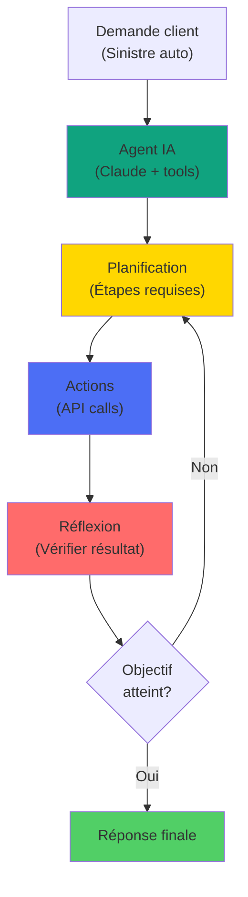

## 🎯 Prochaine Section: MCP & Intégration IA

<div style="text-align: center; padding: 40px 0; background: linear-gradient(135deg, #f5f7fa 0%, #c3cfe2 100%); border-radius: 15px; margin: 30px 0; box-shadow: 0 4px 12px rgba(0,0,0,0.1);">
  <h3 style="color: #2c3e50; margin-bottom: 20px; font-size: 1.8em;">🤖 MCP & Intégration IA</h3>
  <p style="color: #34495e; font-size: 1.1em; max-width: 800px; margin: 0 auto;">
    Explorez comment connecter vos backends avec les modèles d'IA et les agents autonomes pour créer des systèmes intelligents.
  </p>
  <div style="margin-top: 20px; height: 4px; background: linear-gradient(90deg, #3498db, #9b59b6); width: 100px; margin: 20px auto; border-radius: 2px;"></div>
</div>

---

## MCP & Intégration IA: Nouvelle ère

#### Cas d'usage:

Connecter les backends avec les modèles d'IA

- 📋 Assurance: Analyse automatique des sinistres avec Claude
- 🏥 Santé: Diagnostic assistance basé sur données patients
- 📝 Génération contenu: Documents, email, rapports automatisés
- 🔍 Recherche: Sémantique sur base de données

```mermaid
graph LR
                            LLM["LLM (ChatGPT, Claude)"]
                            MCP["MCP Server<br/>(Votre API)"]
                            Backend["Backend<br/>(Node.js, Spring)"]
                            DB["Database<br/>(PostgreSQL)"]
                            
                            LLM -->|Appel fonction| MCP
                            MCP -->|Récupère données| Backend
                            Backend -->|Query| DB
                            DB -->|Résultat| Backend
                            Backend -->|JSON| MCP
                            MCP -->|Réponse structurée| LLM
                            
                            style LLM fill:#10a37f
                            style MCP fill:#ffd700
                            style Backend fill:#4c6ef5
                            style DB fill:#868e96
```



---

## MCP: Model Context Protocol

### Architecture MCP:

#### MCP Server (côté backend):

Standard ouvert pour connecter LLMs aux tools/APIs

```plaintext
// Node.js/Express avec MCP SDK
const mcp = require('@anthropic-sdk/mcp');
const express = require('express');

const server = new mcp.MCPServer({
  name: 'insurance-api',
  version: '1.0.0'
});

// Enregistrer des ressources/outils
server.resource('contract', async (id) => {
  const contract = await db.contracts.findOne(id);
  return {
    type: 'contract',
    id,
    data: contract
  };
});

server.tool('create_claim', {
  description: 'Créer un sinistre',
  inputSchema: {
    type: 'object',
    properties: {
      contractId: { type: 'string' },
      description: { type: 'string' },
      amount: { type: 'number' }
    }
  },
  handler: async (input) => {
    const claim = await db.claims.create({
      contractId: input.contractId,
      description: input.description,
      amount: input.amount,
      status: 'PENDING'
    });
    return { success: true, claim };
  }
});

server.listen(3001);
```

---

## Monitoring: IA en production

#### Métriques à tracker:

Surveiller la qualité et la performance des réponses IA

```plaintext
// Instrumenter les appels IA
const aiMetrics = {
  // Performance
  latency: new Histogram('ai_latency_ms'),
  tokenUsage: new Counter('ai_tokens_used'),
  costs: new Gauge('ai_monthly_cost'),
  
  // Qualité
  hallucinations: new Counter('ai_hallucinations'),
  userRejections: new Counter('ai_responses_rejected'),
  accuracy: new Gauge('ai_accuracy_score'),
  
  // Erreurs
  rateLimitExceeded: new Counter('ai_rate_limit'),
  timeouts: new Counter('ai_timeouts'),
  authErrors: new Counter('ai_auth_errors')
};

// Instrumenter
const startTime = Date.now();
try {
  const response = await llm.analyze(data);
  aiMetrics.latency.observe(Date.now() - startTime);
  aiMetrics.tokenUsage.inc(response.usage.total_tokens);
  
  // User feedback
  response.on('reject', () => {
    aiMetrics.userRejections.inc();
  });
} catch (error) {
  if (error.code === 'RATE_LIMIT') {
    aiMetrics.rateLimitExceeded.inc();
  }
}
```

---

## Futur: Agents IA autonomes

#### Exemple: Traitement sinistre automatique

La prochaine génération: agents capables de décisions autonomes

```plaintext
// Agent autonome
const claimAgent = new Agent({
  tools: [
    'get_contract',
    'create_claim',
    'estimate_damage',
    'notify_client',
    'schedule_inspection'
  ]
});

const result = await claimAgent.run(
  `Traiter ce sinistre: Description du sinistre...`
);

// Résultat: Agent a autonomement:
// 1. ✅ Cherché le contrat
// 2. ✅ Créé le dossier sinistre
// 3. ✅ Estimé les dégâts
// 4. ✅ Notifié le client
// 5. ✅ Programmé l'inspection
// Tout dans une seule chaîne de pensée!
```

