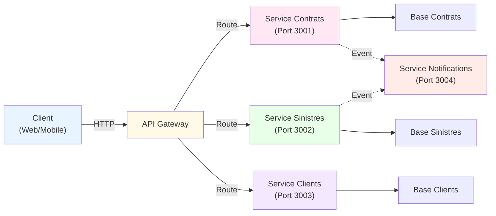
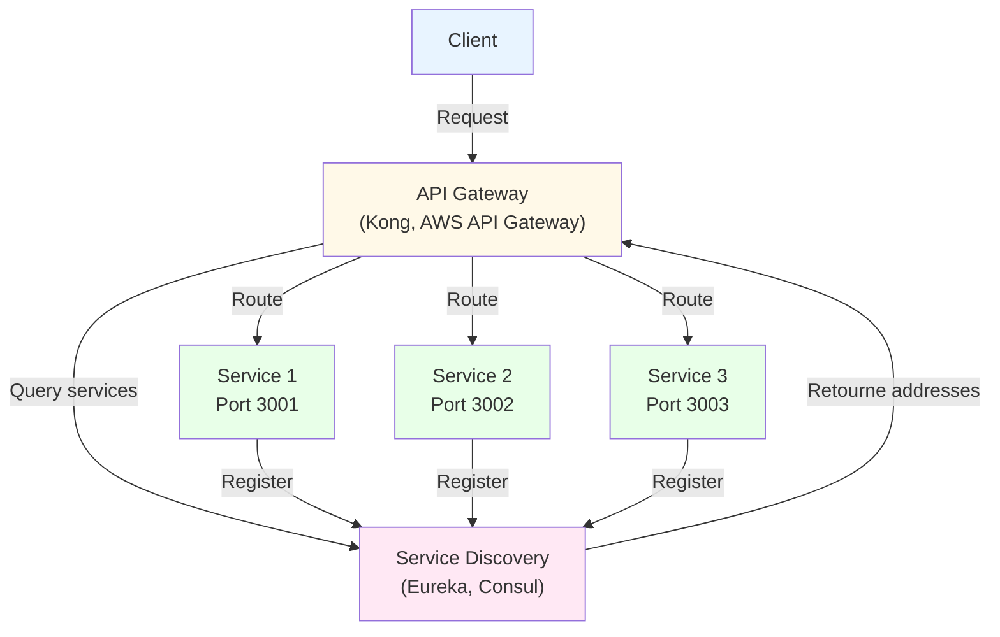
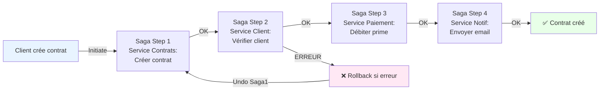
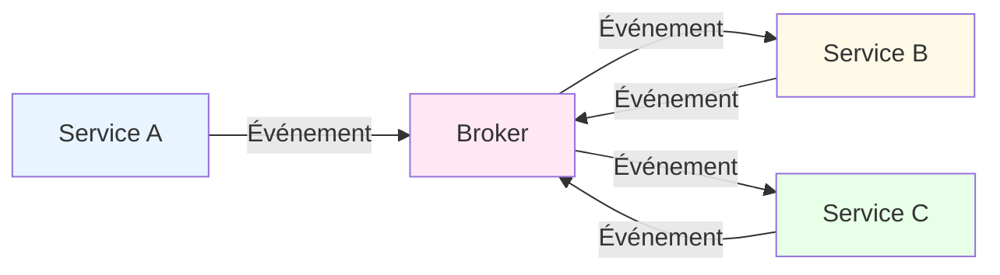
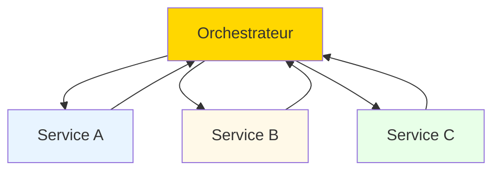
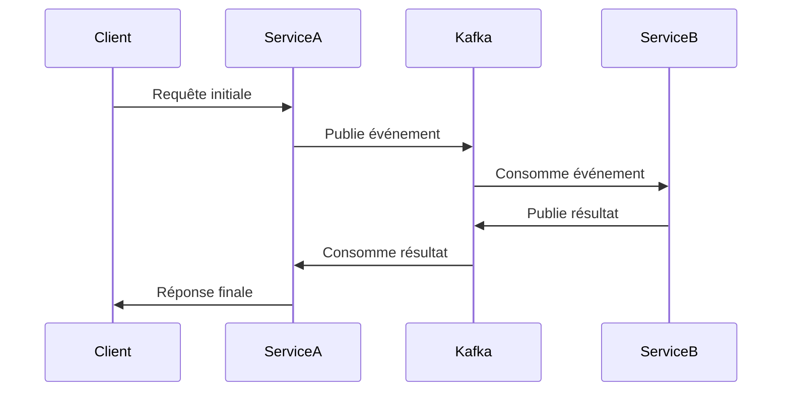
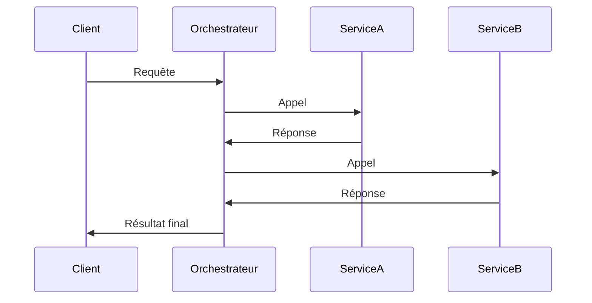

# Microservices

---

## Microservices: Introduction

Architectures distribuées basées sur des services indépendants.



---

## Caractéristiques des Microservices

### Propriétés clés:

<div style="display: grid; grid-template-columns: 1fr 1fr; gap: 30px; margin-top: 0px;">
<div>

#### 🎯 Autonomie

- Services indépendants
- Déploiement indépendant
- BD dédiée
- Équipes autonomes

#### 📡 Communication

- API REST / gRPC
- Message brokers (Kafka)
- Events asynchrones
- Découverte de services

</div>
<div>

#### 🔄 Résilience

- Circuit breaker
- Timeout
- Retry policy
- Health checks

#### 📊 Observabilité

- Logging distribué
- Tracing
- Monitoring
- Alerting

</div>
</div>

---

## API Gateway et Service Discovery

<div style="display: grid; grid-template-columns: 1fr 1fr; gap: 30px; margin-top: 0px;">
<div>

### API Gateway (point d'entrée unique):

- Routage: Diriger requêtes aux services corrects
- Authentification: JWT validation
- Rate limiting: Protection DOS
- Caching: Réduire latence
- Load balancing: Distribuer charge

</div>
<div>


</div>
</div>

---

## Communication inter-services

### Approches de communication:

<div style="display: grid; grid-template-columns: 1fr 1fr; gap: 30px; margin-top: 0px;">
<div>

#### 🔵 Synchrone (REST/gRPC)

```plaintext
Service A
   ↓ (HTTP/gRPC)
Service B
   ↓ (attend réponse)
Service C
   ↓
Réponse retourne

Avantages:
✅ Cohérence immédiate
✅ Facile à déboguer

Inconvénients:
❌ Couplage fort
❌ Service lent = tout lent
```

</div>
<div>

#### 🟣 Asynchrone (Events)

```plaintext
Service A
   ↓ (Publie event)
Kafka/RabbitMQ
   ↓ (Message broker)
Service B (reçoit)
Service C (reçoit)

Avantages:
✅ Découplage complet
✅ Haute disponibilité
✅ Scalabilité

Inconvénients:
❌ Eventual consistency
❌ Plus complexe
```
</div>
</div>

---

## Saga Pattern: Transactions distribuées

#### Deux approches:

Maintenir la cohérence des données sur plusieurs services

- Choreography: Services écoutent les events et réagissent (loose coupling)
- Orchestration: Service central coordonne les étapes (plus simple mais couplage)



---

# 🏗️ Microservices: Choreography vs Orchestration

---

## Définitions et Comparaison

### Choreography



### Orchestration



---

## Critères de Choix

| Critère | Choreography | Orchestration |
|---|---|---|
| **Couplage** | ✅ Faible | ❌ Fort |
| **Complexité** | ⚠️ Élevée | ✅ Modérée |
| **Flexibilité** | ✅ Élevée | ⚠️ Limitée |
| **Visibilité** | ❌ Difficile | ✅ Claire |
| **Maintenance** | ❌ Complexe | ✅ Simple |

### Outils Populaires

- **Choreography**: Kafka, RabbitMQ, AWS EventBridge
- **Orchestration**: Zeebe, Cadence, AWS Step Functions

---

## Implémentation Pratique


<div style="display: grid; grid-template-columns: .5fr 1fr; gap: 30px; margin-top: 0px;">

### Choreography avec Kafka


</div>

---

<div style="display: grid; grid-template-columns: .5fr 1fr; gap: 30px; margin-top: 0px;">

### Orchestration avec Zeebe


</div>