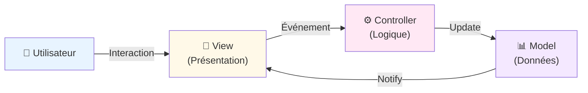
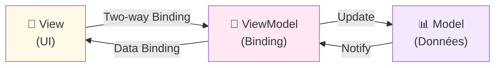
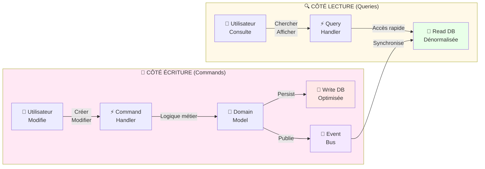
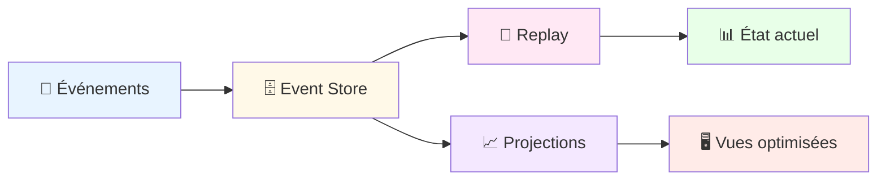
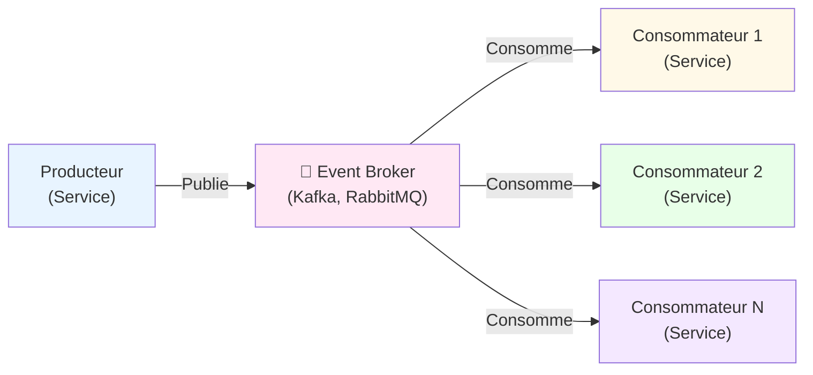
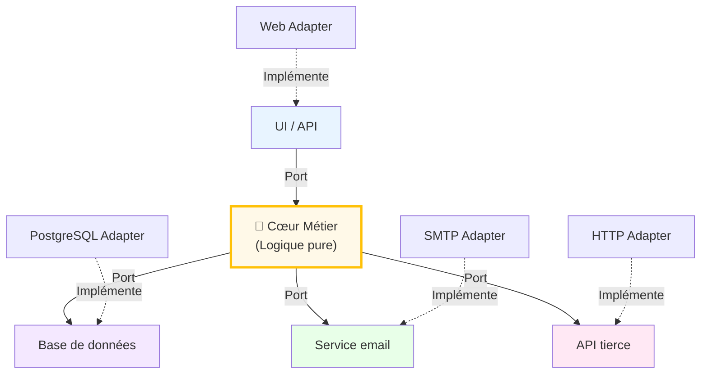
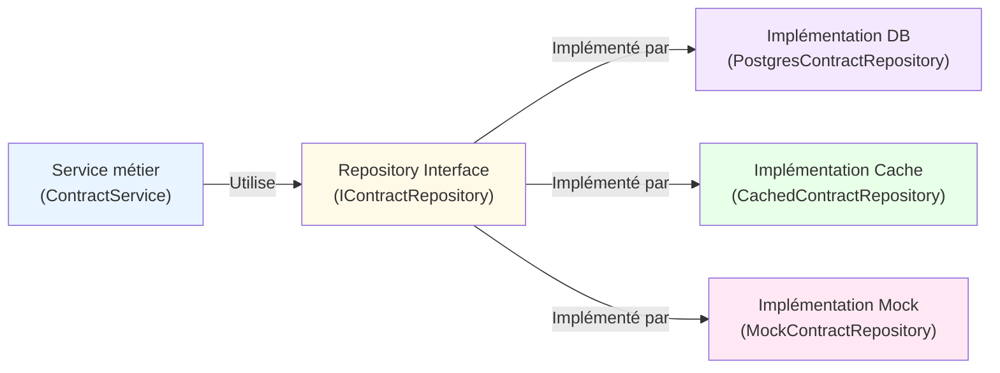

---

# 🏗️ Patterns d'Architecture

*Solutions éprouvées pour structurer vos applications*

---

## Pourquoi utiliser des patterns ?

### Les patterns résolvents des problèmes récurrents

> "The purpose of design patterns is to give a name and a context to design problems and their solutions." — **Gang of Four**, Design Patterns


- Réutilisabilité: Solutions éprouvées et documentées
- Standardisation: Équipes alignées sur une même approche
- Collaboration: Facilite la communication entre développeurs
- Réduction des risques: Évite les pièges courants
- Maintenabilité: Code plus prévisible et compréhensible

---

## Pattern Dependency Injection (DI)
Injecter les dépendances plutôt que les créer soi-même.

### Sans Dependency Injection (couplage fort):


```plaintext
public class ContractService {
    private DatabaseService db = new DatabaseService(); // Couplage fort
    
    public void createContract(Contract c) {
        db.save(c);
    }
}
```

### Avec Dependency Injection (découplage):


```plaintext
public class ContractService {
    private DatabaseService db; // Interface
    
    @Inject // Spring
    public ContractService(DatabaseService db) {
        this.db = db;
    }
}
```

---

## Pattern MVC (Model-View-Controller)

### Séparation des responsabilités:

- Model: Données et logique métier
- View: Présentation et interface utilisateur
- Controller: Coordination et gestion des événements



---

## Pattern MVVM (Model-View-ViewModel)

### Caractéristiques:

- Binding bidirectionnel: Sync automatique View ↔ ViewModel
- Testabilité: ViewModel indépendant de la Vue
- Réactivité: Mises à jour temps réel



---

## Pattern CQRS (Command Query Responsibility Segregation)

### Concept clé

<div style="display: grid; grid-template-columns: 1fr 1fr; gap: 30px; margin-top: 0px;">
<div>
Séparer les modèles de lecture et écriture pour optimiser chacun indépendamment.

### Avantages

- ✅ **Optimisation indépendante**: Chaque modèle optimisé pour son usage
- ✅ **Scalabilité**: Lectures et écritures peuvent être déployées séparément
- ✅ **Performance**: Read DB peut être dénormalisée (cache, index spécifiques)
- ✅ **Clarté**: Séparation claire des responsabilités

</div>
<div>

</div>
</div>
---

## Architecture Event-Sourcing

### Principes fondamentaux



### Concepts clés

- **Événements immutables**: Tous les changements sont stockés comme événements
- **Reconstruction d'état**: L'état actuel est reconstruit en replayant les événements
- **Projections**: Vues optimisées pour différents cas d'usage
- **Audit trail**: Historique complet de toutes les modifications

---

### Cas d'usage

- **Finance**: Traçabilité complète des transactions
- **Assurance**: Historique des contrats et sinistres
- **Santé**: Dossiers patients avec historique complet

### Outils populaires

- **EventStoreDB**: Base de données dédiée
- **Kafka**: Pour le streaming d'événements
- **Axoni**: Plateforme complète

---

## Comparaison Event-Sourcing vs CRUD

| Aspect | Event-Sourcing | CRUD Traditionnel |
|---|---|---|
| **Historique** | ✅ Complet | ❌ Partiel |
| **Audit** | ✅ Natif | ❌ Requiert logs |  |
| **Performance lecture** | ❌ Replay nécessaire | ✅ Direct |
| **Complexité** | ⚠️ Élevée | ✅ Simple |
| **Évolutivité** | ✅ Excellente | ⚠️ Limitée |

---

## Pattern Event-Driven Architecture

### Cas d'usage assurance:

Services réactifs aux événements métiers asynchrones.

- Événement: "ContractCreated" - Un nouveau contrat est créé
- Consommateurs: Service email (notification), Service CRM (update), Service audit (logging)
- Avantage: Découplage complet entre services



---

## Pattern Hexagonal (Ports & Adapters)

### Bénéfices:

<div style="display: grid; grid-template-columns: 1fr 1fr; gap: 30px; margin-top: 0px;">
<div>
Isoler le cœur métier des détails techniques.

- Cœur métier indépendant des frameworks
- Adaptation facile aux changements technologiques
- Tests unitaires sans dépendances externes

</div>
<div>


</div>
</div>
---

## Pattern Repository

### Avantages:

Abstraction de la couche d'accès aux données.

- Logique métier indépendante du mécanisme de persistance
- Facile de basculer de PostgreSQL à MongoDB
- Tests unitaires avec implémentation mock



---

## Récapitulatif: Quand utiliser quel pattern ?

| Pattern | Problème | Quand l'utiliser |
| --- | --- | --- |
| MVC | Séparation UI/logique | Web traditionnel, applications simples |
| MVVM | Binding bidirectionnel | Interfaces réactives, desktop/mobile |
| CQRS | Scalabilité lecture/écriture | Hauts volumes, complex queries |
| Event-Driven | Découplage asynchrone | Microservices, systèmes réactifs |
| Hexagonal | Isolation cœur métier | Logique métier complexe, DDD |
| DI | Gestion dépendances | Tous les projets modernes |
