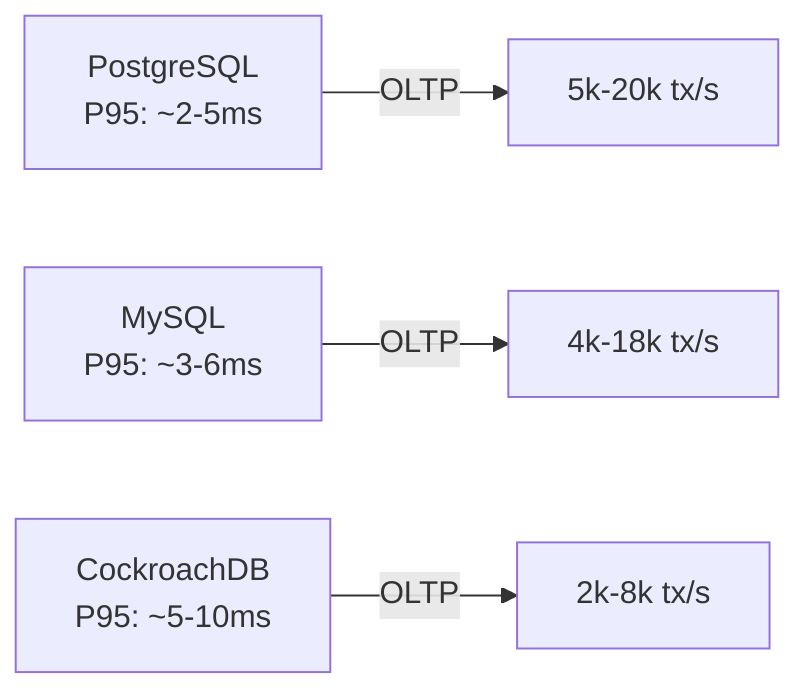
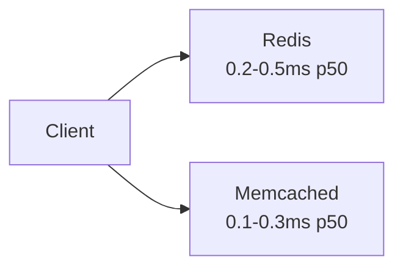
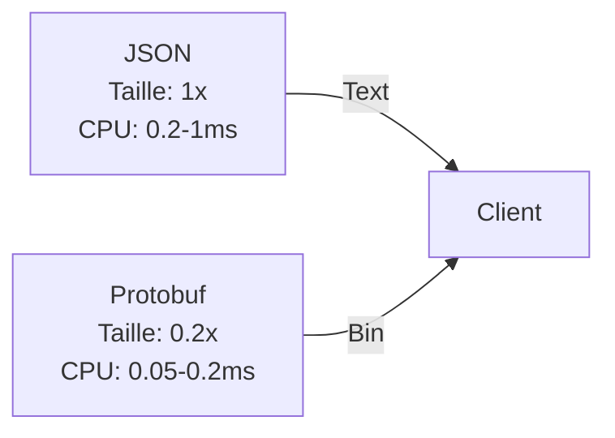

# ⚡ Benchmarks de Performance

Comparatifs publics et recommandations pour choisir une solution.

---

## Bases de données : PostgreSQL vs MySQL vs CockroachDB

| Mesure | PostgreSQL | MySQL (InnoDB) | CockroachDB | Source |
|---|---:|---:|---:|---|
| Latence simple requête (p95) | 2-5 ms | 3-6 ms | 5-10 ms | Percona, Cockroach Labs (2022-2024) |
| Transactions/s (single node) | 5k-20k | 4k-18k | 2k-8k | Percona, Cockroach Labs |
| Réplication | Maître/Esclave (sync/async) | Maître/Esclave | Multi-région natif | Docs fournisseurs |



### Recommandation
- PostgreSQL: choix par défaut pour fonctionnalités et écosystème.  
- MySQL: bon pour workloads simples ou compatibilité.  
- CockroachDB: utile multi-région et réplication transparente (coût latence).

**Sources**: Percona MySQL vs PostgreSQL benchmarks, Cockroach Labs benchmarks.

---

## Cache : Redis vs Memcached

| Mesure | Redis | Memcached | Source |
|---|---:|---:|---|
| Latence moyenne (p50) | ~0.2-0.5 ms | ~0.1-0.3 ms | Redis Labs benchmarks, Tech blogs |
| Throughput (ops/s / instance) | 100k-1M+ | 200k-1M | Redis Labs |
| Cas d'usage | Persist, data structures, pub/sub | Simple K/V cache | 



### Recommandation
- Utiliser **Redis** si besoin de structures (lists, sets), persistance ou pub/sub.  
- **Memcached** pour cache K/V ultra-simple à très faible latence.

**Sources**: Redis Labs performance posts, comparative blog posts.

---

## Sérialisation : JSON vs Protobuf vs MessagePack

| Mesure | Taille payload | Sérialisation (ms) | Désérialisation (ms) | Source |
|---|---:|---:|---:|---|
| JSON (text) | 1x (base) | 0.2-1.0 | 0.2-1.0 | TechEmpower / microbenchmarks |
| Protobuf (bin) | ~0.2-0.4x | 0.05-0.2 | 0.05-0.2 | Google / TechEmpower |



### Recommandation
- API publiques: **JSON** (interopérabilité).  
- Services internes haute perf: **Protobuf** (smaller, faster).  

**Sources**: TechEmpower serialization tests, Google Protobuf docs.

---

## Serverless cold starts : Java vs Node.js vs Python

| Runtime | Cold start (ms) | Warm start (ms) | Source |
|---|---:|---:|---|
| Java (Spring) | 700-1500 ms | 10-50 ms | AWS Lambda cold start studies (2022-2024) |
| Node.js | 150-400 ms | 5-20 ms | AWS blog / community measurements |
| Python | 200-500 ms | 5-30 ms | AWS blog |

```mermaid
sequenceDiagram
  participant Client
  participant Lambda
  Client->>Lambda: cold request
  Note right of Lambda: Java ~700-1500ms
  Node ~150-400ms\nPython ~200-500ms
  Lambda-->>Client: response
```

### Recommandation
- Pour fonctions latency-sensitive, privilégier Node.js/Python ou optimiser Java (GraalVM native-image).  

**Sources**: AWS Lambda cold start posts, serverless community benchmarks.

---

## Résumé pédagogique
- Mesurez toujours dans votre infra.  
- Choisissez Redis pour features, Memcached pour simplicité.  
- Protobuf pour internal RPC haute performance.  
- Serverless: évaluez cold starts selon runtime et besoins.

**Liens utiles**: TechEmpower Benchmarks, Redis Labs, Percona, Cockroach Labs, AWS Serverless blog.
