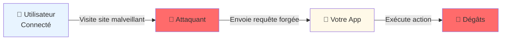
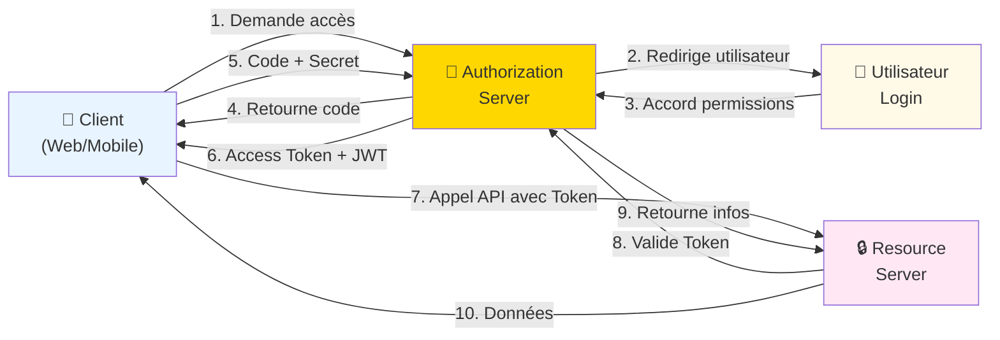
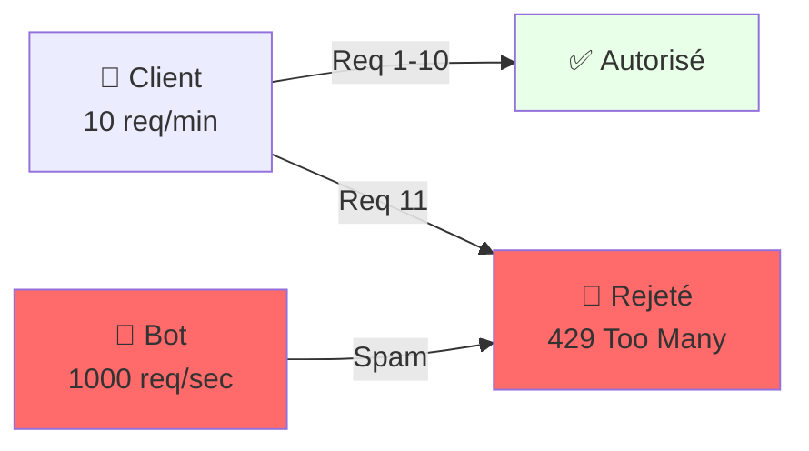

# 🔒 Sécurité Avancée

Protéger vos applications contre les menaces courantes

---

## OWASP Top 10 - Les 10 risques critiques des applications Web


Source : https://owasp.org/Top10/2025/0x00_2025-Introduction/

---

## Injection SQL & Validation d'entrées

### ❌ Code vulnérable

```java
@GetMapping("/users")
public List<User> searchUsers(@RequestParam String name) {
    // DANGEREUX: Concaténation directe
    String query = "SELECT * FROM users WHERE name = '" + name + "'";
    return jdbcTemplate.query(query, new UserRowMapper());
}
```

**Attaque**: `name = "' OR '1'='1` → Récupère tous les utilisateurs

---

## ✅ Code sécurisé avec Spring

### Approche 1: Prepared Statements

```java
@GetMapping("/users")
public List<User> searchUsers(@RequestParam String name) {
    String query = "SELECT * FROM users WHERE name = ?";
    return jdbcTemplate.query(query, new Object[]{name}, new UserRowMapper());
}
```

### Approche 2: Validation d'entrées

```java
@GetMapping("/users")
public List<User> searchUsers(
    @RequestParam 
    @Pattern(regexp = "^[a-zA-Z0-9\\s]*$") 
    String name) {
    return userRepository.findByName(name);
}
```

### Approche 3: ORM (JPA/Hibernate)

```java
@GetMapping("/users")
public List<User> searchUsers(@RequestParam String name) {
    // ✅ JPA paramétrise automatiquement
    return userRepository.findByName(name);
}

// Repository Interface
public interface UserRepository extends JpaRepository<User, Long> {
    List<User> findByName(String name);
}
```

---

## XSS (Cross-Site Scripting) & CSRF

<div style="display: grid; grid-template-columns: 1fr 1fr; gap: 30px; margin-top: 20px;">
<div>

### XSS: Injection de script côté client

```html
<!-- ❌ Vulnérable -->
<h1>${userInput}</h1>

<!-- ✅ Sécurisé (échappement) -->
<h1 th:text="${userInput}"></h1>
```

**Attaque**: `userInput = "<script>alert('Piratage')</script>"`

</div>
<div>

### CSRF: Falsification de requête cross-site


```mermaid
graph LR
    A["👤 Utilisateur<br/>Connecté"] -->|Visite site malveillant| B["🚫 Attaquant"]
    B -->|Envoie requête forgée| C["🏦 Votre App"]
    C -->|Exécute action| D["💸 Dégâts"]

    style A fill:#e8f4ff
    style B fill:#ff6b6b
    style C fill:#fff9e8
    style D fill:#ff6b6b
```

</div>
</div>

---

## ✅ Protection CSRF avec Spring

```java
@Configuration
@EnableWebSecurity
public class SecurityConfig {
    
    @Bean
    public SecurityFilterChain filterChain(HttpSecurity http) throws Exception {
        http
            .csrf()  // ✅ CSRF activé par défaut
                .csrfTokenRepository(CookieCsrfTokenRepository.withHttpOnlyFalse())
            .and()
            .authorizeHttpRequests()
                .requestMatchers("/public/**").permitAll()
                .anyRequest().authenticated();
        
        return http.build();
    }
}
```

### Dans le formulaire HTML

```html
<form method="POST" action="/transfer">
    <input type="hidden" name="_csrf" th:value="${_csrf.token}" />
    <input type="text" name="amount" />
    <button type="submit">Valider</button>
</form>
```

---

## OAuth2 & JWT - Flux d'authentification

### Architecture OAuth2


```mermaid
graph LR
    A["📱 Client<br/>(Web/Mobile)"] -->|1. Demande accès| B["🔑 Authorization<br/>Server"]
    B -->|2. Redirige utilisateur| C["👤 Utilisateur<br/>Login"]
    C -->|3. Accord permissions| B
    B -->|4. Retourne code| A
    A -->|5. Code + Secret| B
    B -->|6. Access Token + JWT| A
    A -->|7. Appel API avec Token| D["🔒 Resource<br/>Server"]
    D -->|8. Valide Token| B
    B -->|9. Retourne infos| D
    D -->|10. Données| A

    style A fill:#e8f4ff
    style B fill:#ffd700
    style C fill:#fff9e8
    style D fill:#ffe8f4
```

---

## ✅ Configuration OAuth2 avec Spring

### Authorization Server

```java
@Configuration
@EnableAuthorizationServer
public class AuthorizationServerConfig extends AuthorizationServerConfigurerAdapter {
    
    @Override
    public void configure(ClientDetailsServiceConfigurer clients) throws Exception {
        clients
            .inMemory()
                .withClient("mobile-app")
                .secret("{bcrypt}$2a$10$...") // ✅ Password encodé
                .authorizedGrantTypes("password", "refresh_token")
                .authorities("ROLE_CLIENT")
                .scopes("read", "write")
                .accessTokenValiditySeconds(3600)     // 1 heure
                .refreshTokenValiditySeconds(86400);  // 24 heures
    }
}
```

### Resource Server (API protégée)

```java
@Configuration
@EnableResourceServer
public class ResourceServerConfig extends ResourceServerConfigurerAdapter {
    
    @Override
    public void configure(HttpSecurity http) throws Exception {
        http
            .authorizeRequests()
                .antMatchers("/public/**").permitAll()
                .antMatchers("/admin/**").hasAuthority("ROLE_ADMIN")
                .anyRequest().authenticated()
            .and()
            .exceptionHandling()
                .accessDeniedHandler(new OAuth2AccessDeniedHandler());
    }
}
```

---

## ✅ Contrôle d'accès avec annotations

```java
@RestController
@RequestMapping("/api/orders")
public class OrderController {
    
    @GetMapping("/{id}")
    @PreAuthorize("hasRole('USER')")
    public Order getOrder(@PathVariable Long id) {
        return orderService.findById(id);
    }
    
    @PostMapping
    @PreAuthorize("hasRole('USER') and @orderService.canCreateOrder(#request)")
    public Order createOrder(@RequestBody CreateOrderRequest request) {
        return orderService.create(request);
    }
    
    @DeleteMapping("/{id}")
    @PreAuthorize("hasRole('ADMIN') or @orderService.isOwner(#id, authentication.principal.id)")
    public void deleteOrder(@PathVariable Long id, Authentication authentication) {
        orderService.delete(id);
    }
    
    @GetMapping("/admin/stats")
    @PreAuthorize("hasAnyRole('ADMIN', 'ANALYST')")
    public OrderStats getStats() {
        return orderService.getStatistics();
    }
}
```

### Récupérer l'utilisateur authentifié

```java
@GetMapping("/profile")
public UserProfile getProfile(@AuthenticationPrincipal UserDetails principal) {
    String username = principal.getUsername();
    // ✅ Accès aux données de l'utilisateur
    return userService.findByUsername(username);
}

// Alternative: récupérer l'objet Authentication
@GetMapping("/me")
public User getCurrentUser(Authentication authentication) {
    UserDetails userDetails = (UserDetails) authentication.getPrincipal();
    return userService.findByUsername(userDetails.getUsername());
}
```

---

## Rate Limiting & Protection DDoS

### Concept: Limiter les requêtes par client


```mermaid
graph LR
    A["📱 Client<br/>10 req/min"] -->|Req 1-10| B["✅ Autorisé"]
    A -->|Req 11| C["🚫 Rejeté<br/>429 Too Many"]
    D["🤖 Bot<br/>1000 req/sec"] -->|Spam| C

    style B fill:#e8ffe8
    style C fill:#ff6b6b
    style D fill:#ff6b6b
```

---

## ✅ Rate Limiting avec Resilience4j

```java
@RestController
@RequestMapping("/api/payments")
public class PaymentController {
    
    @PostMapping("/process")
    @RateLimiter(
        name = "paymentLimiter",
        fallbackMethod = "paymentFallback"
    )
    public PaymentResponse processPayment(@RequestBody PaymentRequest request) {
        return paymentService.process(request);
    }
    
    // Fallback: appelé si limite dépassée
    public PaymentResponse paymentFallback(PaymentRequest request, 
                                           RequestNotPermitted ex) {
        return PaymentResponse.builder()
            .status("RATE_LIMIT_EXCEEDED")
            .message("Trop de requêtes. Réessayez dans 1 minute.")
            .build();
    }
}

// Configuration application.yml
/*
resilience4j:
  ratelimiter:
    instances:
      paymentLimiter:
        registerHealthIndicator: true
        limitRefreshPeriod: 1m
        limitForPeriod: 10
        timeoutDuration: 5s
        eventConsumerBufferSize: 100
*/
```

### Rate Limiting par endpoint + clé personnalisée

```java
@Component
public class ApiKeyRateLimiter {
    
    private final Map<String, RateLimiter> limiters = new ConcurrentHashMap<>();
    
    @PostMapping("/api/data")
    public ResponseEntity<?> processData(
        @RequestHeader("X-API-Key") String apiKey,
        @RequestBody DataRequest data) {
        
        RateLimiter limiter = limiters.computeIfAbsent(apiKey, k -> 
            RateLimiter.of("limiter-" + k, RateLimiterConfig.custom()
                .limitRefreshPeriod(Duration.ofMinutes(1))
                .limitForPeriod(100)
                .build())
        );
        
        if (limiter.acquirePermission()) {
            return ResponseEntity.ok(processData(data));
        } else {
            return ResponseEntity
                .status(429)
                .body("Limite atteinte pour la clé API");
        }
    }
}
```

---

## Secret Management & Configuration sensible

### ❌ Mauvaise pratique

```java
@Configuration
public class DatabaseConfig {
    
    // ❌ DANGEREUX: mot de passe en dur
    @Bean
    public DataSource dataSource() {
        return DriverManager.getConnection(
            "jdbc:postgresql://localhost:5432/db",
            "admin",
            "password123"  // 🚨 Exposé dans le code!
        );
    }
}
```

---

## ✅ Injection de secrets avec @Value

```java
@Configuration
public class DatabaseConfig {
    
    @Value("${database.url}")
    private String dbUrl;
    
    @Value("${database.username}")
    private String dbUsername;
    
    @Value("${database.password}")
    private String dbPassword;
    
    @Bean
    public DataSource dataSource() {
        // ✅ Secrets injectés à l'exécution
        return DriverManager.getConnection(
            dbUrl,
            dbUsername,
            dbPassword
        );
    }
}
```

### Fichier `application-prod.yml` (sécurisé)

```yaml
database:
  url: jdbc:postgresql://prod-db.internal:5432/secure_db
  username: ${DB_USER}      # Variable d'environnement
  password: ${DB_PASSWORD}  # Variable d'environnement

jwt:
  secret: ${JWT_SECRET}
  expiration: 3600000

api:
  keys:
    stripe: ${STRIPE_API_KEY}
    sendgrid: ${SENDGRID_API_KEY}
```

### Configuration avec Spring Cloud Config (Vault)

```java
@Component
public class SecretService {
    
    @Value("${vault.database.password}")
    private String dbPassword;  // ✅ Chiffré dans Vault
    
    @Value("${vault.jwt.secret}")
    private String jwtSecret;   // ✅ Rotaté automatiquement
    
    @Scheduled(fixedDelay = 3600000)  // 1h
    public void refreshSecrets() {
        // ✅ Recharge les secrets depuis Vault régulièrement
        log.info("Secrets actualisés depuis Vault");
    }
}

// Configuration: application-vault.yml
/*
spring:
  cloud:
    vault:
      host: vault.internal
      port: 8200
      scheme: https
      authentication: TOKEN
      token: ${VAULT_TOKEN}
      kv:
        enabled: true
        backend: secret
        version: 2
*/
```

---

## Bonnes pratiques en résumé

<div style="display: grid; grid-template-columns: 1fr 1fr; gap: 30px; margin-top: 20px;">
<div>

### 🛡️ Sécurité au développement

- ✅ Valider TOUTES les entrées
- ✅ Utiliser des Prepared Statements
- ✅ Encoder les sorties HTML/URL
- ✅ HTTPS/TLS obligatoire
- ✅ Secrets en variables d'env
- ✅ Logs sans données sensibles
- ✅ CORS configuré strictement

</div>
<div>

### 🚨 Détection & Réaction

- ✅ Logging sécurité (logs centralisés)
- ✅ Alertes sur anomalies
- ✅ Rate limiting par IP/API key
- ✅ Circuit breaker en cas d'attaque
- ✅ WAF (Web Application Firewall)
- ✅ Monitoring de dépendances vulnérables
- ✅ Rotation de secrets régulière

</div>
</div>

---

## Checklist de sécurité pour la production

- [ ] Toutes les dépendances à jour (pas de CVE)
- [ ] HTTPS/TLS avec certificat valide
- [ ] Authentication & Authorization implémentées
- [ ] Rate limiting actif
- [ ] Secrets en variables d'environnement (jamais en dur)
- [ ] Validation d'entrées exhaustive
- [ ] CORS/CSRF protégés
- [ ] Logging sécurisé (pas de PII)
- [ ] Tests de sécurité (OWASP)
- [ ] WAF/DDoS protection
- [ ] Backups réguliers & testés
- [ ] Plan d'incident de sécurité

---
