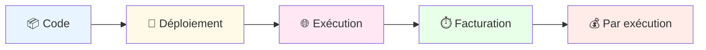
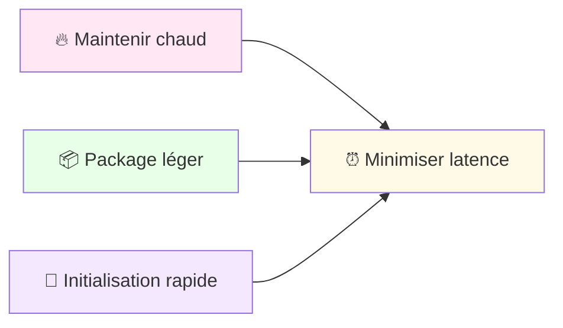
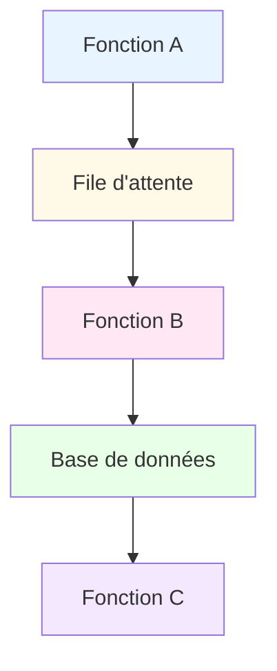

---

## 🎯 Serverless

  <h3 style="color: #2c3e50; margin-bottom: 20px; font-size: 1.8em;">🏗️ Architecture Serverless
</h3>
  

  

  

---

## Principes du Serverless

### Caractéristiques clés

### Avantages

- **Pas de gestion serveur**: Focus sur le code métier
- **Scalabilité automatique**: Gestion transparente de la charge
- **Facturation précise**: Pay-as-you-go
- **Déploiement rapide**: Mise en production instantanée

### Défis

- **Cold starts**: Latence initiale
- **Timeouts**: Limites d'exécution
- **Vendor lock-in**: Dépendance au fournisseur cloud

---

## Patterns Serverless Avancés

### 1. Cold Start Optimization

### 2. Composition de Fonctions

---

## Comparaison des Fournisseurs Cloud

| Fournisseur | Service | Langages | Timeout Max | Points forts |
|---|---|---|---|---|
| **AWS** | Lambda | Node, Python, Java, Go | 15 min | Écosystème complet |
| **Azure** | Functions | C#, JavaScript, Python | 10 min | Intégration Microsoft |
| **Google** | Cloud Functions | Node, Python, Go | 9 min | Scalabilité rapide |
| **Cloudflare** | Workers | JavaScript | 30 sec | Edge computing |