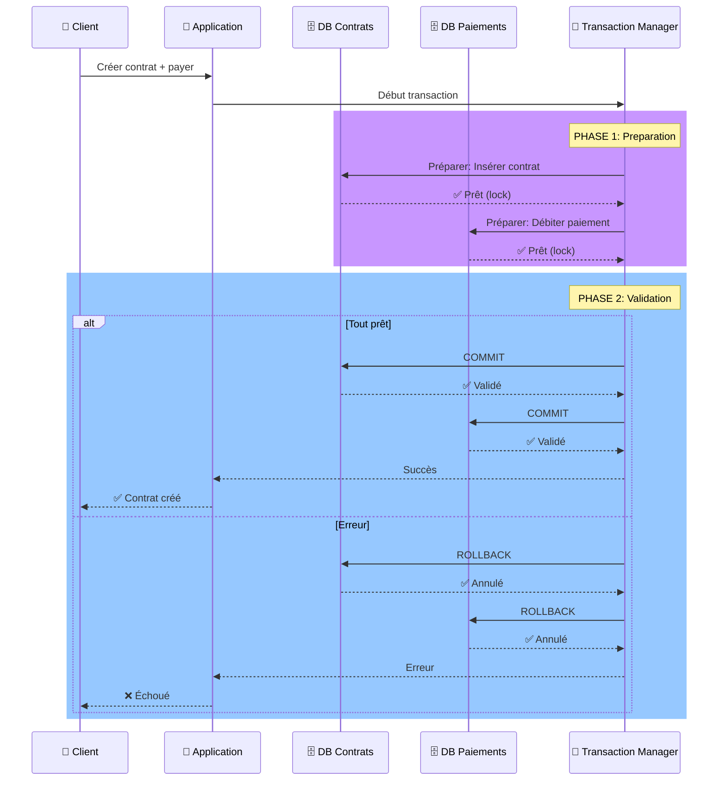

# 💾 Transactions
---

# 💾 Transactions en Backend

## Introduction aux Transactions

### Qu'est-ce qu'une transaction?

Une transaction est une **séquence d'opérations** qui doit s'exécuter en totalité ou pas du tout.

> "Un paiement est soit accepté complètement, soit rejeté en totalité - jamais partiellement."

---

### Propriétés ACID (fondamentales)

| Propriété | Signification | Assurance |
|-----------|---------------|-----------|
| **A**tomicité | Tout ou rien | Pas de paiement partiel |
| **C**ohérence | État valide avant/après | Soldes toujours corrects |
| **I**solation | Transactions indépendantes | Pas de lecture sale |
| **D**urabilité | Persistance garantie | Pas de perte de données |

### Cas d'usage assurance

- ✅ Création de contrat + enregistrement prime
- ✅ Sinistre + déblocage indemnisation
- ✅ Transfert de fonds entre comptes
- ✅ Mise à jour risque + calcul cotisation

---

## Problèmes sans Transactions

### Scénarios catastrophiques

```
Scénario: Achat d'assurance avec paiement

1. ✅ Prime débitée du compte client (-500€)
2. ❌ ERREUR BASE DE DONNÉES
3. ❌ Contrat NON créé
4. ❌ Prime perdue (ou non enregistrée)

→ Client a payé mais pas de contrat!
→ Risque juridique et financier énorme
```

### Sans ACID (base de données simple)

- Lecture sale: Lire une donnée non validée
- Modification perdue: Deux écritures simultanées
- Violation de contrainte: Somme = 0, mais montants = -50 et 100
- Crash pendant mise à jour: État inconsistant

---

## 2-Phase Commit (2PC)

<div style="display: grid; grid-template-columns: 1fr 1fr; gap: 30px; margin-top: 0px;">

### Fonctionnement schématique :

<div style="margin-top: -40px">

</div>
</div>

### Phases détaillées

**Phase 1: Prepare**
- Chaque ressource (BD) vérifie si elle PEUT valider
- Acquiert les locks nécessaires
- Réserve les ressources
- **Pas de commit encore**

**Phase 2: Commit**
- Coordinateur dit "commit" si tout est prêt
- Sinon "rollback"
- Les ressources appliquent définitivement

---

## Niveaux d'Isolation

### 4 niveaux d'isolation SQL standardisés (ANSI SQL) :

| Niveau | Lecture sale | Non-Répétable | Fantôme |
|--------|---------------|---------------|---------|
| **READ UNCOMMITTED** | ❌ Oui | ❌ Oui | ❌ Oui |
| **READ COMMITTED** | ✅ Non | ❌ Oui | ❌ Oui |
| **REPEATABLE READ** | ✅ Non | ✅ Non | ❌ Oui |
| **SERIALIZABLE** | ✅ Non | ✅ Non | ✅ Non |

### Définitions

- **Lecture sale**: Lire une donnée non commitée (peut être annulée)
- **Non-Répétable**: Deux lectures différentes de la même donnée
- **Fantôme**: Lignes qui apparaissent/disparaissent entre lectures

PostgreSQL par exemple supporte les quatre niveaux, et utilise Read Committed par défaut pour éviter les lectures sales sans trop de verrouillages.

---

## Implémentation dans les frameworks

### Spring Boot (Java)

```java
@Service
@Transactional  // ← Gère les transactions automatiquement
public class ContractService {
    @Transactional(propagation = Propagation.REQUIRED,
                   isolation = Isolation.REPEATABLE_READ)
    public void createContractWithPayment(Contract c, Payment p) {
        contractRepository.save(c);        // Insert contrat
        paymentRepository.save(p);         // Débiter paiement
        // ✅ COMMIT automatique si pas d'exception
        // ❌ ROLLBACK automatique si exception
    }
}

@Transactional  // Gestion d'erreur
public void transfer(Account from, Account to, double amount) {
    try {
        from.withdraw(amount);   // -500
        to.deposit(amount);      // +500
        accountRepo.save(from);
        accountRepo.save(to);
    } catch (Exception e) {
        // Rollback automatique, soldes intacts
        throw new TransactionException("Transfert échoué");
    }
}
```

---

### NestJS (Node.js/TypeScript)

```typescript
// Avec TypeORM
@Injectable()
export class ContractService {
  constructor(
    private dataSource: DataSource,
    private contractRepo: Repository<Contract>
  ) {}

  async createContractWithPayment(
    contract: Contract,
    payment: Payment
  ) {
    const queryRunner = this.dataSource.createQueryRunner();
    await queryRunner.connect();
    await queryRunner.startTransaction();

    try {
      await queryRunner.manager.save(contract);
      await queryRunner.manager.save(payment);
      await queryRunner.commitTransaction();
    } catch (err) {
      await queryRunner.rollbackTransaction();
      throw new Error('Transaction failed');
    } finally {
      await queryRunner.release();
    }
  }
}
```

### Considérations importantes

| Aspect | Détail |
|--------|--------|
| **Timeout** | Transactions longues = locks prolongés = deadlock |
| **Deadlock** | 2 transactions attendent mutuellement |
| **Performance** | SERIALIZABLE = plus sûr mais plus lent |
| **Monitoring** | Suivre les transactions longues |
| **Rollback** | Compréhendre les états d'erreur |