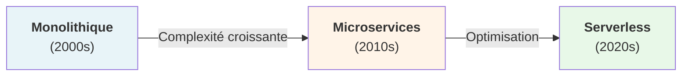

# Architectures Back-end

Back-ends et API pour le Web, le Mobile et l'IA

---
layout: table-contents
gradientColors: ['#8EC5FC', '#E0C3FC']
---

# 📋 Sommaire

- 🔧 Fondamentaux & Introduction
- 🏗️ Patterns d'Architecture
- 🚀 Architectures Avancées
- 🎨 Écosystèmes Technologiques
- ✨ Développement Propre
- 🌐 APIs & Communication
- � Messaging Asynchrone
- 🔒 Sécurité Avancée
- ⚡ Benchmarks de Performance
- 🔢 Nombres Clés
- 🤖 Intégration IA

---
src: ./pages/historique-architectures.md
---

---
src: ./pages/ecosystemes-backend.md
---

## Évolution des architectures

| Architecture | Avantages | Inconvénients |
| --- | --- | --- |
| Monolithe | Simple, facile à déployer | Difficile à scaler, couplage fort |
| Microservices | Scalable, indépendant | Complexité opérationnelle |
| Serverless | Pas de gestion infra | Coûts imprévisibles, latence |

---

## Défis de l'architecture moderne

#### 🚀 Performance

- Latence réduite
- Caching efficace
- Scalabilité

#### 🔒 Sécurité

- OAuth2, JWT
- HTTPS, TLS
- Validation des données

#### 📊 Scalabilité

- Horizontal scaling
- Load balancing
- Caching distribué

#### 🔄 Maintenabilité

- Documentation
- Tests automatisés
- CI/CD pipeline

---
src: ./pages/patterns.md
---
---
src: ./pages/transactions.md
---
---
src: ./pages/microservices.md
---

---
src: ./pages/async-messaging.md
---

---
src: ./pages/serverless.md
---
---
src: ./pages/cache.md
---

---
src: ./pages/db-sharding.md
---

---
src: ./pages/ddd.md
---

---
src: ./pages/clean-code.md
---

---
src: ./pages/security-advanced.md
---

---
src: ./pages/ia-mcp.md
---

---
layout: new-section
sectionImage: 'https://centralesupelec.venture.fr/wp-content/uploads/2023/06/cropped-Logo-CentraleSupelecVenture-VBk.png'
---

## 📚 Conclusion : ressources et références 

---

## Ressources & Références

#### Ouvrages de Référence

**Design Patterns** - Gang of Four (Gamma, Helm, Johnson, Vlissides)
> "The purpose of design patterns is to give a name and a context to design problems and their solutions."

**Building Microservices** - Sam Newman
> "Microservices are small, autonomous services that work together. The microservice architectural style is an approach to developing a single application as a suite of small services."

**Domain-Driven Design** - Eric Evans
> "When you model using only the semantics that the business expert cares about, you get a model that the business expert understands."

**Refactoring: Improving the Design of Existing Code** - Martin Fowler
> "Any fool can write code that a computer can understand. Good programmers write code that humans can understand."

**Clean Code** - Robert C. Martin
> "Any fool can write code that a computer can understand. Good programmers write code that humans can understand."

**Clean Architecture** - Robert C. Martin
> "A software architect is a programmer who has stopped programming and has started thinking about programs."

---

## Questions & Discussion

### Qu'avez-vous envie de discuter?

✋ Levez la main pour poser vos questions

💬 Débat sur technologies, architecture...

🤔 Cas d'usage spécifiques à votre contexte

Pas de question bête - cette partie est pour VOUS

---

## Merci! 🙏

---
