# Architectures Back-end & Front-end

Web, Mobile et IA

---

# 📋 Sommaire

<div style="display: grid; grid-template-columns: 1fr 1fr; gap: 30px; margin-top: 40px;">

<div>

## 🔧 Backend

- **Patterns d'Architecture**
  - Monolithe, Microservices
  - MVC, MVVM
  - CQRS, Event-Driven
  - Hexagonal, DI
  - Repository, Strategy

- **Clean Code, Clean Architecture**

- **Ecosystèmes technologiques**
  - Java, .Net, Python...

</div>

<div>

## 🎨 Frontend

- **Patterns d'Interface**
  - Components
  - State Management
  - Routing

- **Technologies Web**
  - React, Vue, Angular
  - Frameworks modernes

## 🤖 IA

- **MCP, A2A**

</div>

</div>

<div style="margin-top: 30px; padding: 20px; background: #f0f0f0; border-radius: 8px;">

**Fondamentaux** - Principes transversaux (Introduction, Clean Code, Sécurité, Synthèse)

</div>

---


# 📚 Introduction

*Fondamentaux de l'architecture logicielle*

---

## Pourquoi l'architecture logicielle est cruciale ?

> "When you model using only the semantics that the business expert cares about, you get a model that the business expert understands." — **Eric Evans**, Domain-Driven Design

### Impact direct sur:

- Maintenabilité et évolutivité du code
- Performance et sécurité des applications
- Adaptation aux besoins métiers (ex: assurance, santé)
- Réduction des coûts de développement à long terme

---

## Évolution des architectures

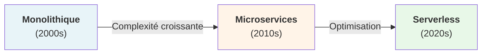

| Architecture | Avantages | Inconvénients |
| --- | --- | --- |
| Monolithe | Simple, facile à déployer | Diffcile à scaler, couplage fort |
| Microservices | Scalable, indépendant | Complexité opérationnelle |
| Serverless | Pas de gestion infra | Coûts imprévisibles, latence |

---

## Définitions clés

#### Back-end
Logique métier, bases de données, APIs, serveurs. Invisible à l'utilisateur final.

#### Front-end
Interface utilisateur, expérience client, interactions. Ce que l'utilisateur voit et utilise.

#### API (Application Programming Interface)
Pont de communication entre back-end et front-end. Contrats et protocoles d'échange de données.

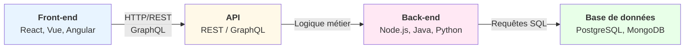

---

## Panorama des technologies

#### 🔧 Back-end

#### 🎨 Front-end

#### 📱 Mobile

#### 🧠 Infrastructure & BD

- Java: Spring Boot, Spring Cloud
- Node.js: Express, NestJS
- Python: Django, FastAPI
- Go: Gin, Echo

- React: Composants, Hooks
- Vue.js: Réactif, simple
- Angular: Complet, TypeScript
- Next.js: SSR, SSG, SSG

- React Native: Code réutilisable
- Flutter: Widgets natifs
- Swift/Kotlin: Natif

- Docker: Conteneurisation
- Kubernetes: Orchestration
- PostgreSQL, MongoDB

---

## Principes fondamentaux

### Séparation des préoccupations

Chaque couche a une responsabilité unique et bien définie.

```plaintext
Présentation (UI)
      ↓
Logique métier (Règles de gestion)
      ↓
Accès aux données (Persistance)
      ↓
Infrastructure (Serveurs, BD)
```

---

## SOLID & Bonnes pratiques

### Principes SOLID

- Single Responsibility Principle: Une classe = une responsabilité
- Open/Closed Principle: Ouvert à l'extension, fermé à la modification
- Liskov Substitution: Les sous-types peuvent remplacer le type parent
- Interface Segregation: Plusieurs interfaces spécifiques > une grosse interface
- Dependency Inversion: Dépendre des abstractions, pas des implémentations

---

## Défis de l'architecture moderne

#### 🚀 Performance

#### 🔒 Sécurité

#### 📊 Scalabilité

#### 🔄 Maintenabilité

- Latence réduite
- Caching efficace
- Scalabilité

- OAuth2, JWT
- HTTPS, TLS
- Validation des données

- Horizontal scaling
- Load balancing
- Caching distribué

- Documentation
- Tests automatisés
- CI/CD pipeline

---

layout: center
class: 'text-center'

# 🏗️ Patterns d'Architecture

*Solutions éprouvées pour structurer vos applications*

---

## Pourquoi utiliser des patterns ?

### Les patterns résolvents des problèmes récurrents

> "The purpose of design patterns is to give a name and a context to design problems and their solutions." — **Gang of Four**, Design Patterns

- Réutilisabilité: Solutions éprouvées et documentées
- Standardisation: Équipes alignées sur une même approche
- Collaboration: Facilite la communication entre développeurs
- Réduction des risques: Évite les pièges courants
- Maintenabilité: Code plus prévisible et compréhensible

---

## Pattern MVC (Model-View-Controller)

### Séparation des responsabilités:

- Model: Données et logique métier
- View: Présentation et interface utilisateur
- Controller: Coordination et gestion des événements

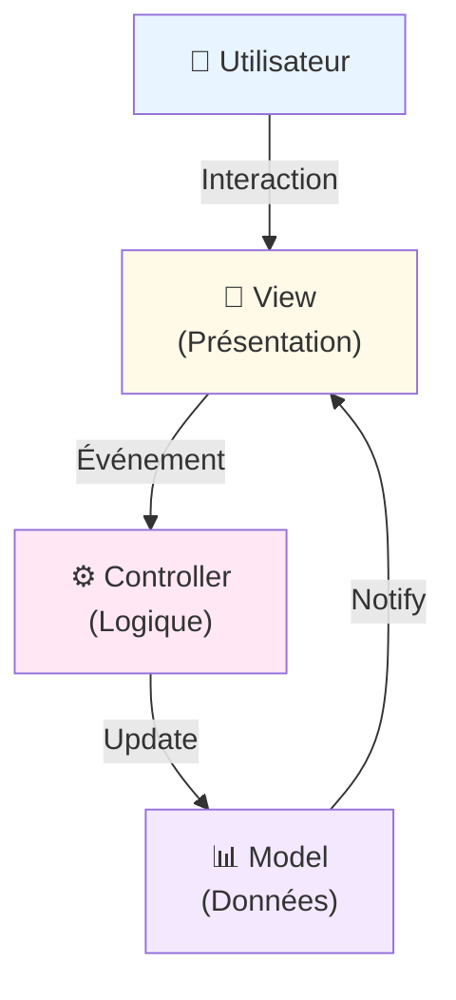

---

## Pattern MVVM (Model-View-ViewModel)

### Caractéristiques:

- Binding bidirectionnel: Sync automatique View ↔ ViewModel
- Testabilité: ViewModel indépendant de la Vue
- Réactivité: Mises à jour temps réel

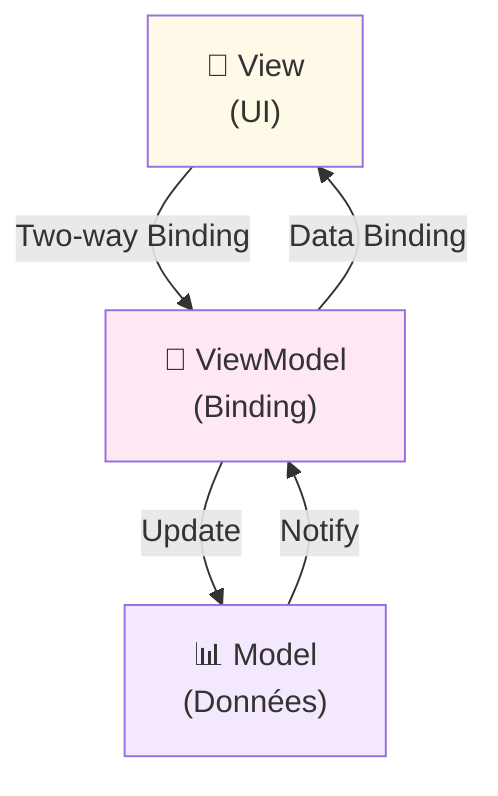

---

## Pattern CQRS (Command Query Responsibility Segregation)

### Avantages:

Séparer les modèles de lecture et écriture.

- Optimisation indépendante des lectures et écritures
- Scalabilité: Lecture et écriture peuvent être déployées séparément
- Performance: Chaque modèle optimisé pour son usage

```mermaid
graph LR
                            Client["👤 Client"]
                            
                            Client -->|Commande<br/>(Écriture)| Command["📝 Command<br/>Handler"]
                            Client -->|Requête<br/>(Lecture)| Query["🔍 Query<br/>Handler"]
                            
                            Command -->|Persiste| Write["💾 Write<br/>Database"]
                            Query -->|Lit| Read["📖 Read<br/>Database<br/>(Optimisée)"]
                            Write -->|Synchronise| Read
                            
                            style Client fill:#e8f4ff
                            style Command fill:#ffe8f4
                            style Query fill:#fff9e8
                            style Write fill:#f4e8ff
                            style Read fill:#e8ffe8
```

---

## Pattern Event-Driven Architecture

### Cas d'usage assurance:

Services réactifs aux événements métiers asynchrones.

- Événement: "ContractCreated" - Un nouveau contrat est créé
- Consommateurs: Service email (notification), Service CRM (update), Service audit (logging)
- Avantage: Découplage complet entre services

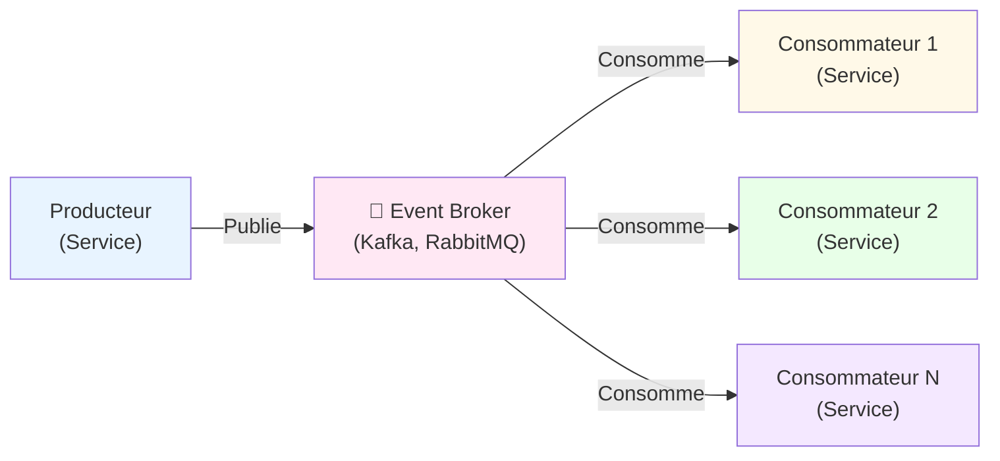

---

## Pattern Hexagonal (Ports & Adapters)

### Bénéfices:

Isoler le cœur métier des détails techniques.

- Cœur métier indépendant des frameworks
- Adaptation facile aux changements technologiques
- Tests unitaires sans dépendances externes

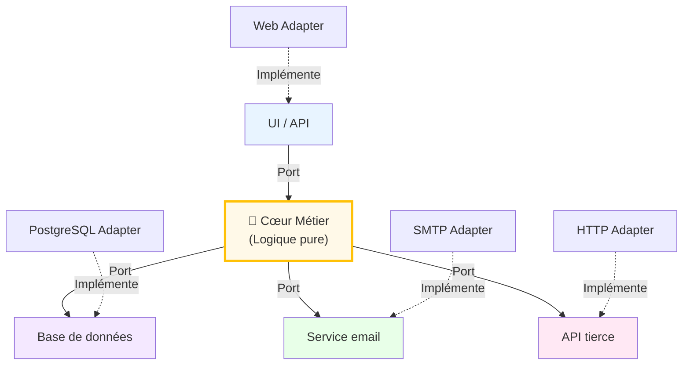

---

## Pattern Dependency Injection (DI)

### Sans Dependency Injection (couplage fort):

### Avec Dependency Injection (découplage):

Injecter les dépendances plutôt que les créer soi-même.

```plaintext
public class ContractService {
    private DatabaseService db = new DatabaseService(); // Couplage fort
    
    public void createContract(Contract c) {
        db.save(c);
    }
}
```

```plaintext
public class ContractService {
    private DatabaseService db; // Interface
    
    @Inject // Spring/Guice injecte la dépendance
    public ContractService(DatabaseService db) {
        this.db = db;
    }
}
```

---

## Pattern Repository

### Avantages:

Abstraction de la couche d'accès aux données.

- Logique métier indépendante du mécanisme de persistance
- Facile de basculer de PostgreSQL à MongoDB
- Tests unitaires avec implémentation mock

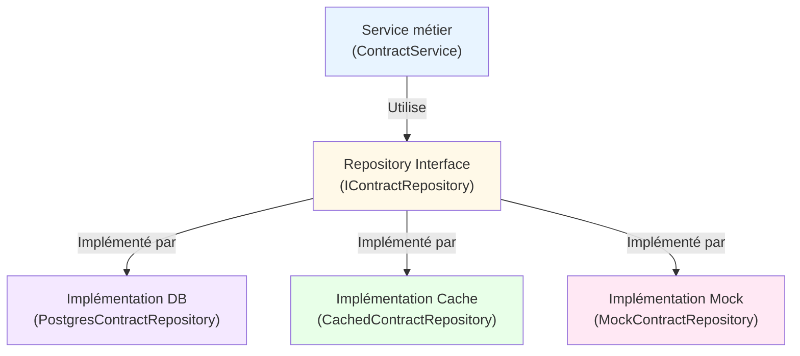

---

## Pattern Strategy

### Exemple: Calcul de prime d'assurance

#### Strategy: BasePricingStrategy

#### Utilisation

Encapsuler une famille d'algorithmes interchangeables.

```plaintext
interface PricingStrategy {
  calculatePremium(contract);
}

class Standard 
  implements PricingStrategy { ... }

class Premium 
  implements PricingStrategy { ... }
```

```plaintext
ContractService {
  strategy: PricingStrategy;
  
  calculate() {
    return this.strategy
      .calculatePremium(contract)
  }
}
```

---

## Récapitulatif: Quand utiliser quel pattern ?

| Pattern | Problème | Quand l'utiliser |
| --- | --- | --- |
| MVC | Séparation UI/logique | Web traditionnel, applications simples |
| MVVM | Binding bidirectionnel | Interfaces réactives, desktop/mobile |
| CQRS | Scalabilité lecture/écriture | Hauts volumes, complex queries |
| Event-Driven | Découplage asynchrone | Microservices, systèmes réactifs |
| Hexagonal | Isolation cœur métier | Logique métier complexe, DDD |
| DI | Gestion dépendances | Tous les projets modernes |

---

layout: center
class: 'text-center'

# 🏗️ Patterns d'Architecture

*Solutions éprouvées pour structurer vos applications*

---

layout: center
class: 'text-center'

# 🔧 Écosystèmes Backend

*Découvrez les principaux frameworks et technologies*

---

## Vue d'ensemble

Les principaux écosystèmes pour développer des applications backend robustes et scalables.

---

## Spring Boot (Java)

### Caractéristiques
- **Framework**: Spring Framework avec Spring Boot pour démarrage rapide
- **TypeScript/Langages**: Java (JVM ecosystem)
- **Popularité**: ⭐⭐⭐⭐⭐ Très populaire en entreprise
- **Apprentissage**: Moyen - courbe importante

### Points forts
- Écosystème très riche et mature
- Excellente scalabilité
- Performance élevée
- Nombreuses intégrations
- Transactions ACID robustes

### Use cases
- Systèmes d'entreprise complexes
- Applications haute disponibilité
- Microservices à grande échelle
- Systèmes financiers

---

## NestJS (Node.js/TypeScript)

### Caractéristiques
- **Framework**: Node.js moderne avec TypeScript par défaut
- **Langages**: TypeScript/JavaScript
- **Popularité**: ⭐⭐⭐⭐ En croissance rapide
- **Apprentissage**: Facile - syntaxe proche de Angular

### Points forts
- Très rapide à développer
- Partage du code Frontend/Backend (JavaScript/TS)
- Développement agile
- Excellent pour API REST et GraphQL
- Écosystème npm très riche

### Use cases
- APIs modernes et scalables
- Applications temps réel (WebSocket)
- Microservices légers
- Projets startup et agiles

---

## Python (FastAPI & Django)

### FastAPI
- **Caractéristiques**: Framework ultra-moderne et performant
- **Avantages**: Très rapide à développer, auto-documentation API
- **Use cases**: APIs légères, Machine Learning, Data Science

### Django
- **Caractéristiques**: Framework complet "batteries included"
- **Avantages**: ORM puissant, admin panel généré, sécurité native
- **Use cases**: Applications web complètes, startups, prototypage rapide

### Points communs
- Popularité: ⭐⭐⭐⭐ Excellente pour l'IA/ML
- Apprentissage: Facile - syntaxe simple et claire
- Productivité: Très haute

---

## .NET / ASP.NET Core (C#)

### Caractéristiques
- **Framework**: ASP.NET Core (cross-platform)
- **Langages**: C# (langage moderne et puissant)
- **Popularité**: ⭐⭐⭐⭐ Très utilisé en entreprise
- **Apprentissage**: Moyen - C# plus complexe que Python

### Points forts
- Performance exceptionnelle
- Typage fort et sécurité
- Excellent écosystème Microsoft
- Cross-platform (Windows, Linux, Mac)
- Intégration Azure native

### Use cases
- Applications d'entreprise Windows
- Systèmes critiques
- Solutions sur Azure
- Applications Windows Desktop + Backend

---

## Ruby on Rails (Ruby)

### Caractéristiques
- **Framework**: Rails (Convention over Configuration)
- **Langages**: Ruby (syntaxe élégante)
- **Popularité**: ⭐⭐⭐ Moins nouveau, mais très efficace
- **Apprentissage**: Très facile - excellent pour débutants

### Points forts
- Rapidité de développement exceptionnelle
- Convention plutôt que configuration
- Excellente pour prototypes et MVPs
- Communauté très active et bienveillante
- Gestion de bases de données élégante

### Use cases
- Startups et MVPs
- Applications web complètes
- Prototypage rapide
- Content management systems

---

## Comparaison Synthétique

| Critère | Spring Boot | NestJS | Python | .NET | Rails |
|---------|-------------|--------|--------|------|-------|
| **Vitesse dev** | Moyen | Rapide | Très rapide | Moyen | Très rapide |
| **Performance** | ⭐⭐⭐⭐⭐ | ⭐⭐⭐⭐ | ⭐⭐⭐ | ⭐⭐⭐⭐⭐ | ⭐⭐⭐ |
| **Scalabilité** | ⭐⭐⭐⭐⭐ | ⭐⭐⭐⭐ | ⭐⭐⭐ | ⭐⭐⭐⭐⭐ | ⭐⭐⭐ |
| **Courbe apprentissage** | Moyenne | Facile | Facile | Moyenne | Très facile |
| **Écosystème** | ⭐⭐⭐⭐⭐ | ⭐⭐⭐⭐ | ⭐⭐⭐⭐ | ⭐⭐⭐⭐⭐ | ⭐⭐⭐ |
| **Entreprise** | ⭐⭐⭐⭐⭐ | ⭐⭐⭐⭐ | ⭐⭐⭐⭐ | ⭐⭐⭐⭐⭐ | ⭐⭐⭐ |
| **Startup/Agile** | ⭐⭐⭐ | ⭐⭐⭐⭐⭐ | ⭐⭐⭐⭐⭐ | ⭐⭐ | ⭐⭐⭐⭐⭐ |

---

## Quelle pile choisir?

### Spring Boot 👉
- Vous avez une équipe Java expérimentée
- Vous développez un système critique d'entreprise
- Vous besoin d'une scalabilité extrême

### NestJS 👉
- Vous voulez une pile moderne et unifiée (Front/Back en TypeScript)
- Vous développez des microservices
- Vous cherchez un bon équilibre productivité/performance

### Python 👉
- Vous découvrez la programmation backend
- Vous travaillez avec l'IA/ML
- Vous voulez développer très rapidement

### .NET 👉
- Vous êtes dans un environnement Microsoft/Azure
- Vous avez besoin de performance extrême
- Vous développez pour Windows et le web

### Rails 👉
- Vous êtes une startup avec peu de ressources
- Vous cherchez à valider rapidement une idée (MVP)
- Vous êtes seul ou en très petit équipe

---

layout: center
class: 'text-center'

# ✨ Clean Code & Architecture

*Écrire du code maintenable et évolutif*

---

## Clean Code: Introduction

### Pourquoi le Clean Code ?

> "Any fool can write code that a computer can understand. Good programmers write code that humans can understand." — **Robert C. Martin**, Clean Code

- Réduction des bugs: Code clair = moins d'erreurs
- Maintenabilité: Facile à modifier et à déboguer
- Collaboration: Équipes comprennent rapidement le code
- Évolutivité: Ajout de fonctionnalités sans refonte
- Productivité: Développeurs plus rapides et efficaces

---

## Code sale vs Code propre

#### ❌ Code sale (mauvais)

#### ✅ Code propre (bon)

```plaintext
function calc(c) {
    let p = 0;
    if (c.age < 25)
        p = c.sal * 0.15;
    else if (c.age < 65)
        p = c.sal * 0.1;
    else
        p = c.sal * 0.2;
    
    // TODO: ajouter taxes
    // FIXME: bug ici
    return p;
}
```

```plaintext
double calculateInsurancePremium(
    Customer customer) {
    int age = customer.getAge();
    double salary = customer.getSalary();
    
    PremiumRate rate = 
        determinePremiumRate(age);
    
    return salary * rate.getPercentage();
}

PremiumRate determinePremiumRate(
    int age) {
    if (age < 25) return YOUNG_RATE;
    if (age < 65) return STANDARD_RATE;
    return SENIOR_RATE;
}
```

---

## Règle 1: Nommage clair

### Noms révélateurs d'intention

| ❌ Mauvais | ✅ Bon | Raison |
| --- | --- | --- |
| d | elapsedTimeInDays | Spécifique et clair |
| calcP() | calculatePremium() | Verbe + nom explicite |
| list1, list2 | activeContracts, expiredContracts | Contexte et utilité clairs |
| Manager | ContractManager | Plus précis et domaine-spécifique |

---

## Règle 2: Fonctions courtes (SRP)

### Fonction trop grosse (mauvais):

### Fonctions courtes et focalisées (bon):

Single Responsibility Principle: Une fonction = une seule raison de changer

```plaintext
public void processContract(Contract c) {
    // Validation
    if (c.getSalary() < 0) throw new Exception(...);
    
    // Calcul de prime
    double premium = c.getSalary() * 0.1;
    
    // Enregistrement
    database.save(c);
    
    // Envoi email
    emailService.send(c.getEmail(), premium);
    
    // Logging
    logger.info("Contrat traité: " + c.getId());
}
```

```plaintext
public void processContract(Contract c) {
    validateContract(c);
    double premium = calculatePremium(c);
    saveContract(c);
    notifyCustomer(c, premium);
}

private void validateContract(Contract c) { ... }
private double calculatePremium(Contract c) { ... }
private void saveContract(Contract c) { ... }
private void notifyCustomer(Contract c, double p) { ... }
```

---

## Règle 3: Gestion des erreurs

### Préférer les exceptions aux codes de retour:

#### ❌ Code de retour

#### ✅ Exception

```plaintext
int status = 
    contractService.save(c);
    
if (status == 0) {
    System.err.println("Erreur!");
} else if (status == 1) {
    System.out.println("Saved");
}
```

```plaintext
try {
    contractService.save(c);
    logger.info("Contrat sauvé");
} catch (
    InvalidContractException e) {
    logger.error(
        "Contrat invalide: "
        + e.getMessage()
    );
}
```

---

## Règle 4: DRY (Don't Repeat Yourself)

#### ❌ Code répété

#### ✅ Extraction en méthode

Éliminer les répétitions de code.

```plaintext
// ContractService
double premium = salary * 0.1;
if (premium < 100) premium = 100;
return premium;

// CustomerService
double amount = salary * 0.1;
if (amount < 100) amount = 100;
return amount;

// BenefitService
double benefit = salary * 0.1;
if (benefit < 100) benefit = 100;
return benefit;
```

```plaintext
// PricingCalculator
private double calculateAmount(
    double salary) {
    double amount = salary * 0.1;
    return Math.max(amount, 100);
}

// Utilisation
ContractService uses 
    calculateAmount();
    
CustomerService uses 
    calculateAmount();
    
BenefitService uses 
    calculateAmount();
```

---

## Règle 5: Commentaires

#### ❌ Commentaires inutiles

#### ✅ Commentaires utiles

Le code doit se commenter lui-même. Les commentaires ne doivent expliquer que le POURQUOI, pas le QUOI.

```plaintext
// Incrémenter i
i++;

// Vérifier si la liste 
// n'est pas vide
if (list.size() > 0) {
    // Boucler sur les éléments
    for (Item item : list) {
        // Ajouter à total
        total += item.getValue();
    }
}
```

```plaintext
// Limite minimale définie par
// la régulation assurance (2024)
final double MINIMUM_PREMIUM = 100;

// Algorithme de pricing Bayésien
// basé sur historique client
// Source: ACME-2023 Paper
private double 
    calculateAdaptivePremium(
        Customer c) {
    ...
}
```

---

## Règle 6: Formatage et style

### Cohérence est clé

- Indentation: 2 ou 4 espaces (pas de tabs)
- Longueur de ligne: Max 100-120 caractères
- Noms de classes: PascalCase (ContractService)
- Noms de variables: camelCase (myVariable)
- Noms de constantes: UPPER_SNAKE_CASE (MAX_SIZE)
- Espaces: Autour des opérateurs (x = y + z)

---

## Règle 7: Testabilité

### Propriétés d'un code testable:

#### Exemple: Test unitaire simple

Code testable = code découplé

- ✅ Dépendances injectées (pas "new Database()")
- ✅ Logique métier indépendante du framework
- ✅ Pas de singletons globaux
- ✅ Pas d'appels à des APIs externes en dur
- ✅ Méthodes courtes et déterministes

```plaintext
@Test
public void testCalculatePremiumForYoungDriver() {
    Customer young = new Customer(20, 30000);
    double premium = service.calculatePremium(young);
    assertEquals(4500, premium, 0.01);
}
```

---

## Récapitulatif: Les 7 règles du Clean Code

| # | Règle | Bénéfice |
| --- | --- | --- |
| 1 | Nommage clair | Comprendre rapidement l'intention |
| 2 | Fonctions courtes (SRP) | Facile à tester et maintenir |
| 3 | Gestion des erreurs | Code plus lisible et robuste |
| 4 | DRY (pas de répétition) | Modifications en un seul endroit |
| 5 | Commentaires utiles | Comprendre le POURQUOI |
| 6 | Formatage cohérent | Équipe sur la même longueur d'onde |
| 7 | Testabilité | Confiance dans le code |

---

## Clean Architecture: Introduction

> "A software architect is a programmer who has stopped programming and has started thinking about programs." — **Robert C. Martin**, Clean Architecture

Structure logicielle indépendante des frameworks, testable et maintenable.

Principe: Les couches intérieures ne dépendent jamais des couches extérieures

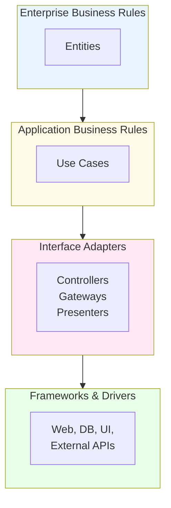

---

## Les 4 couches de Clean Architecture

#### 1️⃣ Entities (Cœur métier)

#### 2️⃣ Use Cases (Logique applicative)

#### 3️⃣ Interface Adapters

#### 4️⃣ Frameworks & Drivers

Objets métiers purs, pas de frameworks

public class Contract {
    private String id;
    private Customer customer;
    private double premium;
    public boolean isValid() {
        return premium > 0 
            && customer != null;
    }
}
                        2️⃣ Use Cases (Logique applicative)
                        Règles métier spécifiques à l'app

public class CreateContractUseCase {
    private ContractRepository repo;
    public void execute(
        CreateContractRequest req) {
        Contract c = new Contract(...);
        validateContract(c);
        repo.save(c);
    }
}
                        3️⃣ Interface Adapters
                        Controllers, Gateways, Presenters

@RestController
public class ContractController {
    @PostMapping("/contracts")
    public void create(
        @RequestBody Request req) {
        useCase.execute(req);
    }
}
                        4️⃣ Frameworks & Drivers
                        Spring, Hibernate, PostgreSQL, etc.

Détails techniques, facilement remplaçables

```plaintext
public class Contract {
    private String id;
    private Customer customer;
    private double premium;
    
    public boolean isValid() {
        return premium > 0 
            && customer != null;
    }
}
```

```plaintext
public class CreateContractUseCase {
    private ContractRepository repo;
    
    public void execute(
        CreateContractRequest req) {
        Contract c = new Contract(...);
        validateContract(c);
        repo.save(c);
    }
}
```

```plaintext
@RestController
public class ContractController {
    @PostMapping("/contracts")
    public void create(
        @RequestBody Request req) {
        useCase.execute(req);
    }
}
```

---

## Direction des dépendances

Règle d'or: Les dépendances pointent toujours vers l'intérieur

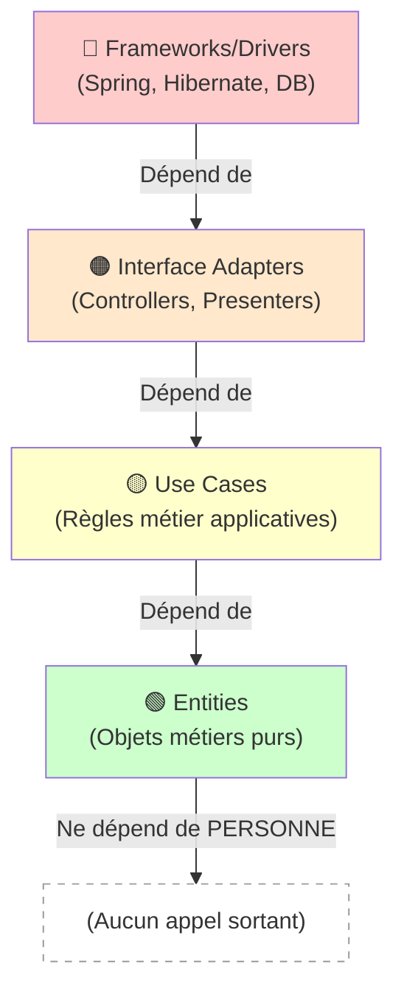

---

## Structure de projet Clean Architecture

```plaintext
src/
├── main/java/com/myapp/
│   │
│   ├── domain/               # 🟢 Entities
│   │   ├── Contract.java
│   │   ├── Customer.java
│   │   └── ContractRepository.java (interface)
│   │
│   ├── application/          # 🟡 Use Cases
│   │   ├── CreateContractUseCase.java
│   │   ├── UpdateContractUseCase.java
│   │   └── dto/
│   │       └── CreateContractRequest.java
│   │
│   ├── infrastructure/       # 🟠 Adapters & Drivers
│   │   ├── controller/
│   │   │   └── ContractController.java
│   │   ├── persistence/
│   │   │   ├── PostgresContractRepository.java
│   │   │   └── ContractEntity.java (JPA)
│   │   └── external/
│   │       └── EmailServiceAdapter.java
│   │
│   └── config/
│       └── DependencyInjectionConfig.java
│
└── test/
    └── java/com/myapp/
        ├── domain/
        ├── application/
        └── infrastructure/
```

---

## Cas d'usage: CreateContractUseCase

### Étapes du processus:

#### Code complet:

```plaintext
@Service
public class CreateContractUseCase {
    private final ContractRepository repo;
    private final EmailService emailService;
    private final PremiumCalculator calculator;
    
    @Inject // Dependency Injection
    public CreateContractUseCase(
        ContractRepository repo,
        EmailService emailService,
        PremiumCalculator calculator) {
        this.repo = repo;
        this.emailService = emailService;
        this.calculator = calculator;
    }
    
    public ContractResponse execute(
        CreateContractRequest request) {
        // 1. Validation
        validateRequest(request);
        
        // 2. Création entité
        Contract contract = new Contract(
            request.getCustomerId(),
            request.getType()
        );
        
        // 3. Calcul de prime
        double premium = calculator
            .calculate(contract);
        contract.setPremium(premium);
        
        // 4. Persistance
        Contract saved = repo.save(contract);
        
        // 5. Notification
        emailService.sendConfirmation(
            saved.getCustomer().getEmail(),
            saved
        );
        
        return new ContractResponse(saved);
    }
    
    private void validateRequest(
        CreateContractRequest request) {
        if (request.getCustomerId() == null)
            throw new InvalidRequestException(
                "Customer ID required"
            );
        // Plus de validations...
    }
}
```

---

## Tests unitaires faciles

#### Test du CreateContractUseCase

Un avantage clé de Clean Architecture: testabilité.

```plaintext
public class CreateContractUseCaseTest {
    private CreateContractUseCase useCase;
    private ContractRepository mockRepo;
    private EmailService mockEmail;
    private PremiumCalculator mockCalc;
    
    @Before
    public void setup() {
        // Créer des mocks (faux objets)
        mockRepo = mock(ContractRepository.class);
        mockEmail = mock(EmailService.class);
        mockCalc = mock(PremiumCalculator.class);
        
        // Injector les dépendances
        useCase = new CreateContractUseCase(
            mockRepo, mockEmail, mockCalc
        );
    }
    
    @Test
    public void shouldCreateContractWithValidData() {
        // Given
        CreateContractRequest req = 
            new CreateContractRequest("cust-1", "AUTO");
        when(mockCalc.calculate(any()))
            .thenReturn(1200.0);
        when(mockRepo.save(any()))
            .thenReturn(new Contract(...));
        
        // When
        ContractResponse response = useCase.execute(req);
        
        // Then
        assertNotNull(response);
        verify(mockEmail).sendConfirmation(...);
        verify(mockRepo).save(...);
    }
}
```

---

## Avantages de Clean Architecture

#### ✅ Pour le développement

#### ✅ Pour la maintenance

#### ✅ Pour le business

#### ✅ Pour l'architecture

- Logique métier isolée
- Tests unitaires simples
- Code découplé
- Facile à naviguer

- Changements localisés
- Moins de bugs
- Évolution facilitée
- Refactoring sûr

- Réduction des coûts
- Time-to-market amélioré
- Moins de bugs en prod
- Équipes plus productives

- Framework agnostique
- Technologie replaceable
- Scalabilité intégrée
- Future-proof

---

## Pièges à éviter

#### ❌ Over-engineering

#### ❌ Entities contaminées

#### ❌ DTOs oubliés

#### ❌ Tests négligés

Conseil: Adapter la complexité aux besoins

Conseil: Entities = POJO purs

Conseil: Toujours utiliser des DTOs

Conseil: 70%+ du code couvert

- Trop de couches
- Abstractions inutiles
- Code complexe pour du simple

- Annotations JPA/Spring
- Logique métier dispersée
- Dépendances externes

- Entities retournées au client
- Leaks d'implémentation
- Couplage fort

- Tests intégration lents
- Pas de tests unitaires
- Coverage faible

---

## Comparaison: Approches d'architecture

| Aspect | Architecture simple | Clean Architecture |
| --- | --- | --- |
| Testabilité | Difficile (couplage fort) | Facile (découplage) |
| Complexité initiale | Faible | Modérée à élevée |
| Maintenance long terme | Difficile (dette tech) | Facile (structure claire) |
| Scalabilité | Limitée | Excellente |
| Changement technologie | Coûteux (réécriture) | Simple (adaptateurs) |
| Productivité équipe | Diminue avec la taille | Stable et prévisible |
| Idéal pour | Prototypes, POC | Projets long terme |

---

## Récapitulatif: Clean Code & Architecture

#### 🎨 Clean Code

#### 🏛️ Clean Architecture

### Impact combiné:

7 règles:

4 couches:

- ✅ Code facile à lire et comprendre
- ✅ Logique métier isolée et testable
- ✅ Dépendances contrôlées
- ✅ Évolution sans refonte majeure
- ✅ Équipes productives et heureuses

---

## REST vs GraphQL

### Comparaison des approches

| Aspect | REST | GraphQL |
| --- | --- | --- |
| Requête | Fixed endpoints (/users/1) | Flexible query (demander exactement ce qu'on veut) |
| Over-fetching | Oui (données superflues) | Non (données exactes) |
| Under-fetching | Oui (appels multiples) | Non (1 requête) |
| Caching | Facile (HTTP standard) | Plus difficile |
| Versioning | Nécessaire (/v1/, /v2/) | Pas nécessaire |
| Courbe d'apprentissage | Facile | Modérée |

---

## REST: Principes fondamentaux

### Principes clés:

#### Exemple d'endpoints REST:

REST: Representational State Transfer

- Client-Server: Séparation des préoccupations
- Stateless: Chaque requête contient toutes les infos
- Cacheable: Réponses peuvent être mises en cache
- Uniform Interface: Ressources identifiables par URI
- Méthodes HTTP standards: GET, POST, PUT, DELETE, PATCH

```plaintext
GET    /api/v1/contracts              # Récupérer tous les contrats
POST   /api/v1/contracts              # Créer un nouveau contrat
GET    /api/v1/contracts/123          # Récupérer un contrat spécifique
PUT    /api/v1/contracts/123          # Mettre à jour complètement
PATCH  /api/v1/contracts/123          # Mise à jour partielle
DELETE /api/v1/contracts/123          # Supprimer

GET    /api/v1/contracts/123/claims   # Sous-ressources
```

---

## REST: Bonnes pratiques

### Best practices pour une API REST robuste:

#### 🔐 Sécurité

#### 📝 Versioning

#### 📚 Documentation

#### ⚠️ Erreurs

- OAuth2: Authentification
- JWT: Token sans état
- HTTPS: Chiffrement
- Rate limiting: Protection DOS
- CORS: Contrôle d'accès

- URL versioning: /v1/, /v2/
- Header versioning: X-API-Version
- Semantic versioning: 1.2.3
- Backward compatibility
- Deprecation warning

- Swagger/OpenAPI
- Postman
- Réducers
- Exemples de requêtes
- Codes d'erreur

- Codes HTTP corrects
- Réponses d'erreur cohérentes
- Messages clairs
- Logging et monitoring
- Ratelimit headers

---

## Codes HTTP et gestion d'erreurs

#### Réponse d'erreur standardisée:

```plaintext
{
  "error": {
    "code": "INVALID_CONTRACT",
    "message": "Le contrat ne peut pas être créé",
    "details": {
      "field": "customer_id",
      "reason": "Customer not found"
    },
    "timestamp": "2026-01-17T10:30:00Z",
    "requestId": "req-12345"
  }
}
```

| Code | Signification | Exemple |
| --- | --- | --- |
| 200 | OK - Succès | Requête GET réussie |
| 201 | Created - Ressource créée | POST réussi |
| 400 | Bad Request - Erreur client | JSON invalide |
| 401 | Unauthorized - Auth requise | Token expiré |
| 403 | Forbidden - Pas d'accès | Permissions insuffisantes |
| 404 | Not Found - Ressource absente | Contrat inexistant |
| 500 | Server Error - Erreur serveur | Exception non gérée |
| 503 | Service Unavailable | Maintenance, surcharge |

---

## GraphQL: Introduction

### Concept clé: Demander exactement ce qu'on veut

#### ❌ REST (over-fetching)

#### ✅ GraphQL (seulement ce qu'il faut)

GraphQL: Query language pour APIs

```plaintext
GET /api/v1/contracts/123

{
  "id": "123",
  "customer": { ... },
  "premium": 1200,
  "type": "AUTO",
  "status": "ACTIVE",
  "createdAt": "...",
  "updatedAt": "...",
  // Plein de données non nécessaires
}

Données non utilisées = 
bande passante gaspillée
```

```plaintext
query {
  contract(id: "123") {
    id
    premium
    type
  }
}

Réponse:
{
  "contract": {
    "id": "123",
    "premium": 1200,
    "type": "AUTO"
  }
}

Que ce qui est demandé
```

---

## Schéma GraphQL

#### Exemple de schéma pour assurance:

Structure typée des données et opérations disponibles

```plaintext
type Contract {
  id: ID!                    # ! = obligatoire
  customer: Customer!
  premium: Float!
  type: ContractType!
  status: Status!
  claims: [Claim!]!          # Liste obligatoire
  createdAt: DateTime!
}

type Customer {
  id: ID!
  name: String!
  email: String!
  age: Int!
  contracts: [Contract!]!
}

enum ContractType {
  AUTO
  HOME
  HEALTH
}

enum Status {
  ACTIVE
  EXPIRED
  SUSPENDED
}

type Query {
  contract(id: ID!): Contract
  contracts(limit: Int = 10): [Contract!]!
  customer(id: ID!): Customer
}

type Mutation {
  createContract(input: CreateContractInput!): Contract!
  updateContract(id: ID!, input: UpdateContractInput!): Contract!
  deleteContract(id: ID!): Boolean!
}
```

---

## GraphQL Queries (Lecture)

### Query simple:

### Query avec filtrage et pagination:

### Query avec relations imbriquées:

```plaintext
query GetContract {
  contract(id: "123") {
    id
    premium
    type
    customer {
      name
      email
    }
  }
}
```

```plaintext
query GetContracts {
  contracts(limit: 10, offset: 0) {
    id
    premium
    type
    status
    customer {
      id
      name
    }
  }
}
```

```plaintext
query GetCustomerWithContracts {
  customer(id: "cust-1") {
    id
    name
    contracts {
      id
      premium
      type
      claims {
        id
        status
        amount
      }
    }
  }
}
```

---

## GraphQL Mutations (Écriture)

#### Mutation: Créer un contrat

Opérations de création, mise à jour, suppression

```plaintext
mutation CreateNewContract {
  createContract(input: {
    customerId: "cust-1"
    type: AUTO
    coverage: [COLLISION, THEFT]
    deductible: 500
  }) {
    id
    premium
    status
    customer {
      name
    }
  }
}

Réponse:
{
  "createContract": {
    "id": "contract-789",
    "premium": 1200.50,
    "status": "ACTIVE",
    "customer": {
      "name": "John Doe"
    }
  }
}
```

---

## GraphQL: Avantages et limitations

#### ✅ Avantages

#### ❌ Limitations

- Pas de over-fetching
- Pas de under-fetching
- Requête unique
- Pas de versioning
- Typage fort
- Documentation auto
- Introspection

- Caching difficile (POST)
- Courbe apprentissage
- Complexité du serveur
- N+1 queries problem
- File uploads complexe
- Real-time (WebSocket)
- Monitoring plus difficile

---

## Implémentation GraphQL: Apollo Server

#### Installation et setup:

#### Code serveur GraphQL (Node.js):

```plaintext
npm install apollo-server-express
npm install graphql
```

```plaintext
const { ApolloServer, gql } = require('apollo-server-express');
const express = require('express');

// Schéma
const typeDefs = gql`
  type Contract {
    id: ID!
    premium: Float!
    type: String!
  }
  
  type Query {
    contract(id: ID!): Contract
  }
  
  type Mutation {
    createContract(premium: Float!, type: String!): Contract!
  }
`;

// Résolveurs
const resolvers = {
  Query: {
    contract: (_, { id }) => {
      return { id, premium: 1200, type: 'AUTO' };
    }
  },
  Mutation: {
    createContract: (_, { premium, type }) => {
      return { id: 'new-id', premium, type };
    }
  }
};

// Serveur
const server = new ApolloServer({ typeDefs, resolvers });
const app = express();
server.start().then(() => {
  server.applyMiddleware({ app });
  app.listen(4000, () => {
    console.log('GraphQL: http://localhost:4000/graphql');
  });
});
```

---

## Quand utiliser REST vs GraphQL?

| Scénario | REST | GraphQL | Recommandation |
| --- | --- | --- | --- |
| Ressources simples | ✅ Idéal | ⚠️ Overkill | REST |
| Relations complexes | ❌ Appels multiples | ✅ Requête unique | GraphQL |
| Clients variés | ❌ Over-fetching | ✅ Données précises | GraphQL |
| Mobile (bande passante) | ❌ Données superflues | ✅ Minimal | GraphQL |
| Caching HTTP | ✅ Facile | ❌ Complexe | REST |
| Adoption rapide | ✅ Facile à apprendre | ❌ Courbe apprentissage | REST |
| Real-time (WebSocket) | ❌ Non natif | ✅ Subscriptions | GraphQL |
| File uploads | ✅ Natif | ⚠️ Complexe | REST |

---

## Sécurité dans les APIs

#### 🔐 OAuth2

#### 🔑 JWT (JSON Web Tokens)

#### Flux d'authentification JWT:

Protocole d'authentification/autorisation

Token stateless, auto-contenu

- Authorization Code: Apps web
- Client Credentials: Services
- Implicit: Apps single-page
- Refresh Token: Session longue

- Header: Type et algorithme
- Payload: Données (user_id)
- Signature: Vérification intégrité
- Expiration: Courte durée

```plaintext
1. Client envoie login/password
   → POST /api/login { "email": "user@test.com", "password": "..." }

2. Serveur valide et crée JWT
   → Token: eyJhbGciOiJIUzI1NiIsInR5cCI6IkpXVCJ9...

3. Client stocke le token (localStorage/sessionStorage)

4. Client envoie token dans chaque requête
   → Authorization: Bearer eyJhbGciOi...

5. Serveur valide la signature et l'expiration
   → ✅ Accès autorisé ou ❌ Token invalide
```

---

## Documentation API: Swagger/OpenAPI

#### Exemple de specification OpenAPI (YAML):

Documenter et tester les APIs interactivement

```plaintext
openapi: 3.0.0
info:
  title: Insurance API
  version: 1.0.0
paths:
  /contracts:
    get:
      summary: List all contracts
      parameters:
        - name: limit
          in: query
          type: integer
          default: 10
      responses:
        '200':
          description: List of contracts
          content:
            application/json:
              schema:
                type: array
                items:
                  $ref: '#/components/schemas/Contract'
        '401':
          description: Unauthorized
    post:
      summary: Create contract
      requestBody:
        required: true
        content:
          application/json:
            schema:
              $ref: '#/components/schemas/CreateContractRequest'
      responses:
        '201':
          description: Contract created
          content:
            application/json:
              schema:
                $ref: '#/components/schemas/Contract'
components:
  schemas:
    Contract:
      type: object
      properties:
        id:
          type: string
        premium:
          type: number
        type:
          type: string
```

---

## Versioning d'API

#### 🔢 URL Versioning

#### 📋 Header Versioning

#### Bonnes pratiques:

Maintenir la compatibilité avec les clients existants

- Semantic Versioning: MAJOR.MINOR.PATCH (1.2.3)
- Backward compatibility: Supporter les anciennes versions (minimum 2 ans)
- Deprecation warnings: Notifier les clients
- Changelog: Documenter les changements

```plaintext
GET /api/v1/contracts
GET /api/v2/contracts

Avantages:
✅ Clair et explicite
✅ Caching facile
✅ Fournisseurs multiples

Inconvénients:
❌ URLs dupliquées
❌ Maintenance double
```

```plaintext
GET /api/contracts
X-API-Version: 2

Avantages:
✅ URL unique
✅ Moins de duplication

Inconvénients:
❌ Moins visible
❌ Caching plus difficile
```

---

## Récapitulatif: API et GraphQL

#### 🌐 REST API

#### 📊 GraphQL

### Points clés:

- Standard HTTP (GET, POST, PUT, DELETE)
- Endpoints fixes par ressource
- Facile à cacher
- Versioning standard
- Idéal pour ressources simples
- Courbe apprentissage faible

- Query language typé
- Requêtes flexibles
- Pas over/under-fetching
- Pas de versioning
- Idéal pour relations complexes
- Courbe apprentissage modérée

- ✅ Sécurité: OAuth2 + JWT
- ✅ Documentation: Swagger/OpenAPI
- ✅ Versioning: URL ou Header
- ✅ Codes HTTP corrects
- ✅ Gestion d'erreurs cohérente

---

## Microservices: Introduction

Architectures distribuées basées sur des services indépendants.

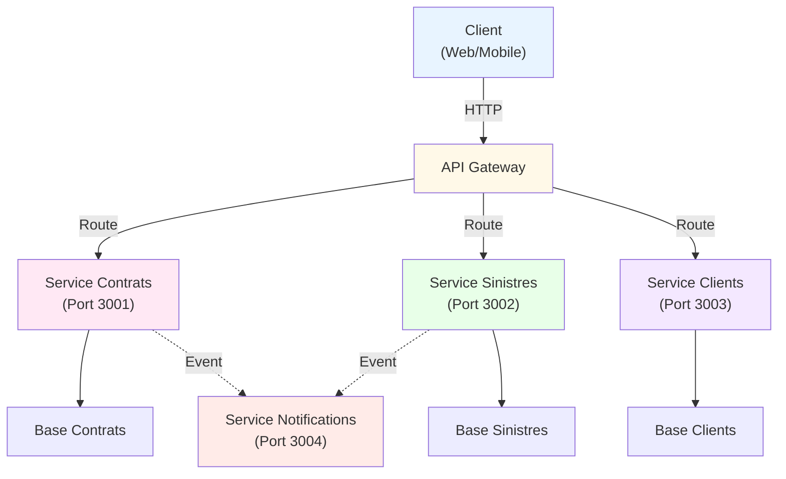

---

## Caractéristiques des Microservices

### Propriétés clés:

#### 🎯 Autonomie

#### 📡 Communication

#### 🔄 Résilience

#### 📊 Observabilité

- Services indépendants
- Déploiement indépendant
- BD dédiée
- Équipes autonomes

- API REST / gRPC
- Message brokers (Kafka)
- Events asynchrones
- Découverte de services

- Circuit breaker
- Timeout
- Retry policy
- Health checks

- Logging distribué
- Tracing
- Monitoring
- Alerting

---

## API Gateway et Service Discovery

### API Gateway (point d'entrée unique):

- Routage: Diriger requêtes aux services corrects
- Authentification: JWT validation
- Rate limiting: Protection DOS
- Caching: Réduire latence
- Load balancing: Distribuer charge

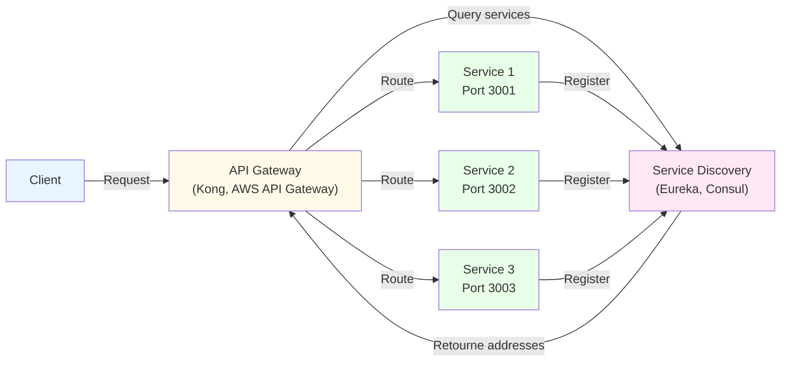

---

## Communication inter-services

### Approches de communication:

#### 🔵 Synchrone (REST/gRPC)

#### 🟣 Asynchrone (Events)

```plaintext
Service A
   ↓ (HTTP/gRPC)
Service B
   ↓ (attend réponse)
Service C
   ↓
Réponse retourne

Avantages:
✅ Cohérence immédiate
✅ Facile à déboguer

Inconvénients:
❌ Couplage fort
❌ Service lent = tout lent
```

```plaintext
Service A
   ↓ (Publie event)
Kafka/RabbitMQ
   ↓ (Message broker)
Service B (reçoit)
Service C (reçoit)

Avantages:
✅ Découplage complet
✅ Haute disponibilité
✅ Scalabilité

Inconvénients:
❌ Eventual consistency
❌ Plus complexe
```

---

## Saga Pattern: Transactions distribuées

#### Deux approches:

Maintenir la cohérence des données sur plusieurs services

- Choreography: Services écoutent les events et réagissent (loose coupling)
- Orchestration: Service central coordonne les étapes (plus simple mais couplage)

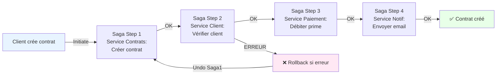

---

## SSR: Server-Side Rendering

### Avantages:

Le serveur génère le HTML complet avant envoi au navigateur

- ✅ SEO: HTML complet pour crawlers
- ✅ Performance initiale: Page affichée rapidement
- ✅ Social media: Open Graph meta tags
- ✅ Contenu dynamique: Basé sur la requête

```mermaid
graph LR
                            Browser["🌐 Navigateur<br/>(URL)"]
                            Server["⚙️ Serveur<br/>(Node.js/Next.js)"]
                            React["⚛️ React"]
                            BD["📊 Base de données"]
                            
                            Browser -->|GET /page| Server
                            Server -->|Render| React
                            React -->|Query| BD
                            BD -->|Données| React
                            React -->|HTML générée| Server
                            Server -->|HTML + CSS + JS| Browser
                            Browser -->|Affiche page complète<br/>(SEO-friendly)| Browser
                            
                            style Browser fill:#e8f4ff
                            style Server fill:#fff9e8
                            style React fill:#ffe8f4
                            style BD fill:#e8ffe8
```

---

## SSG: Static Site Generation

### Avantages:

Générer les pages HTML à la compilation (build time)

- ✅ Performance: Fichiers pré-générés (très rapide)
- ✅ Sécurité: Pas de serveur Node.js exposé
- ✅ Coûts: Hosting CDN bon marché
- ✅ SEO: HTML complet et optimisé

```mermaid
graph LR
                            Dev["💻 Développeur<br/>(npm run build)"]
                            Generator["🏗️ Build System<br/>(Next.js, Gatsby)"]
                            BD["📊 Base de données"]
                            StaticHTML["📄 HTML statiques<br/>(+ CSS + JS)"]
                            CDN["🌍 CDN<br/>(CloudFlare)"]
                            Browser["🌐 Navigateur"]
                            
                            Dev -->|Build| Generator
                            Generator -->|Query| BD
                            BD -->|Données| Generator
                            Generator -->|Génère| StaticHTML
                            StaticHTML -->|Deploy| CDN
                            Browser -->|GET /page| CDN
                            CDN -->|Fichier statique| Browser
                            Browser -->|Affiche page<br/>(très rapide)| Browser
                            
                            style Dev fill:#e8f4ff
                            style Generator fill:#fff9e8
                            style StaticHTML fill:#ffe8f4
                            style CDN fill:#e8ffe8
```

---

## SPA: Single Page Application

### Avantages vs Inconvénients:

#### ✅ Avantages

#### ❌ Inconvénients

Application côté client, tout le rendu en JavaScript

- UX fluide (pas de reload)
- Interaction rapide
- Offline possible
- Webapp native-like

- SEO difficile
- JS volumineux
- Première charge lente
- Pas de meta tags

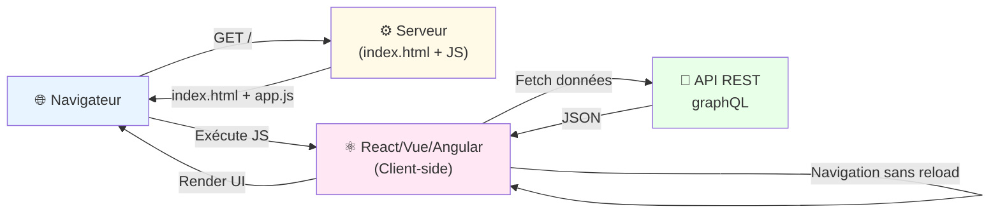

---

## Comparaison: SSR vs SSG vs SPA

| Aspect | SSR | SSG | SPA |
| --- | --- | --- | --- |
| Quand générer | Runtime (chaque requête) | Build time (compilation) | Browser (JavaScript) |
| Performance | Bonne (HTML pré-rendu) | Excellente (fichiers statiques) | Mauvaise initiale |
| SEO | Parfait (HTML complet) | Parfait (HTML complet) | Difficile (JS exécuté) |
| Contenu dynamique | ✅ Oui (par requête) | ⚠️ Revalidation | ✅ Oui (en temps réel) |
| Coûts serveur | Modérés (besoin serveur) | Bas (CDN seulement) | Bas (BaaS) |
| Scalabilité | Limitée (load serveur) | Illimitée (CDN) | Illimitée (API) |
| Idéal pour | News, blogs (contenu dyn) | Docs, portfolio, blogs | Apps (Gmail, Trello) |

---

## Next.js: Hybrid Rendering

#### Structure d'un projet Next.js:

#### Exemples de stratégies:

Framework React supportant SSR, SSG et SPA dans le même projet

```plaintext
my-app/
├── pages/
│   ├── index.js           # Page d'accueil
│   ├── contracts/
│   │   ├── index.js       # Liste contrats
│   │   └── [id].js        # Détail contrat
│   └── api/
│       └── contracts.js   # API route
├── public/
├── styles/
└── package.json
```

```plaintext
// Page SSG (statique, très rapide)
export async function getStaticProps() {
  const contracts = await db.contracts.findAll();
  return { props: { contracts }, revalidate: 3600 };
}

// Page SSR (dynamique à chaque requête)
export async function getServerSideProps(context) {
  const id = context.params.id;
  const contract = await db.contracts.findById(id);
  return { props: { contract } };
}

// Page SPA (côté client seulement)
export default function Page() {
  const [contracts, setContracts] = useState([]);
  useEffect(() => {
    fetch('/api/contracts').then(r => r.json())
      .then(setContracts);
  }, []);
  return &lt;&gt;...&lt;/&gt;;
}
```

---

## Hydration: HTML + Interactivité

### Processus d'hydration:

#### ⚠️ Hydration Mismatch:

Transformer du HTML statique en application interactive

Le HTML côté serveur et côté client DOIT être identique, sinon:

- ❌ React réécrit le DOM (performance)
- ❌ Perte du contenu serveur
- ❌ Erreurs de validation

```mermaid
sequenceDiagram
                                participant Browser
                                participant Server
                                participant React
                                
                                Browser->>Server: GET /page
                                Server->>React: Render &lt;Component /&gt;
                                React->>Server: HTML string
                                Server->>Browser: HTML + app.js
                                
                                Note over Browser: Affiche HTML (pas interactif)
                                
                                Browser->>Browser: Télécharge app.js
                                Browser->>React: Charge React
                                React->>Browser: Attache event listeners
                                
                                Note over Browser: Page maintenant interactive!
```

---

## Web Vitals: Métriques de performance

#### 🟢 LCP

#### 🟡 FID

#### 🔴 CLS

#### Techniques d'optimisation:

Mesurer l'expérience utilisateur réelle

Largest Contentful Paint

Temps d'affichage du contenu principal

Idéal: &lt; 2.5 secondes

First Input Delay

Délai avant réaction aux interactions

Idéal: &lt; 100ms

Cumulative Layout Shift

Stabilité visuelle (pas de changement de layout)

Idéal: &lt; 0.1

- Image optimization: WebP, lazy loading
- Code splitting: Charger JS au besoin
- Caching: Mis en cache navigateur + CDN
- Compression: Gzip, Brotli
- SSR/SSG: Pré-rendu du contenu

---

## Récapitulatif: SSR vs SSG vs SPA

### Décision tree (arbre de décision):

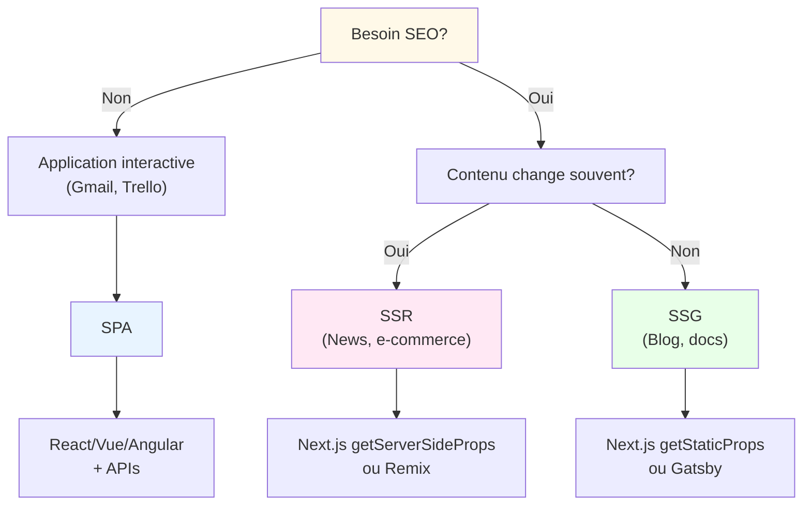

---

## Spring Boot: Introduction

### Caractéristiques clés:

#### Créer un projet Spring Boot:

Framework Java pour construire des microservices robustes

- Auto-configuration: Configuration intelligente par défaut
- Starters: Dépendances pré-configurées (spring-boot-starter-web)
- Embedded server: Pas besoin de Tomcat externe
- Production-ready: Monitoring, logging, health checks
- Actuator: Endpoints de monitoring (/health, /metrics)

```plaintext
# Via Spring Boot CLI
spring boot new my-api --from=web

# Via Maven
mvn archetype:generate \
  -DgroupId=com.myapp \
  -DartifactId=my-api \
  -DarchetypeArtifactId=maven-archetype-quickstart

# Via Spring Initializr
# https://start.spring.io
```

---

## Architecture Spring Boot

### Structure standard:

### application.properties:

```plaintext
src/main/java/com/myapp/
├── Application.java           # Entry point @SpringBootApplication
├── controller/
│   └── ContractController.java # REST endpoints
├── service/
│   └── ContractService.java    # Logique métier
├── repository/
│   └── ContractRepository.java # Accès données
├── entity/
│   └── Contract.java           # JPA entity
└── config/
    └── SecurityConfig.java     # Configuration

src/main/resources/
├── application.properties      # Configuration (port, BD, etc)
└── schema.sql                  # DDL
```

```plaintext
# Serveur
server.port=8080
server.servlet.context-path=/api

# Base de données
spring.datasource.url=jdbc:postgresql://localhost/myapp
spring.datasource.username=admin
spring.datasource.password=secret
spring.jpa.hibernate.ddl-auto=update

# Logging
logging.level.root=INFO
logging.level.com.myapp=DEBUG

# Actuator
management.endpoints.web.exposure.include=health,metrics
```

---

## Contrôleurs REST Spring Boot

#### Exemple complet de contrôleur:

```plaintext
@RestController
@RequestMapping("/api/contracts")
@Slf4j // Lombok logging
public class ContractController {
    
    private final ContractService service;
    
    @Autowired
    public ContractController(ContractService service) {
        this.service = service;
    }
    
    // GET /api/contracts?limit=10&offset=0
    @GetMapping
    public ResponseEntity&lt;List&lt;ContractDTO&gt;&gt; listContracts(
            @RequestParam(defaultValue = "10") int limit,
            @RequestParam(defaultValue = "0") int offset) {
        List&lt;ContractDTO&gt; contracts = service.list(limit, offset);
        return ResponseEntity.ok(contracts);
    }
    
    // GET /api/contracts/{id}
    @GetMapping("/{id}")
    public ResponseEntity&lt;ContractDTO&gt; getById(
            @PathVariable String id) {
        return service.findById(id)
            .map(ResponseEntity::ok)
            .orElse(ResponseEntity.notFound().build());
    }
    
    // POST /api/contracts
    @PostMapping
    public ResponseEntity&lt;ContractDTO&gt; create(
            @Valid @RequestBody CreateContractRequest request) {
        ContractDTO created = service.create(request);
        return ResponseEntity
            .status(HttpStatus.CREATED)
            .body(created);
    }
    
    // PUT /api/contracts/{id}
    @PutMapping("/{id}")
    public ResponseEntity&lt;ContractDTO&gt; update(
            @PathVariable String id,
            @Valid @RequestBody UpdateContractRequest request) {
        ContractDTO updated = service.update(id, request);
        return ResponseEntity.ok(updated);
    }
    
    // DELETE /api/contracts/{id}
    @DeleteMapping("/{id}")
    public ResponseEntity&lt;Void&gt; delete(@PathVariable String id) {
        service.delete(id);
        return ResponseEntity.noContent().build();
    }
    
    // Exception handling
    @ExceptionHandler(InvalidContractException.class)
    public ResponseEntity&lt;ErrorResponse&gt; handleInvalid(
            InvalidContractException e) {
        log.error("Invalid contract: {}", e.getMessage());
        return ResponseEntity.badRequest().body(
            new ErrorResponse("INVALID_CONTRACT", e.getMessage())
        );
    }
}
```

---

## Services et Repository Pattern

#### Service (Logique métier):

```plaintext
@Service
@Slf4j
public class ContractService {
    
    private final ContractRepository repo;
    private final PremiumCalculator calculator;
    private final EmailService emailService;
    
    @Autowired
    public ContractService(ContractRepository repo,
                          PremiumCalculator calculator,
                          EmailService emailService) {
        this.repo = repo;
        this.calculator = calculator;
        this.emailService = emailService;
    }
    
    @Transactional
    public ContractDTO create(CreateContractRequest req) {
        // Validation
        if (req.getCustomerId() == null)
            throw new InvalidContractException("Customer required");
        
        // Créer entité
        Contract contract = new Contract();
        contract.setCustomerId(req.getCustomerId());
        contract.setType(req.getType());
        
        // Calcul de prime
        double premium = calculator.calculate(contract);
        contract.setPremium(premium);
        
        // Sauvegarde
        Contract saved = repo.save(contract);
        log.info("Contract created: {}", saved.getId());
        
        // Notification async
        emailService.sendAsync(saved);
        
        return toDTO(saved);
    }
    
    public Optional&lt;ContractDTO&gt; findById(String id) {
        return repo.findById(id).map(this::toDTO);
    }
    
    @Transactional
    public void delete(String id) {
        repo.deleteById(id);
        log.info("Contract deleted: {}", id);
    }
    
    private ContractDTO toDTO(Contract contract) {
        return new ContractDTO(contract.getId(), 
                              contract.getPremium(),
                              contract.getType());
    }
}
```

---

## Spring Data JPA: Accès aux données

#### Repository interface:

```plaintext
@Repository
public interface ContractRepository 
    extends JpaRepository&lt;Contract, String&gt; {
    
    // Méthodes générées automatiquement:
    // save(T), delete(T), findById(ID), findAll(), etc.
    
    // Requêtes personnalisées (query methods)
    List&lt;Contract&gt; findByCustomerId(String customerId);
    
    List&lt;Contract&gt; findByType(String type);
    
    List&lt;Contract&gt; findByStatusAndCustomerId(
        String status, String customerId);
    
    // Requêtes JPQL/SQL natives
    @Query("SELECT c FROM Contract c WHERE c.premium > ?1")
    List&lt;Contract&gt; findHighPremium(double amount);
    
    @Query(value = "SELECT * FROM contracts WHERE active = true",
           nativeQuery = true)
    List&lt;Contract&gt; findAllActive();
    
    // Pagination et tri
    Page&lt;Contract&gt; findAll(Pageable pageable);
}

// Utilisation:
Pageable page = PageRequest.of(0, 10, 
    Sort.by("premium").descending());
Page&lt;Contract&gt; result = repo.findAll(page);
```

---

## Spring Cloud: Microservices distribuées

### Composants clés:

#### 🔍 Service Discovery

#### 🚪 API Gateway

#### ⚡ Circuit Breaker

#### 📊 Distributed Tracing

Framework pour construire des systèmes distribués

- Eureka: Service registry
- Consul: Service mesh
- Auto-registration et detection

- Spring Cloud Gateway
- Routing intelligent
- Load balancing

- Resilience4j, Hystrix
- Gestion des défaillances
- Fallback strategies

- Spring Cloud Sleuth
- Jaeger, Zipkin
- Correlation IDs

---

## Spring Cloud Config: Configuration centralisée

#### Fichiers de config (application.yml):

Gérer la configuration des microservices depuis un endroit central

```plaintext
# config-repo/application.yml
server:
  port: 8080
  
spring:
  datasource:
    url: jdbc:postgresql://localhost/myapp
    username: admin
  jpa:
    hibernate:
      ddl-auto: update

# config-repo/application-prod.yml  
server:
  port: 8080
  
spring:
  datasource:
    url: jdbc:postgresql://prod-db:5432/myapp
    username: prod-admin
    password: ${DB_PASSWORD} # Variable d'environnement
```

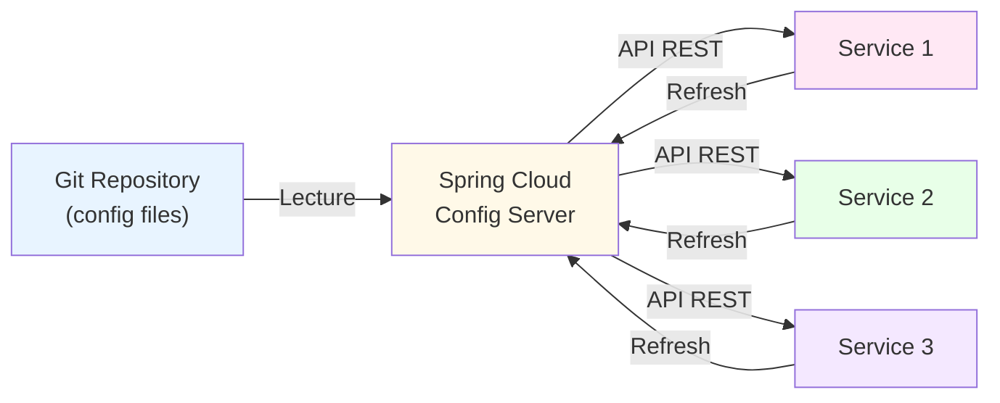

---

## Testing Spring Boot Applications

#### Tests unitaires:

#### Tests d'intégration:

```plaintext
@ExtendWith(MockitoExtension.class)
public class ContractServiceTest {
    
    @Mock
    private ContractRepository mockRepo;
    
    @InjectMocks
    private ContractService service;
    
    @Test
    public void shouldCreateContract() {
        // Given
        CreateContractRequest req = new CreateContractRequest(...);
        when(mockRepo.save(any()))
            .thenReturn(new Contract("123", 1200));
        
        // When
        ContractDTO result = service.create(req);
        
        // Then
        assertNotNull(result);
        assertEquals("123", result.getId());
        verify(mockRepo).save(any());
    }
}
```

```plaintext
@SpringBootTest(webEnvironment = WebEnvironment.RANDOM_PORT)
@AutoConfigureMockMvc
public class ContractControllerIntegrationTest {
    
    @Autowired
    private MockMvc mockMvc;
    
    @Test
    public void shouldCreateContractViaAPI() throws Exception {
        mockMvc.perform(post("/api/contracts")
            .contentType(MediaType.APPLICATION_JSON)
            .content("{\"customerId\":\"c1\",\"type\":\"AUTO\"}"))
            .andExpect(status().isCreated())
            .andExpect(jsonPath("$.id").exists());
    }
}
```

---

## Spring Security: Authentification & Autorisation

#### Configuration Spring Security avec JWT:

Framework pour sécuriser les applications Spring

```plaintext
@Configuration
@EnableWebSecurity
public class SecurityConfig {
    
    @Bean
    public SecurityFilterChain filterChain(HttpSecurity http) 
            throws Exception {
        http
            .csrf().disable()
            .authorizeRequests()
                .antMatchers("/api/login", "/api/register")
                    .permitAll()
                .antMatchers("/api/admin/**")
                    .hasRole("ADMIN")
                .anyRequest()
                    .authenticated()
            .and()
            .addFilterBefore(
                new JwtAuthenticationFilter(),
                UsernamePasswordAuthenticationFilter.class
            );
        return http.build();
    }
    
    @Bean
    public PasswordEncoder passwordEncoder() {
        return new BCryptPasswordEncoder();
    }
}

// JWT Filter
@Component
public class JwtAuthenticationFilter 
        extends OncePerRequestFilter {
    
    @Override
    protected void doFilterInternal(HttpServletRequest req,
            HttpServletResponse res,
            FilterChain chain) throws IOException, ServletException {
        
        String token = extractToken(req);
        if (token != null && isTokenValid(token)) {
            String userId = extractUserId(token);
            var auth = new UsernamePasswordAuthenticationToken(
                userId, null, getAuthorities(token)
            );
            SecurityContextHolder.getContext()
                .setAuthentication(auth);
        }
        chain.doFilter(req, res);
    }
}
```

---

## Monitoring: Spring Boot Actuator

#### application.properties:

### Endpoints disponibles:

Endpoints pour monitorer la santé et les performances

```plaintext
# Activer Actuator
management.endpoints.web.exposure.include=*
management.endpoint.health.show-details=always

# Ou limiter à certains endpoints
management.endpoints.web.exposure.include=health,metrics,info
```

| Endpoint | Description |
| --- | --- |
| /actuator/health | Santé générale (UP/DOWN) |
| /actuator/metrics | Métriques (CPU, mémoire, requêtes) |
| /actuator/prometheus | Format Prometheus (pour Grafana) |
| /actuator/loggers | Niveau de logging (modifiable) |
| /actuator/env | Variables d'environnement |
| /actuator/threaddump | Dump des threads (debugging) |

---

## Déploiement Spring Boot

### Compilation et packaging:

### Avec Docker:

```plaintext
# Compiler et créer JAR
mvn clean package -DskipTests

# JAR créé: target/my-api-1.0.0.jar
# Exécutable standalone (embarque Tomcat)

# Lancer l'application
java -jar target/my-api-1.0.0.jar

# Avec variables d'environnement
java -Dspring.profiles.active=prod \
     -Dserver.port=8080 \
     -jar target/my-api-1.0.0.jar
```

```plaintext
FROM openjdk:11-jre-slim

WORKDIR /app

COPY target/my-api-1.0.0.jar app.jar

EXPOSE 8080

ENTRYPOINT ["java", "-jar", "app.jar"]
```

```plaintext
# Build image
docker build -t my-api:1.0.0 .

# Run container
docker run -p 8080:8080 \
    -e SPRING_PROFILES_ACTIVE=prod \
    my-api:1.0.0
```

---

## Récapitulatif: Écosystème Spring Boot

### Stack complet:

#### Core

#### Operations

### Avantages:

- Spring Boot (app)
- Spring Data JPA (BD)
- Spring Security (auth)
- Spring Cloud (microservices)

- Actuator (monitoring)
- Logging (SLF4J)
- Docker (containerization)
- Kubernetes (orchestration)

- ✅ Configuration intelligente (convention over configuration)
- ✅ Rich ecosystem (Spring Cloud, Data, Security, etc.)
- ✅ Production-ready (monitoring, health checks, etc.)
- ✅ Communauté large et mature
- ✅ Scalabilité éprouvée

---

## Node.js: Introduction

### Caractéristiques clés:

#### Installer Node.js:

JavaScript côté serveur - Runtime built on Chrome's V8 engine

- Event-driven: Basé sur les événements asynchrones
- Non-blocking I/O: N'attend pas les opérations disque/réseau
- Single-threaded: Un seul thread principal (avec worker threads)
- npm: Package manager avec millions de modules
- Cross-platform: Linux, macOS, Windows

```plaintext
# Via package manager (Linux)
sudo apt install nodejs npm

# Via Homebrew (macOS)
brew install node

# Via nvm (Node Version Manager - recommandé)
curl -o- https://raw.githubusercontent.com/nvm-sh/nvm/v0.39.0/install.sh | bash
nvm install 18.17.0
nvm use 18.17.0

# Vérifier
node --version
npm --version
```

---

## npm: Gestion des dépendances

#### Commandes essentielles:

#### package.json structure:

Node Package Manager - Gérer les modules et dépendances

```plaintext
# Initialiser un projet
npm init -y

# Installer une dépendance
npm install express
npm i express            # Alias court

# Installer en développement (dev)
npm install --save-dev typescript
npm i -D typescript

# Installer une version spécifique
npm install express@4.18.2

# Installer toutes les dépendances (package.json)
npm install

# Mettre à jour les dépendances
npm update
npm outdated              # Voir les versions disponibles

# Désinstaller
npm uninstall express

# Lister les versions globales
npm list -g
```

```plaintext
{
  "name": "my-api",
  "version": "1.0.0",
  "description": "Insurance API",
  "main": "index.js",
  "scripts": {
    "start": "node index.js",
    "dev": "nodemon index.js",
    "test": "jest"
  },
  "dependencies": {
    "express": "^4.18.0",
    "postgresql": "^14.0"
  },
  "devDependencies": {
    "nodemon": "^2.0.20",
    "jest": "^29.0.0"
  }
}
```

---

## Express.js: Framework Web minimaliste

#### Application Express basique:

Framework léger pour construire des APIs et applications web

```plaintext
const express = require('express');
const app = express();

// Middleware
app.use(express.json());
app.use(express.static('public'));

// Routes
app.get('/', (req, res) => {
  res.json({ message: 'Hello World!' });
});

// CRUD routes
app.get('/api/contracts', (req, res) => {
  res.json({ contracts: [] });
});

app.post('/api/contracts', (req, res) => {
  const { customerId, type } = req.body;
  res.status(201).json({ id: '123', customerId, type });
});

app.get('/api/contracts/:id', (req, res) => {
  const { id } = req.params;
  res.json({ id, premium: 1200 });
});

app.put('/api/contracts/:id', (req, res) => {
  const { id } = req.params;
  res.json({ id, updated: true });
});

app.delete('/api/contracts/:id', (req, res) => {
  res.status(204).send();
});

// Error handling
app.use((err, req, res, next) => {
  console.error(err.stack);
  res.status(500).json({ error: 'Something went wrong' });
});

// Démarrer serveur
const PORT = process.env.PORT || 3000;
app.listen(PORT, () => {
  console.log(`Server running on port ${PORT}`);
});
```

---

## NestJS: Framework pour Microservices

### Caractéristiques:

#### Créer un projet NestJS:

Framework TypeScript avec architecture modulaire (inspiré par Angular)

- ✅ TypeScript natif (type-safe)
- ✅ Architecture modulaire (modules, controllers, services)
- ✅ Dependency Injection (intégré)
- ✅ Décorateurs (@Controller, @Get, @Post)
- ✅ Middleware et Guards (authentification)
- ✅ Testing intégré (Jest)

```plaintext
# Installer CLI
npm install -g @nestjs/cli

# Créer nouveau projet
nest new my-api

# Générer ressources
nest generate controller contracts
nest generate service contracts
nest generate module contracts
```

---

## Architecture NestJS

### Structure standard:

#### Module NestJS complet:

```plaintext
src/
├── contracts/
│   ├── contracts.module.ts       # Module (groupement)
│   ├── contracts.controller.ts   # Routes REST
│   ├── contracts.service.ts      # Logique métier
│   ├── contracts.entity.ts       # Entity (TypeORM)
│   └── dto/
│       ├── create-contract.dto.ts
│       └── update-contract.dto.ts
├── app.module.ts                 # Root module
├── main.ts                        # Entry point
└── common/
    ├── guards/
    ├── interceptors/
    └── decorators/
```

```plaintext
// contracts.module.ts
import { Module } from '@nestjs/common';
import { TypeOrmModule } from '@nestjs/typeorm';
import { ContractsController } from './contracts.controller';
import { ContractsService } from './contracts.service';
import { Contract } from './contracts.entity';

@Module({
  imports: [TypeOrmModule.forFeature([Contract])],
  controllers: [ContractsController],
  providers: [ContractsService],
})
export class ContractsModule {}

// contracts.controller.ts
import { Controller, Get, Post, Body, Param } from '@nestjs/common';
import { ContractsService } from './contracts.service';
import { CreateContractDto } from './dto/create-contract.dto';

@Controller('contracts')
export class ContractsController {
  constructor(private readonly service: ContractsService) {}

  @Get()
  findAll() {
    return this.service.findAll();
  }

  @Get(':id')
  findOne(@Param('id') id: string) {
    return this.service.findOne(id);
  }

  @Post()
  create(@Body() createDto: CreateContractDto) {
    return this.service.create(createDto);
  }
}

// contracts.service.ts
import { Injectable } from '@nestjs/common';
import { InjectRepository } from '@nestjs/typeorm';
import { Repository } from 'typeorm';
import { Contract } from './contracts.entity';
import { CreateContractDto } from './dto/create-contract.dto';

@Injectable()
export class ContractsService {
  constructor(
    @InjectRepository(Contract)
    private repo: Repository&lt;Contract&gt;,
  ) {}

  findAll() {
    return this.repo.find();
  }

  findOne(id: string) {
    return this.repo.findOne({ where: { id } });
  }

  create(dto: CreateContractDto) {
    return this.repo.save(dto);
  }
}
```

---

## NestJS: Middleware, Guards & Interceptors

#### Guard: Authentification avec JWT

Pipeline de traitement des requêtes

```plaintext
@Injectable()
export class JwtAuthGuard implements CanActivate {
  constructor(private jwtService: JwtService) {}

  canActivate(context: ExecutionContext): boolean {
    const request = context.switchToHttp().getRequest();
    const authHeader = request.headers.authorization;
    
    if (!authHeader) return false;
    
    const token = authHeader.replace('Bearer ', '');
    try {
      const payload = this.jwtService.verify(token);
      request.user = payload;
      return true;
    } catch (e) {
      return false;
    }
  }
}

// Utilisation
@Get()
@UseGuards(JwtAuthGuard)
findAll(@Request() req) {
  return this.service.findAll(req.user.id);
}
```

```mermaid
graph LR
                            Request["🔵 Requête HTTP"]
                            Middleware["⚙️ Middleware<br/>(logging, CORS)"]
                            Guard["🔐 Guard<br/>(authentification)"]
                            Interceptor1["🔄 Interceptor Before<br/>(transformer requête)"]
                            Controller["📨 Controller<br/>(route handler)"]
                            Interceptor2["🔄 Interceptor After<br/>(transformer réponse)"]
                            Response["🟢 Réponse HTTP"]
                            
                            Request --> Middleware
                            Middleware --> Guard
                            Guard --> Interceptor1
                            Interceptor1 --> Controller
                            Controller --> Interceptor2
                            Interceptor2 --> Response
                            
                            style Request fill:#e8f4ff
                            style Middleware fill:#fff9e8
                            style Guard fill:#ffe8f4
                            style Interceptor1 fill:#e8ffe8
                            style Controller fill:#f4e8ff
                            style Interceptor2 fill:#e8ffe8
                            style Response fill:#ccffcc
```

---

## TypeORM: ORM pour Node.js

#### Entity TypeORM:

Object-Relational Mapping pour TypeScript

```plaintext
import { Entity, Column, PrimaryGeneratedColumn, 
         OneToMany, CreateDateColumn } from 'typeorm';

@Entity('contracts')
export class Contract {
  @PrimaryGeneratedColumn('uuid')
  id: string;

  @Column()
  customerId: string;

  @Column({ type: 'varchar', length: 50 })
  type: string;

  @Column({ type: 'decimal', precision: 10, scale: 2 })
  premium: number;

  @Column({ default: 'ACTIVE' })
  status: string;

  @OneToMany(() => Claim, claim => claim.contract)
  claims: Claim[];

  @CreateDateColumn()
  createdAt: Date;

  @Column({ type: 'timestamp', onUpdate: 'CURRENT_TIMESTAMP' })
  updatedAt: Date;
}

// Relation
@Entity('claims')
export class Claim {
  @PrimaryGeneratedColumn('uuid')
  id: string;

  @ManyToOne(() => Contract, contract => contract.claims)
  contract: Contract;

  @Column()
  contractId: string;

  @Column()
  description: string;
}
```

---

## Testing avec Jest

#### Test unitaire NestJS:

Framework de test pour Node.js et NestJS

```plaintext
import { Test, TestingModule } from '@nestjs/testing';
import { ContractsService } from './contracts.service';
import { ContractsController } from './contracts.controller';
import { getRepositoryToken } from '@nestjs/typeorm';
import { Contract } from './contracts.entity';

describe('ContractsService', () => {
  let service: ContractsService;
  let mockRepo: any;

  beforeEach(async () => {
    // Mock repository
    mockRepo = {
      find: jest.fn().mockResolvedValue([
        { id: '1', premium: 1200 }
      ]),
      findOne: jest.fn().mockResolvedValue(
        { id: '1', premium: 1200 }
      ),
      save: jest.fn().mockResolvedValue(
        { id: '1', premium: 1200 }
      ),
    };

    const module: TestingModule = await Test.createTestingModule({
      providers: [
        ContractsService,
        {
          provide: getRepositoryToken(Contract),
          useValue: mockRepo,
        },
      ],
    }).compile();

    service = module.get&lt;ContractsService&gt;(ContractsService);
  });

  it('should return all contracts', async () => {
    const result = await service.findAll();
    expect(result).toEqual([{ id: '1', premium: 1200 }]);
    expect(mockRepo.find).toHaveBeenCalled();
  });

  it('should create a contract', async () => {
    const dto = { customerId: 'c1', type: 'AUTO' };
    const result = await service.create(dto);
    expect(result).toBeDefined();
    expect(mockRepo.save).toHaveBeenCalledWith(dto);
  });
});
```

---

## Déploiement Node.js

### PM2 (Process Manager):

### Docker:

### Heroku:

```plaintext
# Installer PM2
npm install -g pm2

# Lancer application
pm2 start app.js

# Lancer en cluster mode (utiliser tous les cores)
pm2 start app.js -i max

# Monitorage
pm2 monit

# Logs
pm2 logs

# Persister après reboot
pm2 startup
pm2 save
```

```plaintext
FROM node:18-alpine

WORKDIR /app

# Copier package files
COPY package*.json ./

# Installer dépendances
RUN npm ci --only=production

# Copier code
COPY . .

# Build si TypeScript
RUN npm run build

EXPOSE 3000

CMD ["npm", "start"]
```

```plaintext
# Login
heroku login

# Créer app
heroku create my-api

# Déployer
git push heroku main

# Logs
heroku logs --tail
```

---

## Récapitulatif: Écosystème Node.js

### Stack Node.js complet:

#### Frameworks

#### Écosystème

### Avantages:

- Express: Minimaliste, flexible
- NestJS: Modulaire, TypeScript
- Fastify: Haute performance
- Koa: Middleware elegance

- npm: Package manager
- TypeORM: ORM
- Jest: Testing
- PM2: Process management

- ✅ JavaScript partout (frontend + backend)
- ✅ Non-blocking I/O (haute performance)
- ✅ Énorme écosystème npm
- ✅ TypeScript support natif (NestJS)
- ✅ Courbe d'apprentissage plus douce que Java

---

## Frameworks Front-end: Panorama

### Les 3 grands:

Frameworks JavaScript pour construire des interfaces utilisateur modernes

| Framework | Philosophie | Courbe d'apprentissage | Popularité |
| --- | --- | --- | --- |
| React | Component-based, JSX | Modérée | ⭐⭐⭐⭐⭐ (Très populaire) |
| Vue | Progressive, HTML-first | Facile | ⭐⭐⭐⭐ (Croissant) |
| Angular | Full-featured, TypeScript | Élevée | ⭐⭐⭐ (Entreprises) |

---

## React: Composants et JSX

#### Composant fonctionnel React:

Library JavaScript pour construire des UIs avec des composants réutilisables

```plaintext
import React, { useState } from 'react';

// Composant fonctionnel avec Hooks
export function ContractForm({ onSubmit }) {
  const [formData, setFormData] = useState({
    customerId: '',
    type: 'AUTO'
  });

  const handleChange = (e) => {
    const { name, value } = e.target;
    setFormData(prev => ({
      ...prev,
      [name]: value
    }));
  };

  const handleSubmit = (e) => {
    e.preventDefault();
    onSubmit(formData);
    setFormData({ customerId: '', type: 'AUTO' });
  };

  return (
    &lt;form onSubmit={handleSubmit}&gt;
      &lt;input
        type="text"
        name="customerId"
        value={formData.customerId}
        onChange={handleChange}
        placeholder="Customer ID"
        required
      /&gt;
      &lt;select name="type" value={formData.type} onChange={handleChange}&gt;
        &lt;option value="AUTO"&gt;Auto&lt;/option&gt;
        &lt;option value="HOME"&gt;Home&lt;/option&gt;
        &lt;option value="HEALTH"&gt;Health&lt;/option&gt;
      &lt;/select&gt;
      &lt;button type="submit"&gt;Create Contract&lt;/button&gt;
    &lt;/form&gt;
  );
}

// Composant parent
export function App() {
  const handleCreateContract = async (data) => {
    const response = await fetch('/api/contracts', {
      method: 'POST',
      headers: { 'Content-Type': 'application/json' },
      body: JSON.stringify(data)
    });
    const contract = await response.json();
    console.log('Contract created:', contract);
  };

  return (
    &lt;div className="app"&gt;
      &lt;h1&gt;Create Contract&lt;/h1&gt;
      &lt;ContractForm onSubmit={handleCreateContract} /&gt;
    &lt;/div&gt;
  );
}
```

---

## React Hooks: État et effets

#### Hooks courants:

Réutiliser la logique avec des fonctions au lieu de classes

```plaintext
import { useState, useEffect, useContext, useReducer } from 'react';

// useState - Gérer l'état local
function ContractList() {
  const [contracts, setContracts] = useState([]);
  const [loading, setLoading] = useState(true);

  return &lt;&gt;...&lt;/&gt;;
}

// useEffect - Effets secondaires (API calls, timers)
useEffect(() => {
  const fetchContracts = async () => {
    const response = await fetch('/api/contracts');
    const data = await response.json();
    setContracts(data);
    setLoading(false);
  };
  fetchContracts();
}, []); // Dépendance vide = une seule exécution au mount

// useContext - Accéder au contexte global
const theme = useContext(ThemeContext);

// useReducer - État complexe
const [state, dispatch] = useReducer(reducer, initialState);
dispatch({ type: 'ADD_CONTRACT', payload: contract });

// Custom Hooks - Extraire logique réutilisable
function useContracts() {
  const [contracts, setContracts] = useState([]);
  
  useEffect(() => {
    fetch('/api/contracts')
      .then(r => r.json())
      .then(setContracts);
  }, []);
  
  return contracts;
}

// Utilisation
const contracts = useContracts();
```

---

## Gestion d'état en React

#### Context API (intégré)

#### Redux (library)

Gérer l'état global de l'application

// Créer contexte
const UserContext = createContext();
// Provider
function UserProvider({ children }) {
  const [user, setUser] = useState(null);
  return (
    &lt;UserContext.Provider value={{ user, setUser }}&gt;
      {children}
    &lt;/UserContext.Provider&gt;
  );
}
// Utiliser
function MyComponent() {
  const { user } = useContext(UserContext);
  return &lt;p&gt;{user.name}&lt;/p&gt;;
}
                        Quand l'utiliser: État simple/petit

// Store + Reducer
const store = createStore((state = {}, action) => {
  switch (action.type) {
    case 'ADD_CONTRACT':
      return { ...state, 
        contracts: [...state.contracts, 
          action.payload] };
    default: return state;
  }
});
// Actions
const addContract = (contract) => ({
  type: 'ADD_CONTRACT',
  payload: contract
});
// Component
function MyComponent() {
  const dispatch = useDispatch();
  const contracts = useSelector(
    state => state.contracts
  );
  return (
    &lt;button onClick={() => 
      dispatch(addContract({...}))}
    &gt;Add&lt;/button&gt;
  );
}
                        Quand l'utiliser: État complexe/gros apps

```plaintext
// Créer contexte
const UserContext = createContext();

// Provider
function UserProvider({ children }) {
  const [user, setUser] = useState(null);
  
  return (
    &lt;UserContext.Provider value={{ user, setUser }}&gt;
      {children}
    &lt;/UserContext.Provider&gt;
  );
}

// Utiliser
function MyComponent() {
  const { user } = useContext(UserContext);
  return &lt;p&gt;{user.name}&lt;/p&gt;;
}
```

```plaintext
// Store + Reducer
const store = createStore((state = {}, action) => {
  switch (action.type) {
    case 'ADD_CONTRACT':
      return { ...state, 
        contracts: [...state.contracts, 
          action.payload] };
    default: return state;
  }
});

// Actions
const addContract = (contract) => ({
  type: 'ADD_CONTRACT',
  payload: contract
});

// Component
function MyComponent() {
  const dispatch = useDispatch();
  const contracts = useSelector(
    state => state.contracts
  );
  
  return (
    &lt;button onClick={() => 
      dispatch(addContract({...}))}
    &gt;Add&lt;/button&gt;
  );
}
```

---

## Vue.js: Progressive Framework

#### Composant Vue:

Framework approachable et performant

```plaintext
&lt;template&gt;
  &lt;div class="contract-form"&gt;
    &lt;form @submit.prevent="submitForm"&gt;
      &lt;input 
        v-model="form.customerId"
        placeholder="Customer ID"
      /&gt;
      &lt;select v-model="form.type"&gt;
        &lt;option&gt;AUTO&lt;/option&gt;
        &lt;option&gt;HOME&lt;/option&gt;
      &lt;/select&gt;
      &lt;button type="submit"&gt;Create&lt;/button&gt;
    &lt;/form&gt;
    
    &lt;div v-if="loading"&gt;Loading...&lt;/div&gt;
    &lt;div v-else-if="contracts.length"&gt;
      &lt;ul&gt;
        &lt;li v-for="c in contracts" :key="c.id"&gt;
          {{ c.type }} - {{ c.premium }}
        &lt;/li&gt;
      &lt;/ul&gt;
    &lt;/div&gt;
  &lt;/div&gt;
&lt;/template&gt;

&lt;script setup&gt;
import { ref, onMounted } from 'vue';

const form = ref({ customerId: '', type: 'AUTO' });
const contracts = ref([]);
const loading = ref(true);

onMounted(async () => {
  const response = await fetch('/api/contracts');
  contracts.value = await response.json();
  loading.value = false;
});

const submitForm = async () => {
  const response = await fetch('/api/contracts', {
    method: 'POST',
    headers: { 'Content-Type': 'application/json' },
    body: JSON.stringify(form.value)
  });
  const contract = await response.json();
  contracts.value.push(contract);
};
&lt;/script&gt;

&lt;style scoped&gt;
.contract-form {
  padding: 20px;
}
&lt;/style&gt;
```

---

## Angular: Full-Featured Framework

### Caractéristiques:

#### Structure Angular:

Framework complet TypeScript pour applications enterprise

- TypeScript natif (type-safe)
- Dependency Injection (intégré)
- RxJS & Observables (programmation réactive)
- Services et Components (architecture claire)
- Form handling (réactif et template-driven)
- Routing (navigation avancée)
- Testing (Jasmine + Karma intégrés)

```plaintext
src/app/
├── contracts/
│   ├── contract.model.ts
│   ├── contract.service.ts
│   ├── contract-list/
│   │   ├── contract-list.component.ts
│   │   └── contract-list.component.html
│   └── contract-form/
│       ├── contract-form.component.ts
│       └── contract-form.component.html
├── app.module.ts
├── app-routing.module.ts
└── app.component.ts
```

---

## Comparaison: React vs Vue vs Angular

| Aspect | React | Vue | Angular |
| --- | --- | --- | --- |
| Courbe d'apprentissage | Modérée | Facile | Élevée |
| TypeScript | Optionnel | Optionnel | Natif |
| Taille bundle | ~50KB (minifié) | ~30KB (minifié) | ~500KB (minifié) |
| Performance | Excellente | Excellente | Bonne |
| Écosystème | Énorme | Croissant | Complet (intégré) |
| Gestion d'état | Redux, Zustand | Pinia, Vuex | NgRx (intégré) |
| Idéal pour | Apps modernes, startups | Projets rapides, prototype | Grandes entreprises |
| Emploi/marché | ⭐⭐⭐⭐⭐ Très demandé | ⭐⭐⭐⭐ Croissant | ⭐⭐⭐ Enterprise |

---

## Build Tools: Webpack, Vite, Parcel

#### 📦 Webpack

#### ⚡ Vite

#### 📄 Parcel

#### Créer projet React avec Vite:

Outils pour bundler et optimiser le code front-end

- Standard (CRA, Vue CLI)
- Très configurable
- Lent à démarrer
- Build complet

- Très rapide (ES modules)
- Dev server instant
- Configuration simple
- Recommandé 2026

- Zero-config
- Facile pour petits projets
- Auto-build
- Communauté petite

```plaintext
npm create vite@latest my-app -- --template react
cd my-app
npm install
npm run dev        # Dev server (http://localhost:5173)
npm run build      # Production build
npm run preview    # Prévisualiser build
```

---

## Styling Front-end: Options modernes

### Approches de styling:

#### 🎨 CSS Modules

#### 💅 CSS-in-JS (Styled Components)

#### 🎯 Tailwind CSS

#### 🔌 BEM (CSS traditionnel)

```plaintext
/* styles.module.css */
.container {
  padding: 20px;
  background: #f0f0f0;
}
```

```plaintext
import styles from './styles.module.css';
&lt;div className={styles.container}&gt;...&lt;/div&gt;
```

```plaintext
import styled from 'styled-components';

const Container = styled.div`
  padding: 20px;
  background: #f0f0f0;
  &:hover {
    background: #e0e0e0;
  }
`;

&lt;Container&gt;...&lt;/Container&gt;
```

```plaintext
&lt;div className="p-5 bg-gray-100 
  hover:bg-gray-200"&gt;
  ...
&lt;/div&gt;
```

```plaintext
.container { }
.container__title { }
.container--active { }
```

---

## Récapitulatif: Écosystème Front-end

### Stack front-end moderne (2026):

#### Base

#### Tooling

### Concepts clés:

- Framework: React (+ Vite)
- Styling: Tailwind ou Styled-Components
- State: Zustand ou Redux
- Routing: React Router v6

- Build: Vite
- Testing: Vitest + React Testing Library
- Linting: ESLint
- Formatting: Prettier

- ✅ Composants réutilisables
- ✅ State management clair
- ✅ Gestion d'effets (side effects)
- ✅ Routing et navigation
- ✅ API integration (fetch/axios)
- ✅ Testing et qualité de code

---

## Développement Mobile: Panorama

### 3 approches principales:

Approches pour développer des applications mobiles

| Approche | Langages | Performance | Temps de dev |
| --- | --- | --- | --- |
| Native | Swift (iOS) / Kotlin (Android) | ⭐⭐⭐⭐⭐ Excellente | ⏱️ Lent (deux bases de code) |
| Cross-platform | React Native / Flutter | ⭐⭐⭐⭐ Très bonne | ⏱️⏱️ Modéré (une base de code) |
| Web App | HTML/CSS/JS (Responsive) | ⭐⭐⭐ Correcte | ⏱️⏱️⏱️ Rapide |

---

## React Native: JavaScript sur iOS/Android

#### Application React Native:

Framework pour construire des apps mobiles avec React

```plaintext
import React, { useState, useEffect } from 'react';
import { View, Text, TextInput, TouchableOpacity, 
         FlatList, StyleSheet, SafeAreaView } from 'react-native';

export default function ContractApp() {
  const [contracts, setContracts] = useState([]);
  const [customerId, setCustomerId] = useState('');

  useEffect(() => {
    fetchContracts();
  }, []);

  const fetchContracts = async () => {
    const response = await fetch('https://api.example.com/contracts');
    const data = await response.json();
    setContracts(data);
  };

  const createContract = async () => {
    const response = await fetch('https://api.example.com/contracts', {
      method: 'POST',
      headers: { 'Content-Type': 'application/json' },
      body: JSON.stringify({ customerId, type: 'AUTO' })
    });
    const newContract = await response.json();
    setContracts([...contracts, newContract]);
    setCustomerId('');
  };

  return (
    &lt;SafeAreaView style={styles.container}&gt;
      &lt;Text style={styles.title}&gt;My Contracts&lt;/Text&gt;
      
      &lt;TextInput
        style={styles.input}
        placeholder="Customer ID"
        value={customerId}
        onChangeText={setCustomerId}
      /&gt;
      
      &lt;TouchableOpacity 
        style={styles.button} 
        onPress={createContract}
      &gt;
        &lt;Text style={styles.buttonText}&gt;Create&lt;/Text&gt;
      &lt;/TouchableOpacity&gt;
      
      &lt;FlatList
        data={contracts}
        keyExtractor={item => item.id}
        renderItem={({ item }) => (
          &lt;View style={styles.contract}&gt;
            &lt;Text style={styles.contractType}&gt;{item.type}&lt;/Text&gt;
            &lt;Text&gt;${item.premium}&lt;/Text&gt;
          &lt;/View&gt;
        )}
      /&gt;
    &lt;/SafeAreaView&gt;
  );
}

const styles = StyleSheet.create({
  container: { flex: 1, backgroundColor: '#fff' },
  title: { fontSize: 24, fontWeight: 'bold', padding: 20 },
  input: { borderWidth: 1, padding: 10, margin: 10, borderRadius: 5 },
  button: { backgroundColor: '#0066cc', padding: 15, margin: 10, borderRadius: 5 },
  buttonText: { color: '#fff', fontWeight: 'bold', textAlign: 'center' },
  contract: { padding: 15, borderBottomWidth: 1, borderBottomColor: '#eee' },
  contractType: { fontWeight: 'bold', fontSize: 16 }
});
```

---

## Architecture React Native

#### Setup Expo (recommandé pour débutants):

Comment React Native communique avec iOS/Android

```plaintext
# Installer Expo CLI
npm install -g expo-cli

# Créer nouveau projet
expo init my-app
cd my-app

# Lancer sur téléphone/simulateur
expo start

# Scanner QR code ou appuyer 'i' (iOS) ou 'a' (Android)
```

```mermaid
graph TB
                            RN["React Native<br/>(JavaScript)"]
                            Bridge["Bridge<br/>(Sérialisation)"]
                            iOS["iOS Native<br/>(Swift)"]
                            Android["Android Native<br/>(Kotlin)"]
                            Native["Composants natifs<br/>(UIView, View)"]
                            
                            RN -->|JSI| Bridge
                            Bridge -->|Native modules| iOS
                            Bridge -->|Native modules| Android
                            iOS --> Native
                            Android --> Native
                            
                            style RN fill:#61dafb
                            style Bridge fill:#ffd700
                            style iOS fill:#999
                            style Android fill:#a4c639
                            style Native fill:#e8f4ff
```

---

## Flutter: Framework cross-platform Google

### Avantages Flutter:

#### Application Flutter simple:

Développer des apps iOS/Android/Web avec Dart

- ✅ Performance native: Compilé vers ARM (pas de bridge)
- ✅ UI attractive: Material Design et Cupertino (iOS)
- ✅ Hot reload: Modifier le code et voir en temps réel
- ✅ Une base de code: iOS, Android, Web, Desktop
- ✅ Dart: Langage moderne, typé
- ✅ Moins de code: que React Native (généralement)

```plaintext
import 'package:flutter/material.dart';

void main() {
  runApp(const MyApp());
}

class MyApp extends StatelessWidget {
  const MyApp();

  @override
  Widget build(BuildContext context) {
    return MaterialApp(
      title: 'Insurance App',
      theme: ThemeData(primarySwatch: Colors.blue),
      home: const ContractListPage(),
    );
  }
}

class ContractListPage extends StatefulWidget {
  const ContractListPage();

  @override
  State&lt;ContractListPage&gt; createState() => _ContractListPageState();
}

class _ContractListPageState extends State&lt;ContractListPage&gt; {
  List&lt;Contract&gt; contracts = [];

  @override
  void initState() {
    super.initState();
    fetchContracts();
  }

  Future&lt;void&gt; fetchContracts() async {
    final response = await http.get(
      Uri.parse('https://api.example.com/contracts')
    );
    if (response.statusCode == 200) {
      setState(() {
        contracts = (json.decode(response.body) as List)
          .map((c) => Contract.fromJson(c))
          .toList();
      });
    }
  }

  @override
  Widget build(BuildContext context) {
    return Scaffold(
      appBar: AppBar(title: const Text('My Contracts')),
      body: ListView.builder(
        itemCount: contracts.length,
        itemBuilder: (context, index) {
          final contract = contracts[index];
          return ListTile(
            title: Text(contract.type),
            subtitle: Text('\$${contract.premium}'),
          );
        },
      ),
    );
  }
}
```

---

## Native Development: Swift & Kotlin

#### Swift (iOS)

#### Kotlin (Android)

Développement natif pour apps haute performance

```plaintext
import Foundation

struct Contract {
  let id: String
  let type: String
  let premium: Double
}

class ContractService {
  private let baseURL = 
    "https://api.example.com"
  
  func fetchContracts() 
    async throws -> [Contract] {
    let url = URL(string: 
      "\(baseURL)/contracts")!
    let (data, _) = try await 
      URLSession.shared
        .data(from: url)
    return try JSONDecoder()
      .decode([Contract].self, 
        from: data)
  }
}
```

```plaintext
import retrofit2.http.GET
import kotlinx.coroutines.flow.Flow

data class Contract(
  val id: String,
  val type: String,
  val premium: Double
)

interface ContractService {
  @GET("contracts")
  suspend fun getContracts(): 
    List&lt;Contract&gt;
}

class ContractRepository(
  private val service: ContractService
) {
  fun fetchContracts(): Flow&lt;List&lt;Contract&gt;&gt; {
    return flow {
      val contracts = 
        service.getContracts()
      emit(contracts)
    }.flowOn(Dispatchers.IO)
  }
}
```

---

## Comparaison: React Native vs Flutter vs Native

| Critère | React Native | Flutter | Native (Swift/Kotlin) |
| --- | --- | --- | --- |
| Langage | JavaScript | Dart | Swift / Kotlin |
| Performance | ⭐⭐⭐⭐ (Bridge lent) | ⭐⭐⭐⭐⭐ (Compilé) | ⭐⭐⭐⭐⭐ (Optimisé) |
| Courbe d'apprentissage | Facile (React known) | Modérée | Élevée |
| Écosystème | ⭐⭐⭐⭐⭐ (npm) | ⭐⭐⭐⭐ (pub.dev) | ⭐⭐⭐⭐ (natif) |
| Base de code | 1 (iOS + Android) | 1 (iOS + Android + Web) | 2 (ios/ android/) |
| Temps de dev | ⏱️⏱️⏱️ Rapide | ⏱️⏱️⏱️ Rapide | ⏱️⏱️ Lent |
| Idéal pour | Apps classiques, startups | Apps complètes (multi-plateforme) | Haute performance, jeux |

---

## Architecture Mobile: Offline-first

#### Implémentation offline-first:

Gérer la connectivité instable des appareils mobiles

```plaintext
// React Native avec AsyncStorage + WatermelonDB

import { Database } from '@nozbe/watermelondb';
import SQLiteAdapter from '@nozbe/watermelondb/adapters/sqlite';
import NetInfo from '@react-native-community/netinfo';

class SyncService {
  async syncData() {
    const isConnected = await NetInfo.fetch();
    
    if (!isConnected.isConnected) {
      // Offline: sauvegarder localement
      await this.saveLocalCache(data);
      await this.queueForSync(data);
      return;
    }
    
    // Online: synchroniser avec le serveur
    const queuedActions = await this.getQueuedActions();
    for (const action of queuedActions) {
      await this.sendToServer(action);
    }
    
    await this.clearQueue();
  }
  
  async saveLocalCache(data) {
    const database = new Database({
      adapter: new SQLiteAdapter({ 
        dbName: 'contracts' 
      })
    });
    await database.write(async () => {
      // Sauvegarder les données localement
    });
  }
}
```

```mermaid
graph TB
                            App["Application<br/>(React Native/Flutter)"]
                            Cache["Cache Local<br/>(SQLite/Hive)"]
                            Queue["Queue Sync<br/>(Actions en attente)"]
                            Network["Network Check"]
                            API["API Backend"]
                            
                            App -->|Lire/Écrire| Cache
                            Cache -->|Si offline| Queue
                            Network -->|Online?| Queue
                            Queue -->|Sync| API
                            API -->|Réponse| Cache
                            
                            style App fill:#61dafb
                            style Cache fill:#ffd700
                            style Queue fill:#ff6b6b
                            style Network fill:#51cf66
                            style API fill:#4c6ef5
```

---

## Gestion des données mobiles

#### SQLite (Native)

#### Realm (Mobile)

#### Hive (Flutter)

#### AsyncStorage (React Native)

Stocker et synchroniser les données localement

- ✅ SQL queries
- ✅ Relations complexes
- ✅ Très stable
- ❌ Syntaxe verbose

- ✅ Synchronisation Cloud
- ✅ API simple (objets)
- ✅ Transactions ACID
- ❌ Licence propriétaire (gratuit)

- ✅ Ultra rapide (key-value)
- ✅ Très simple
- ✅ Pas de setup SQL
- ❌ Pas de relations complexes

- ✅ Simple (key-value)
- ✅ Built-in
- ✅ Petit stockage
- ❌ Limité (~10MB)

```plaintext
SELECT * FROM contracts 
WHERE status = 'ACTIVE' 
AND premium > 1000
```

```plaintext
realm.write(() => {
  realm.create('Contract', {
    id: '1', type: 'AUTO'
  });
});
```

```plaintext
var box = await Hive.openBox('contracts');
box.put('contract_1', contract);
var contract = box.get('contract_1');
```

```plaintext
await AsyncStorage.setItem(
  'contract_1',
  JSON.stringify(contract)
);
```

---

## Performance Mobile: Optimisations

### Optimisations critiques:

#### Rendu optimisé

#### Gestion mémoire

#### Bundle size

#### Network

- ✅ Code splitting
- ✅ Tree shaking (remove dead code)
- ✅ Compression (gzip)
- ✅ Lazy loading images
- ❌ Énormes assets

- ✅ GraphQL (moins de données)
- ✅ Pagination et pagination
- ✅ Cache HTTP (ETags)
- ✅ Compression Brotli
- ❌ Gros payloads JSON

```plaintext
// React Native
const ContractItem = React.memo(({ 
  contract, onPress 
}) => (
  &lt;TouchableOpacity onPress={onPress}&gt;
    &lt;Text&gt;{contract.type}&lt;/Text&gt;
  &lt;/TouchableOpacity&gt;
));

// Utiliser FlatList au lieu de ScrollView
&lt;FlatList
  data={contracts}
  renderItem={({ item }) => 
    &lt;ContractItem contract={item} /&gt;
  }
  keyExtractor={item => item.id}
  removeClippedSubviews={true}
/&gt;
```

```plaintext
// Éviter les fuites mémoire
useEffect(() => {
  const subscription = 
    fetchContracts();
  
  return () => {
    // Cleanup
    subscription.unsubscribe();
  };
}, []);

// Libérer les ressources
componentWillUnmount() {
  this.subscription?.unsubscribe();
  this.timer?.cancel();
}
```

---

## Distribution: App Stores

#### 🍎 Apple App Store

#### 🤖 Google Play Store

#### Commandes pour Expo (React Native):

Déployer l'application sur les stores

- 1. Rejoindre Apple Developer Program (99$/an)
- 2. Créer App ID dans Developer Portal
- 3. Générer certificats et provisioning profiles
- 4. Archive l'app avec Xcode
- 5. Soumettre via TestFlight
- 6. Approbation (1-48h)

- 1. Rejoindre Google Play Developer Program (25$ une fois)
- 2. Créer signingKey
- 3. Build APK/AAB avec Android Studio
- 4. Remplir le formulaire dans Play Console
- 5. Soumettre pour review
- 6. Approbation (~2h)

```plaintext
# Créer build (dans le cloud)
expo build:ios
expo build:android

# Ou utiliser EAS (Expo Application Services)
eas build --platform ios
eas build --platform android

# Soumettre directement
eas submit --platform ios
eas submit --platform android
```

---

## Récapitulatif: Développement Mobile

### Stack mobile recommandé (2026):

#### Cross-platform

#### Native (si needed)

#### Tooling

### Checklist déploiement:

- Framework: React Native ou Flutter
- State: Redux ou Provider
- API: REST ou GraphQL
- Storage: SQLite/Realm/Hive

- iOS: Swift + SwiftUI
- Android: Kotlin + Jetpack
- IDE: Xcode, Android Studio
- Testing: XCTest, JUnit

- Version Control: Git
- CI/CD: GitHub Actions, EAS
- Analytics: Firebase
- Crash Reporting: Sentry

- ✅ Tests unitaires et d'intégration
- ✅ Optimisation performance (bundle, memory)
- ✅ Offline support et sync
- ✅ Sécurité (tokens, cryptage local)
- ✅ Gestion des versions d'API
- ✅ Analytics et crash reporting
- ✅ Onboarding utilisateur (premier lancement)

---

## MCP & Intégration IA: Nouvelle ère

#### Cas d'usage:

Connecter les backends avec les modèles d'IA

- 📋 Assurance: Analyse automatique des sinistres avec Claude
- 🏥 Santé: Diagnostic assistance basé sur données patients
- 📝 Génération contenu: Documents, email, rapports automatisés
- 🔍 Recherche: Sémantique sur base de données

```mermaid
graph LR
                            LLM["LLM (ChatGPT, Claude)"]
                            MCP["MCP Server<br/>(Votre API)"]
                            Backend["Backend<br/>(Node.js, Spring)"]
                            DB["Database<br/>(PostgreSQL)"]
                            
                            LLM -->|Appel fonction| MCP
                            MCP -->|Récupère données| Backend
                            Backend -->|Query| DB
                            DB -->|Résultat| Backend
                            Backend -->|JSON| MCP
                            MCP -->|Réponse structurée| LLM
                            
                            style LLM fill:#10a37f
                            style MCP fill:#ffd700
                            style Backend fill:#4c6ef5
                            style DB fill:#868e96
```

---

## MCP: Model Context Protocol

### Architecture MCP:

#### MCP Server (côté backend):

Standard ouvert pour connecter LLMs aux tools/APIs

```plaintext
// Node.js/Express avec MCP SDK
const mcp = require('@anthropic-sdk/mcp');
const express = require('express');

const server = new mcp.MCPServer({
  name: 'insurance-api',
  version: '1.0.0'
});

// Enregistrer des ressources/outils
server.resource('contract', async (id) => {
  const contract = await db.contracts.findOne(id);
  return {
    type: 'contract',
    id,
    data: contract
  };
});

server.tool('create_claim', {
  description: 'Créer un sinistre',
  inputSchema: {
    type: 'object',
    properties: {
      contractId: { type: 'string' },
      description: { type: 'string' },
      amount: { type: 'number' }
    }
  },
  handler: async (input) => {
    const claim = await db.claims.create({
      contractId: input.contractId,
      description: input.description,
      amount: input.amount,
      status: 'PENDING'
    });
    return { success: true, claim };
  }
});

server.listen(3001);
```

---

## Exposer les APIs pour l'IA

### Best Practices:

#### 📊 Schémas clairs

#### 🔑 Authentification

#### ⚠️ Limitations & Guardrails:

Préparer votre backend pour l'intégration IA

- Rate limiting: Max 100 requêtes/min pour IA
- Scopes: L'IA ne peut accéder qu'aux données appropriées
- Validation: Valider tous les inputs
- Logs: Auditer toutes les actions IA

```plaintext
{
  "contract": {
    "id": "string",
    "customerId": "string",
    "type": "enum(AUTO|HOME|HEALTH)",
    "premium": {
      "type": "number",
      "minimum": 0,
      "unit": "EUR"
    },
    "status": "enum(ACTIVE|EXPIRED)",
    "createdAt": "ISO8601"
  }
}
```

```plaintext
// Utiliser des tokens d'accès limités
const aiToken = jwt.sign(
  {
    sub: 'ai-assistant',
    scopes: ['read:contracts', 
             'create:claims']
  },
  SECRET,
  { expiresIn: '1h' }
);

// Audit chaque appel IA
app.use((req, res, next) => {
  if (req.user?.type === 'ai') {
    logAiAction({
      action: req.path,
      user: req.user.sub,
      timestamp: new Date(),
      result: res.statusCode
    });
  }
  next();
});
```

---

## Use Cases: IA dans Assurance/Santé

### Cas d'usage assurance:

#### 1️⃣ Analyse automatique de sinistres

#### 2️⃣ Recommandations personnalisées

#### 3️⃣ Génération de documents

### Cas d'usage santé:

Flux: Client décrit sinistre → Claude analyse → Extraction automatique données → Création claim dans BDD → Notation de risque

// Prompt exemple
const prompt = `
Tu es un expert en assurance automobile. 
Analyse ce sinistre: "${claimDescription}"
Extrais les informations dans ce format JSON:
{
  "type": "collision|theft|damage",
  "severity": "low|medium|high",
  "estimatedAmount": number,
  "actionRequired": string[]
}
`;
                        2️⃣ Recommandations personnalisées
                        Flux: Historique client → Claude analyse → Produits recommandés → Propositions adaptées

Flux: Données contrat → Claude génère → Email/PDF avec détails clause personnalisées

- 📋 Diagnostic assistance: Analyse symptômes + historique → suggestions
- 💊 Gestion médicaments: Détection interactions, contrindications
- 📊 Rapports médicaux: Génération automatique résumés

```plaintext
// Prompt exemple
const prompt = `
Tu es un expert en assurance automobile. 
Analyse ce sinistre: "${claimDescription}"
Extrais les informations dans ce format JSON:
{
  "type": "collision|theft|damage",
  "severity": "low|medium|high",
  "estimatedAmount": number,
  "actionRequired": string[]
}
`;
```

---

## Sécurité & Gouvernance: IA en production

### Points critiques:

#### 🔒 Sécurité données

#### ⚖️ Conformité légale

#### Architecture sécurisée:

Protéger les données et respecter la réglementation

- ✅ Chiffrer données avant LLM
- ✅ Pas d'infos sensibles en prompt
- ✅ PII masking/tokenization
- ✅ Utiliser des modèles privés

- ✅ RGPD (droit à l'oubli)
- ✅ HIPAA (santé US)
- ✅ Explainabilité IA
- ✅ Audit trail complet

```plaintext
// Vault pour secrets, chiffrement E2E
const vault = require('@hashicorp/vault-client');
const crypto = require('crypto');

const processWithAI = async (userData) => {
  // 1. Anonymiser les données
  const anonymized = maskPII(userData);
  
  // 2. Chiffrer avant envoi
  const encrypted = crypto
    .createCipheriv('aes-256-gcm', key, iv)
    .update(JSON.stringify(anonymized))
    .final();
  
  // 3. Appeler LLM (données chiffrées)
  const response = await llm.analyze(encrypted);
  
  // 4. Logger pour audit
  auditLog.record({
    action: 'ai_analysis',
    user: userId,
    timestamp: new Date(),
    dataHash: hash(anonymized),
    result: 'success'
  });
  
  return response;
};
```

---

## Monitoring: IA en production

#### Métriques à tracker:

Surveiller la qualité et la performance des réponses IA

```plaintext
// Instrumenter les appels IA
const aiMetrics = {
  // Performance
  latency: new Histogram('ai_latency_ms'),
  tokenUsage: new Counter('ai_tokens_used'),
  costs: new Gauge('ai_monthly_cost'),
  
  // Qualité
  hallucinations: new Counter('ai_hallucinations'),
  userRejections: new Counter('ai_responses_rejected'),
  accuracy: new Gauge('ai_accuracy_score'),
  
  // Erreurs
  rateLimitExceeded: new Counter('ai_rate_limit'),
  timeouts: new Counter('ai_timeouts'),
  authErrors: new Counter('ai_auth_errors')
};

// Instrumenter
const startTime = Date.now();
try {
  const response = await llm.analyze(data);
  aiMetrics.latency.observe(Date.now() - startTime);
  aiMetrics.tokenUsage.inc(response.usage.total_tokens);
  
  // User feedback
  response.on('reject', () => {
    aiMetrics.userRejections.inc();
  });
} catch (error) {
  if (error.code === 'RATE_LIMIT') {
    aiMetrics.rateLimitExceeded.inc();
  }
}
```

---

## Futur: Agents IA autonomes

#### Exemple: Traitement sinistre automatique

La prochaine génération: agents capables de décisions autonomes

```plaintext
// Agent autonome
const claimAgent = new Agent({
  tools: [
    'get_contract',
    'create_claim',
    'estimate_damage',
    'notify_client',
    'schedule_inspection'
  ]
});

const result = await claimAgent.run(
  `Traiter ce sinistre: Description du sinistre...`
);

// Résultat: Agent a autonomement:
// 1. ✅ Cherché le contrat
// 2. ✅ Créé le dossier sinistre
// 3. ✅ Estimé les dégâts
// 4. ✅ Notifié le client
// 5. ✅ Programmé l'inspection
// Tout dans une seule chaîne de pensée!
```

```mermaid
graph TB
                            Request["Demande client<br/>(Sinistre auto)"]
                            Agent["Agent IA<br/>(Claude + tools)"]
                            Plan["Planification<br/>(Étapes requises)"]
                            Action["Actions<br/>(API calls)"]
                            Reflect["Réflexion<br/>(Vérifier résultat)"]
                            Done{"Objectif<br/>atteint?"}
                            Response["Réponse finale"]
                            
                            Request --> Agent
                            Agent --> Plan
                            Plan --> Action
                            Action --> Reflect
                            Reflect --> Done
                            Done -->|Non| Plan
                            Done -->|Oui| Response
                            
                            style Agent fill:#10a37f
                            style Plan fill:#ffd700
                            style Action fill:#4c6ef5
                            style Reflect fill:#ff6b6b
                            style Response fill:#51cf66
```

---

## Récapitulatif: MCP & IA en Production

### Architecture complète:

#### Backend side

#### LLM side

### Roadmap 2026:

- API: REST/GraphQL
- MCP Server: Expose ressources
- Auth: OAuth2/tokens
- Audit: Logs détaillés

- Model: Claude, GPT-4
- Tools: API calls structurées
- Agents: Loop autonome
- Monitoring: Métriques qualité

- ✅ Phase 1: Exposer APIs simples (GET)
- ✅ Phase 2: Actions écrites (POST/PUT)
- ✅ Phase 3: Agents autonomes avec guardrails
- ✅ Phase 4: Multi-agents collaboratifs

---

## Conclusion: Architectures Modern (2026)

### Ce que vous avez appris:

#### Backend

#### Frontend/Mobile

#### Advanced

#### Tendances 2026+

- ✅ Spring Boot (enterprise)
- ✅ Node.js/NestJS (moderne)
- ✅ Clean Architecture
- ✅ API design (REST/GraphQL)
- ✅ Microservices patterns

- ✅ React (standard)
- ✅ State management
- ✅ React Native/Flutter
- ✅ Performance optimization
- ✅ Responsive design

- ✅ SSR/SSG/SPA tradeoffs
- ✅ Deployment (Docker/K8s)
- ✅ Security best practices
- ✅ Monitoring observability

- ✅ IA intégration (MCP)
- ✅ Agents autonomes
- ✅ Edge computing
- ✅ Programmation quantique(?)

---

## Architecture Decision Matrix

Choisir la bonne stack selon vos contraintes

| Projet | Backend | Frontend | Mobile | Database |
| --- | --- | --- | --- | --- |
| Startup SaaS(Rapide) | Node.js + NestJS | React + Vite | React Native (Expo) | PostgreSQL |
| Assurance (Web)(Scalabilité) | Spring Boot | React + Redux | Native Swift/Kotlin | Oracle/PostgreSQL |
| E-commerce(Performance) | Node.js | Next.js (SSR) | Flutter | PostgreSQL + Redis |
| Santé(Sécurité) | Spring Boot (Java) | Angular | Native Swift/Kotlin | HIPAA PostgreSQL |
| MVP/Prototype(Temps minimum) | Firebase/Supabase | Vue.js | Flutter | Firebase |
| Legacy (Migration)(Graduel) | Spring Boot | React (micro-frontends) | Hybride | PostgreSQL (migrate) |

---

## Critères de sélection technologique

#### ✅ Critères positifs

#### ⚠️ Signes d'alerte

#### 🎯 Framework de décision (2-3 min par techno):

Évaluer les technologies avant de les choisir

- Maturité: Utilisé en production
- Communauté: Actif, nombreux ressources
- Documentation: Complète et claire
- Performance: Benchmarks publics
- Scalabilité: Peut grandir
- Maintenabilité: Code lisible, patterns clairs
- Emploi: Demande marché

- Hype: Nouvelle techno = risque
- Dépendances: Trop de libs externes
- Breaking changes: Mises à jour instables
- Lock-in: Difficulté à migrer
- Coût: Licensing élevé
- Peu actif: Pas de devs disponibles
- Un seul vendeur: Dépendance unique

```plaintext
1. Résout-elle notre problème? → NON = eliminer
2. L'équipe peut-elle l'apprendre? → NON = pénalité
3. Communauté active? → OUI = bonus
4. Maintenable à long terme? → NON = risque
5. Performance suffisante? → NON = eliminer

Notation: 1-10 par critère → moyenne finale
Seuil: &gt;= 7/10 = acceptable
```

---

## DevOps: Déploiement en production

### Pipeline CI/CD standard:

#### Terraform (Infrastructure as Code):

Passer du développement à la production

```plaintext
# AWS ECS + RDS
terraform {
  required_providers {
    aws = {
      source  = "hashicorp/aws"
      version = "~> 5.0"
    }
  }
}

provider "aws" {
  region = "eu-west-1"
}

# RDS Database
resource "aws_db_instance" "contracts" {
  identifier     = "contracts-db"
  engine         = "postgres"
  engine_version = "14.0"
  instance_class = "db.t3.micro"
  allocated_storage = "20"
  
  db_name  = "contracts"
  username = var.db_user
  password = var.db_password
}

# ECS Cluster
resource "aws_ecs_cluster" "api" {
  name = "insurance-api"
}

resource "aws_ecs_task_definition" "api" {
  family = "insurance-api"
  cpu    = "256"
  memory = "512"
  
  container_definitions = jsonencode([...])
}
```

```mermaid
graph LR
                            Code["👨‍💻 Code Push<br/>(git)"]
                            Build["🔨 Build<br/>(npm/maven)"]
                            Test["🧪 Test<br/>(Jest/JUnit)"]
                            SonarQube["📊 SonarQube<br/>(Code quality)"]
                            Docker["🐳 Docker<br/>(Image)"]
                            Staging["🌐 Staging<br/>(Test env)"]
                            Prod["🚀 Production<br/>(Real)"]
                            Monitor["📈 Monitor<br/>(Logs/Metrics)"]
                            
                            Code -->|webhook| Build
                            Build --> Test
                            Test --> SonarQube
                            SonarQube -->|✅| Docker
                            Docker --> Staging
                            Staging -->|Manual approval| Prod
                            Prod --> Monitor
                            
                            style Code fill:#61dafb
                            style Build fill:#ffd700
                            style Test fill:#51cf66
                            style SonarQube fill:#ff6b6b
                            style Docker fill:#2496ed
                            style Staging fill:#ffa500
                            style Prod fill:#ff0000
                            style Monitor fill:#4c6ef5
```

---

## Sécurité: Bonnes pratiques

#### 🔒 Application Security

#### 🔐 Data Security

#### 🛡️ Infrastructure Security

#### 🔍 Monitoring & Audit

Protéger l'application et les données

- ✅ HTTPS (TLS 1.3+)
- ✅ OWASP Top 10
- ✅ Input validation
- ✅ SQL Injection prevention
- ✅ XSS protection (CSP)
- ✅ CSRF tokens
- ✅ Rate limiting
- ✅ CORS configuration

- ✅ Encryption at rest
- ✅ Encryption in transit
- ✅ Hashing passwords (bcrypt)
- ✅ JWT avec expiration
- ✅ Secrets management (Vault)
- ✅ PII masking
- ✅ Backups chiffrés
- ✅ Logs sanitized

- ✅ Firewall rules
- ✅ WAF (Web App Firewall)
- ✅ DDoS protection
- ✅ Network segmentation
- ✅ VPC & Security groups
- ✅ Managed services
- ✅ Vulnerability scanning
- ✅ Patch management

- ✅ Security logs
- ✅ Intrusion detection
- ✅ Penetration testing
- ✅ Compliance scanning
- ✅ Access logging
- ✅ Incident response plan
- ✅ Security training
- ✅ Code review

---

## Performance: Monitoring & Optimization

#### 📊 Métriques clés (APM)

#### 🚀 Optimisations backend

#### ⚡ Optimisations frontend

#### 🛠️ Tools

Mesurer et optimiser les performances

- Latency: p50/p95/p99 (ms)
- Throughput: req/sec
- Error rate: % requêtes
- Availability: uptime %
- CPU/Memory: utilisation
- Database: query time
- Cache hit: %
- Cold starts: serverless

- ✅ Code splitting
- ✅ Lazy loading
- ✅ Image optimization
- ✅ Tree shaking
- ✅ Virtual scrolling
- ✅ Memoization (React.memo)
- ✅ Service workers
- ✅ Web workers

- Backend: New Relic, DataDog
- Frontend: Lighthouse, WebPageTest
- Logs: ELK, Splunk
- Metrics: Prometheus, Grafana
- Tracing: Jaeger, Zipkin
- Real User: Google Analytics

```plaintext
// 1. Caching
app.use(cacheControl({
  'API-RESPONSE': '5 minutes',
  'STATIC': '1 year'
}));

// 2. Compression
app.use(compression());

// 3. Database indexes
CREATE INDEX idx_contracts_status 
ON contracts(status, created_at);

// 4. Connection pooling
const pool = new Pool({
  max: 20,
  idleTimeoutMillis: 30000,
  connectionTimeoutMillis: 2000,
});

// 5. Query optimization
SELECT * FROM contracts 
WHERE status = 'ACTIVE'
LIMIT 100 OFFSET 0;
-- Au lieu de: SELECT * (cardinality explosion)
```

---

## Organisation: Structure d'équipe

### Petit projet (3-5 personnes):

### Projet moyen (15-20 personnes):

#### Responsabilités clés:

Organiser les équipes pour la scalabilité

- Backend: API design, database, scalability
- Frontend: UX, performance, responsive
- Mobile: App store releases, native features
- DevOps: Deployment, monitoring, security
- QA: Testing, quality, regression
- Tech Lead: Architecture, decisions, mentoring

```plaintext
Tech Lead (1)
├── Full-stack Developer (2)
├── DevOps/Infrastructure (1)
└── QA/Testing (1)

Rôles croisés: tout le monde touche à tout
```

```plaintext
Engineering Manager (1)
├── Backend Chapter Lead (1)
│   ├── Backend Developers (4-5)
│   └── DBA (1)
├── Frontend Chapter Lead (1)
│   ├── Frontend Developers (4-5)
│   └── UX/Design (1)
├── Mobile Chapter Lead (1)
│   └── Mobile Developers (3-4)
├── DevOps/Infra (2-3)
└── QA Lead (1)
    └── QA Engineers (3-4)
```

---

## Carrière: Progression dans le tech

#### 🎯 Individual Contributor

#### 👔 Leadership

#### 🚀 Spécialisation

Évolution de carrière en 2026

💰 Salaire: €30k → €120k+

💰 Salaire: €45k → €200k+

💰 Potentiel: €100k → ∞

- Junior Dev (0-2 ans)
- Mid Dev (2-5 ans)
- Senior Dev (5-8 ans)
- Staff/Principal (8+ ans)

- Tech Lead (IC → Lead)
- Manager (People mgmt)
- Director (Strategy)
- VP/CTO (Executive)

- Expert Domain (Ex: IA)
- Architect (Design systems)
- Consultant (Advisory)
- Founder (Startup)

---

## Apprentissage continu: Rester à jour

#### 📚 Ressources gratuites

#### 💰 Ressources payantes

#### 🎯 Best practices learning

#### ⚡ À ne pas négliger

L'industrie change tous les 2-3 ans

- YouTube: Tech talks, tutorials
- Dev.to: Articles techniques
- GitHub: Code open-source
- Podcasts: Tech interviews
- Docs officielles: React, Node, Spring
- Twitter/X: Tech community
- Open Source: Contribuer

- Udemy: Cours structurés ($)
- Coursera: Certifications ($$)
- Frontend Masters: Avancé ($$)
- System Design Interview: ($$)
- LeetCode: Algo training ($)
- Conferences: Networking (€)
- Books: Classics (€)

- ✅ Apprendre en faisant (build projects)
- ✅ Code reviews (learn from others)
- ✅ Blog/Write articles
- ✅ Mentorat (mentor & être mentoré)
- ✅ Side projects
- ✅ Meetups locaux
- ✅ Conférences annuelles

- ❌ Pas juste de la théorie
- ❌ Pas tous les langages
- ❌ Pas les hypes sans fondations
- ❌ Pas ignorer les fondamentaux
- ❌ Ne pas rester isolé
- ❌ Pas faire du context switching
- ❌ Ne pas négliger soft skills

---

## Ressources & Références

#### � Ouvrages de Référence

**Clean Code** - Robert C. Martin
> "Any fool can write code that a computer can understand. Good programmers write code that humans can understand."

**Clean Architecture** - Robert C. Martin
> "A software architect is a programmer who has stopped programming and has started thinking about programs."

**Design Patterns** - Gang of Four (Gamma, Helm, Johnson, Vlissides)
> "The purpose of design patterns is to give a name and a context to design problems and their solutions."

**Building Microservices** - Sam Newman
> "Microservices are small, autonomous services that work together. The microservice architectural style is an approach to developing a single application as a suite of small services."

**Domain-Driven Design** - Eric Evans
> "When you model using only the semantics that the business expert cares about, you get a model that the business expert understands."

**The Pragmatic Programmer** - Hunt & Thomas
> "Leave the campground cleaner than you found it. Leave the code better than you found it."

**Refactoring: Improving the Design of Existing Code** - Martin Fowler
> "Any fool can write code that a computer can understand. Good programmers write code that humans can understand."

---

#### 🔧 Documentation officielle

- Spring Boot: https://spring.io/projects/spring-boot
- NestJS: https://nestjs.com
- React: https://react.dev
- Vue.js: https://vuejs.org
- Angular: https://angular.io
- Python/FastAPI: https://fastapi.tiangolo.com
- .NET: https://dotnet.microsoft.com

#### 🎓 Plateformes d'apprentissage

- Coursera (Spécialisations complètes)
- Frontend Masters (Spécialistes reconnus)
- Udemy (Cours pratiques)
- LeetCode (Algorithmes & entretiens)
- Educative (Tutoriels interactifs)
- YouTube (Chaînes techniques)

#### 🌐 Communautés & Forums

- Stack Overflow
- Dev.to
- Medium (Articles techniques)
- Reddit (r/programming, r/webdev, r/learnprogramming)
- GitHub (Projets open-source)
- Hacker News

---- Stack Overflow
- Dev.to
- Hacker News
- GitHub (Open source)
- Discord (Communities)
- Meetup (Local)
- Conferences: JSConf, React Conf, etc.

---

## Insights clés de cette formation

#### 1️⃣ Pas de technologie universelle

#### 2️⃣ Fondamentaux &gt; frameworks

#### 3️⃣ DevOps c'est la production

#### 4️⃣ Sécurité dès le départ

#### 5️⃣ La scalabilité humaine

#### 6️⃣ L'IA change le jeu

Les leçons importantes

Chaque choix tech est un trade-off: performance vs facilité, coût vs flexibilité. Évaluer vos priorités.

Comprendre l'architecture, les patterns, les principes est plus important que maîtriser React ou Spring Boot.

Le code qui fonctionne en dev = 0. Seul le code en prod compte. Investir dans CI/CD et monitoring.

Ajouter la sécurité après est 10x plus cher. Planifier dès l'architecture initiale.

C'est pas juste du code - c'est comment l'équipe grandit. Clean code et documentation sauvent des vies.

2026 onwards: l'IA n'est pas optionnel. Apprendre à utiliser les LLMs et MCP dès maintenant.

---

## Prochaines étapes: De la théorie à la pratique

#### 📅 Semaine 1

#### 📅 Semaines 2-4

#### 📅 Semaines 5-8

#### 🎯 Projets recommandés pour pratiquer:

Appliquer ce que vous avez appris

- Choisir un projet
- Évaluer technologies
- Setup dev env
- Premiere requête HTTP

- Implémenter API
- Build frontend
- Connecter frontend/backend
- Tests unitaires

- Docker & CI/CD
- Monitoring
- Sécurité hardening
- Déployer en prod

- Assurance: API gestion contrats + React frontend
- E-commerce: Catalogue produits, shopping cart, checkout
- Santé: Dossier patient, RDV, prescription
- Réseau social: Posts, followers, notifications
- IoT: Données capteurs, API temps réel, dashboards

---

## Questions & Discussion

### Qu'avez-vous envie de discuter?

✋ Levez la main pour poser vos questions
                        💬 Débat sur technologies, architecture, ou carrière
                        🤔 Cas d'usage spécifiques à votre contexte

Temps estimé: 30-45 minutes

Pas de question bête - cette partie est pour VOUS

---

## Contact & Ressources Finales

### Rester en contact

#### 📧 Email

#### 🔗 LinkedIn

#### 💻 GitHub

#### 🎓 Certification

#### 📚 Ressources partagées de cette formation:

contact@example.com

Pour questions/retours

linkedin.com/company/example

Suivre nos updates

github.com/example

Code examples & projets

Attestation formation

Disponible après complétion

- ✅ Slides PDF (reveal.js)
- ✅ Code samples (tous les exemples)
- ✅ Fichier de configuration (Docker, Kubernetes)
- ✅ Liste de livres & articles recommandés
- ✅ Checklist architecture
- ✅ Accès à slack/discord communauté

---

## Merci! 🙏

### Merci pour ces 6 heures!

#### Vos prochains défis:

Vous avez maintenant les fondamentaux pour construire
                        des architectures back-end & front-end modernes en 2026+ ✨

- 🚀 Construire un projet personnel
- 📚 Approfondir une technologie
- 🤝 Contribuer à l'open source
- 💼 Partager vos connaissances
- 🌱 Continuer à apprendre

---

## Bonus: Glossaire Technique

#### A-M

#### N-Z

- API: Application Programming Interface
- ACID: Atomicity, Consistency, Isolation, Durability
- CI/CD: Continuous Integration/Deployment
- CORS: Cross-Origin Resource Sharing
- CRUD: Create, Read, Update, Delete
- DevOps: Development + Operations
- Docker: Container orchestration
- DPI: Dependency Injection
- GraphQL: Query language for APIs
- HTTPS: HTTP Secure (TLS/SSL)
- JWT: JSON Web Token
- K8s: Kubernetes (orchestration)
- LLM: Large Language Model
- MCP: Model Context Protocol

- ORM: Object-Relational Mapping
- OWASP: Open Web App Security Project
- PII: Personally Identifiable Information
- REST: Representational State Transfer
- RBAC: Role-Based Access Control
- RPC: Remote Procedure Call
- SQL: Structured Query Language
- SSR/SSG: Server-Side Rendering/Generation
- TDD: Test-Driven Development
- VCS: Version Control System
- WAF: Web Application Firewall
- WebSocket: Real-time bidirectional comm.
- XSS: Cross-Site Scripting attack
- ZIP: Zero-Knowledge Proof

---

