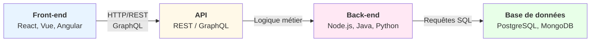
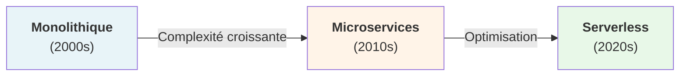
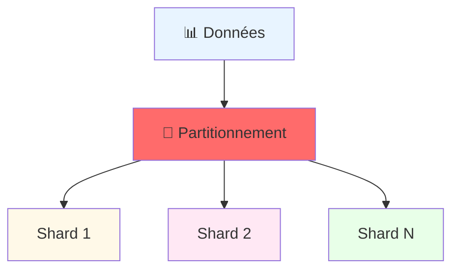
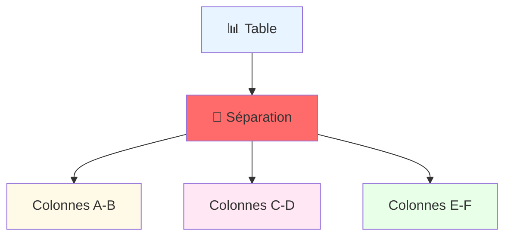
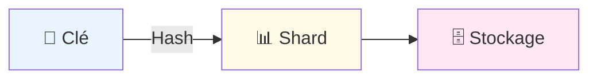
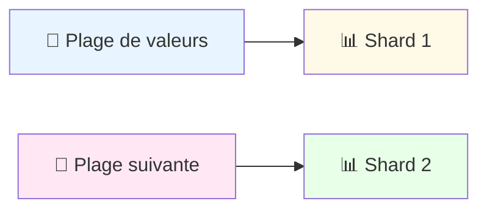
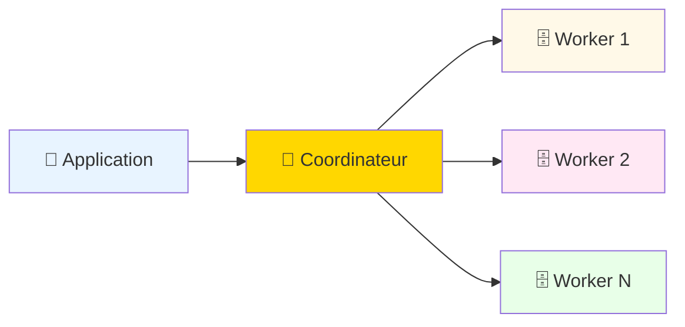
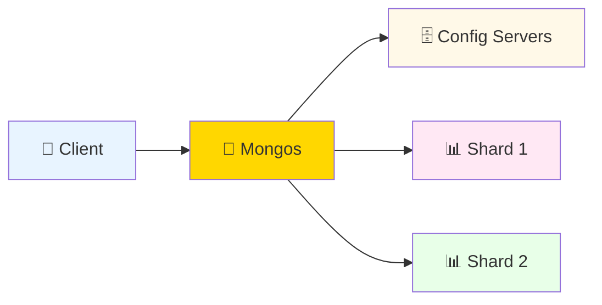

# Architectures Back-end

Back-ends et API pour le Web, le Mobile et l'IA

---
layout: table-contents
gradientColors: ['#8EC5FC', '#E0C3FC']
---

# 📋 Sommaire

- 🔧 Fondamentaux & Introduction
- 🏗️ Patterns d'Architecture
- 🚀 Architectures Avancées
- 🎨 Écosystèmes Technologiques
- ✨ Développement Propre
- 🌐 APIs & Communication
- 🤖 Intégration IA

---
layout: new-section
---

## 🎯 Introduction

<div style="text-align: center; padding: 40px 0; background: linear-gradient(135deg, #f5f7fa 0%, #c3cfe2 100%); border-radius: 15px; margin: 30px 0; box-shadow: 0 4px 12px rgba(0,0,0,0.1);">
  <h3 style="color: #2c3e50; margin-bottom: 20px; font-size: 1.8em;">📚 Introduction</h3>
  <p style="color: #34495e; font-size: 1.1em; max-width: 800px; margin: 0 auto;">
    Les fondamentaux de l'architecture logicielle
  </p>
  <div style="margin-top: 20px; height: 4px; background: linear-gradient(90deg, #3498db, #9b59b6); width: 100px; margin: 20px auto; border-radius: 2px;"></div>
</div>

---

## Pourquoi l'architecture logicielle est cruciale ?

> "When you model using only the semantics that the business expert cares about, you get a model that the business expert understands." — **Eric Evans**, Domain-Driven Design


### Impact direct sur:

- Maintenabilité et évolutivité du code
- Performance et sécurité des applications
- Adaptation aux besoins métiers (ex: assurance, santé)
- Réduction des coûts de développement à long terme

---

## Définitions clés

#### Back-end
Logique métier, bases de données, APIs, serveurs. Invisible à l'utilisateur final.

#### Front-end
Interface utilisateur, expérience client, interactions. Ce que l'utilisateur voit et utilise.

#### API (Application Programming Interface)
Pont de communication entre back-end et front-end. Contrats et protocoles d'échange de données.


---
src: ./pages/ecosystemes-backend.md
---

## Évolution des architectures



| Architecture | Avantages | Inconvénients |
| --- | --- | --- |
| Monolithe | Simple, facile à déployer | Difficile à scaler, couplage fort |
| Microservices | Scalable, indépendant | Complexité opérationnelle |
| Serverless | Pas de gestion infra | Coûts imprévisibles, latence |


---

## Principes d'architecture applicative

---

### Séparation des préoccupations

Chaque couche a une responsabilité unique et bien définie.

```plaintext
Présentation (UI)
      ↓
Logique métier (Règles de gestion)
      ↓
Accès aux données (Persistance)
      ↓
Infrastructure (Serveurs, BD)
```

---

## Principes SOLID

- Single Responsibility Principle: Une classe = une responsabilité
- Open/Closed Principle: Ouvert à l'extension, fermé à la modification
- Liskov Substitution: Les sous-types peuvent remplacer le type parent
- Interface Segregation: Plusieurs interfaces spécifiques > une grosse interface
- Dependency Inversion: Dépendre des abstractions, pas des implémentations

---

## Défis de l'architecture moderne

<div style="display: grid; grid-template-columns: 1fr 1fr; gap: 30px; margin-top: 20px;">
<div style="display: grid; grid-template-columns: 1fr; gap: 30px; ">

#### 🚀 Performance


- Latence réduite
- Caching efficace
- Scalabilité

#### 🔒 Sécurité


- OAuth2, JWT
- HTTPS, TLS
- Validation des données

</div>
<div style="display: grid; grid-template-columns: 1fr; gap: 30px; ">

#### 📊 Scalabilité


- Horizontal scaling
- Load balancing
- Caching distribué

#### 🔄 Maintenabilité

- Documentation
- Tests automatisés
- CI/CD pipeline
</div>
</div>

---
src: ./pages/patterns.md
---
---
src: ./pages/transactions.md
---
---
src: ./pages/microservices.md
---
---
src: ./pages/serverless.md
---
---
src: ./pages/cache.md
---

# 🗃️ Database Sharding et Partitioning

---

## Définitions

<div style="display: grid; grid-template-columns: 1fr 1fr; gap: 30px; margin-top: 0px;">
<div>

### Sharding Horizontal



</div>
<div>

### Partitioning Vertical


</div>
</div>

---

## Stratégies de Sharding

### 1. Key-Based Sharding



### 2. Range-Based Sharding



---

## Implémentation Pratique

<div style="display: grid; grid-template-columns: 1fr 1fr; gap: 30px; margin-top: 0px;">
<div>

### PostgreSQL avec Citus


</div>
<div>

### MongoDB Sharding



</div>
</div>

---
src: ./pages/ddd.md
---

---
src: ./pages/clean-code.md
---

---
src: ./pages/api.md
---

---
src: ./pages/ia-mcp.md
---

---

## Ressources & Références

#### Ouvrages de Référence

**Clean Code** - Robert C. Martin
> "Any fool can write code that a computer can understand. Good programmers write code that humans can understand."

**Clean Architecture** - Robert C. Martin
> "A software architect is a programmer who has stopped programming and has started thinking about programs."

**Design Patterns** - Gang of Four (Gamma, Helm, Johnson, Vlissides)
> "The purpose of design patterns is to give a name and a context to design problems and their solutions."

**Building Microservices** - Sam Newman
> "Microservices are small, autonomous services that work together. The microservice architectural style is an approach to developing a single application as a suite of small services."

**Domain-Driven Design** - Eric Evans
> "When you model using only the semantics that the business expert cares about, you get a model that the business expert understands."

**The Pragmatic Programmer** - Hunt & Thomas
> "Leave the campground cleaner than you found it. Leave the code better than you found it."

**Refactoring: Improving the Design of Existing Code** - Martin Fowler
> "Any fool can write code that a computer can understand. Good programmers write code that humans can understand."

---

## Questions & Discussion

### Qu'avez-vous envie de discuter?

✋ Levez la main pour poser vos questions
💬 Débat sur technologies, architecture...
🤔 Cas d'usage spécifiques à votre contexte


Pas de question bête - cette partie est pour VOUS

---

## Merci! 🙏

---
