# Architectures Back-end

Back-ends et API pour le Web, le Mobile et l'IA

---

# 📋 Sommaire

<div style="display: grid; grid-template-columns: 1fr 1fr; gap: 30px; margin-top: 40px">

<div style="display: grid; row-gap: 30px">

## 🔧 Fondamentaux & Introduction

## 🏗️ Patterns d'Architecture

## 🚀 Architectures Avancées

</div>

<div style="display: grid; row-gap: 30px">

## 🎨 Écosystèmes Technologiques

## ✨ Développement Propre

## 🌐 APIs & Communication

## 🤖 Intégration IA

</div>

</div>

---

## 🎯 Introduction

<div style="text-align: center; padding: 40px 0; background: linear-gradient(135deg, #f5f7fa 0%, #c3cfe2 100%); border-radius: 15px; margin: 30px 0; box-shadow: 0 4px 12px rgba(0,0,0,0.1);">
  <h3 style="color: #2c3e50; margin-bottom: 20px; font-size: 1.8em;">📚 Introduction</h3>
  <p style="color: #34495e; font-size: 1.1em; max-width: 800px; margin: 0 auto;">
    Les fondamentaux de l'architecture logicielle
  </p>
  <div style="margin-top: 20px; height: 4px; background: linear-gradient(90deg, #3498db, #9b59b6); width: 100px; margin: 20px auto; border-radius: 2px;"></div>
</div>

---

# 📚 Introduction

*Fondamentaux de l'architecture logicielle*

---

## Pourquoi l'architecture logicielle est cruciale ?

> "When you model using only the semantics that the business expert cares about, you get a model that the business expert understands." — **Eric Evans**, Domain-Driven Design


### Impact direct sur:

- Maintenabilité et évolutivité du code
- Performance et sécurité des applications
- Adaptation aux besoins métiers (ex: assurance, santé)
- Réduction des coûts de développement à long terme

---

## Définitions clés

#### Back-end
Logique métier, bases de données, APIs, serveurs. Invisible à l'utilisateur final.

#### Front-end
Interface utilisateur, expérience client, interactions. Ce que l'utilisateur voit et utilise.

#### API (Application Programming Interface)
Pont de communication entre back-end et front-end. Contrats et protocoles d'échange de données.

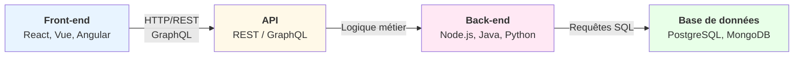

---

## Évolution des architectures

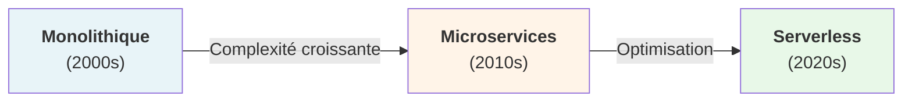

| Architecture | Avantages | Inconvénients |
| --- | --- | --- |
| Monolithe | Simple, facile à déployer | Difficile à scaler, couplage fort |
| Microservices | Scalable, indépendant | Complexité opérationnelle |
| Serverless | Pas de gestion infra | Coûts imprévisibles, latence |


---

## Principes d'architecture applicative

---

### Séparation des préoccupations

Chaque couche a une responsabilité unique et bien définie.

```plaintext
Présentation (UI)
      ↓
Logique métier (Règles de gestion)
      ↓
Accès aux données (Persistance)
      ↓
Infrastructure (Serveurs, BD)
```

---

## Principes SOLID

- Single Responsibility Principle: Une classe = une responsabilité
- Open/Closed Principle: Ouvert à l'extension, fermé à la modification
- Liskov Substitution: Les sous-types peuvent remplacer le type parent
- Interface Segregation: Plusieurs interfaces spécifiques > une grosse interface
- Dependency Inversion: Dépendre des abstractions, pas des implémentations

---

## Défis de l'architecture moderne

<div style="display: grid; grid-template-columns: 1fr 1fr; gap: 30px; margin-top: 0px;">
<div>

#### 🚀 Performance


- Latence réduite
- Caching efficace
- Scalabilité

#### 🔒 Sécurité


- OAuth2, JWT
- HTTPS, TLS
- Validation des données

</div>
<div>

#### 📊 Scalabilité


- Horizontal scaling
- Load balancing
- Caching distribué

#### 🔄 Maintenabilité

- Documentation
- Tests automatisés
- CI/CD pipeline
</div>
</div>

---

# 🏗️ Patterns d'Architecture

*Solutions éprouvées pour structurer vos applications*

---

## Pourquoi utiliser des patterns ?

### Les patterns résolvents des problèmes récurrents

> "The purpose of design patterns is to give a name and a context to design problems and their solutions." — **Gang of Four**, Design Patterns


- Réutilisabilité: Solutions éprouvées et documentées
- Standardisation: Équipes alignées sur une même approche
- Collaboration: Facilite la communication entre développeurs
- Réduction des risques: Évite les pièges courants
- Maintenabilité: Code plus prévisible et compréhensible

---

## Pattern MVC (Model-View-Controller)

### Séparation des responsabilités:

- Model: Données et logique métier
- View: Présentation et interface utilisateur
- Controller: Coordination et gestion des événements

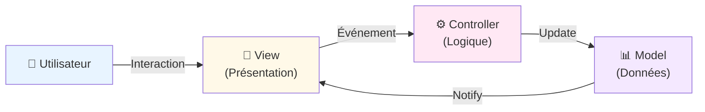

---

## Pattern MVVM (Model-View-ViewModel)

### Caractéristiques:

- Binding bidirectionnel: Sync automatique View ↔ ViewModel
- Testabilité: ViewModel indépendant de la Vue
- Réactivité: Mises à jour temps réel

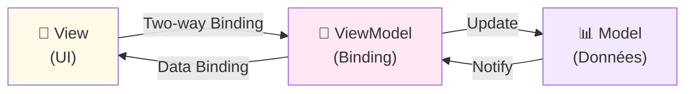

---

## Pattern CQRS (Command Query Responsibility Segregation)

### Concept clé

<div style="display: grid; grid-template-columns: 1fr 1fr; gap: 30px; margin-top: 0px;">
<div>
Séparer les modèles de lecture et écriture pour optimiser chacun indépendamment.

### Avantages

- ✅ **Optimisation indépendante**: Chaque modèle optimisé pour son usage
- ✅ **Scalabilité**: Lectures et écritures peuvent être déployées séparément
- ✅ **Performance**: Read DB peut être dénormalisée (cache, index spécifiques)
- ✅ **Clarté**: Séparation claire des responsabilités

</div>
<div>
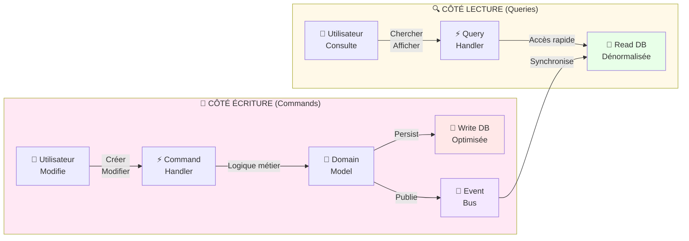
</div>
</div>
---

## Architecture Event-Sourcing

### Principes fondamentaux

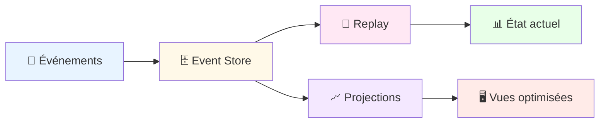

### Concepts clés

- **Événements immutables**: Tous les changements sont stockés comme événements
- **Reconstruction d'état**: L'état actuel est reconstruit en replayant les événements
- **Projections**: Vues optimisées pour différents cas d'usage
- **Audit trail**: Historique complet de toutes les modifications

---

### Cas d'usage

- **Finance**: Traçabilité complète des transactions
- **Assurance**: Historique des contrats et sinistres
- **Santé**: Dossiers patients avec historique complet

### Outils populaires

- **EventStoreDB**: Base de données dédiée
- **Kafka**: Pour le streaming d'événements
- **Axoni**: Plateforme complète

---

## Comparaison Event-Sourcing vs CRUD

| Aspect | Event-Sourcing | CRUD Traditionnel |
|---|---|---|
| **Historique** | ✅ Complet | ❌ Partiel |
| **Audit** | ✅ Natif | ❌ Requiert logs |  |
| **Performance lecture** | ❌ Replay nécessaire | ✅ Direct |
| **Complexité** | ⚠️ Élevée | ✅ Simple |
| **Évolutivité** | ✅ Excellente | ⚠️ Limitée |

---

## Pattern Event-Driven Architecture

### Cas d'usage assurance:

Services réactifs aux événements métiers asynchrones.

- Événement: "ContractCreated" - Un nouveau contrat est créé
- Consommateurs: Service email (notification), Service CRM (update), Service audit (logging)
- Avantage: Découplage complet entre services

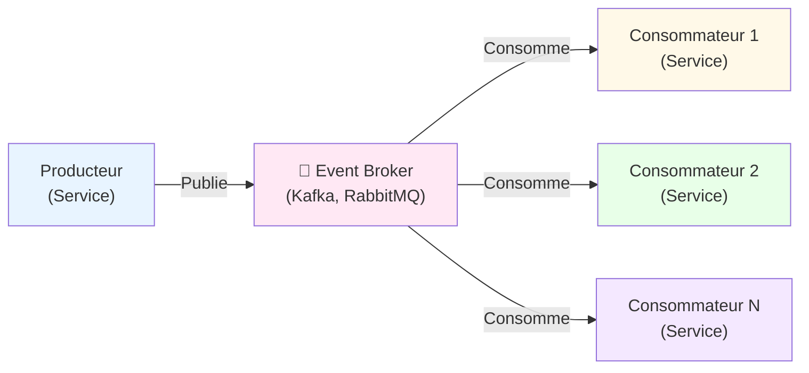

---

## Pattern Hexagonal (Ports & Adapters)

### Bénéfices:

<div style="display: grid; grid-template-columns: 1fr 1fr; gap: 30px; margin-top: 0px;">
<div>
Isoler le cœur métier des détails techniques.

- Cœur métier indépendant des frameworks
- Adaptation facile aux changements technologiques
- Tests unitaires sans dépendances externes

</div>
<div>

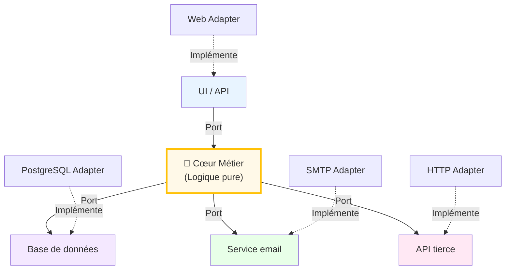
</div>
</div>

---

## Pattern Dependency Injection (DI)
Injecter les dépendances plutôt que les créer soi-même.

### Sans Dependency Injection (couplage fort):


```plaintext
public class ContractService {
    private DatabaseService db = new DatabaseService(); // Couplage fort
    
    public void createContract(Contract c) {
        db.save(c);
    }
}
```

### Avec Dependency Injection (découplage):


```plaintext
public class ContractService {
    private DatabaseService db; // Interface
    
    @Inject // Spring/Guice injecte la dépendance
    public ContractService(DatabaseService db) {
        this.db = db;
    }
}
```

---

## Pattern Repository

### Avantages:

Abstraction de la couche d'accès aux données.

- Logique métier indépendante du mécanisme de persistance
- Facile de basculer de PostgreSQL à MongoDB
- Tests unitaires avec implémentation mock

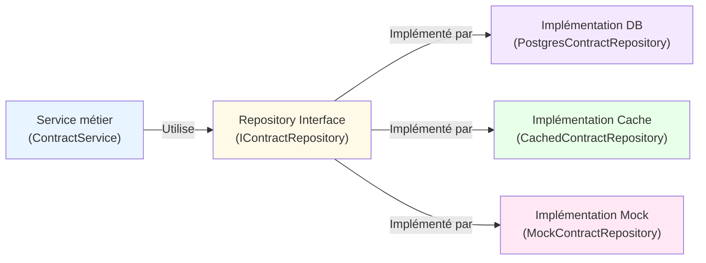

---

## Récapitulatif: Quand utiliser quel pattern ?

| Pattern | Problème | Quand l'utiliser |
| --- | --- | --- |
| MVC | Séparation UI/logique | Web traditionnel, applications simples |
| MVVM | Binding bidirectionnel | Interfaces réactives, desktop/mobile |
| CQRS | Scalabilité lecture/écriture | Hauts volumes, complex queries |
| Event-Driven | Découplage asynchrone | Microservices, systèmes réactifs |
| Hexagonal | Isolation cœur métier | Logique métier complexe, DDD |
| DI | Gestion dépendances | Tous les projets modernes |

---

# 🏗️ Architecture Serverless

---

## Principes du Serverless

### Caractéristiques clés

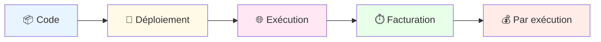

### Avantages

- **Pas de gestion serveur**: Focus sur le code métier
- **Scalabilité automatique**: Gestion transparente de la charge
- **Facturation précise**: Pay-as-you-go
- **Déploiement rapide**: Mise en production instantanée

### Défis

- **Cold starts**: Latence initiale
- **Timeouts**: Limites d'exécution
- **Vendor lock-in**: Dépendance au fournisseur cloud

---

## Patterns Serverless Avancés

<div style="display: grid; grid-template-columns: 1fr 1fr; gap: 30px; margin-top: 0px;">
<div>

### 1. Cold Start Optimization

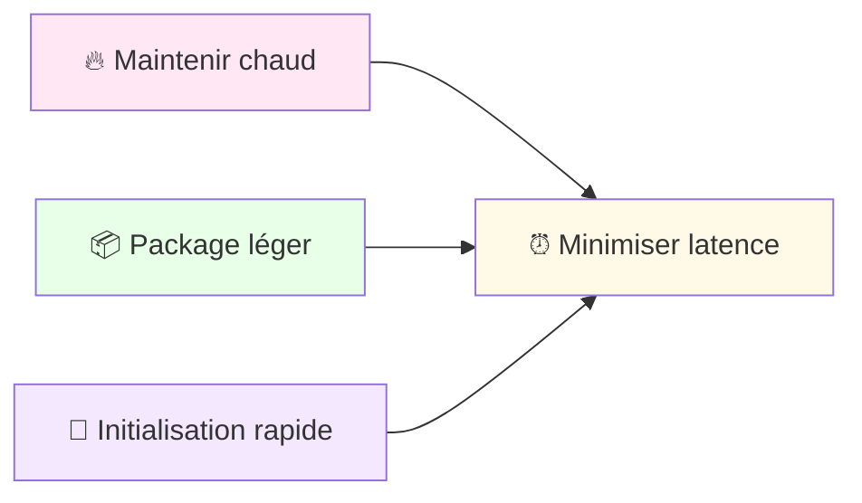

</div>
<div>

### 2. Composition de Fonctions

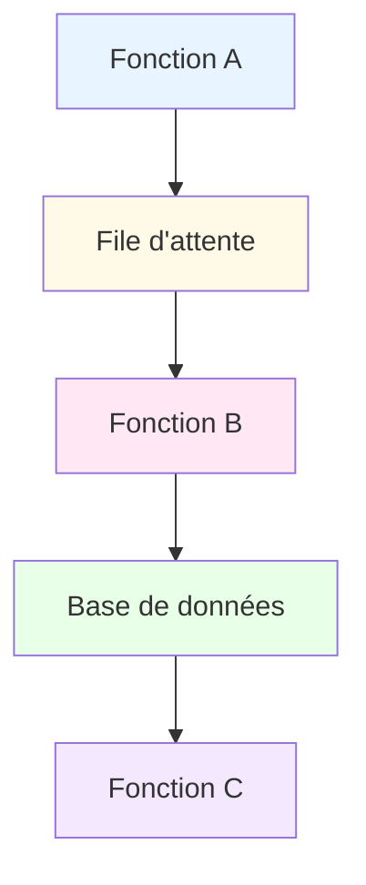

</div>
</div>

---

## Comparaison des Fournisseurs Cloud

| Fournisseur | Service | Langages | Timeout Max | Points forts |
|---|---|---|---|---|
| **AWS** | Lambda | Node, Python, Java, Go | 15 min | Écosystème complet |
| **Azure** | Functions | C#, JavaScript, Python | 10 min | Intégration Microsoft |
| **Google** | Cloud Functions | Node, Python, Go | 9 min | Scalabilité rapide |
| **Cloudflare** | Workers | JavaScript | 30 sec | Edge computing |

---

## Microservices: Introduction

Architectures distribuées basées sur des services indépendants.

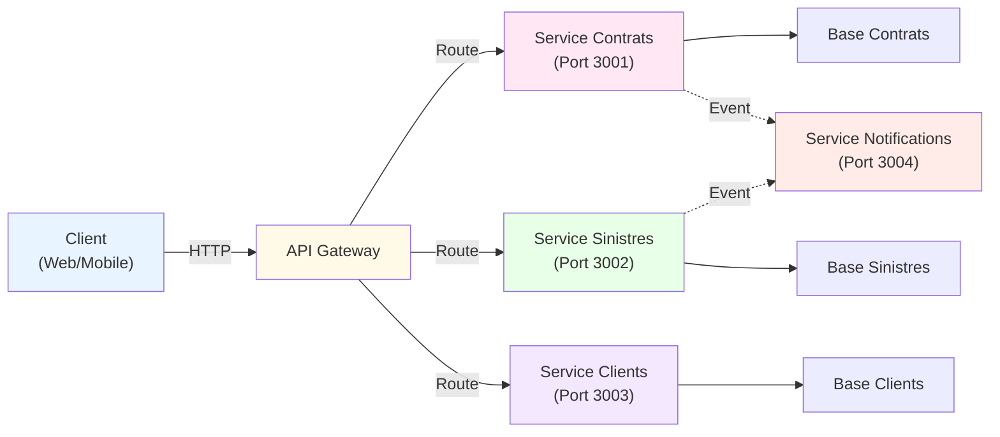

---

## Caractéristiques des Microservices

### Propriétés clés:

<div style="display: grid; grid-template-columns: 1fr 1fr; gap: 30px; margin-top: 0px;">
<div>

#### 🎯 Autonomie

- Services indépendants
- Déploiement indépendant
- BD dédiée
- Équipes autonomes

#### 📡 Communication

- API REST / gRPC
- Message brokers (Kafka)
- Events asynchrones
- Découverte de services

</div>
<div>

#### 🔄 Résilience

- Circuit breaker
- Timeout
- Retry policy
- Health checks

#### 📊 Observabilité

- Logging distribué
- Tracing
- Monitoring
- Alerting

</div>
</div>

---

## API Gateway et Service Discovery

### API Gateway (point d'entrée unique):

- Routage: Diriger requêtes aux services corrects
- Authentification: JWT validation
- Rate limiting: Protection DOS
- Caching: Réduire latence
- Load balancing: Distribuer charge

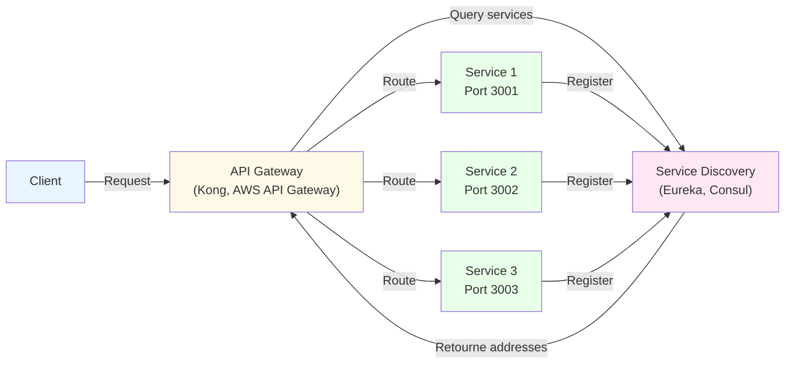

---

## Communication inter-services

### Approches de communication:

#### 🔵 Synchrone (REST/gRPC)

```plaintext
Service A
   ↓ (HTTP/gRPC)
Service B
   ↓ (attend réponse)
Service C
   ↓
Réponse retourne

Avantages:
✅ Cohérence immédiate
✅ Facile à déboguer

Inconvénients:
❌ Couplage fort
❌ Service lent = tout lent
```

#### 🟣 Asynchrone (Events)

```plaintext
Service A
   ↓ (Publie event)
Kafka/RabbitMQ
   ↓ (Message broker)
Service B (reçoit)
Service C (reçoit)

Avantages:
✅ Découplage complet
✅ Haute disponibilité
✅ Scalabilité

Inconvénients:
❌ Eventual consistency
❌ Plus complexe
```

---

## Saga Pattern: Transactions distribuées

#### Deux approches:

Maintenir la cohérence des données sur plusieurs services

- Choreography: Services écoutent les events et réagissent (loose coupling)
- Orchestration: Service central coordonne les étapes (plus simple mais couplage)

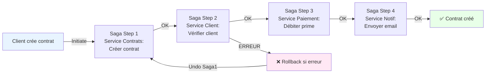

---

# 🏗️ Microservices: Choreography vs Orchestration

---

## Définitions et Comparaison

### Choreography

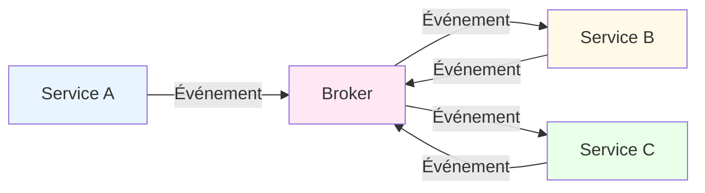

### Orchestration

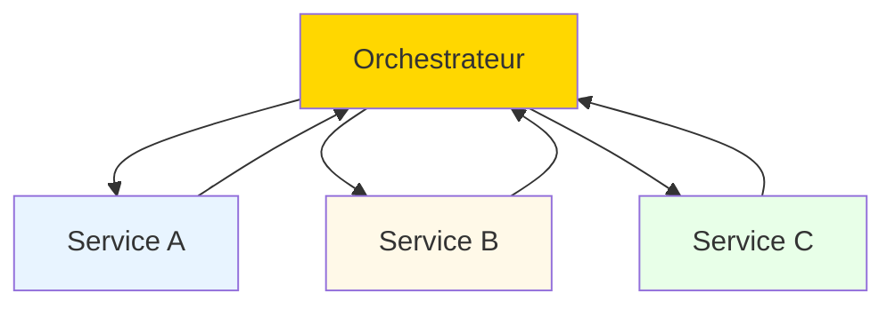

---

## Critères de Choix

| Critère | Choreography | Orchestration |
|---|---|---|
| **Couplage** | ✅ Faible | ❌ Fort |
| **Complexité** | ⚠️ Élevée | ✅ Modérée |
| **Flexibilité** | ✅ Élevée | ⚠️ Limitée |
| **Visibilité** | ❌ Difficile | ✅ Claire |
| **Maintenance** | ❌ Complexe | ✅ Simple |

### Outils Populaires

- **Choreography**: Kafka, RabbitMQ, AWS EventBridge
- **Orchestration**: Zeebe, Cadence, AWS Step Functions

---

## Implémentation Pratique

### Choreography avec Kafka

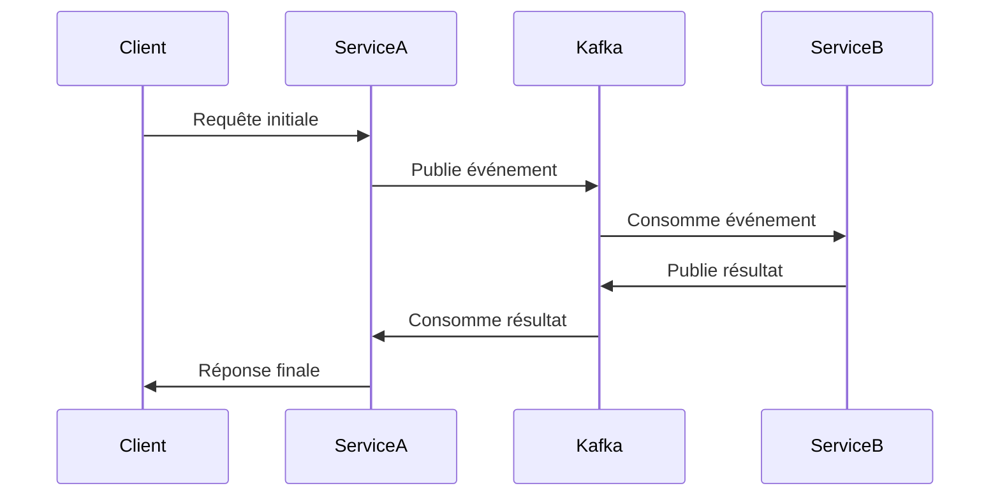

### Orchestration avec Zeebe

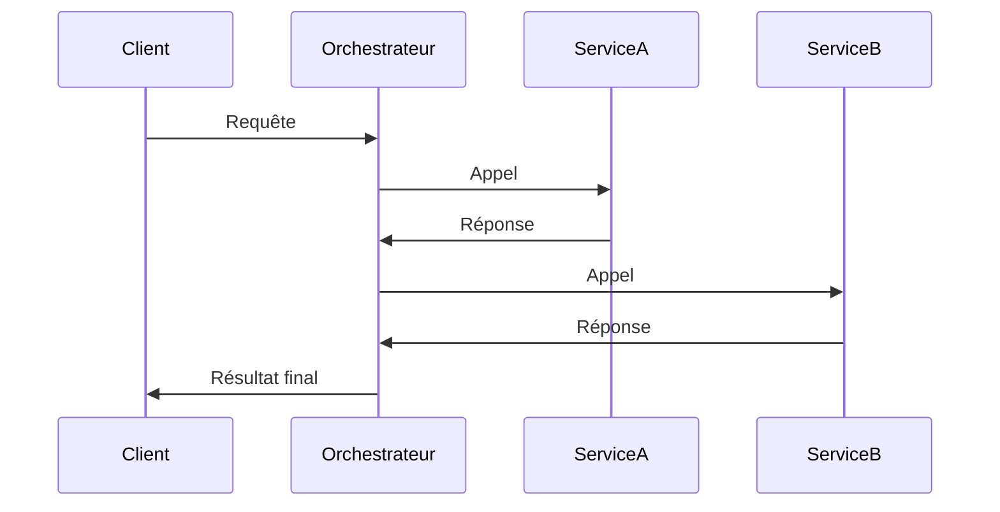

---

# 💾 Transactions en Backend

## Introduction aux Transactions

### Qu'est-ce qu'une transaction?

Une transaction est une **séquence d'opérations** qui doit s'exécuter en totalité ou pas du tout.

> "Un paiement est soit accepté complètement, soit rejeté en totalité - jamais partiellement."

---

### Propriétés ACID (fondamentales)

| Propriété | Signification | Assurance |
|-----------|---------------|-----------|
| **A**tomicité | Tout ou rien | Pas de paiement partiel |
| **C**ohérence | État valide avant/après | Soldes corrects toujours |
| **I**solation | Transactions indépendantes | Pas de lecture sale |
| **D**urabilité | Persistance garantie | Pas de perte de données |

### Cas d'usage assurance

- ✅ Création de contrat + enregistrement prime
- ✅ Sinistre + déblocage indemnisation
- ✅ Transfert de fonds entre comptes
- ✅ Mise à jour risque + calcul cotisation

---

## Problèmes sans Transactions

### Scénarios catastrophiques

```
Scénario: Achat d'assurance avec paiement

1. ✅ Prime débitée du compte client (-500€)
2. ❌ ERREUR BASE DE DONNÉES
3. ❌ Contrat NON créé
4. ❌ Prime perdue (ou non enregistrée)

→ Client a payé mais pas de contrat!
→ Risque juridique et financier énorme
```

### Sans ACID (base de données simple)

- Lecture sale: Lire une donnée non validée
- Modification perdue: Deux écritures simultanées
- Violation de contrainte: Somme = 0, mais montants = -50 et 100
- Crash pendant mise à jour: État inconsistant

---

## 2-Phase Commit (2PC)

<div style="display: grid; grid-template-columns: 1fr 1fr; gap: 30px; margin-top: 0px;">
<div>
Fonctionnement schématique :
</div>
<div>
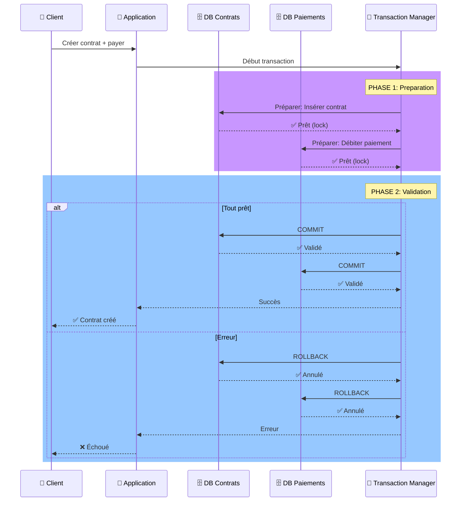
</div>
</div>

### Phases détaillées

**Phase 1: Prepare**
- Chaque ressource (BD) vérifie si elle PEUT valider
- Acquiert les locks nécessaires
- Réserve les ressources
- **Pas de commit encore**

**Phase 2: Commit**
- Coordinateur dit "commit" si tout est prêt
- Sinon "rollback"
- Les ressources appliquent définitivement

---

## Niveaux d'Isolation

### Lecture avec problèmes potentiels

| Niveau | Lecture Dirty | Non-Répétable | Fantôme |
|--------|---------------|---------------|---------|
| **READ UNCOMMITTED** | ❌ Oui | ❌ Oui | ❌ Oui |
| **READ COMMITTED** | ✅ Non | ❌ Oui | ❌ Oui |
| **REPEATABLE READ** | ✅ Non | ✅ Non | ❌ Oui |
| **SERIALIZABLE** | ✅ Non | ✅ Non | ✅ Non |

### Définitions

- **Lecture Dirty**: Lire une donnée non commitée (peut être annulée)
- **Non-Répétable**: Deux lectures différentes de la même donnée
- **Fantôme**: Lignes qui apparaissent/disparaissent entre lectures

---

## Implémentation dans les frameworks

### Spring Boot (Java)

```java
@Service
@Transactional  // ← Gère les transactions automatiquement
public class ContractService {
    
    @Transactional(propagation = Propagation.REQUIRED,
                   isolation = Isolation.REPEATABLE_READ)
    public void createContractWithPayment(Contract c, Payment p) {
        contractRepository.save(c);        // Insert contrat
        paymentRepository.save(p);         // Débiter paiement
        // ✅ COMMIT automatique si pas d'exception
        // ❌ ROLLBACK automatique si exception
    }
}

// Gestion d'erreur
@Transactional
public void transfer(Account from, Account to, double amount) {
    try {
        from.withdraw(amount);   // -500
        to.deposit(amount);      // +500
        accountRepo.save(from);
        accountRepo.save(to);
    } catch (Exception e) {
        // Rollback automatique, soldes intacts
        throw new TransactionException("Transfert échoué");
    }
}
```

### NestJS (Node.js/TypeScript)

```typescript
// Avec TypeORM
@Injectable()
export class ContractService {
  constructor(
    private dataSource: DataSource,
    private contractRepo: Repository<Contract>
  ) {}

  async createContractWithPayment(
    contract: Contract,
    payment: Payment
  ) {
    const queryRunner = this.dataSource.createQueryRunner();
    await queryRunner.connect();
    await queryRunner.startTransaction();

    try {
      await queryRunner.manager.save(contract);
      await queryRunner.manager.save(payment);
      await queryRunner.commitTransaction();
    } catch (err) {
      await queryRunner.rollbackTransaction();
      throw new Error('Transaction failed');
    } finally {
      await queryRunner.release();
    }
  }
}
```

### Considérations importantes

| Aspect | Détail |
|--------|--------|
| **Timeout** | Transactions longues = locks prolongés = deadlock |
| **Deadlock** | 2 transactions attendent mutuellement |
| **Performance** | SERIALIZABLE = plus sûr mais plus lent |
| **Monitoring** | Suivre les transactions longues |
| **Rollback** | Compréhendre les états d'erreur |

---

# 🚀 Caching Avancé

---

## Patterns de Cache

### Cache-Aside (Lazy Loading)

```mermaid
sequenceDiagram
    participant Client
    participant Cache
    participant Database

    Client->>Cache: Demande donnée
    alt Cache hit
        Cache->>Client: Retourne donnée
    else Cache miss
        Cache->>Database: Récupère donnée
        Database->>Cache: Stocke donnée
        Cache->>Client: Retourne donnée
    end
```

### Write-Through

```mermaid
sequenceDiagram
    participant Client
    participant Cache
    participant Database

    Client->>Cache: Écrit donnée
    Cache->>Database: Écrit donnée
    Database->>Cache: Confirmation
    Cache->>Client: Confirmation
```

---

## Comparaison Redis vs Memcached

| Critère | Redis | Memcached |
|---|---|---|
| **Persistance** | ✅ Oui | ❌ Non |
| **Structures** | ✅ Riches | ❌ Clé-valeur |
| **Réplication** | ✅ Master-Slave | ❌ Basique |
| **Performance** | ⚠️ Très élevée | ✅ Extrême |
| **Utilisation** | Cache + BD | Cache pur |

### Cas d'usage

- **Redis**: Sessions, leaderboards, pub/sub
- **Memcached**: Cache simple, performances pures

---

## Stratégies d'Invalidation

### 1. Time-based (TTL)

```mermaid
graph LR
    A["🕒 Donnée mise en cache"] --> B["⏳ TTL expire"]
    B --> C["🗑️ Invalidation automatique"]

    style A fill:#e8f4ff
    style B fill:#fff9e8
    style C fill:#ffe8f4
```

### 2. Event-based

```mermaid
graph LR
    A["📝 Mise à jour BD"] --> B["🔔 Événement"]
    B --> C["🗑️ Invalidation cache"]

    style A fill:#e8f4ff
    style B fill:#ffd700
    style C fill:#ffe8f4
```

---

# 🗃️ Database Sharding et Partitioning

---

## Définitions

### Sharding Horizontal

```mermaid
graph LR
    A["📊 Données"] --> B["🔪 Partitionnement"]
    B --> C["Shard 1"]
    B --> D["Shard 2"]
    B --> E["Shard N"]

    style A fill:#e8f4ff
    style B fill:#ff6b6b
    style C fill:#fff9e8
    style D fill:#ffe8f4
    style E fill:#e8ffe8
```

### Partitioning Vertical

```mermaid
graph LR
    A["📊 Table"] --> B["🔪 Séparation"]
    B --> C["Colonnes A-B"]
    B --> D["Colonnes C-D"]
    B --> E["Colonnes E-F"]

    style A fill:#e8f4ff
    style B fill:#ff6b6b
    style C fill:#fff9e8
    style D fill:#ffe8f4
    style E fill:#e8ffe8
```

---

## Stratégies de Sharding

### 1. Key-Based Sharding

```mermaid
graph LR
    A["🔑 Clé"] -->|Hash| B["📊 Shard"]
    B --> C["🗄️ Stockage"]

    style A fill:#e8f4ff
    style B fill:#fff9e8
    style C fill:#ffe8f4
```

### 2. Range-Based Sharding

```mermaid
graph LR
    A["📏 Plage de valeurs"] --> B["📊 Shard 1"]
    C["📏 Plage suivante"] --> D["📊 Shard 2"]

    style A fill:#e8f4ff
    style B fill:#fff9e8
    style C fill:#ffe8f4
    style D fill:#e8ffe8
```

---

## Implémentation Pratique

### PostgreSQL avec Citus

```mermaid
graph LR
    A["📱 Application"] --> B["🔄 Coordinateur"]
    B --> C["🗄️ Worker 1"]
    B --> D["🗄️ Worker 2"]
    B --> E["🗄️ Worker N"]

    style A fill:#e8f4ff
    style B fill:#ffd700
    style C fill:#fff9e8
    style D fill:#ffe8f4
    style E fill:#e8ffe8
```

### MongoDB Sharding

```mermaid
graph LR
    A["📱 Client"] --> B["🎯 Mongos"]
    B --> C["🗄️ Config Servers"]
    B --> D["📊 Shard 1"]
    B --> E["📊 Shard 2"]

    style A fill:#e8f4ff
    style B fill:#ffd700
    style C fill:#fff9e8
    style D fill:#ffe8f4
    style E fill:#e8ffe8
```

---

# 🎯 Domain-Driven Design Approfondi

---

## Strategic vs Tactical DDD

### Niveaux de DDD

```mermaid
graph TD
    A["🎯 Strategic DDD"] --> B["🔧 Tactical DDD"]
    B --> C["📦 Implementation"]

    style A fill:#ffd700
    style B fill:#ffe8f4
    style C fill:#fff9e8
```

### Strategic DDD

- **Bounded Contexts**: Frontières claires
- **Context Mapping**: Relations entre contextes
- **Ubiquitous Language**: Langage commun

### Tactical DDD

- **Aggregates**: Cohérence transactionnelle
- **Domain Events**: Communication asynchrone
- **Entities vs Value Objects**: Modélisation fine

---

## Bounded Contexts et Context Mapping

### Exemple d'Architecture

```mermaid
graph LR
    A["🛒 Commandes"] -->|🔄| B["📦 Livraisons"]
    A -->|📝| C["💰 Paiements"]
    B -->|📦| D["📍 Logistique"]

    style A fill:#e8f4ff
    style B fill:#fff9e8
    style C fill:#ffe8f4
    style D fill:#e8ffe8
```

### Types de Relations

| Relation | Description | Exemple |
|---|---|---|
| **Partnership** | Collaboration étroite | Commandes ↔ Livraisons |
| **Customer-Supplier** | Client-fournisseur | Commandes → Paiements |
| **Conformist** | Adaptation | Livraisons → Logistique |
| **Anti-Corruption Layer** | Isolation | Legacy → Nouveau |

---

## Event Storming

### Processus Collaboratif

```mermaid
graph TD
    A["🤝 Atelier"] --> B["📝 Événements"]
    B --> C["🔷 Commandes"]
    C --> D["📦 Aggregates"]
    D --> E["🎯 Bounded Contexts"]

    style A fill:#ffd700
    style B fill:#e8f4ff
    style C fill:#fff9e8
    style D fill:#ffe8f4
    style E fill:#e8ffe8
```

### Étapes Clés

1. **Événements métiers**: "CommandePayée", "LivraisonPlanifiée"
2. **Commandes**: Actions déclenchantes
3. **Aggregates**: Groupes cohérents
4. **Bounded Contexts**: Frontières logiques

---

## Récapitulatif DDD

### Avantages

- **Alignement métier**: Langage commun
- **Modularité**: Contextes indépendants
- **Maintenabilité**: Modèle clair
- **Évolutivité**: Adaptation facile

### Anti-Patterns à Éviter

- **Big Ball of Mud**: Tout dans un contexte
- **Anemic Domain Model**: Logique dans les services
- **Over-Engineering**: Complexité inutile

---

# 🔧 Écosystèmes Backend

*Découvrez les principaux frameworks et technologies*

---

## Vue d'ensemble

Les principaux écosystèmes pour développer des applications backend robustes et scalables.

---

## Spring Boot (Java)

### Caractéristiques
- **Framework**: Spring Framework avec Spring Boot pour démarrage rapide
- **TypeScript/Langages**: Java (JVM ecosystem)
- **Popularité**: ⭐⭐⭐⭐⭐ Très populaire en entreprise
- **Apprentissage**: Moyen - courbe importante

### Points forts
- Écosystème très riche et mature
- Excellente scalabilité
- Performance élevée
- Nombreuses intégrations
- Transactions ACID robustes

### Use cases
- Systèmes d'entreprise complexes
- Applications haute disponibilité
- Microservices à grande échelle
- Systèmes financiers

---

## NestJS (Node.js/TypeScript)

### Caractéristiques
- **Framework**: Node.js moderne avec TypeScript par défaut
- **Langages**: TypeScript/JavaScript
- **Popularité**: ⭐⭐⭐⭐ En croissance rapide
- **Apprentissage**: Facile - syntaxe proche de Angular

### Points forts
- Très rapide à développer
- Partage du code Frontend/Backend (JavaScript/TS)
- Développement agile
- Excellent pour API REST et GraphQL
- Écosystème npm très riche

### Use cases
- APIs modernes et scalables
- Applications temps réel (WebSocket)
- Microservices légers
- Projets startup et agiles

---

## Python (FastAPI & Django)

### FastAPI
- **Caractéristiques**: Framework ultra-moderne et performant
- **Avantages**: Très rapide à développer, auto-documentation API
- **Use cases**: APIs légères, Machine Learning, Data Science

### Django
- **Caractéristiques**: Framework complet "batteries included"
- **Avantages**: ORM puissant, admin panel généré, sécurité native
- **Use cases**: Applications web complètes, startups, prototypage rapide

### Points communs
- Popularité: ⭐⭐⭐⭐ Excellente pour l'IA/ML
- Apprentissage: Facile - syntaxe simple et claire
- Productivité: Très haute

---

## .NET / ASP.NET Core (C#)

### Caractéristiques
- **Framework**: ASP.NET Core (cross-platform)
- **Langages**: C# (langage moderne et puissant)
- **Popularité**: ⭐⭐⭐⭐ Très utilisé en entreprise
- **Apprentissage**: Moyen - C# plus complexe que Python

### Points forts
- Performance exceptionnelle
- Typage fort et sécurité
- Excellent écosystème Microsoft
- Cross-platform (Windows, Linux, Mac)
- Intégration Azure native

### Use cases
- Applications d'entreprise Windows
- Systèmes critiques
- Solutions sur Azure
- Applications Windows Desktop + Backend

---

## Comparaison Synthétique

| Critère | Spring Boot | NestJS | Python | .NET | 
|---------|-------------|--------|--------|------|
| **Vitesse dev** | Moyen | Rapide | Très rapide | Moyen |
| **Performance** | ⭐⭐⭐⭐⭐ | ⭐⭐⭐⭐ | ⭐⭐⭐ | ⭐⭐⭐⭐⭐ |
| **Scalabilité** | ⭐⭐⭐⭐⭐ | ⭐⭐⭐⭐ | ⭐⭐⭐ | ⭐⭐⭐⭐⭐ |
| **Courbe apprentissage** | Moyenne | Facile | Facile | Moyenne |
| **Écosystème** | ⭐⭐⭐⭐⭐ | ⭐⭐⭐⭐ | ⭐⭐⭐⭐ | ⭐⭐⭐⭐⭐ |
| **Entreprise** | ⭐⭐⭐⭐⭐ | ⭐⭐⭐⭐ | ⭐⭐⭐⭐ | ⭐⭐⭐⭐⭐ |
| **Startup/Agile** | ⭐⭐⭐ | ⭐⭐⭐⭐⭐ | ⭐⭐⭐⭐⭐ | ⭐⭐ |

---

## Quelle pile choisir?

### Spring Boot 👉
- Vous avez une équipe Java expérimentée
- Vous développez un système critique d'entreprise
- Vous avez besoin d'une scalabilité extrême

### NestJS 👉
- Vous voulez une pile moderne et unifiée (Front/Back en TypeScript)
- Vous développez des microservices
- Vous cherchez un bon équilibre productivité/performance

### Python 👉
- Vous découvrez la programmation backend
- Vous travaillez avec l'IA/ML
- Vous voulez développer très rapidement

### .NET 👉
- Vous êtes dans un environnement Microsoft/Azure
- Vous avez besoin de performance extrême
- Vous développez pour Windows et le web

---

# ✨ Clean Code & Architecture

*Écrire du code maintenable et évolutif*

---

## Clean Code: Introduction

### Pourquoi le Clean Code ?

> "Any fool can write code that a computer can understand. Good programmers write code that humans can understand." — **Robert C. Martin**, Clean Code


- Réduction des bugs: Code clair = moins d'erreurs
- Maintenabilité: Facile à modifier et à déboguer
- Collaboration: Équipes comprennent rapidement le code
- Évolutivité: Ajout de fonctionnalités sans refonte
- Productivité: Développeurs plus rapides et efficaces

---

## Code sale vs Code propre

#### ❌ Code sale (mauvais)


```plaintext
function calc(c) {
    let p = 0;
    if (c.age < 25)
        p = c.sal * 0.15;
    else if (c.age < 65)
        p = c.sal * 0.1;
    else
        p = c.sal * 0.2;
    
    // TODO: ajouter taxes
    // FIXME: bug ici
    return p;
}
```

#### ✅ Code propre (bon)

```plaintext
double calculateInsurancePremium(
    Customer customer) {
    int age = customer.getAge();
    double salary = customer.getSalary();
    
    PremiumRate rate = 
        determinePremiumRate(age);
    
    return salary * rate.getPercentage();
}

PremiumRate determinePremiumRate(
    int age) {
    if (age < 25) return YOUNG_RATE;
    if (age < 65) return STANDARD_RATE;
    return SENIOR_RATE;
}
```

---

## Règle 1: Nommage clair

### Noms révélateurs d'intention

| ❌ Mauvais | ✅ Bon | Raison |
| --- | --- | --- |
| d | elapsedTimeInDays | Spécifique et clair |
| calcP() | calculatePremium() | Verbe + nom explicite |
| list1, list2 | activeContracts, expiredContracts | Contexte et utilité clairs |
| Manager | ContractManager | Plus précis et domaine-spécifique |

---

## Règle 2: Fonctions courtes (SRP)

Single Responsibility Principle: Une fonction = une seule raison de changer

### Fonction trop grosse (mauvais):

```plaintext
public void processContract(Contract c) {
    // Validation
    if (c.getSalary() < 0) throw new Exception(...);
    
    // Calcul de prime
    double premium = c.getSalary() * 0.1;
    
    // Enregistrement
    database.save(c);
    
    // Envoi email
    emailService.send(c.getEmail(), premium);
    
    // Logging
    logger.info("Contrat traité: " + c.getId());
}
```
### Fonctions courtes et focalisées (bon):

```plaintext
public void processContract(Contract c) {
    validateContract(c);
    double premium = calculatePremium(c);
    saveContract(c);
    notifyCustomer(c, premium);
}

private void validateContract(Contract c) { ... }
private double calculatePremium(Contract c) { ... }
private void saveContract(Contract c) { ... }
private void notifyCustomer(Contract c, double p) { ... }
```

---

## Règle 3: Gestion des erreurs

### Préférer les exceptions aux codes de retour:

#### ❌ Code de retour

```plaintext
int status = 
    contractService.save(c);
    
if (status == 0) {
    System.err.println("Erreur!");
} else if (status == 1) {
    System.out.println("Saved");
}
```

#### ✅ Exception

```plaintext
try {
    contractService.save(c);
    logger.info("Contrat sauvé");
} catch (
    InvalidContractException e) {
    logger.error(
        "Contrat invalide: "
        + e.getMessage()
    );
}
```

---

## Règle 4: DRY (Don't Repeat Yourself)

Éliminer les répétitions de code.

#### ❌ Code répété

```plaintext
// ContractService
double premium = salary * 0.1;
if (premium < 100) premium = 100;
return premium;

// CustomerService
double amount = salary * 0.1;
if (amount < 100) amount = 100;
return amount;

// BenefitService
double benefit = salary * 0.1;
if (benefit < 100) benefit = 100;
return benefit;
```

#### ✅ Extraction en méthode

```plaintext
// PricingCalculator
private double calculateAmount(
    double salary) {
    double amount = salary * 0.1;
    return Math.max(amount, 100);
}

// Utilisation
ContractService uses 
    calculateAmount();
    
CustomerService uses 
    calculateAmount();
    
BenefitService uses 
    calculateAmount();
```

---

## Règle 5: Commentaires

Le code doit se commenter lui-même. Les commentaires ne doivent expliquer que le POURQUOI, pas le QUOI.

<div class="grid grid-cols-2 gap-4">
  <div>

#### ❌ Commentaires inutiles

```plaintext
// Incrémenter i
i++;

// Vérifier si la liste 
// n'est pas vide
if (list.size() > 0) {
    // Boucler sur les éléments
    for (Item item : list) {
        // Ajouter à total
        total += item.getValue();
    }
}
```
</div>
<div>

#### ✅ Commentaires utiles

```plaintext
// Limite minimale définie par
// la régulation assurance (2024)
final double MINIMUM_PREMIUM = 100;

// Algorithme de pricing Bayésien
// basé sur historique client
// Source: ACME-2023 Paper
private double 
    calculateAdaptivePremium(
        Customer c) {
    ...
}
```
</div>
</div>

---

## Règle 6: Formatage et style

### La cohérence est clé

- Indentation: 2 ou 4 espaces (pas de tabs)
- Longueur de ligne: Max 100-120 caractères
- Noms de classes: PascalCase (ContractService)
- Noms de variables: camelCase (myVariable)
- Noms de constantes: UPPER_SNAKE_CASE (MAX_SIZE)
- Espaces: Autour des opérateurs (x = y + z)

---

## Règle 7: Testabilité

### Propriétés d'un code testable:

#### Exemple: Test unitaire simple

Code testable = code découplé

- ✅ Dépendances injectées (pas "new Database()")
- ✅ Logique métier indépendante du framework
- ✅ Pas de singletons globaux
- ✅ Pas d'appels à des APIs externes en dur
- ✅ Méthodes courtes et déterministes

```plaintext
@Test
public void testCalculatePremiumForYoungDriver() {
    Customer young = new Customer(20, 30000);
    double premium = service.calculatePremium(young);
    assertEquals(4500, premium, 0.01);
}
```

---

## Récapitulatif: Les 7 règles du Clean Code

| # | Règle | Bénéfice |
| --- | --- | --- |
| 1 | Nommage clair | Comprendre rapidement l'intention |
| 2 | Fonctions courtes (SRP) | Facile à tester et maintenir |
| 3 | Gestion des erreurs | Code plus lisible et robuste |
| 4 | DRY (pas de répétition) | Modifications en un seul endroit |
| 5 | Commentaires utiles | Comprendre le POURQUOI |
| 6 | Formatage cohérent | Équipe sur la même longueur d'onde |
| 7 | Testabilité | Confiance dans le code |

---

## Clean Architecture: Introduction

> "A software architect is a programmer who has stopped programming and has started thinking about programs." — **Robert C. Martin**, Clean Architecture


Structure logicielle indépendante des frameworks, testable et maintenable.

Principe: Les couches intérieures ne dépendent jamais des couches extérieures

```mermaid
graph TB
                            subgraph Enterprise["Enterprise Business Rules"]
                                A["Entities"]
                            end
                            subgraph AppBiz["Application Business Rules"]
                                B["Use Cases"]
                            end
                            subgraph Interface["Interface Adapters"]
                                C["Controllers<br/>Gateways<br/>Presenters"]
                            end
                            subgraph Frameworks["Frameworks & Drivers"]
                                D["Web, DB, UI,<br/>External APIs"]
                            end
                            
                            Enterprise --> AppBiz
                            AppBiz --> Interface
                            Interface --> Frameworks
                            
                            style Enterprise fill:#e8f4ff
                            style AppBiz fill:#fff9e8
                            style Interface fill:#ffe8f4
                            style Frameworks fill:#e8ffe8
```

---

## Les 4 couches de Clean Architecture 1/2

#### 1️⃣ Entities (Cœur métier)

Objets métiers purs, pas de frameworks

```plaintext
public class Contract {
    private String id;
    private Customer customer;
    private double premium;
    public boolean isValid() {
        return premium > 0 
            && customer != null;
    }
}
```

#### 2️⃣ Use Cases (Logique applicative)

Règles métier spécifiques à l'app

public class CreateContractUseCase {
    private ContractRepository repo;
    public void execute(
        CreateContractRequest req) {
        Contract c = new Contract(...);
        validateContract(c);
        repo.save(c);
    }
}

---

## Les 4 couches de Clean Architecture 2/2

#### 3️⃣ Interface Adapters

Controllers, Gateways, Presenters

```plaintext

@RestController
public class ContractController {
    @PostMapping("/contracts")
    public void create(
        @RequestBody Request req) {
        useCase.execute(req);
    }
}
```

#### 4️⃣ Frameworks & Drivers

Spring, Hibernate, PostgreSQL, etc.

Détails techniques, facilement remplaçables

```plaintext
@RestController
public class ContractController {
    @PostMapping("/contracts")
    public void create(
        @RequestBody Request req) {
        useCase.execute(req);
    }
}
```

---

## Direction des dépendances

Règle d'or: Les dépendances pointent toujours vers l'intérieur

```mermaid
graph LR
                            Frameworks["🔴 Frameworks/Drivers<br/>(Spring, Hibernate, DB)"]
                            Interface["🟠 Interface Adapters<br/>(Controllers, Presenters)"]
                            UseCase["🟡 Use Cases<br/>(Règles métier applicatives)"]
                            Entities["🟢 Entities<br/>(Objets métiers purs)"]
                            
                            Frameworks -->|Dépend de| Interface
                            Interface -->|Dépend de| UseCase
                            UseCase -->|Dépend de| Entities
                            Entities -->|Ne dépend de PERSONNE| X["(Aucun appel sortant)"]
                            
                            style Frameworks fill:#ffcccc
                            style Interface fill:#ffe8cc
                            style UseCase fill:#ffffcc
                            style Entities fill:#ccffcc
                            style X fill:#ffffff,stroke:#999,stroke-dasharray: 5 5
```

---

## Structure de projet Clean Architecture

<div class="grid grid-cols-2 gap-4">
  <div>
```plaintext
src/
├── main/java/com/myapp/
│   │
│   ├── domain/               # 🟢 Entities
│   │   ├── Contract.java
│   │   ├── Customer.java
│   │   └── ContractRepository.java (interface)
│   │
│   ├── application/          # 🟡 Use Cases
│   │   ├── CreateContractUseCase.java
│   │   ├── UpdateContractUseCase.java
│   │   └── dto/
│   │       └── CreateContractRequest.java
│   │
│   ├── infrastructure/       # 🟠 Adapters & Drivers
│   │   ├── controller/
│   │   │   └── ContractController.java
│   │   ├── persistence/
│   │   │   ├── PostgresContractRepository.java
│   │   │   └── ContractEntity.java (JPA)
│   │   └── external/
│   │       └── EmailServiceAdapter.java
│   │
│   └── config/
│       └── DependencyInjectionConfig.java
```
</div>
<div>

```plaintext
│
└── test/
    └── java/com/myapp/
        ├── domain/
        ├── application/
        └── infrastructure/
```
</div>
</div>

---

## Cas d'usage: CreateContractUseCase

### Étapes du processus:

#### Code complet:

<div class="grid grid-cols-2 gap-4">
  <div>
```plaintext
@Service
public class CreateContractUseCase {
    private final ContractRepository repo;
    private final EmailService emailService;
    private final PremiumCalculator calculator;
    
    @Inject // Dependency Injection
    public CreateContractUseCase(
        ContractRepository repo,
        EmailService emailService,
        PremiumCalculator calculator) {
        this.repo = repo;
        this.emailService = emailService;
        this.calculator = calculator;
    }
```
</div>
<div>

```plaintext
    public ContractResponse execute(
        CreateContractRequest request) {
        // 1. Validation
        validateRequest(request);
        
        // 2. Création entité
        Contract contract = new Contract(
            request.getCustomerId(),
            request.getType()
        );
        
        // 3. Calcul de prime
        double premium = calculator
            .calculate(contract);
        contract.setPremium(premium);
        
        // 4. Persistance
        Contract saved = repo.save(contract);
        
        // 5. Notification
        emailService.sendConfirmation(
            saved.getCustomer().getEmail(),
            saved
        );
        
        return new ContractResponse(saved);
    }
    
    private void validateRequest(
        CreateContractRequest request) {
        if (request.getCustomerId() == null)
            throw new InvalidRequestException(
                "Customer ID required"
            );
        // Plus de validations...
    }
}
```
</div>
</div>

---

## Tests unitaires faciles

#### Test du CreateContractUseCase

Un avantage clé de Clean Architecture: testabilité.

<div class="grid grid-cols-2 gap-4">
  <div>
```plaintext
public class CreateContractUseCaseTest {
    private CreateContractUseCase useCase;
    private ContractRepository mockRepo;
    private EmailService mockEmail;
    private PremiumCalculator mockCalc;
    
    @Before
    public void setup() {
        // Créer des mocks (faux objets)
        mockRepo = mock(ContractRepository.class);
        mockEmail = mock(EmailService.class);
        mockCalc = mock(PremiumCalculator.class);
        
        // Injector les dépendances
        useCase = new CreateContractUseCase(
            mockRepo, mockEmail, mockCalc
        );
    }
```

</div>
<div>
    
```plaintext 
    @Test
    public void shouldCreateContractWithValidData() {
        // Given
        CreateContractRequest req = 
            new CreateContractRequest("cust-1", "AUTO");
        when(mockCalc.calculate(any()))
            .thenReturn(1200.0);
        when(mockRepo.save(any()))
            .thenReturn(new Contract(...));
        
        // When
        ContractResponse response = useCase.execute(req);
        
        // Then
        assertNotNull(response);
        verify(mockEmail).sendConfirmation(...);
        verify(mockRepo).save(...);
    }
}
```
</div>
</div>


---

## Avantages de Clean Architecture

<div class="grid grid-cols-2 gap-4">
  <div>

#### ✅ Pour le développement

- Logique métier isolée
- Tests unitaires simples
- Code découplé
- Facile à naviguer


#### ✅ Pour la maintenance

- Changements localisés
- Moins de bugs
- Évolution facilitée
- Refactoring sûr
</div>
<div>

#### ✅ Pour le business

- Réduction des coûts
- Time-to-market amélioré
- Moins de bugs en prod
- Équipes plus productives

#### ✅ Pour l'architecture

- Framework agnostique
- Technologie replaceable
- Scalabilité intégrée
- Future-proof
</div>
</div>
---

## Pièges à éviter

<div class="grid grid-cols-2 gap-4">
  <div>


#### ❌ Over-engineering

- Trop de couches
- Abstractions inutiles
- Code complexe pour du simple

Conseil: Adapter la complexité aux besoins

#### ❌ Entities contaminées

- Annotations JPA/Spring
- Logique métier dispersée
- Dépendances externes

Conseil: Entities = POJO purs
</div>
<div>

#### ❌ DTOs oubliés

- Entities retournées au client
- Leaks d'implémentation
- Couplage fort

Conseil: Toujours utiliser des DTOs

#### ❌ Tests négligés


- Tests intégration lents
- Pas de tests unitaires
- Coverage faible

Conseil: 70%+ du code couvert
</div>
</div>
---

## Comparaison: Approches d'architecture

| Aspect | Architecture simple | Clean Architecture |
| --- | --- | --- |
| Testabilité | Difficile (couplage fort) | Facile (découplage) |
| Complexité initiale | Faible | Modérée à élevée |
| Maintenance long terme | Difficile (dette tech) | Facile (structure claire) |
| Scalabilité | Limitée | Excellente |
| Changement technologie | Coûteux (réécriture) | Simple (adaptateurs) |
| Productivité équipe | Diminue avec la taille | Stable et prévisible |
| Idéal pour | Prototypes, POC | Projets long terme |


---

## REST vs GraphQL

### Comparaison des approches

| Aspect | REST | GraphQL |
| --- | --- | --- |
| Requête | Fixed endpoints (/users/1) | Flexible query (demander exactement ce qu'on veut) |
| Over-fetching | Oui (données superflues) | Non (données exactes) |
| Under-fetching | Oui (appels multiples) | Non (1 requête) |
| Caching | Facile (HTTP standard) | Plus difficile |
| Versioning | Nécessaire (/v1/, /v2/) | Pas nécessaire |
| Courbe d'apprentissage | Facile | Modérée |

---

## REST: Principes fondamentaux

### Principes clés:

REST: Representational State Transfer

- Client-Server: Séparation des préoccupations
- Stateless: Chaque requête contient toutes les infos
- Cacheable: Réponses peuvent être mises en cache
- Uniform Interface: Ressources identifiables par URI
- Méthodes HTTP standards: GET, POST, PUT, DELETE, PATCH

#### Exemple d'endpoints REST:

```plaintext
GET    /api/v1/contracts              # Récupérer tous les contrats
POST   /api/v1/contracts              # Créer un nouveau contrat
GET    /api/v1/contracts/123          # Récupérer un contrat spécifique
PUT    /api/v1/contracts/123          # Mettre à jour complètement
PATCH  /api/v1/contracts/123          # Mise à jour partielle
DELETE /api/v1/contracts/123          # Supprimer

GET    /api/v1/contracts/123/claims   # Sous-ressources
```

---

## REST: Bonnes pratiques

### Best practices pour une API REST robuste:

#### 🔐 Sécurité

- OAuth2: Authentification
- JWT: Token sans état
- HTTPS: Chiffrement
- Rate limiting: Protection DOS
- CORS: Contrôle d'accès

#### 📝 Versioning

- URL versioning: /v1/, /v2/
- Header versioning: X-API-Version
- Semantic versioning: 1.2.3
- Backward compatibility
- Deprecation warning

#### 📚 Documentation

- Swagger/OpenAPI
- Postman
- Réducers
- Exemples de requêtes
- Codes d'erreur

#### ⚠️ Erreurs

- Codes HTTP corrects
- Réponses d'erreur cohérentes
- Messages clairs
- Logging et monitoring
- Ratelimit headers

---

## Codes HTTP et gestion d'erreurs

#### Réponse d'erreur standardisée:

```plaintext
{
  "error": {
    "code": "INVALID_CONTRACT",
    "message": "Le contrat ne peut pas être créé",
    "details": {
      "field": "customer_id",
      "reason": "Customer not found"
    },
    "timestamp": "2026-01-17T10:30:00Z",
    "requestId": "req-12345"
  }
}
```

| Code | Signification | Exemple |
| --- | --- | --- |
| 200 | OK - Succès | Requête GET réussie |
| 201 | Created - Ressource créée | POST réussi |
| 400 | Bad Request - Erreur client | JSON invalide |
| 401 | Unauthorized - Auth requise | Token expiré |
| 403 | Forbidden - Pas d'accès | Permissions insuffisantes |
| 404 | Not Found - Ressource absente | Contrat inexistant |
| 500 | Server Error - Erreur serveur | Exception non gérée |
| 503 | Service Unavailable | Maintenance, surcharge |

---

## GraphQL: Introduction

### Concept clé: Demander exactement ce qu'on veut

#### ❌ REST (over-fetching)

```plaintext
GET /api/v1/contracts/123

{
  "id": "123",
  "customer": { ... },
  "premium": 1200,
  "type": "AUTO",
  "status": "ACTIVE",
  "createdAt": "...",
  "updatedAt": "...",
  // Plein de données non nécessaires
}

Données non utilisées = 
bande passante gaspillée
```

#### ✅ GraphQL (seulement ce qu'il faut)

GraphQL: Query language pour APIs

```plaintext
query {
  contract(id: "123") {
    id
    premium
    type
  }
}

Réponse:
{
  "contract": {
    "id": "123",
    "premium": 1200,
    "type": "AUTO"
  }
}

Que ce qui est demandé
```

---

## Schéma GraphQL

#### Exemple de schéma pour assurance:

Structure typée des données et opérations disponibles

```plaintext
type Contract {
  id: ID!                    # ! = obligatoire
  customer: Customer!
  premium: Float!
  type: ContractType!
  status: Status!
  claims: [Claim!]!          # Liste obligatoire
  createdAt: DateTime!
}

type Customer {
  id: ID!
  name: String!
  email: String!
  age: Int!
  contracts: [Contract!]!
}

enum ContractType {
  AUTO
  HOME
  HEALTH
}

enum Status {
  ACTIVE
  EXPIRED
  SUSPENDED
}

type Query {
  contract(id: ID!): Contract
  contracts(limit: Int = 10): [Contract!]!
  customer(id: ID!): Customer
}

type Mutation {
  createContract(input: CreateContractInput!): Contract!
  updateContract(id: ID!, input: UpdateContractInput!): Contract!
  deleteContract(id: ID!): Boolean!
}
```

---

## GraphQL Queries (Lecture)

### Query simple:

```plaintext
query GetContract {
  contract(id: "123") {
    id
    premium
    type
    customer {
      name
      email
    }
  }
}
```

### Query avec filtrage et pagination:

```plaintext
query GetContracts {
  contracts(limit: 10, offset: 0) {
    id
    premium
    type
    status
    customer {
      id
      name
    }
  }
}
```

### Query avec relations imbriquées:

```plaintext
query GetCustomerWithContracts {
  customer(id: "cust-1") {
    id
    name
    contracts {
      id
      premium
      type
      claims {
        id
        status
        amount
      }
    }
  }
}
```

---

## GraphQL Mutations (Écriture)

#### Mutation: Créer un contrat

Opérations de création, mise à jour, suppression

```plaintext
mutation CreateNewContract {
  createContract(input: {
    customerId: "cust-1"
    type: AUTO
    coverage: [COLLISION, THEFT]
    deductible: 500
  }) {
    id
    premium
    status
    customer {
      name
    }
  }
}

Réponse:
{
  "createContract": {
    "id": "contract-789",
    "premium": 1200.50,
    "status": "ACTIVE",
    "customer": {
      "name": "John Doe"
    }
  }
}
```

---

## GraphQL: Avantages et limitations

#### ✅ Avantages

#### ❌ Limitations

- Pas de over-fetching
- Pas de under-fetching
- Requête unique
- Pas de versioning
- Typage fort
- Documentation auto
- Introspection

- Caching difficile (POST)
- Courbe apprentissage
- Complexité du serveur
- N+1 queries problem
- File uploads complexe
- Real-time (WebSocket)
- Monitoring plus difficile

---

## Quand utiliser REST vs GraphQL?

| Scénario | REST | GraphQL | Recommandation |
| --- | --- | --- | --- |
| Ressources simples | ✅ Idéal | ⚠️ Overkill | REST |
| Relations complexes | ❌ Appels multiples | ✅ Requête unique | GraphQL |
| Clients variés | ❌ Over-fetching | ✅ Données précises | GraphQL |
| Mobile (bande passante) | ❌ Données superflues | ✅ Minimal | GraphQL |
| Caching HTTP | ✅ Facile | ❌ Complexe | REST |
| Adoption rapide | ✅ Facile à apprendre | ❌ Courbe apprentissage | REST |
| Real-time (WebSocket) | ❌ Non natif | ✅ Subscriptions | GraphQL |
| File uploads | ✅ Natif | ⚠️ Complexe | REST |

---

## Sécurité dans les APIs

#### 🔐 OAuth2

Protocole d’autorisation qui permet à une application tierce d’accéder à des ressources protégées (API, données) au nom d’un utilisateur, sans lui transmettre son mot de passe

#### 🔑 JWT (JSON Web Tokens)

Standard ouvert pour transmettre des informations sécurisées sous forme d'objet JSON signé numériquement.

#### 🔐 OpenID Connect

Protocole d'authentification basé sur OAuth 2.0 qui vérifie l'identité des utilisateurs via un ID Token (JWT).
Il ajoute à OAuth une couche d'identité standardisée (openid scope) pour SSO et informations utilisateur sécurisées.


---

## Documentation API: Swagger/OpenAPI

#### Exemple de specification OpenAPI (YAML):

Documenter et tester les APIs interactivement

```plaintext
openapi: 3.0.0
info:
  title: Insurance API
  version: 1.0.0
paths:
  /contracts:
    get:
      summary: List all contracts
      parameters:
        - name: limit
          in: query
          type: integer
          default: 10
      responses:
        '200':
          description: List of contracts
          content:
            application/json:
              schema:
                type: array
                items:
                  $ref: '#/components/schemas/Contract'
        '401':
          description: Unauthorized
    post:
      summary: Create contract
      requestBody:
        required: true
        content:
          application/json:
            schema:
              $ref: '#/components/schemas/CreateContractRequest'
      responses:
        '201':
          description: Contract created
          content:
            application/json:
              schema:
                $ref: '#/components/schemas/Contract'
components:
  schemas:
    Contract:
      type: object
      properties:
        id:
          type: string
        premium:
          type: number
        type:
          type: string
```

---

## Versioning d'API

#### 🔢 URL Versioning

Maintenir la compatibilité avec les clients existants

- Semantic Versioning: MAJOR.MINOR.PATCH (1.2.3)
- Backward compatibility: Supporter les anciennes versions (minimum 2 ans)
- Deprecation warnings: Notifier les clients
- Changelog: Documenter les changements

```plaintext
GET /api/v1/contracts
GET /api/v2/contracts

Avantages:
✅ Clair et explicite
✅ Caching facile
✅ Fournisseurs multiples

Inconvénients:
❌ URLs dupliquées
❌ Maintenance double
```

#### 📋 Header Versioning

```plaintext
GET /api/contracts
X-API-Version: 2

Avantages:
✅ URL unique
✅ Moins de duplication

Inconvénients:
❌ Moins visible
❌ Caching plus difficile
```

---

## Récapitulatif: API et GraphQL

#### 🌐 REST API

- Standard HTTP (GET, POST, PUT, DELETE)
- Endpoints fixes par ressource
- Facile à cacher
- Versioning standard
- Idéal pour ressources simples
- Courbe apprentissage faible

#### 📊 GraphQL

- Query language typé
- Requêtes flexibles
- Pas over/under-fetching
- Pas de versioning
- Idéal pour relations complexes
- Courbe apprentissage modérée

### Points clés:

- ✅ Sécurité: OAuth2 + JWT
- ✅ Documentation: Swagger/OpenAPI
- ✅ Versioning: URL ou Header
- ✅ Codes HTTP corrects
- ✅ Gestion d'erreurs cohérente

---

## 🎯 Prochaine Section: MCP & Intégration IA

<div style="text-align: center; padding: 40px 0; background: linear-gradient(135deg, #f5f7fa 0%, #c3cfe2 100%); border-radius: 15px; margin: 30px 0; box-shadow: 0 4px 12px rgba(0,0,0,0.1);">
  <h3 style="color: #2c3e50; margin-bottom: 20px; font-size: 1.8em;">🤖 MCP & Intégration IA</h3>
  <p style="color: #34495e; font-size: 1.1em; max-width: 800px; margin: 0 auto;">
    Explorez comment connecter vos backends avec les modèles d'IA et les agents autonomes pour créer des systèmes intelligents.
  </p>
  <div style="margin-top: 20px; height: 4px; background: linear-gradient(90deg, #3498db, #9b59b6); width: 100px; margin: 20px auto; border-radius: 2px;"></div>
</div>

---

## MCP & Intégration IA: Nouvelle ère

#### Cas d'usage:

Connecter les backends avec les modèles d'IA

- 📋 Assurance: Analyse automatique des sinistres avec Claude
- 🏥 Santé: Diagnostic assistance basé sur données patients
- 📝 Génération contenu: Documents, email, rapports automatisés
- 🔍 Recherche: Sémantique sur base de données

```mermaid
graph LR
                            LLM["LLM (ChatGPT, Claude)"]
                            MCP["MCP Server<br/>(Votre API)"]
                            Backend["Backend<br/>(Node.js, Spring)"]
                            DB["Database<br/>(PostgreSQL)"]
                            
                            LLM -->|Appel fonction| MCP
                            MCP -->|Récupère données| Backend
                            Backend -->|Query| DB
                            DB -->|Résultat| Backend
                            Backend -->|JSON| MCP
                            MCP -->|Réponse structurée| LLM
                            
                            style LLM fill:#10a37f
                            style MCP fill:#ffd700
                            style Backend fill:#4c6ef5
                            style DB fill:#868e96
```

---

## MCP: Model Context Protocol

### Architecture MCP:

#### MCP Server (côté backend):

Standard ouvert pour connecter LLMs aux tools/APIs

```plaintext
// Node.js/Express avec MCP SDK
const mcp = require('@anthropic-sdk/mcp');
const express = require('express');

const server = new mcp.MCPServer({
  name: 'insurance-api',
  version: '1.0.0'
});

// Enregistrer des ressources/outils
server.resource('contract', async (id) => {
  const contract = await db.contracts.findOne(id);
  return {
    type: 'contract',
    id,
    data: contract
  };
});

server.tool('create_claim', {
  description: 'Créer un sinistre',
  inputSchema: {
    type: 'object',
    properties: {
      contractId: { type: 'string' },
      description: { type: 'string' },
      amount: { type: 'number' }
    }
  },
  handler: async (input) => {
    const claim = await db.claims.create({
      contractId: input.contractId,
      description: input.description,
      amount: input.amount,
      status: 'PENDING'
    });
    return { success: true, claim };
  }
});

server.listen(3001);
```

---

## Monitoring: IA en production

#### Métriques à tracker:

Surveiller la qualité et la performance des réponses IA

```plaintext
// Instrumenter les appels IA
const aiMetrics = {
  // Performance
  latency: new Histogram('ai_latency_ms'),
  tokenUsage: new Counter('ai_tokens_used'),
  costs: new Gauge('ai_monthly_cost'),
  
  // Qualité
  hallucinations: new Counter('ai_hallucinations'),
  userRejections: new Counter('ai_responses_rejected'),
  accuracy: new Gauge('ai_accuracy_score'),
  
  // Erreurs
  rateLimitExceeded: new Counter('ai_rate_limit'),
  timeouts: new Counter('ai_timeouts'),
  authErrors: new Counter('ai_auth_errors')
};

// Instrumenter
const startTime = Date.now();
try {
  const response = await llm.analyze(data);
  aiMetrics.latency.observe(Date.now() - startTime);
  aiMetrics.tokenUsage.inc(response.usage.total_tokens);
  
  // User feedback
  response.on('reject', () => {
    aiMetrics.userRejections.inc();
  });
} catch (error) {
  if (error.code === 'RATE_LIMIT') {
    aiMetrics.rateLimitExceeded.inc();
  }
}
```

---

## Futur: Agents IA autonomes

#### Exemple: Traitement sinistre automatique

La prochaine génération: agents capables de décisions autonomes

```plaintext
// Agent autonome
const claimAgent = new Agent({
  tools: [
    'get_contract',
    'create_claim',
    'estimate_damage',
    'notify_client',
    'schedule_inspection'
  ]
});

const result = await claimAgent.run(
  `Traiter ce sinistre: Description du sinistre...`
);

// Résultat: Agent a autonomement:
// 1. ✅ Cherché le contrat
// 2. ✅ Créé le dossier sinistre
// 3. ✅ Estimé les dégâts
// 4. ✅ Notifié le client
// 5. ✅ Programmé l'inspection
// Tout dans une seule chaîne de pensée!
```

```mermaid
graph TB
                            Request["Demande client<br/>(Sinistre auto)"]
                            Agent["Agent IA<br/>(Claude + tools)"]
                            Plan["Planification<br/>(Étapes requises)"]
                            Action["Actions<br/>(API calls)"]
                            Reflect["Réflexion<br/>(Vérifier résultat)"]
                            Done{"Objectif<br/>atteint?"}
                            Response["Réponse finale"]
                            
                            Request --> Agent
                            Agent --> Plan
                            Plan --> Action
                            Action --> Reflect
                            Reflect --> Done
                            Done -->|Non| Plan
                            Done -->|Oui| Response
                            
                            style Agent fill:#10a37f
                            style Plan fill:#ffd700
                            style Action fill:#4c6ef5
                            style Reflect fill:#ff6b6b
                            style Response fill:#51cf66
```

---

## Ressources & Références

#### Ouvrages de Référence

**Clean Code** - Robert C. Martin
> "Any fool can write code that a computer can understand. Good programmers write code that humans can understand."

**Clean Architecture** - Robert C. Martin
> "A software architect is a programmer who has stopped programming and has started thinking about programs."

**Design Patterns** - Gang of Four (Gamma, Helm, Johnson, Vlissides)
> "The purpose of design patterns is to give a name and a context to design problems and their solutions."

**Building Microservices** - Sam Newman
> "Microservices are small, autonomous services that work together. The microservice architectural style is an approach to developing a single application as a suite of small services."

**Domain-Driven Design** - Eric Evans
> "When you model using only the semantics that the business expert cares about, you get a model that the business expert understands."

**The Pragmatic Programmer** - Hunt & Thomas
> "Leave the campground cleaner than you found it. Leave the code better than you found it."

**Refactoring: Improving the Design of Existing Code** - Martin Fowler
> "Any fool can write code that a computer can understand. Good programmers write code that humans can understand."

---

## Questions & Discussion

### Qu'avez-vous envie de discuter?

✋ Levez la main pour poser vos questions
💬 Débat sur technologies, architecture...
🤔 Cas d'usage spécifiques à votre contexte


Pas de question bête - cette partie est pour VOUS

---

## Merci! 🙏

---


