# Architectures Back-end

Back-ends et API pour le Web, le Mobile et l'IA

---

# 📋 Sommaire

<div style="display: grid; grid-template-columns: 1fr 1fr; gap: 30px; margin-top: 40px;">

<div>

## 🔧 Fondamentaux du développement back-end

- **Patterns d'Architecture**
  - Monolithe, Microservices, Serverless

  **Patterns de développement**
  - MVC, MVVM
  - CQRS, Event-Driven
  - Hexagonal, DI
  - Repository, Strategy

- **Clean Code, Clean Architecture**
- **Transactions et ACID**
- **SOLID Principles**
- **Event-Sourcing**
- **Serverless Avancée**

</div>

<div>

## 🎨 Ecosystèmes technologies

- **Ecosystèmes technologiques**
  - Java (Spring Boot), .Net, Python (FastAPI, Django), Node.js (Express, NestJS), Ruby on Rails

## Stratégies pour les API

- **REST vs GraphQL**
- Sécurité (OAuth2, JWT)
- Documentation (Swagger/OpenAPI)
- Versioning

## 🤖 En route vers l'IA

- **MCP, A2A**
- Intégration IA dans les backends
- Agents autonomes
- Sécurité et gouvernance IA

## Architecture Avancée

- **Microservices Choreography vs Orchestration**
- **Sécurité Avancée**
- **Caching Avancé**
- **Database Sharding**
- **Domain-Driven Design Approfondi**

</div>

</div>

<div style="margin-top: 30px; padding: 20px; background: #f0f0f0; border-radius: 8px;">

**Fondamentaux** - Principes transversaux (Introduction, Clean Code, Sécurité, Synthèse)

</div>

---


# 📚 Introduction

*Fondamentaux de l'architecture logicielle*

---

## Pourquoi l'architecture logicielle est cruciale ?

> "When you model using only the semantics that the business expert cares about, you get a model that the business expert understands." — **Eric Evans**, Domain-Driven Design

### Impact direct sur:

- Maintenabilité et évolutivité du code
- Performance et sécurité des applications
- Adaptation aux besoins métiers (ex: assurance, santé)
- Réduction des coûts de développement à long terme

---

## Évolution des architectures

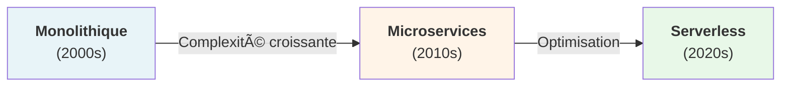

| Architecture | Avantages | Inconvénients |
| --- | --- | --- |
| Monolithe | Simple, facile à déployer | Diffcile à scaler, couplage fort |
| Microservices | Scalable, indépendant | Complexité opérationnelle |
| Serverless | Pas de gestion infra | Coûts imprévisibles, latence |

---

## Définitions clés

#### Back-end
Logique métier, bases de données, APIs, serveurs. Invisible à l'utilisateur final.

#### Front-end
Interface utilisateur, expérience client, interactions. Ce que l'utilisateur voit et utilise.

#### API (Application Programming Interface)
Pont de communication entre back-end et front-end. Contrats et protocoles d'échange de données.

```mermaid
graph LR
                            A["<b>Front-end</b><br/>React, Vue, Angular"] -->|HTTP/REST<br/>GraphQL| B["<b>API</b><br/>REST / GraphQL"]
                            B -->|Logique métier| C["<b>Back-end</b><br/>Node.js, Java, Python"]
                            C -->|Requêtes SQL| D["<b>Base de données</b><br/>PostgreSQL, MongoDB"]
                            
                            style A fill:#e8f4ff
                            style B fill:#fff9e8
                            style C fill:#ffe8f4
                            style D fill:#e8ffe8
```

---

## Panorama des technologies


<div style="display: grid; grid-template-columns: 1fr 1fr; gap: 30px; margin-top: 40px;">

<div>

#### 🔧 Back-end

- Java: Spring Boot, Spring Cloud
- Node.js: Express, NestJS
- Python: Django, FastAPI
- Go: Gin, Echo
#### 🎨 Front-end

- React: Composants, Hooks
- Vue.js: Réactif, simple
- Angular: Complet, TypeScript
- Next.js: SSR, SSG, SSG

</div>
<div>

#### 📱 Mobile

- React Native: Code réutilisable
- Flutter: Widgets natifs
- Swift/Kotlin: Natif

#### 🧠 Infrastructure & BD
- Docker: Conteneurisation
- Kubernetes: Orchestration
- PostgreSQL, MongoDB
</div>
</div>
---

## Principes d'architecture applicative

---

### Séparation des préoccupations

Chaque couche a une responsabilité unique et bien définie.

```plaintext
Présentation (UI)
      ↓
Logique métier (Règles de gestion)
      ↓
Accès aux données (Persistance)
      ↓
Infrastructure (Serveurs, BD)
```

---

## Principes SOLID

- Single Responsibility Principle: Une classe = une responsabilité
- Open/Closed Principle: Ouvert à l'extension, fermé à la modification
- Liskov Substitution: Les sous-types peuvent remplacer le type parent
- Interface Segregation: Plusieurs interfaces spécifiques > une grosse interface
- Dependency Inversion: Dépendre des abstractions, pas des implémentations

---

## Défis de l'architecture moderne

#### 🚀 Performance


- Latence réduite
- Caching efficace
- Scalabilité

#### 🔒 Sécurité


- OAuth2, JWT
- HTTPS, TLS
- Validation des données

#### 📊 Scalabilité


- Horizontal scaling
- Load balancing
- Caching distribué

#### 🔄 Maintenabilité

- Documentation
- Tests automatisés
- CI/CD pipeline

---


# 🏗️ Patterns d'Architecture

*Solutions éprouvées pour structurer vos applications*

---

## Pourquoi utiliser des patterns ?

### Les patterns résolvents des problèmes récurrents

> "The purpose of design patterns is to give a name and a context to design problems and their solutions." — **Gang of Four**, Design Patterns

- Réutilisabilité: Solutions éprouvées et documentées
- Standardisation: Équipes alignées sur une même approche
- Collaboration: Facilite la communication entre développeurs
- Réduction des risques: Évite les pièges courants
- Maintenabilité: Code plus prévisible et compréhensible

---

## Pattern MVC (Model-View-Controller)

### Séparation des responsabilités:

- Model: Données et logique métier
- View: Présentation et interface utilisateur
- Controller: Coordination et gestion des événements

```mermaid
graph LR
                            User["👤 Utilisateur"] -->|Interaction| View["🎨 View<br/>(Présentation)"]
                            View -->|Événement| Controller["⚙️ Controller<br/>(Logique)"]
                            Controller -->|Update| Model["📊 Model<br/>(Données)"]
                            Model -->|Notify| View
                            
                            style User fill:#e8f4ff
                            style View fill:#fff9e8
                            style Controller fill:#ffe8f4
                            style Model fill:#f4e8ff
```

---

## Pattern MVVM (Model-View-ViewModel)

### Caractéristiques:

- Binding bidirectionnel: Sync automatique View ↔ ViewModel
- Testabilité: ViewModel indépendant de la Vue
- Réactivité: Mises à jour temps réel

```mermaid
graph LR
                            View["🎨 View<br/>(UI)"]
                            ViewModel["🔗 ViewModel<br/>(Binding)"]
                            Model["📊 Model<br/>(Données)"]
                            
                            View -->|Two-way Binding| ViewModel
                            ViewModel -->|Data Binding| View
                            ViewModel -->|Update| Model
                            Model -->|Notify| ViewModel
                            
                            style View fill:#fff9e8
                            style ViewModel fill:#ffe8f4
                            style Model fill:#f4e8ff
```

---

## Pattern CQRS (Command Query Responsibility Segregation)

### Concept clé

Séparer les modèles de lecture et écriture pour optimiser chacun indépendamment.

```mermaid
graph LR
    subgraph Commands["📝 CÔTÉ ÉCRITURE (Commands)"]
        UI1["🧑 Utilisateur<br/>Modifie"]
        Handler1["⚡ Command<br/>Handler"]
        Domain["🎯 Domain<br/>Model"]
        WriteDB["💾 Write DB<br/>Optimisée"]
        EventBus["📢 Event<br/>Bus"]
    end

    subgraph Queries["🔍 CÔTÉ LECTURE (Queries)"]
        UI2["🧑 Utilisateur<br/>Consulte"]
        Handler2["⚡ Query<br/>Handler"]
        ReadDB["📖 Read DB<br/>Dénormalisée"]
    end

    UI1 -->|Créer<br/>Modifier| Handler1
    Handler1 -->|Logique métier| Domain
    Domain -->|Persist| WriteDB
    Domain -->|Publie| EventBus

    UI2 -->|Chercher<br/>Afficher| Handler2
    Handler2 -->|Accès rapide| ReadDB

    EventBus -->|Synchronise| ReadDB

    style Commands fill:#ffe8f4
    style Queries fill:#fff9e8
    style WriteDB fill:#ffe8e8
    style ReadDB fill:#e8ffe8
    style EventBus fill:#f4e8ff
```

### Avantages

- ✅ **Optimisation indépendante**: Chaque modèle optimisé pour son usage
- ✅ **Scalabilité**: Lectures et écritures peuvent être déployées séparément
- ✅ **Performance**: Read DB peut être dénormalisée (cache, index spécifiques)
- ✅ **Clarté**: Séparation claire des responsabilités

---

## Architecture Event-Sourcing

### Principes fondamentaux

```mermaid
graph LR
    A["📝 Événements"] --> B["🗄️ Event Store"]
    B --> C["🔄 Replay"]
    C --> D["📊 État actuel"]
    B --> E["📈 Projections"]
    E --> F["🖥️ Vues optimisées"]

    style A fill:#e8f4ff
    style B fill:#fff9e8
    style C fill:#ffe8f4
    style D fill:#e8ffe8
    style E fill:#f4e8ff
    style F fill:#ffebe8
```

### Concepts clés

- **Événements immutables**: Tous les changements sont stockés comme événements
- **Reconstruction d'état**: L'état actuel est reconstruit en replayant les événements
- **Projections**: Vues optimisées pour différents cas d'usage
- **Audit trail**: Historique complet de toutes les modifications

### Cas d'usage

- **Finance**: Traçabilité complète des transactions
- **Assurance**: Historique des contrats et sinistres
- **Santé**: Dossiers patients avec historique complet

### Outils populaires

- **EventStoreDB**: Base de données dédiée
- **Kafka**: Pour le streaming d'événements
- **Axoni**: Plateforme complète

---

## Comparaison Event-Sourcing vs CRUD

| Aspect | Event-Sourcing | CRUD Traditionnel |
|---|---|---|
| **Historique** | ✅ Complet | ❌ Partiel |
| **Audit** | ✅ Natif | ❌ Requiert logs |  |
| **Performance lecture** | ❌ Replay nécessaire | ✅ Direct |
| **Complexité** | ⚠️ Élevée | ✅ Simple |
| **Évolutivité** | ✅ Excellente | ⚠️ Limitée |

---

# 🏗️ Architecture Serverless Avancée

---

## Principes du Serverless

### Caractéristiques clés

```mermaid
graph TD
    A["📦 Code"] --> B["🚀 Déploiement"]
    B --> C["🌐 Exécution"]
    C --> D["⏱️ Facturation"]
    D --> E["💰 Par exécution"]

    style A fill:#e8f4ff
    style B fill:#fff9e8
    style C fill:#ffe8f4
    style D fill:#e8ffe8
    style E fill:#ffebe8
```

### Avantages

- **Pas de gestion serveur**: Focus sur le code métier
- **Scalabilité automatique**: Gestion transparente de la charge
- **Facturation précise**: Pay-as-you-go
- **Déploiement rapide**: Mise en production instantanée

### Défis

- **Cold starts**: Latence initiale
- **Timeouts**: Limites d'exécution
- **Vendor lock-in**: Dépendance au fournisseur cloud

---

## Patterns Serverless Avancés

### 1. Cold Start Optimization

```mermaid
graph LR
    A["🔥 Maintenir chaud"] --> B["⏰ Minimiser latence"]
    C["📦 Package léger"] --> B
    D["🚀 Initialisation rapide"] --> B

    style A fill:#ffe8f4
    style B fill:#fff9e8
    style C fill:#e8ffe8
    style D fill:#f4e8ff
```

### 2. Composition de Fonctions

```mermaid
graph TD
    A["Fonction A"] --> B["File d'attente"]
    B --> C["Fonction B"]
    C --> D["Base de données"]
    D --> E["Fonction C"]

    style A fill:#e8f4ff
    style B fill:#fff9e8
    style C fill:#ffe8f4
    style D fill:#e8ffe8
    style E fill:#f4e8ff
```

---

## Comparaison des Fournisseurs Cloud

| Fournisseur | Service | Langages | Timeout Max | Points forts |
|---|---|---|---|---|
| **AWS** | Lambda | Node, Python, Java, Go | 15 min | Écosystème complet |
| **Azure** | Functions | C#, JavaScript, Python | 10 min | Intégration Microsoft |
| **Google** | Cloud Functions | Node, Python, Go | 9 min | Scalabilité rapide |
| **Cloudflare** | Workers | JavaScript | 30 sec | Edge computing |

---

# 🏗️ Microservices: Choreography vs Orchestration

---

## Définitions et Comparaison

### Choreography

```mermaid
graph LR
    A["Service A"] -->|Événement| B["Broker"]
    B -->|Événement| C["Service B"]
    B -->|Événement| D["Service C"]
    C -->|Événement| B
    D -->|Événement| B

    style A fill:#e8f4ff
    style B fill:#ffe8f4
    style C fill:#fff9e8
    style D fill:#e8ffe8
```

### Orchestration


---

## Critères de Choix

| Critère | Choreography | Orchestration |
|---|---|---|
| **Couplage** | ✅ Faible | ❌ Fort |
| **Complexité** | ⚠️ Élevée | ✅ Modérée |
| **Flexibilité** | ✅ Élevée | ⚠️ Limitée |
| **Visibilité** | ❌ Difficile | ✅ Claire |
| **Maintenance** | ❌ Complexe | ✅ Simple |

### Outils Populaires

- **Choreography**: Kafka, RabbitMQ, AWS EventBridge
- **Orchestration**: Zeebe, Cadence, AWS Step Functions

---

## Implémentation Pratique

### Choreography avec Kafka

```mermaid
sequenceDiagram
    participant Client
    participant ServiceA
    participant Kafka
    participant ServiceB

    Client->>ServiceA: Requête initiale
    ServiceA->>Kafka: Publie événement
    Kafka->>ServiceB: Consomme événement
    ServiceB->>Kafka: Publie résultat
    Kafka->>ServiceA: Consomme résultat
    ServiceA->>Client: Réponse finale
```

### Orchestration avec Zeebe

```mermaid
sequenceDiagram
    participant Client
    participant Orchestrateur
    participant ServiceA
    participant ServiceB

    Client->>Orchestrateur: Requête
    Orchestrateur->>ServiceA: Appel
    ServiceA->>Orchestrateur: Réponse
    Orchestrateur->>ServiceB: Appel
    ServiceB->>Orchestrateur: Réponse
    Orchestrateur->>Client: Résultat final
```

---

# 🔒 Sécurité Avancée

---

## Zero Trust Architecture

### Principes Fondamentaux

```mermaid
graph TD
    A["🛡️ Never Trust"] --> B["🔍 Always Verify"]
    B --> C["🔒 Least Privilege"]
    C --> D["📡 Micro-Segmentation"]

    style A fill:#ff6b6b
    style B fill:#ffe8f4
    style C fill:#fff9e8
    style D fill:#e8ffe8
```

### Piliers du Zero Trust

1. **Identité**: Vérification continue
2. **Appareil**: Posture de sécurité
3. **Réseau**: Micro-segmentation
4. **Application**: Accès granulaire
5. **Données**: Chiffrement et classification

---

## Service-to-Service Authentication

### Mutual TLS (mTLS)

```mermaid
graph LR
    A["Service A"] -->|🔐 Certificat| B["Service B"]
    B -->|🔐 Certificat| A
    A -->|🔒 Communication| B
    B -->|🔒 Communication| A

    style A fill:#e8f4ff
    style B fill:#fff9e8
```

### OAuth2 pour les Services

```mermaid
sequenceDiagram
    participant ServiceA
    participant AuthServer
    participant ServiceB

    ServiceA->>AuthServer: Demande token
    AuthServer->>ServiceA: Token JWT
    ServiceA->>ServiceB: Requête + Token
    ServiceB->>AuthServer: Valide token
    AuthServer->>ServiceB: Validation
    ServiceB->>ServiceA: Réponse
```

---

## Secret Management

### HashiCorp Vault

```mermaid
graph TD
    A["🔑 Applications"] --> B["🗄️ Vault"]
    B --> C["🔐 Secrets"]
    B --> D["📝 Certificats"]
    B --> E["🔑 Clés API"]

    style A fill:#e8f4ff
    style B fill:#ffd700
    style C fill:#fff9e8
    style D fill:#ffe8f4
    style E fill:#e8ffe8
```

### Best Practices

- **Rotation automatique**: Changement régulier des secrets
- **Accès temporaire**: Tokens à durée limitée
- **Audit complet**: Logging de tous les accès
- **Chiffrement**: Secrets toujours chiffrés

---

# 🚀 Caching Avancé

---

## Patterns de Cache

### Cache-Aside (Lazy Loading)

```mermaid
sequenceDiagram
    participant Client
    participant Cache
    participant Database

    Client->>Cache: Demande donnée
    alt Cache hit
        Cache->>Client: Retourne donnée
    else Cache miss
        Cache->>Database: Récupère donnée
        Database->>Cache: Stocke donnée
        Cache->>Client: Retourne donnée
    end
```

### Write-Through

```mermaid
sequenceDiagram
    participant Client
    participant Cache
    participant Database

    Client->>Cache: Écrit donnée
    Cache->>Database: Écrit donnée
    Database->>Cache: Confirmation
    Cache->>Client: Confirmation
```

---

## Comparaison Redis vs Memcached

| Critère | Redis | Memcached |
|---|---|---|
| **Persistance** | ✅ Oui | ❌ Non |
| **Structures** | ✅ Riches | ❌ Clé-valeur |
| **Réplication** | ✅ Master-Slave | ❌ Basique |
| **Performance** | ⚠️ Très élevée | ✅ Extrême |
| **Utilisation** | Cache + BD | Cache pur |

### Cas d'usage

- **Redis**: Sessions, leaderboards, pub/sub
- **Memcached**: Cache simple, performances pures

---

## Stratégies d'Invalidation

### 1. Time-based (TTL)

```mermaid
graph LR
    A["🕒 Donnée mise en cache"] --> B["⏳ TTL expire"]
    B --> C["🗑️ Invalidation automatique"]

    style A fill:#e8f4ff
    style B fill:#fff9e8
    style C fill:#ffe8f4
```

### 2. Event-based

```mermaid
graph LR
    A["📝 Mise à jour BD"] --> B["🔔 Événement"]
    B --> C["🗑️ Invalidation cache"]

    style A fill:#e8f4ff
    style B fill:#ffd700
    style C fill:#ffe8f4
```

---

# 🗃️ Database Sharding et Partitioning

---

## Définitions

### Sharding Horizontal

```mermaid
graph TD
    A["📊 Données"] --> B["🔪 Partitionnement"]
    B --> C["Shard 1"]
    B --> D["Shard 2"]
    B --> E["Shard N"]

    style A fill:#e8f4ff
    style B fill:#ff6b6b
    style C fill:#fff9e8
    style D fill:#ffe8f4
    style E fill:#e8ffe8
```

### Partitioning Vertical

```mermaid
graph TD
    A["📊 Table"] --> B["🔪 Séparation"]
    B --> C["Colonnes A-B"]
    B --> D["Colonnes C-D"]
    B --> E["Colonnes E-F"]

    style A fill:#e8f4ff
    style B fill:#ff6b6b
    style C fill:#fff9e8
    style D fill:#ffe8f4
    style E fill:#e8ffe8
```

---

## Stratégies de Sharding

### 1. Key-Based Sharding

```mermaid
graph LR
    A["🔑 Clé"] -->|Hash| B["📊 Shard"]
    B --> C["🗄️ Stockage"]

    style A fill:#e8f4ff
    style B fill:#fff9e8
    style C fill:#ffe8f4
```

### 2. Range-Based Sharding

```mermaid
graph LR
    A["📏 Plage de valeurs"] --> B["📊 Shard 1"]
    C["📏 Plage suivante"] --> D["📊 Shard 2"]

    style A fill:#e8f4ff
    style B fill:#fff9e8
    style C fill:#ffe8f4
    style D fill:#e8ffe8
```

---

## Implémentation Pratique

### PostgreSQL avec Citus

```mermaid
graph TD
    A["📱 Application"] --> B["🔄 Coordinateur"]
    B --> C["🗄️ Worker 1"]
    B --> D["🗄️ Worker 2"]
    B --> E["🗄️ Worker N"]

    style A fill:#e8f4ff
    style B fill:#ffd700
    style C fill:#fff9e8
    style D fill:#ffe8f4
    style E fill:#e8ffe8
```

### MongoDB Sharding

```mermaid
graph TD
    A["📱 Client"] --> B["🎯 Mongos"]
    B --> C["🗄️ Config Servers"]
    B --> D["📊 Shard 1"]
    B --> E["📊 Shard 2"]

    style A fill:#e8f4ff
    style B fill:#ffd700
    style C fill:#fff9e8
    style D fill:#ffe8f4
    style E fill:#e8ffe8
```

---

# 🎯 Domain-Driven Design Approfondi

---

## Strategic vs Tactical DDD

### Niveaux de DDD

```mermaid
graph TD
    A["🎯 Strategic DDD"] --> B["🔧 Tactical DDD"]
    B --> C["📦 Implementation"]

    style A fill:#ffd700
    style B fill:#ffe8f4
    style C fill:#fff9e8
```

### Strategic DDD

- **Bounded Contexts**: Frontières claires
- **Context Mapping**: Relations entre contextes
- **Ubiquitous Language**: Langage commun

### Tactical DDD

- **Aggregates**: Cohérence transactionnelle
- **Domain Events**: Communication asynchrone
- **Entities vs Value Objects**: Modélisation fine

---

## Bounded Contexts et Context Mapping

### Exemple d'Architecture

```mermaid
graph LR
    A["🛒 Commandes"] -->|🔄| B["📦 Livraisons"]
    A -->|📝| C["💰 Paiements"]
    B -->|📦| D["📍 Logistique"]

    style A fill:#e8f4ff
    style B fill:#fff9e8
    style C fill:#ffe8f4
    style D fill:#e8ffe8
```

### Types de Relations

| Relation | Description | Exemple |
|---|---|---|
| **Partnership** | Collaboration étroite | Commandes ↔ Livraisons |
| **Customer-Supplier** | Client-fournisseur | Commandes → Paiements |
| **Conformist** | Adaptation | Livraisons → Logistique |
| **Anti-Corruption Layer** | Isolation | Legacy → Nouveau |

---

## Event Storming

### Processus Collaboratif

```mermaid
graph TD
    A["🤝 Atelier"] --> B["📝 Événements"]
    B --> C["🔷 Commandes"]
    C --> D["📦 Aggregates"]
    D --> E["🎯 Bounded Contexts"]

    style A fill:#ffd700
    style B fill:#e8f4ff
    style C fill:#fff9e8
    style D fill:#ffe8f4
    style E fill:#e8ffe8
```

### Étapes Clés

1. **Événements métiers**: "CommandePayée", "LivraisonPlanifiée"
2. **Commandes**: Actions déclenchantes
3. **Aggregates**: Groupes cohérents
4. **Bounded Contexts**: Frontières logiques

---

## Récapitulatif DDD

### Avantages

- **Alignement métier**: Langage commun
- **Modularité**: Contextes indépendants
- **Maintenabilité**: Modèle clair
- **Évolutivité**: Adaptation facile

### Anti-Patterns à Éviter

- **Big Ball of Mud**: Tout dans un contexte
- **Anemic Domain Model**: Logique dans les services
- **Over-Engineering**: Complexité inutile

---

## Pattern Event-Driven Architecture

### Cas d'usage assurance:

Services réactifs aux événements métiers asynchrones.

- Événement: "ContractCreated" - Un nouveau contrat est créé
- Consommateurs: Service email (notification), Service CRM (update), Service audit (logging)
- Avantage: Découplage complet entre services

```mermaid
graph LR
                            A["Producteur<br/>(Service)"] -->|Publie| Broker["🔔 Event Broker<br/>(Kafka, RabbitMQ)"]
                            Broker -->|Consomme| B["Consommateur 1<br/>(Service)"]
                            Broker -->|Consomme| C["Consommateur 2<br/>(Service)"]
                            Broker -->|Consomme| D["Consommateur N<br/>(Service)"]
                            
                            style A fill:#e8f4ff
                            style Broker fill:#ffe8f4
                            style B fill:#fff9e8
                            style C fill:#e8ffe8
                            style D fill:#f4e8ff
```

---

## Pattern Hexagonal (Ports & Adapters)

### Bénéfices:

Isoler le cœur métier des détails techniques.

- Cœur métier indépendant des frameworks
- Adaptation facile aux changements technologiques
- Tests unitaires sans dépendances externes

```mermaid
graph LR
                            UI["UI / API"]
                            DB["Base de données"]
                            MAIL["Service email"]
                            API3["API tierce"]
                            
                            UI -->|Port| Core["🔷 Cœur Métier<br/>(Logique pure)"]
                            Core -->|Port| DB
                            Core -->|Port| MAIL
                            Core -->|Port| API3
                            
                            UAda["Web Adapter"]
                            DBAda["PostgreSQL Adapter"]
                            MAILAda["SMTP Adapter"]
                            APIAda["HTTP Adapter"]
                            
                            UAda -.->|Implémente| UI
                            DBAda -.->|Implémente| DB
                            MAILAda -.->|Implémente| MAIL
                            APIAda -.->|Implémente| API3
                            
                            style Core fill:#fff9e8,stroke:#ffc107,stroke-width:3px
                            style UI fill:#e8f4ff
                            style DB fill:#f4e8ff
                            style MAIL fill:#e8ffe8
                            style API3 fill:#ffe8f4
```

---

## Pattern Dependency Injection (DI)
Injecter les dépendances plutôt que les créer soi-même.

### Sans Dependency Injection (couplage fort):


```plaintext
public class ContractService {
    private DatabaseService db = new DatabaseService(); // Couplage fort
    
    public void createContract(Contract c) {
        db.save(c);
    }
}
```

### Avec Dependency Injection (découplage):


```plaintext
public class ContractService {
    private DatabaseService db; // Interface
    
    @Inject // Spring/Guice injecte la dépendance
    public ContractService(DatabaseService db) {
        this.db = db;
    }
}
```

---

## Pattern Repository

### Avantages:

Abstraction de la couche d'accès aux données.

- Logique métier indépendante du mécanisme de persistance
- Facile de basculer de PostgreSQL à MongoDB
- Tests unitaires avec implémentation mock

```mermaid
graph LR
                            Service["Service métier<br/>(ContractService)"]
                            Repo["Repository Interface<br/>(IContractRepository)"]
                            Impl1["Implémentation DB<br/>(PostgresContractRepository)"]
                            Impl2["Implémentation Cache<br/>(CachedContractRepository)"]
                            Impl3["Implémentation Mock<br/>(MockContractRepository)"]
                            
                            Service -->|Utilise| Repo
                            Repo -->|Implémenté par| Impl1
                            Repo -->|Implémenté par| Impl2
                            Repo -->|Implémenté par| Impl3
                            
                            style Service fill:#e8f4ff
                            style Repo fill:#fff9e8
                            style Impl1 fill:#f4e8ff
                            style Impl2 fill:#e8ffe8
                            style Impl3 fill:#ffe8f4
```

---

## Récapitulatif: Quand utiliser quel pattern ?

| Pattern | Problème | Quand l'utiliser |
| --- | --- | --- |
| MVC | Séparation UI/logique | Web traditionnel, applications simples |
| MVVM | Binding bidirectionnel | Interfaces réactives, desktop/mobile |
| CQRS | Scalabilité lecture/écriture | Hauts volumes, complex queries |
| Event-Driven | Découplage asynchrone | Microservices, systèmes réactifs |
| Hexagonal | Isolation cœur métier | Logique métier complexe, DDD |
| DI | Gestion dépendances | Tous les projets modernes |

---

# 🔧 Écosystèmes Backend

*Découvrez les principaux frameworks et technologies*

---

## Vue d'ensemble

Les principaux écosystèmes pour développer des applications backend robustes et scalables.

---

## Spring Boot (Java)

### Caractéristiques
- **Framework**: Spring Framework avec Spring Boot pour démarrage rapide
- **TypeScript/Langages**: Java (JVM ecosystem)
- **Popularité**: ⭐⭐⭐⭐⭐ Très populaire en entreprise
- **Apprentissage**: Moyen - courbe importante

### Points forts
- Écosystème très riche et mature
- Excellente scalabilité
- Performance élevée
- Nombreuses intégrations
- Transactions ACID robustes

### Use cases
- Systèmes d'entreprise complexes
- Applications haute disponibilité
- Microservices à grande échelle
- Systèmes financiers

---

## NestJS (Node.js/TypeScript)

### Caractéristiques
- **Framework**: Node.js moderne avec TypeScript par défaut
- **Langages**: TypeScript/JavaScript
- **Popularité**: ⭐⭐⭐⭐ En croissance rapide
- **Apprentissage**: Facile - syntaxe proche de Angular

### Points forts
- Très rapide à développer
- Partage du code Frontend/Backend (JavaScript/TS)
- Développement agile
- Excellent pour API REST et GraphQL
- Écosystème npm très riche

### Use cases
- APIs modernes et scalables
- Applications temps réel (WebSocket)
- Microservices légers
- Projets startup et agiles

---

## Python (FastAPI & Django)

### FastAPI
- **Caractéristiques**: Framework ultra-moderne et performant
- **Avantages**: Très rapide à développer, auto-documentation API
- **Use cases**: APIs légères, Machine Learning, Data Science

### Django
- **Caractéristiques**: Framework complet "batteries included"
- **Avantages**: ORM puissant, admin panel généré, sécurité native
- **Use cases**: Applications web complètes, startups, prototypage rapide

### Points communs
- Popularité: ⭐⭐⭐⭐ Excellente pour l'IA/ML
- Apprentissage: Facile - syntaxe simple et claire
- Productivité: Très haute

---

## .NET / ASP.NET Core (C#)

### Caractéristiques
- **Framework**: ASP.NET Core (cross-platform)
- **Langages**: C# (langage moderne et puissant)
- **Popularité**: ⭐⭐⭐⭐ Très utilisé en entreprise
- **Apprentissage**: Moyen - C# plus complexe que Python

### Points forts
- Performance exceptionnelle
- Typage fort et sécurité
- Excellent écosystème Microsoft
- Cross-platform (Windows, Linux, Mac)
- Intégration Azure native

### Use cases
- Applications d'entreprise Windows
- Systèmes critiques
- Solutions sur Azure
- Applications Windows Desktop + Backend

---

## Ruby on Rails (Ruby)

### Caractéristiques
- **Framework**: Rails (Convention over Configuration)
- **Langages**: Ruby (syntaxe élégante)
- **Popularité**: ⭐⭐⭐ Moins nouveau, mais très efficace
- **Apprentissage**: Très facile - excellent pour débutants

### Points forts
- Rapidité de développement exceptionnelle
- Convention plutôt que configuration
- Excellente pour prototypes et MVPs
- Communauté très active et bienveillante
- Gestion de bases de données élégante

### Use cases
- Startups et MVPs
- Applications web complètes
- Prototypage rapide
- Content management systems

---

## Comparaison Synthétique

| Critère | Spring Boot | NestJS | Python | .NET | Rails |
|---------|-------------|--------|--------|------|-------|
| **Vitesse dev** | Moyen | Rapide | Très rapide | Moyen | Très rapide |
| **Performance** | ⭐⭐⭐⭐⭐ | ⭐⭐⭐⭐ | ⭐⭐⭐ | ⭐⭐⭐⭐⭐ | ⭐⭐⭐ |
| **Scalabilité** | ⭐⭐⭐⭐⭐ | ⭐⭐⭐⭐ | ⭐⭐⭐ | ⭐⭐⭐⭐⭐ | ⭐⭐⭐ |
| **Courbe apprentissage** | Moyenne | Facile | Facile | Moyenne | Très facile |
| **Écosystème** | ⭐⭐⭐⭐⭐ | ⭐⭐⭐⭐ | ⭐⭐⭐⭐ | ⭐⭐⭐⭐⭐ | ⭐⭐⭐ |
| **Entreprise** | ⭐⭐⭐⭐⭐ | ⭐⭐⭐⭐ | ⭐⭐⭐⭐ | ⭐⭐⭐⭐⭐ | ⭐⭐⭐ |
| **Startup/Agile** | ⭐⭐⭐ | ⭐⭐⭐⭐⭐ | ⭐⭐⭐⭐⭐ | ⭐⭐ | ⭐⭐⭐⭐⭐ |

---

## Quelle pile choisir?

### Spring Boot 👉
- Vous avez une équipe Java expérimentée
- Vous développez un système critique d'entreprise
- Vous besoin d'une scalabilité extrême

### NestJS 👉
- Vous voulez une pile moderne et unifiée (Front/Back en TypeScript)
- Vous développez des microservices
- Vous cherchez un bon équilibre productivité/performance

### Python 👉
- Vous découvrez la programmation backend
- Vous travaillez avec l'IA/ML
- Vous voulez développer très rapidement

### .NET 👉
- Vous êtes dans un environnement Microsoft/Azure
- Vous avez besoin de performance extrême
- Vous développez pour Windows et le web

---

# 💾 Transactions en Backend

## Introduction aux Transactions

### Qu'est-ce qu'une transaction?

Une transaction est une **séquence d'opérations** qui doit s'exécuter en totalité ou pas du tout.

> "Un paiement est soit accepté complètement, soit rejeté en totalité - jamais partiellement."

---

### Propriétés ACID (fondamentales)

| Propriété | Signification | Assurance |
|-----------|---------------|-----------|
| **A**tomicité | Tout ou rien | Pas de paiement partiel |
| **C**ohérence | État valide avant/après | Soldes corrects toujours |
| **I**solation | Transactions indépendantes | Pas de lecture sale |
| **D**urabilité | Persistance garantie | Pas de perte de données |

### Cas d'usage assurance

- ✅ Création de contrat + enregistrement prime
- ✅ Sinistre + déblocage indemnisation
- ✅ Transfert de fonds entre comptes
- ✅ Mise à jour risque + calcul cotisation

---

## Problèmes sans Transactions

### Scénarios catastrophiques

```
Scénario: Achat d'assurance avec paiement

1. ✅ Prime débitée du compte client (-500€)
2. ❌ ERREUR BASE DE DONNÉES
3. ❌ Contrat NON créé
4. ❌ Prime perdue (ou non enregistrée)

→ Client a payé mais pas de contrat!
→ Risque juridique et financier énorme
```

### Sans ACID (base de données simple)

- Lecture sale: Lire une donnée non validée
- Modification perdue: Deux écritures simultanées
- Violation de contrainte: Somme = 0, mais montants = -50 et 100
- Crash pendant mise à jour: État inconsistant

---

## 2-Phase Commit (2PC)

<div style="display: grid; grid-template-columns: 1fr 1fr; gap: 30px; margin-top: 0px;">
<div>
Fonctionnement schématique :
</div>
<div>
```mermaid
sequenceDiagram
    participant Client as 🧑 Client
    participant App as 📱 Application
    participant DB1 as 🗄️ DB Contrats
    participant DB2 as 🗄️ DB Paiements
    participant TM as 🎯 Transaction Manager

    Client->>App: Créer contrat + payer
    
    App->>TM: Début transaction
    
    rect rgb(200, 150, 255)
        Note over TM: PHASE 1: Preparation
        TM->>DB1: Préparer: Insérer contrat
        DB1-->>TM: ✅ Prêt (lock)
        TM->>DB2: Préparer: Débiter paiement
        DB2-->>TM: ✅ Prêt (lock)
    end
    
    rect rgb(150, 200, 255)
        Note over TM: PHASE 2: Validation
        alt Tout prêt
            TM->>DB1: COMMIT
            DB1-->>TM: ✅ Validé
            TM->>DB2: COMMIT
            DB2-->>TM: ✅ Validé
            TM-->>App: Succès
            App-->>Client: ✅ Contrat créé
        else Erreur
            TM->>DB1: ROLLBACK
            DB1-->>TM: ✅ Annulé
            TM->>DB2: ROLLBACK
            DB2-->>TM: ✅ Annulé
            TM-->>App: Erreur
            App-->>Client: ❌ Échoué
        end
    end
```
</div>
</div>

### Phases détaillées

**Phase 1: Prepare**
- Chaque ressource (BD) vérifie si elle PEUT valider
- Acquiert les locks nécessaires
- Réserve les ressources
- **Pas de commit encore**

**Phase 2: Commit**
- Coordinateur dit "commit" si tout est prêt
- Sinon "rollback"
- Les ressources appliquent définitivement

---

## Niveaux d'Isolation

### Lecture avec problèmes potentiels

| Niveau | Lecture Dirty | Non-Répétable | Fantôme |
|--------|---------------|---------------|---------|
| **READ UNCOMMITTED** | ❌ Oui | ❌ Oui | ❌ Oui |
| **READ COMMITTED** | ✅ Non | ❌ Oui | ❌ Oui |
| **REPEATABLE READ** | ✅ Non | ✅ Non | ❌ Oui |
| **SERIALIZABLE** | ✅ Non | ✅ Non | ✅ Non |

### Définitions

- **Lecture Dirty**: Lire une donnée non commitée (peut être annulée)
- **Non-Répétable**: Deux lectures différentes de la même donnée
- **Fantôme**: Lignes qui apparaissent/disparaissent entre lectures

---

## Implémentation dans les frameworks

### Spring Boot (Java)

```java
@Service
@Transactional  // ← Gère les transactions automatiquement
public class ContractService {
    
    @Transactional(propagation = Propagation.REQUIRED,
                   isolation = Isolation.REPEATABLE_READ)
    public void createContractWithPayment(Contract c, Payment p) {
        contractRepository.save(c);        // Insert contrat
        paymentRepository.save(p);         // Débiter paiement
        // ✅ COMMIT automatique si pas d'exception
        // ❌ ROLLBACK automatique si exception
    }
}

// Gestion d'erreur
@Transactional
public void transfer(Account from, Account to, double amount) {
    try {
        from.withdraw(amount);   // -500
        to.deposit(amount);      // +500
        accountRepo.save(from);
        accountRepo.save(to);
    } catch (Exception e) {
        // Rollback automatique, soldes intacts
        throw new TransactionException("Transfert échoué");
    }
}
```

### NestJS (Node.js/TypeScript)

```typescript
// Avec TypeORM
@Injectable()
export class ContractService {
  constructor(
    private dataSource: DataSource,
    private contractRepo: Repository<Contract>
  ) {}

  async createContractWithPayment(
    contract: Contract,
    payment: Payment
  ) {
    const queryRunner = this.dataSource.createQueryRunner();
    await queryRunner.connect();
    await queryRunner.startTransaction();

    try {
      await queryRunner.manager.save(contract);
      await queryRunner.manager.save(payment);
      await queryRunner.commitTransaction();
    } catch (err) {
      await queryRunner.rollbackTransaction();
      throw new Error('Transaction failed');
    } finally {
      await queryRunner.release();
    }
  }
}
```

### Considérations importantes

| Aspect | Détail |
|--------|--------|
| **Timeout** | Transactions longues = locks prolongés = deadlock |
| **Deadlock** | 2 transactions attendent mutuellement |
| **Performance** | SERIALIZABLE = plus sûr mais plus lent |
| **Monitoring** | Suivre les transactions longues |
| **Rollback** | Compréhendre les états d'erreur |

---

# ✨ Clean Code & Architecture

*Écrire du code maintenable et évolutif*

---

## Clean Code: Introduction

### Pourquoi le Clean Code ?

> "Any fool can write code that a computer can understand. Good programmers write code that humans can understand." — **Robert C. Martin**, Clean Code

- Réduction des bugs: Code clair = moins d'erreurs
- Maintenabilité: Facile à modifier et à déboguer
- Collaboration: Équipes comprennent rapidement le code
- Évolutivité: Ajout de fonctionnalités sans refonte
- Productivité: Développeurs plus rapides et efficaces

---

## Code sale vs Code propre

#### ❌ Code sale (mauvais)


```plaintext
function calc(c) {
    let p = 0;
    if (c.age < 25)
        p = c.sal * 0.15;
    else if (c.age < 65)
        p = c.sal * 0.1;
    else
        p = c.sal * 0.2;
    
    // TODO: ajouter taxes
    // FIXME: bug ici
    return p;
}
```

#### ✅ Code propre (bon)

```plaintext
double calculateInsurancePremium(
    Customer customer) {
    int age = customer.getAge();
    double salary = customer.getSalary();
    
    PremiumRate rate = 
        determinePremiumRate(age);
    
    return salary * rate.getPercentage();
}

PremiumRate determinePremiumRate(
    int age) {
    if (age < 25) return YOUNG_RATE;
    if (age < 65) return STANDARD_RATE;
    return SENIOR_RATE;
}
```

---

## Règle 1: Nommage clair

### Noms révélateurs d'intention

| ❌ Mauvais | ✅ Bon | Raison |
| --- | --- | --- |
| d | elapsedTimeInDays | Spécifique et clair |
| calcP() | calculatePremium() | Verbe + nom explicite |
| list1, list2 | activeContracts, expiredContracts | Contexte et utilité clairs |
| Manager | ContractManager | Plus précis et domaine-spécifique |

---

## Règle 2: Fonctions courtes (SRP)

### Fonction trop grosse (mauvais):

### Fonctions courtes et focalisées (bon):

Single Responsibility Principle: Une fonction = une seule raison de changer

```plaintext
public void processContract(Contract c) {
    // Validation
    if (c.getSalary() < 0) throw new Exception(...);
    
    // Calcul de prime
    double premium = c.getSalary() * 0.1;
    
    // Enregistrement
    database.save(c);
    
    // Envoi email
    emailService.send(c.getEmail(), premium);
    
    // Logging
    logger.info("Contrat traité: " + c.getId());
}
```

```plaintext
public void processContract(Contract c) {
    validateContract(c);
    double premium = calculatePremium(c);
    saveContract(c);
    notifyCustomer(c, premium);
}

private void validateContract(Contract c) { ... }
private double calculatePremium(Contract c) { ... }
private void saveContract(Contract c) { ... }
private void notifyCustomer(Contract c, double p) { ... }
```

---

## Règle 3: Gestion des erreurs

### Préférer les exceptions aux codes de retour:

#### ❌ Code de retour

#### ✅ Exception

```plaintext
int status = 
    contractService.save(c);
    
if (status == 0) {
    System.err.println("Erreur!");
} else if (status == 1) {
    System.out.println("Saved");
}
```

```plaintext
try {
    contractService.save(c);
    logger.info("Contrat sauvé");
} catch (
    InvalidContractException e) {
    logger.error(
        "Contrat invalide: "
        + e.getMessage()
    );
}
```

---

## Règle 4: DRY (Don't Repeat Yourself)

#### ❌ Code répété

#### ✅ Extraction en méthode

Éliminer les répétitions de code.

```plaintext
// ContractService
double premium = salary * 0.1;
if (premium < 100) premium = 100;
return premium;

// CustomerService
double amount = salary * 0.1;
if (amount < 100) amount = 100;
return amount;

// BenefitService
double benefit = salary * 0.1;
if (benefit < 100) benefit = 100;
return benefit;
```

```plaintext
// PricingCalculator
private double calculateAmount(
    double salary) {
    double amount = salary * 0.1;
    return Math.max(amount, 100);
}

// Utilisation
ContractService uses 
    calculateAmount();
    
CustomerService uses 
    calculateAmount();
    
BenefitService uses 
    calculateAmount();
```

---

## Règle 5: Commentaires

#### ❌ Commentaires inutiles

#### ✅ Commentaires utiles

Le code doit se commenter lui-même. Les commentaires ne doivent expliquer que le POURQUOI, pas le QUOI.

```plaintext
// Incrémenter i
i++;

// Vérifier si la liste 
// n'est pas vide
if (list.size() > 0) {
    // Boucler sur les éléments
    for (Item item : list) {
        // Ajouter à total
        total += item.getValue();
    }
}
```

```plaintext
// Limite minimale définie par
// la régulation assurance (2024)
final double MINIMUM_PREMIUM = 100;

// Algorithme de pricing Bayésien
// basé sur historique client
// Source: ACME-2023 Paper
private double 
    calculateAdaptivePremium(
        Customer c) {
    ...
}
```

---

## Règle 6: Formatage et style

### Cohérence est clé

- Indentation: 2 ou 4 espaces (pas de tabs)
- Longueur de ligne: Max 100-120 caractères
- Noms de classes: PascalCase (ContractService)
- Noms de variables: camelCase (myVariable)
- Noms de constantes: UPPER_SNAKE_CASE (MAX_SIZE)
- Espaces: Autour des opérateurs (x = y + z)

---

## Règle 7: Testabilité

### Propriétés d'un code testable:

#### Exemple: Test unitaire simple

Code testable = code découplé

- ✅ Dépendances injectées (pas "new Database()")
- ✅ Logique métier indépendante du framework
- ✅ Pas de singletons globaux
- ✅ Pas d'appels à des APIs externes en dur
- ✅ Méthodes courtes et déterministes

```plaintext
@Test
public void testCalculatePremiumForYoungDriver() {
    Customer young = new Customer(20, 30000);
    double premium = service.calculatePremium(young);
    assertEquals(4500, premium, 0.01);
}
```

---

## Récapitulatif: Les 7 règles du Clean Code

| # | Règle | Bénéfice |
| --- | --- | --- |
| 1 | Nommage clair | Comprendre rapidement l'intention |
| 2 | Fonctions courtes (SRP) | Facile à tester et maintenir |
| 3 | Gestion des erreurs | Code plus lisible et robuste |
| 4 | DRY (pas de répétition) | Modifications en un seul endroit |
| 5 | Commentaires utiles | Comprendre le POURQUOI |
| 6 | Formatage cohérent | Équipe sur la même longueur d'onde |
| 7 | Testabilité | Confiance dans le code |

---

## Clean Architecture: Introduction

> "A software architect is a programmer who has stopped programming and has started thinking about programs." — **Robert C. Martin**, Clean Architecture

Structure logicielle indépendante des frameworks, testable et maintenable.

Principe: Les couches intérieures ne dépendent jamais des couches extérieures

```mermaid
graph TB
                            subgraph Enterprise["Enterprise Business Rules"]
                                A["Entities"]
                            end
                            subgraph AppBiz["Application Business Rules"]
                                B["Use Cases"]
                            end
                            subgraph Interface["Interface Adapters"]
                                C["Controllers<br/>Gateways<br/>Presenters"]
                            end
                            subgraph Frameworks["Frameworks & Drivers"]
                                D["Web, DB, UI,<br/>External APIs"]
                            end
                            
                            Enterprise --> AppBiz
                            AppBiz --> Interface
                            Interface --> Frameworks
                            
                            style Enterprise fill:#e8f4ff
                            style AppBiz fill:#fff9e8
                            style Interface fill:#ffe8f4
                            style Frameworks fill:#e8ffe8
```

---

## Les 4 couches de Clean Architecture

#### 1️⃣ Entities (Cœur métier)

#### 2️⃣ Use Cases (Logique applicative)

#### 3️⃣ Interface Adapters

#### 4️⃣ Frameworks & Drivers

Objets métiers purs, pas de frameworks

public class Contract {
    private String id;
    private Customer customer;
    private double premium;
    public boolean isValid() {
        return premium > 0 
            && customer != null;
    }
}
                        2️⃣ Use Cases (Logique applicative)
                        Règles métier spécifiques à l'app

public class CreateContractUseCase {
    private ContractRepository repo;
    public void execute(
        CreateContractRequest req) {
        Contract c = new Contract(...);
        validateContract(c);
        repo.save(c);
    }
}
                        3️⃣ Interface Adapters
                        Controllers, Gateways, Presenters

@RestController
public class ContractController {
    @PostMapping("/contracts")
    public void create(
        @RequestBody Request req) {
        useCase.execute(req);
    }
}
                        4️⃣ Frameworks & Drivers
                        Spring, Hibernate, PostgreSQL, etc.

Détails techniques, facilement remplaçables

```plaintext
public class Contract {
    private String id;
    private Customer customer;
    private double premium;
    
    public boolean isValid() {
        return premium > 0 
            && customer != null;
    }
}
```

```plaintext
public class CreateContractUseCase {
    private ContractRepository repo;
    
    public void execute(
        CreateContractRequest req) {
        Contract c = new Contract(...);
        validateContract(c);
        repo.save(c);
    }
}
```

```plaintext
@RestController
public class ContractController {
    @PostMapping("/contracts")
    public void create(
        @RequestBody Request req) {
        useCase.execute(req);
    }
}
```

---

## Direction des dépendances

Règle d'or: Les dépendances pointent toujours vers l'intérieur

```mermaid
graph TB
                            Frameworks["🔴 Frameworks/Drivers<br/>(Spring, Hibernate, DB)"]
                            Interface["🟠 Interface Adapters<br/>(Controllers, Presenters)"]
                            UseCase["🟡 Use Cases<br/>(Règles métier applicatives)"]
                            Entities["🟢 Entities<br/>(Objets métiers purs)"]
                            
                            Frameworks -->|Dépend de| Interface
                            Interface -->|Dépend de| UseCase
                            UseCase -->|Dépend de| Entities
                            Entities -->|Ne dépend de PERSONNE| X["(Aucun appel sortant)"]
                            
                            style Frameworks fill:#ffcccc
                            style Interface fill:#ffe8cc
                            style UseCase fill:#ffffcc
                            style Entities fill:#ccffcc
                            style X fill:#ffffff,stroke:#999,stroke-dasharray: 5 5
```

---

## Structure de projet Clean Architecture

```plaintext
src/
├── main/java/com/myapp/
│   │
│   ├── domain/               # 🟢 Entities
│   │   ├── Contract.java
│   │   ├── Customer.java
│   │   └── ContractRepository.java (interface)
│   │
│   ├── application/          # 🟡 Use Cases
│   │   ├── CreateContractUseCase.java
│   │   ├── UpdateContractUseCase.java
│   │   └── dto/
│   │       └── CreateContractRequest.java
│   │
│   ├── infrastructure/       # 🟠 Adapters & Drivers
│   │   ├── controller/
│   │   │   └── ContractController.java
│   │   ├── persistence/
│   │   │   ├── PostgresContractRepository.java
│   │   │   └── ContractEntity.java (JPA)
│   │   └── external/
│   │       └── EmailServiceAdapter.java
│   │
│   └── config/
│       └── DependencyInjectionConfig.java
│
└── test/
    └── java/com/myapp/
        ├── domain/
        ├── application/
        └── infrastructure/
```

---

## Cas d'usage: CreateContractUseCase

### Étapes du processus:

#### Code complet:

```plaintext
@Service
public class CreateContractUseCase {
    private final ContractRepository repo;
    private final EmailService emailService;
    private final PremiumCalculator calculator;
    
    @Inject // Dependency Injection
    public CreateContractUseCase(
        ContractRepository repo,
        EmailService emailService,
        PremiumCalculator calculator) {
        this.repo = repo;
        this.emailService = emailService;
        this.calculator = calculator;
    }
    
    public ContractResponse execute(
        CreateContractRequest request) {
        // 1. Validation
        validateRequest(request);
        
        // 2. Création entité
        Contract contract = new Contract(
            request.getCustomerId(),
            request.getType()
        );
        
        // 3. Calcul de prime
        double premium = calculator
            .calculate(contract);
        contract.setPremium(premium);
        
        // 4. Persistance
        Contract saved = repo.save(contract);
        
        // 5. Notification
        emailService.sendConfirmation(
            saved.getCustomer().getEmail(),
            saved
        );
        
        return new ContractResponse(saved);
    }
    
    private void validateRequest(
        CreateContractRequest request) {
        if (request.getCustomerId() == null)
            throw new InvalidRequestException(
                "Customer ID required"
            );
        // Plus de validations...
    }
}
```

---

## Tests unitaires faciles

#### Test du CreateContractUseCase

Un avantage clé de Clean Architecture: testabilité.

```plaintext
public class CreateContractUseCaseTest {
    private CreateContractUseCase useCase;
    private ContractRepository mockRepo;
    private EmailService mockEmail;
    private PremiumCalculator mockCalc;
    
    @Before
    public void setup() {
        // Créer des mocks (faux objets)
        mockRepo = mock(ContractRepository.class);
        mockEmail = mock(EmailService.class);
        mockCalc = mock(PremiumCalculator.class);
        
        // Injector les dépendances
        useCase = new CreateContractUseCase(
            mockRepo, mockEmail, mockCalc
        );
    }
    
    @Test
    public void shouldCreateContractWithValidData() {
        // Given
        CreateContractRequest req = 
            new CreateContractRequest("cust-1", "AUTO");
        when(mockCalc.calculate(any()))
            .thenReturn(1200.0);
        when(mockRepo.save(any()))
            .thenReturn(new Contract(...));
        
        // When
        ContractResponse response = useCase.execute(req);
        
        // Then
        assertNotNull(response);
        verify(mockEmail).sendConfirmation(...);
        verify(mockRepo).save(...);
    }
}
```

---

## Avantages de Clean Architecture

#### ✅ Pour le développement

#### ✅ Pour la maintenance

#### ✅ Pour le business

#### ✅ Pour l'architecture

- Logique métier isolée
- Tests unitaires simples
- Code découplé
- Facile à naviguer

- Changements localisés
- Moins de bugs
- Évolution facilitée
- Refactoring sûr

- Réduction des coûts
- Time-to-market amélioré
- Moins de bugs en prod
- Équipes plus productives

- Framework agnostique
- Technologie replaceable
- Scalabilité intégrée
- Future-proof

---

## Pièges à éviter

#### ❌ Over-engineering

#### ❌ Entities contaminées

#### ❌ DTOs oubliés

#### ❌ Tests négligés

Conseil: Adapter la complexité aux besoins

Conseil: Entities = POJO purs

Conseil: Toujours utiliser des DTOs

Conseil: 70%+ du code couvert

- Trop de couches
- Abstractions inutiles
- Code complexe pour du simple

- Annotations JPA/Spring
- Logique métier dispersée
- Dépendances externes

- Entities retournées au client
- Leaks d'implémentation
- Couplage fort

- Tests intégration lents
- Pas de tests unitaires
- Coverage faible

---

## Comparaison: Approches d'architecture

| Aspect | Architecture simple | Clean Architecture |
| --- | --- | --- |
| Testabilité | Difficile (couplage fort) | Facile (découplage) |
| Complexité initiale | Faible | Modérée à élevée |
| Maintenance long terme | Difficile (dette tech) | Facile (structure claire) |
| Scalabilité | Limitée | Excellente |
| Changement technologie | Coûteux (réécriture) | Simple (adaptateurs) |
| Productivité équipe | Diminue avec la taille | Stable et prévisible |
| Idéal pour | Prototypes, POC | Projets long terme |

---

## Récapitulatif: Clean Code & Architecture

#### 🎨 Clean Code

#### 🏛️ Clean Architecture

### Impact combiné:

7 règles:

4 couches:

- ✅ Code facile à lire et comprendre
- ✅ Logique métier isolée et testable
- ✅ Dépendances contrôlées
- ✅ Évolution sans refonte majeure
- ✅ Équipes productives et heureuses

---

## REST vs GraphQL

### Comparaison des approches

| Aspect | REST | GraphQL |
| --- | --- | --- |
| Requête | Fixed endpoints (/users/1) | Flexible query (demander exactement ce qu'on veut) |
| Over-fetching | Oui (données superflues) | Non (données exactes) |
| Under-fetching | Oui (appels multiples) | Non (1 requête) |
| Caching | Facile (HTTP standard) | Plus difficile |
| Versioning | Nécessaire (/v1/, /v2/) | Pas nécessaire |
| Courbe d'apprentissage | Facile | Modérée |

---

## REST: Principes fondamentaux

### Principes clés:

#### Exemple d'endpoints REST:

REST: Representational State Transfer

- Client-Server: Séparation des préoccupations
- Stateless: Chaque requête contient toutes les infos
- Cacheable: Réponses peuvent être mises en cache
- Uniform Interface: Ressources identifiables par URI
- Méthodes HTTP standards: GET, POST, PUT, DELETE, PATCH

```plaintext
GET    /api/v1/contracts              # Récupérer tous les contrats
POST   /api/v1/contracts              # Créer un nouveau contrat
GET    /api/v1/contracts/123          # Récupérer un contrat spécifique
PUT    /api/v1/contracts/123          # Mettre à jour complètement
PATCH  /api/v1/contracts/123          # Mise à jour partielle
DELETE /api/v1/contracts/123          # Supprimer

GET    /api/v1/contracts/123/claims   # Sous-ressources
```

---

## REST: Bonnes pratiques

### Best practices pour une API REST robuste:

#### 🔐 Sécurité

#### 📝 Versioning

#### 📚 Documentation

#### ⚠️ Erreurs

- OAuth2: Authentification
- JWT: Token sans état
- HTTPS: Chiffrement
- Rate limiting: Protection DOS
- CORS: Contrôle d'accès

- URL versioning: /v1/, /v2/
- Header versioning: X-API-Version
- Semantic versioning: 1.2.3
- Backward compatibility
- Deprecation warning

- Swagger/OpenAPI
- Postman
- Réducers
- Exemples de requêtes
- Codes d'erreur

- Codes HTTP corrects
- Réponses d'erreur cohérentes
- Messages clairs
- Logging et monitoring
- Ratelimit headers

---

## Codes HTTP et gestion d'erreurs

#### Réponse d'erreur standardisée:

```plaintext
{
  "error": {
    "code": "INVALID_CONTRACT",
    "message": "Le contrat ne peut pas être créé",
    "details": {
      "field": "customer_id",
      "reason": "Customer not found"
    },
    "timestamp": "2026-01-17T10:30:00Z",
    "requestId": "req-12345"
  }
}
```

| Code | Signification | Exemple |
| --- | --- | --- |
| 200 | OK - Succès | Requête GET réussie |
| 201 | Created - Ressource créée | POST réussi |
| 400 | Bad Request - Erreur client | JSON invalide |
| 401 | Unauthorized - Auth requise | Token expiré |
| 403 | Forbidden - Pas d'accès | Permissions insuffisantes |
| 404 | Not Found - Ressource absente | Contrat inexistant |
| 500 | Server Error - Erreur serveur | Exception non gérée |
| 503 | Service Unavailable | Maintenance, surcharge |

---

## GraphQL: Introduction

### Concept clé: Demander exactement ce qu'on veut

#### ❌ REST (over-fetching)

#### ✅ GraphQL (seulement ce qu'il faut)

GraphQL: Query language pour APIs

```plaintext
GET /api/v1/contracts/123

{
  "id": "123",
  "customer": { ... },
  "premium": 1200,
  "type": "AUTO",
  "status": "ACTIVE",
  "createdAt": "...",
  "updatedAt": "...",
  // Plein de données non nécessaires
}

Données non utilisées = 
bande passante gaspillée
```

```plaintext
query {
  contract(id: "123") {
    id
    premium
    type
  }
}

Réponse:
{
  "contract": {
    "id": "123",
    "premium": 1200,
    "type": "AUTO"
  }
}

Que ce qui est demandé
```

---

## Schéma GraphQL

#### Exemple de schéma pour assurance:

Structure typée des données et opérations disponibles

```plaintext
type Contract {
  id: ID!                    # ! = obligatoire
  customer: Customer!
  premium: Float!
  type: ContractType!
  status: Status!
  claims: [Claim!]!          # Liste obligatoire
  createdAt: DateTime!
}

type Customer {
  id: ID!
  name: String!
  email: String!
  age: Int!
  contracts: [Contract!]!
}

enum ContractType {
  AUTO
  HOME
  HEALTH
}

enum Status {
  ACTIVE
  EXPIRED
  SUSPENDED
}

type Query {
  contract(id: ID!): Contract
  contracts(limit: Int = 10): [Contract!]!
  customer(id: ID!): Customer
}

type Mutation {
  createContract(input: CreateContractInput!): Contract!
  updateContract(id: ID!, input: UpdateContractInput!): Contract!
  deleteContract(id: ID!): Boolean!
}
```

---

## GraphQL Queries (Lecture)

### Query simple:

### Query avec filtrage et pagination:

### Query avec relations imbriquées:

```plaintext
query GetContract {
  contract(id: "123") {
    id
    premium
    type
    customer {
      name
      email
    }
  }
}
```

```plaintext
query GetContracts {
  contracts(limit: 10, offset: 0) {
    id
    premium
    type
    status
    customer {
      id
      name
    }
  }
}
```

```plaintext
query GetCustomerWithContracts {
  customer(id: "cust-1") {
    id
    name
    contracts {
      id
      premium
      type
      claims {
        id
        status
        amount
      }
    }
  }
}
```

---

## GraphQL Mutations (Écriture)

#### Mutation: Créer un contrat

Opérations de création, mise à jour, suppression

```plaintext
mutation CreateNewContract {
  createContract(input: {
    customerId: "cust-1"
    type: AUTO
    coverage: [COLLISION, THEFT]
    deductible: 500
  }) {
    id
    premium
    status
    customer {
      name
    }
  }
}

Réponse:
{
  "createContract": {
    "id": "contract-789",
    "premium": 1200.50,
    "status": "ACTIVE",
    "customer": {
      "name": "John Doe"
    }
  }
}
```

---

## GraphQL: Avantages et limitations

#### ✅ Avantages

#### ❌ Limitations

- Pas de over-fetching
- Pas de under-fetching
- Requête unique
- Pas de versioning
- Typage fort
- Documentation auto
- Introspection

- Caching difficile (POST)
- Courbe apprentissage
- Complexité du serveur
- N+1 queries problem
- File uploads complexe
- Real-time (WebSocket)
- Monitoring plus difficile

---

## Implémentation GraphQL: Apollo Server

#### Installation et setup:

#### Code serveur GraphQL (Node.js):

```plaintext
npm install apollo-server-express
npm install graphql
```

```plaintext
const { ApolloServer, gql } = require('apollo-server-express');
const express = require('express');

// Schéma
const typeDefs = gql`
  type Contract {
    id: ID!
    premium: Float!
    type: String!
  }
  
  type Query {
    contract(id: ID!): Contract
  }
  
  type Mutation {
    createContract(premium: Float!, type: String!): Contract!
  }
`;

// Résolveurs
const resolvers = {
  Query: {
    contract: (_, { id }) => {
      return { id, premium: 1200, type: 'AUTO' };
    }
  },
  Mutation: {
    createContract: (_, { premium, type }) => {
      return { id: 'new-id', premium, type };
    }
  }
};

// Serveur
const server = new ApolloServer({ typeDefs, resolvers });
const app = express();
server.start().then(() => {
  server.applyMiddleware({ app });
  app.listen(4000, () => {
    console.log('GraphQL: http://localhost:4000/graphql');
  });
});
```

---

## Quand utiliser REST vs GraphQL?

| Scénario | REST | GraphQL | Recommandation |
| --- | --- | --- | --- |
| Ressources simples | ✅ Idéal | ⚠️ Overkill | REST |
| Relations complexes | ❌ Appels multiples | ✅ Requête unique | GraphQL |
| Clients variés | ❌ Over-fetching | ✅ Données précises | GraphQL |
| Mobile (bande passante) | ❌ Données superflues | ✅ Minimal | GraphQL |
| Caching HTTP | ✅ Facile | ❌ Complexe | REST |
| Adoption rapide | ✅ Facile à apprendre | ❌ Courbe apprentissage | REST |
| Real-time (WebSocket) | ❌ Non natif | ✅ Subscriptions | GraphQL |
| File uploads | ✅ Natif | ⚠️ Complexe | REST |

---

## Sécurité dans les APIs

#### 🔐 OAuth2

#### 🔑 JWT (JSON Web Tokens)

#### Flux d'authentification JWT:

Protocole d'authentification/autorisation

Token stateless, auto-contenu

- Authorization Code: Apps web
- Client Credentials: Services
- Implicit: Apps single-page
- Refresh Token: Session longue

- Header: Type et algorithme
- Payload: Données (user_id)
- Signature: Vérification intégrité
- Expiration: Courte durée

```plaintext
1. Client envoie login/password
   → POST /api/login { "email": "user@test.com", "password": "..." }

2. Serveur valide et crée JWT
   → Token: eyJhbGciOiJIUzI1NiIsInR5cCI6IkpXVCJ9...

3. Client stocke le token (localStorage/sessionStorage)

4. Client envoie token dans chaque requête
   → Authorization: Bearer eyJhbGciOi...

5. Serveur valide la signature et l'expiration
   → ✅ Accès autorisé ou ❌ Token invalide
```

---

## Documentation API: Swagger/OpenAPI

#### Exemple de specification OpenAPI (YAML):

Documenter et tester les APIs interactivement

```plaintext
openapi: 3.0.0
info:
  title: Insurance API
  version: 1.0.0
paths:
  /contracts:
    get:
      summary: List all contracts
      parameters:
        - name: limit
          in: query
          type: integer
          default: 10
      responses:
        '200':
          description: List of contracts
          content:
            application/json:
              schema:
                type: array
                items:
                  $ref: '#/components/schemas/Contract'
        '401':
          description: Unauthorized
    post:
      summary: Create contract
      requestBody:
        required: true
        content:
          application/json:
            schema:
              $ref: '#/components/schemas/CreateContractRequest'
      responses:
        '201':
          description: Contract created
          content:
            application/json:
              schema:
                $ref: '#/components/schemas/Contract'
components:
  schemas:
    Contract:
      type: object
      properties:
        id:
          type: string
        premium:
          type: number
        type:
          type: string
```

---

## Versioning d'API

#### 🔢 URL Versioning

#### 📋 Header Versioning

#### Bonnes pratiques:

Maintenir la compatibilité avec les clients existants

- Semantic Versioning: MAJOR.MINOR.PATCH (1.2.3)
- Backward compatibility: Supporter les anciennes versions (minimum 2 ans)
- Deprecation warnings: Notifier les clients
- Changelog: Documenter les changements

```plaintext
GET /api/v1/contracts
GET /api/v2/contracts

Avantages:
✅ Clair et explicite
✅ Caching facile
✅ Fournisseurs multiples

Inconvénients:
❌ URLs dupliquées
❌ Maintenance double
```

```plaintext
GET /api/contracts
X-API-Version: 2

Avantages:
✅ URL unique
✅ Moins de duplication

Inconvénients:
❌ Moins visible
❌ Caching plus difficile
```

---

## Récapitulatif: API et GraphQL

#### 🌐 REST API

#### 📊 GraphQL

### Points clés:

- Standard HTTP (GET, POST, PUT, DELETE)
- Endpoints fixes par ressource
- Facile à cacher
- Versioning standard
- Idéal pour ressources simples
- Courbe apprentissage faible

- Query language typé
- Requêtes flexibles
- Pas over/under-fetching
- Pas de versioning
- Idéal pour relations complexes
- Courbe apprentissage modérée

- ✅ Sécurité: OAuth2 + JWT
- ✅ Documentation: Swagger/OpenAPI
- ✅ Versioning: URL ou Header
- ✅ Codes HTTP corrects
- ✅ Gestion d'erreurs cohérente

---

## Microservices: Introduction

Architectures distribuées basées sur des services indépendants.

```mermaid
graph TB
                            Client["Client<br/>(Web/Mobile)"]
                            Gateway["API Gateway"]
                            
                            ServiceContract["Service Contrats<br/>(Port 3001)"]
                            ServiceClaim["Service Sinistres<br/>(Port 3002)"]
                            ServiceCustomer["Service Clients<br/>(Port 3003)"]
                            ServiceNotif["Service Notifications<br/>(Port 3004)"]
                            
                            DBContract["Base Contrats"]
                            DBClaim["Base Sinistres"]
                            DBCustomer["Base Clients"]
                            
                            Client -->|HTTP| Gateway
                            Gateway -->|Route| ServiceContract
                            Gateway -->|Route| ServiceClaim
                            Gateway -->|Route| ServiceCustomer
                            
                            ServiceContract --> DBContract
                            ServiceClaim --> DBClaim
                            ServiceCustomer --> DBCustomer
                            
                            ServiceContract -.->|Event| ServiceNotif
                            ServiceClaim -.->|Event| ServiceNotif
                            
                            style Client fill:#e8f4ff
                            style Gateway fill:#fff9e8
                            style ServiceContract fill:#ffe8f4
                            style ServiceClaim fill:#e8ffe8
                            style ServiceCustomer fill:#f4e8ff
                            style ServiceNotif fill:#ffebe8
```

---

## Caractéristiques des Microservices

### Propriétés clés:

#### 🎯 Autonomie

#### 📡 Communication

#### 🔄 Résilience

#### 📊 Observabilité

- Services indépendants
- Déploiement indépendant
- BD dédiée
- Équipes autonomes

- API REST / gRPC
- Message brokers (Kafka)
- Events asynchrones
- Découverte de services

- Circuit breaker
- Timeout
- Retry policy
- Health checks

- Logging distribué
- Tracing
- Monitoring
- Alerting

---

## API Gateway et Service Discovery

### API Gateway (point d'entrée unique):

- Routage: Diriger requêtes aux services corrects
- Authentification: JWT validation
- Rate limiting: Protection DOS
- Caching: Réduire latence
- Load balancing: Distribuer charge

```mermaid
graph LR
                            Client["Client"]
                            Gateway["API Gateway<br/>(Kong, AWS API Gateway)"]
                            
                            Eureka["Service Discovery<br/>(Eureka, Consul)"]
                            
                            Serv1["Service 1<br/>Port 3001"]
                            Serv2["Service 2<br/>Port 3002"]
                            Serv3["Service 3<br/>Port 3003"]
                            
                            Client -->|Request| Gateway
                            Gateway -->|Query services| Eureka
                            Eureka -->|Retourne addresses| Gateway
                            Gateway -->|Route| Serv1
                            Gateway -->|Route| Serv2
                            Gateway -->|Route| Serv3
                            
                            Serv1 -->|Register| Eureka
                            Serv2 -->|Register| Eureka
                            Serv3 -->|Register| Eureka
                            
                            style Client fill:#e8f4ff
                            style Gateway fill:#fff9e8
                            style Eureka fill:#ffe8f4
                            style Serv1 fill:#e8ffe8
                            style Serv2 fill:#e8ffe8
                            style Serv3 fill:#e8ffe8
```

---

## Communication inter-services

### Approches de communication:

#### 🔵 Synchrone (REST/gRPC)

#### 🟣 Asynchrone (Events)

```plaintext
Service A
   ↓ (HTTP/gRPC)
Service B
   ↓ (attend réponse)
Service C
   ↓
Réponse retourne

Avantages:
✅ Cohérence immédiate
✅ Facile à déboguer

Inconvénients:
❌ Couplage fort
❌ Service lent = tout lent
```

```plaintext
Service A
   ↓ (Publie event)
Kafka/RabbitMQ
   ↓ (Message broker)
Service B (reçoit)
Service C (reçoit)

Avantages:
✅ Découplage complet
✅ Haute disponibilité
✅ Scalabilité

Inconvénients:
❌ Eventual consistency
❌ Plus complexe
```

---

## Saga Pattern: Transactions distribuées

#### Deux approches:

Maintenir la cohérence des données sur plusieurs services

- Choreography: Services écoutent les events et réagissent (loose coupling)
- Orchestration: Service central coordonne les étapes (plus simple mais couplage)

```mermaid
graph LR
                            User["Client crée contrat"]
                            
                            Saga1["Saga Step 1<br/>Service Contrats:<br/>Créer contrat"]
                            Saga2["Saga Step 2<br/>Service Client:<br/>Vérifier client"]
                            Saga3["Saga Step 3<br/>Service Paiement:<br/>Débiter prime"]
                            Saga4["Saga Step 4<br/>Service Notif:<br/>Envoyer email"]
                            
                            Success["✅ Contrat créé"]
                            Rollback["❌ Rollback si erreur"]
                            
                            User -->|Initiate| Saga1
                            Saga1 -->|OK| Saga2
                            Saga2 -->|OK| Saga3
                            Saga3 -->|OK| Saga4
                            Saga4 -->|OK| Success
                            
                            Saga2 -->|ERREUR| Rollback
                            Rollback -->|Undo Saga1| Saga1
                            
                            style User fill:#e8f4ff
                            style Success fill:#e8ffe8
                            style Rollback fill:#ffe8f4
```

---

## Spring Boot: Introduction

### Caractéristiques clés:

#### Créer un projet Spring Boot:

Framework Java pour construire des microservices robustes

- Auto-configuration: Configuration intelligente par défaut
- Starters: Dépendances pré-configurées (spring-boot-starter-web)
- Embedded server: Pas besoin de Tomcat externe
- Production-ready: Monitoring, logging, health checks
- Actuator: Endpoints de monitoring (/health, /metrics)

```plaintext
# Via Spring Boot CLI
spring boot new my-api --from=web

# Via Maven
mvn archetype:generate \
  -DgroupId=com.myapp \
  -DartifactId=my-api \
  -DarchetypeArtifactId=maven-archetype-quickstart

# Via Spring Initializr
# https://start.spring.io
```

---

## Architecture Spring Boot

### Structure standard:

### application.properties:

```plaintext
src/main/java/com/myapp/
├── Application.java           # Entry point @SpringBootApplication
├── controller/
│   └── ContractController.java # REST endpoints
├── service/
│   └── ContractService.java    # Logique métier
├── repository/
│   └── ContractRepository.java # Accès données
├── entity/
│   └── Contract.java           # JPA entity
└── config/
    └── SecurityConfig.java     # Configuration

src/main/resources/
├── application.properties      # Configuration (port, BD, etc)
└── schema.sql                  # DDL
```

```plaintext
# Serveur
server.port=8080
server.servlet.context-path=/api

# Base de données
spring.datasource.url=jdbc:postgresql://localhost/myapp
spring.datasource.username=admin
spring.datasource.password=secret
spring.jpa.hibernate.ddl-auto=update

# Logging
logging.level.root=INFO
logging.level.com.myapp=DEBUG

# Actuator
management.endpoints.web.exposure.include=health,metrics
```

---

## Contrôleurs REST Spring Boot

#### Exemple complet de contrôleur:

```plaintext
@RestController
@RequestMapping("/api/contracts")
@Slf4j // Lombok logging
public class ContractController {
    
    private final ContractService service;
    
    @Autowired
    public ContractController(ContractService service) {
        this.service = service;
    }
    
    // GET /api/contracts?limit=10&offset=0
    @GetMapping
    public ResponseEntity&lt;List&lt;ContractDTO&gt;&gt; listContracts(
            @RequestParam(defaultValue = "10") int limit,
            @RequestParam(defaultValue = "0") int offset) {
        List&lt;ContractDTO&gt; contracts = service.list(limit, offset);
        return ResponseEntity.ok(contracts);
    }
    
    // GET /api/contracts/{id}
    @GetMapping("/{id}")
    public ResponseEntity&lt;ContractDTO&gt; getById(
            @PathVariable String id) {
        return service.findById(id)
            .map(ResponseEntity::ok)
            .orElse(ResponseEntity.notFound().build());
    }
    
    // POST /api/contracts
    @PostMapping
    public ResponseEntity&lt;ContractDTO&gt; create(
            @Valid @RequestBody CreateContractRequest request) {
        ContractDTO created = service.create(request);
        return ResponseEntity
            .status(HttpStatus.CREATED)
            .body(created);
    }
    
    // PUT /api/contracts/{id}
    @PutMapping("/{id}")
    public ResponseEntity&lt;ContractDTO&gt; update(
            @PathVariable String id,
            @Valid @RequestBody UpdateContractRequest request) {
        ContractDTO updated = service.update(id, request);
        return ResponseEntity.ok(updated);
    }
    
    // DELETE /api/contracts/{id}
    @DeleteMapping("/{id}")
    public ResponseEntity&lt;Void&gt; delete(@PathVariable String id) {
        service.delete(id);
        return ResponseEntity.noContent().build();
    }
    
    // Exception handling
    @ExceptionHandler(InvalidContractException.class)
    public ResponseEntity&lt;ErrorResponse&gt; handleInvalid(
            InvalidContractException e) {
        log.error("Invalid contract: {}", e.getMessage());
        return ResponseEntity.badRequest().body(
            new ErrorResponse("INVALID_CONTRACT", e.getMessage())
        );
    }
}
```

---

## Services et Repository Pattern

#### Service (Logique métier):

```plaintext
@Service
@Slf4j
public class ContractService {
    
    private final ContractRepository repo;
    private final PremiumCalculator calculator;
    private final EmailService emailService;
    
    @Autowired
    public ContractService(ContractRepository repo,
                          PremiumCalculator calculator,
                          EmailService emailService) {
        this.repo = repo;
        this.calculator = calculator;
        this.emailService = emailService;
    }
    
    @Transactional
    public ContractDTO create(CreateContractRequest req) {
        // Validation
        if (req.getCustomerId() == null)
            throw new InvalidContractException("Customer required");
        
        // Créer entité
        Contract contract = new Contract();
        contract.setCustomerId(req.getCustomerId());
        contract.setType(req.getType());
        
        // Calcul de prime
        double premium = calculator.calculate(contract);
        contract.setPremium(premium);
        
        // Sauvegarde
        Contract saved = repo.save(contract);
        log.info("Contract created: {}", saved.getId());
        
        // Notification async
        emailService.sendAsync(saved);
        
        return toDTO(saved);
    }
    
    public Optional&lt;ContractDTO&gt; findById(String id) {
        return repo.findById(id).map(this::toDTO);
    }
    
    @Transactional
    public void delete(String id) {
        repo.deleteById(id);
        log.info("Contract deleted: {}", id);
    }
    
    private ContractDTO toDTO(Contract contract) {
        return new ContractDTO(contract.getId(), 
                              contract.getPremium(),
                              contract.getType());
    }
}
```

---

## Spring Data JPA: Accès aux données

#### Repository interface:

```plaintext
@Repository
public interface ContractRepository 
    extends JpaRepository&lt;Contract, String&gt; {
    
    // Méthodes générées automatiquement:
    // save(T), delete(T), findById(ID), findAll(), etc.
    
    // Requêtes personnalisées (query methods)
    List&lt;Contract&gt; findByCustomerId(String customerId);
    
    List&lt;Contract&gt; findByType(String type);
    
    List&lt;Contract&gt; findByStatusAndCustomerId(
        String status, String customerId);
    
    // Requêtes JPQL/SQL natives
    @Query("SELECT c FROM Contract c WHERE c.premium > ?1")
    List&lt;Contract&gt; findHighPremium(double amount);
    
    @Query(value = "SELECT * FROM contracts WHERE active = true",
           nativeQuery = true)
    List&lt;Contract&gt; findAllActive();
    
    // Pagination et tri
    Page&lt;Contract&gt; findAll(Pageable pageable);
}

// Utilisation:
Pageable page = PageRequest.of(0, 10, 
    Sort.by("premium").descending());
Page&lt;Contract&gt; result = repo.findAll(page);
```

---

## Spring Cloud: Microservices distribuées

### Composants clés:

#### 🔍 Service Discovery

#### 🚪 API Gateway

#### ⚡ Circuit Breaker

#### 📊 Distributed Tracing

Framework pour construire des systèmes distribués

- Eureka: Service registry
- Consul: Service mesh
- Auto-registration et detection

- Spring Cloud Gateway
- Routing intelligent
- Load balancing

- Resilience4j, Hystrix
- Gestion des défaillances
- Fallback strategies

- Spring Cloud Sleuth
- Jaeger, Zipkin
- Correlation IDs

---

## Spring Cloud Config: Configuration centralisée

#### Fichiers de config (application.yml):

Gérer la configuration des microservices depuis un endroit central

```plaintext
# config-repo/application.yml
server:
  port: 8080
  
spring:
  datasource:
    url: jdbc:postgresql://localhost/myapp
    username: admin
  jpa:
    hibernate:
      ddl-auto: update

# config-repo/application-prod.yml  
server:
  port: 8080
  
spring:
  datasource:
    url: jdbc:postgresql://prod-db:5432/myapp
    username: prod-admin
    password: ${DB_PASSWORD} # Variable d'environnement
```

```mermaid
graph LR
                            Git["Git Repository<br/>(config files)"]
                            ConfigServer["Spring Cloud<br/>Config Server"]
                            Service1["Service 1"]
                            Service2["Service 2"]
                            Service3["Service 3"]
                            
                            Git -->|Lecture| ConfigServer
                            ConfigServer -->|API REST| Service1
                            ConfigServer -->|API REST| Service2
                            ConfigServer -->|API REST| Service3
                            
                            Service1 -->|Refresh| ConfigServer
                            Service2 -->|Refresh| ConfigServer
                            Service3 -->|Refresh| ConfigServer
                            
                            style Git fill:#e8f4ff
                            style ConfigServer fill:#fff9e8
                            style Service1 fill:#ffe8f4
                            style Service2 fill:#e8ffe8
                            style Service3 fill:#f4e8ff
```

---

## Testing Spring Boot Applications

#### Tests unitaires:

#### Tests d'intégration:

```plaintext
@ExtendWith(MockitoExtension.class)
public class ContractServiceTest {
    
    @Mock
    private ContractRepository mockRepo;
    
    @InjectMocks
    private ContractService service;
    
    @Test
    public void shouldCreateContract() {
        // Given
        CreateContractRequest req = new CreateContractRequest(...);
        when(mockRepo.save(any()))
            .thenReturn(new Contract("123", 1200));
        
        // When
        ContractDTO result = service.create(req);
        
        // Then
        assertNotNull(result);
        assertEquals("123", result.getId());
        verify(mockRepo).save(any());
    }
}
```

```plaintext
@SpringBootTest(webEnvironment = WebEnvironment.RANDOM_PORT)
@AutoConfigureMockMvc
public class ContractControllerIntegrationTest {
    
    @Autowired
    private MockMvc mockMvc;
    
    @Test
    public void shouldCreateContractViaAPI() throws Exception {
        mockMvc.perform(post("/api/contracts")
            .contentType(MediaType.APPLICATION_JSON)
            .content("{\"customerId\":\"c1\",\"type\":\"AUTO\"}"))
            .andExpect(status().isCreated())
            .andExpect(jsonPath("$.id").exists());
    }
}
```

---

## Spring Security: Authentification & Autorisation

#### Configuration Spring Security avec JWT:

Framework pour sécuriser les applications Spring

```plaintext
@Configuration
@EnableWebSecurity
public class SecurityConfig {
    
    @Bean
    public SecurityFilterChain filterChain(HttpSecurity http) 
            throws Exception {
        http
            .csrf().disable()
            .authorizeRequests()
                .antMatchers("/api/login", "/api/register")
                    .permitAll()
                .antMatchers("/api/admin/**")
                    .hasRole("ADMIN")
                .anyRequest()
                    .authenticated()
            .and()
            .addFilterBefore(
                new JwtAuthenticationFilter(),
                UsernamePasswordAuthenticationFilter.class
            );
        return http.build();
    }
    
    @Bean
    public PasswordEncoder passwordEncoder() {
        return new BCryptPasswordEncoder();
    }
}

// JWT Filter
@Component
public class JwtAuthenticationFilter 
        extends OncePerRequestFilter {
    
    @Override
    protected void doFilterInternal(HttpServletRequest req,
            HttpServletResponse res,
            FilterChain chain) throws IOException, ServletException {
        
        String token = extractToken(req);
        if (token != null && isTokenValid(token)) {
            String userId = extractUserId(token);
            var auth = new UsernamePasswordAuthenticationToken(
                userId, null, getAuthorities(token)
            );
            SecurityContextHolder.getContext()
                .setAuthentication(auth);
        }
        chain.doFilter(req, res);
    }
}
```

---

## Monitoring: Spring Boot Actuator

#### application.properties:

### Endpoints disponibles:

Endpoints pour monitorer la santé et les performances

```plaintext
# Activer Actuator
management.endpoints.web.exposure.include=*
management.endpoint.health.show-details=always

# Ou limiter à certains endpoints
management.endpoints.web.exposure.include=health,metrics,info
```

| Endpoint | Description |
| --- | --- |
| /actuator/health | Santé générale (UP/DOWN) |
| /actuator/metrics | Métriques (CPU, mémoire, requêtes) |
| /actuator/prometheus | Format Prometheus (pour Grafana) |
| /actuator/loggers | Niveau de logging (modifiable) |
| /actuator/env | Variables d'environnement |
| /actuator/threaddump | Dump des threads (debugging) |

---

## Déploiement Spring Boot

### Compilation et packaging:

### Avec Docker:

```plaintext
# Compiler et créer JAR
mvn clean package -DskipTests

# JAR créé: target/my-api-1.0.0.jar
# Exécutable standalone (embarque Tomcat)

# Lancer l'application
java -jar target/my-api-1.0.0.jar

# Avec variables d'environnement
java -Dspring.profiles.active=prod \
     -Dserver.port=8080 \
     -jar target/my-api-1.0.0.jar
```

```plaintext
FROM openjdk:11-jre-slim

WORKDIR /app

COPY target/my-api-1.0.0.jar app.jar

EXPOSE 8080

ENTRYPOINT ["java", "-jar", "app.jar"]
```

```plaintext
# Build image
docker build -t my-api:1.0.0 .

# Run container
docker run -p 8080:8080 \
    -e SPRING_PROFILES_ACTIVE=prod \
    my-api:1.0.0
```

---

## Récapitulatif: Écosystème Spring Boot

### Stack complet:

#### Core

#### Operations

### Avantages:

- Spring Boot (app)
- Spring Data JPA (BD)
- Spring Security (auth)
- Spring Cloud (microservices)

- Actuator (monitoring)
- Logging (SLF4J)
- Docker (containerization)
- Kubernetes (orchestration)

- ✅ Configuration intelligente (convention over configuration)
- ✅ Rich ecosystem (Spring Cloud, Data, Security, etc.)
- ✅ Production-ready (monitoring, health checks, etc.)
- ✅ Communauté large et mature
- ✅ Scalabilité éprouvée

---

## Node.js: Introduction

### Caractéristiques clés:

#### Installer Node.js:

JavaScript côté serveur - Runtime built on Chrome's V8 engine

- Event-driven: Basé sur les événements asynchrones
- Non-blocking I/O: N'attend pas les opérations disque/réseau
- Single-threaded: Un seul thread principal (avec worker threads)
- npm: Package manager avec millions de modules
- Cross-platform: Linux, macOS, Windows

```plaintext
# Via package manager (Linux)
sudo apt install nodejs npm

# Via Homebrew (macOS)
brew install node

# Via nvm (Node Version Manager - recommandé)
curl -o- https://raw.githubusercontent.com/nvm-sh/nvm/v0.39.0/install.sh | bash
nvm install 18.17.0
nvm use 18.17.0

# Vérifier
node --version
npm --version
```

---

## npm: Gestion des dépendances

#### Commandes essentielles:

#### package.json structure:

Node Package Manager - Gérer les modules et dépendances

```plaintext
# Initialiser un projet
npm init -y

# Installer une dépendance
npm install express
npm i express            # Alias court

# Installer en développement (dev)
npm install --save-dev typescript
npm i -D typescript

# Installer une version spécifique
npm install express@4.18.2

# Installer toutes les dépendances (package.json)
npm install

# Mettre à jour les dépendances
npm update
npm outdated              # Voir les versions disponibles

# Désinstaller
npm uninstall express

# Lister les versions globales
npm list -g
```

```plaintext
{
  "name": "my-api",
  "version": "1.0.0",
  "description": "Insurance API",
  "main": "index.js",
  "scripts": {
    "start": "node index.js",
    "dev": "nodemon index.js",
    "test": "jest"
  },
  "dependencies": {
    "express": "^4.18.0",
    "postgresql": "^14.0"
  },
  "devDependencies": {
    "nodemon": "^2.0.20",
    "jest": "^29.0.0"
  }
}
```

---

## Express.js: Framework Web minimaliste

#### Application Express basique:

Framework léger pour construire des APIs et applications web

```plaintext
const express = require('express');
const app = express();

// Middleware
app.use(express.json());
app.use(express.static('public'));

// Routes
app.get('/', (req, res) => {
  res.json({ message: 'Hello World!' });
});

// CRUD routes
app.get('/api/contracts', (req, res) => {
  res.json({ contracts: [] });
});

app.post('/api/contracts', (req, res) => {
  const { customerId, type } = req.body;
  res.status(201).json({ id: '123', customerId, type });
});

app.get('/api/contracts/:id', (req, res) => {
  const { id } = req.params;
  res.json({ id, premium: 1200 });
});

app.put('/api/contracts/:id', (req, res) => {
  const { id } = req.params;
  res.json({ id, updated: true });
});

app.delete('/api/contracts/:id', (req, res) => {
  res.status(204).send();
});

// Error handling
app.use((err, req, res, next) => {
  console.error(err.stack);
  res.status(500).json({ error: 'Something went wrong' });
});

// Démarrer serveur
const PORT = process.env.PORT || 3000;
app.listen(PORT, () => {
  console.log(`Server running on port ${PORT}`);
});
```

---

## NestJS: Framework pour Microservices

### Caractéristiques:

#### Créer un projet NestJS:

Framework TypeScript avec architecture modulaire (inspiré par Angular)

- ✅ TypeScript natif (type-safe)
- ✅ Architecture modulaire (modules, controllers, services)
- ✅ Dependency Injection (intégré)
- ✅ Décorateurs (@Controller, @Get, @Post)
- ✅ Middleware et Guards (authentification)
- ✅ Testing intégré (Jest)

```plaintext
# Installer CLI
npm install -g @nestjs/cli

# Créer nouveau projet
nest new my-api

# Générer ressources
nest generate controller contracts
nest generate service contracts
nest generate module contracts
```

---

## Architecture NestJS

### Structure standard:

#### Module NestJS complet:

```plaintext
src/
├── contracts/
│   ├── contracts.module.ts       # Module (groupement)
│   ├── contracts.controller.ts   # Routes REST
│   ├── contracts.service.ts      # Logique métier
│   ├── contracts.entity.ts       # Entity (TypeORM)
│   └── dto/
│       ├── create-contract.dto.ts
│       └── update-contract.dto.ts
├── app.module.ts                 # Root module
├── main.ts                        # Entry point
└── common/
    ├── guards/
    ├── interceptors/
    └── decorators/
```

```plaintext
// contracts.module.ts
import { Module } from '@nestjs/common';
import { TypeOrmModule } from '@nestjs/typeorm';
import { ContractsController } from './contracts.controller';
import { ContractsService } from './contracts.service';
import { Contract } from './contracts.entity';

@Module({
  imports: [TypeOrmModule.forFeature([Contract])],
  controllers: [ContractsController],
  providers: [ContractsService],
})
export class ContractsModule {}

// contracts.controller.ts
import { Controller, Get, Post, Body, Param } from '@nestjs/common';
import { ContractsService } from './contracts.service';
import { CreateContractDto } from './dto/create-contract.dto';

@Controller('contracts')
export class ContractsController {
  constructor(private readonly service: ContractsService) {}

  @Get()
  findAll() {
    return this.service.findAll();
  }

  @Get(':id')
  findOne(@Param('id') id: string) {
    return this.service.findOne(id);
  }

  @Post()
  create(@Body() createDto: CreateContractDto) {
    return this.service.create(createDto);
  }
}

// contracts.service.ts
import { Injectable } from '@nestjs/common';
import { InjectRepository } from '@nestjs/typeorm';
import { Repository } from 'typeorm';
import { Contract } from './contracts.entity';
import { CreateContractDto } from './dto/create-contract.dto';

@Injectable()
export class ContractsService {
  constructor(
    @InjectRepository(Contract)
    private repo: Repository&lt;Contract&gt;,
  ) {}

  findAll() {
    return this.repo.find();
  }

  findOne(id: string) {
    return this.repo.findOne({ where: { id } });
  }

  create(dto: CreateContractDto) {
    return this.repo.save(dto);
  }
}
```

---

## NestJS: Middleware, Guards & Interceptors

#### Guard: Authentification avec JWT

Pipeline de traitement des requêtes

```plaintext
@Injectable()
export class JwtAuthGuard implements CanActivate {
  constructor(private jwtService: JwtService) {}

  canActivate(context: ExecutionContext): boolean {
    const request = context.switchToHttp().getRequest();
    const authHeader = request.headers.authorization;
    
    if (!authHeader) return false;
    
    const token = authHeader.replace('Bearer ', '');
    try {
      const payload = this.jwtService.verify(token);
      request.user = payload;
      return true;
    } catch (e) {
      return false;
    }
  }
}

// Utilisation
@Get()
@UseGuards(JwtAuthGuard)
findAll(@Request() req) {
  return this.service.findAll(req.user.id);
}
```

```mermaid
graph LR
                            Request["🔵 Requête HTTP"]
                            Middleware["⚙️ Middleware<br/>(logging, CORS)"]
                            Guard["🔐 Guard<br/>(authentification)"]
                            Interceptor1["🔄 Interceptor Before<br/>(transformer requête)"]
                            Controller["📨 Controller<br/>(route handler)"]
                            Interceptor2["🔄 Interceptor After<br/>(transformer réponse)"]
                            Response["🟢 Réponse HTTP"]
                            
                            Request --> Middleware
                            Middleware --> Guard
                            Guard --> Interceptor1
                            Interceptor1 --> Controller
                            Controller --> Interceptor2
                            Interceptor2 --> Response
                            
                            style Request fill:#e8f4ff
                            style Middleware fill:#fff9e8
                            style Guard fill:#ffe8f4
                            style Interceptor1 fill:#e8ffe8
                            style Controller fill:#f4e8ff
                            style Interceptor2 fill:#e8ffe8
                            style Response fill:#ccffcc
```

---

## TypeORM: ORM pour Node.js

#### Entity TypeORM:

Object-Relational Mapping pour TypeScript

```plaintext
import { Entity, Column, PrimaryGeneratedColumn, 
         OneToMany, CreateDateColumn } from 'typeorm';

@Entity('contracts')
export class Contract {
  @PrimaryGeneratedColumn('uuid')
  id: string;

  @Column()
  customerId: string;

  @Column({ type: 'varchar', length: 50 })
  type: string;

  @Column({ type: 'decimal', precision: 10, scale: 2 })
  premium: number;

  @Column({ default: 'ACTIVE' })
  status: string;

  @OneToMany(() => Claim, claim => claim.contract)
  claims: Claim[];

  @CreateDateColumn()
  createdAt: Date;

  @Column({ type: 'timestamp', onUpdate: 'CURRENT_TIMESTAMP' })
  updatedAt: Date;
}

// Relation
@Entity('claims')
export class Claim {
  @PrimaryGeneratedColumn('uuid')
  id: string;

  @ManyToOne(() => Contract, contract => contract.claims)
  contract: Contract;

  @Column()
  contractId: string;

  @Column()
  description: string;
}
```

---

## Testing avec Jest

#### Test unitaire NestJS:

Framework de test pour Node.js et NestJS

```plaintext
import { Test, TestingModule } from '@nestjs/testing';
import { ContractsService } from './contracts.service';
import { ContractsController } from './contracts.controller';
import { getRepositoryToken } from '@nestjs/typeorm';
import { Contract } from './contracts.entity';

describe('ContractsService', () => {
  let service: ContractsService;
  let mockRepo: any;

  beforeEach(async () => {
    // Mock repository
    mockRepo = {
      find: jest.fn().mockResolvedValue([
        { id: '1', premium: 1200 }
      ]),
      findOne: jest.fn().mockResolvedValue(
        { id: '1', premium: 1200 }
      ),
      save: jest.fn().mockResolvedValue(
        { id: '1', premium: 1200 }
      ),
    };

    const module: TestingModule = await Test.createTestingModule({
      providers: [
        ContractsService,
        {
          provide: getRepositoryToken(Contract),
          useValue: mockRepo,
        },
      ],
    }).compile();

    service = module.get&lt;ContractsService&gt;(ContractsService);
  });

  it('should return all contracts', async () => {
    const result = await service.findAll();
    expect(result).toEqual([{ id: '1', premium: 1200 }]);
    expect(mockRepo.find).toHaveBeenCalled();
  });

  it('should create a contract', async () => {
    const dto = { customerId: 'c1', type: 'AUTO' };
    const result = await service.create(dto);
    expect(result).toBeDefined();
    expect(mockRepo.save).toHaveBeenCalledWith(dto);
  });
});
```

---

## Déploiement Node.js

### PM2 (Process Manager):

### Docker:

### Heroku:

```plaintext
# Installer PM2
npm install -g pm2

# Lancer application
pm2 start app.js

# Lancer en cluster mode (utiliser tous les cores)
pm2 start app.js -i max

# Monitorage
pm2 monit

# Logs
pm2 logs

# Persister après reboot
pm2 startup
pm2 save
```

```plaintext
FROM node:18-alpine

WORKDIR /app

# Copier package files
COPY package*.json ./

# Installer dépendances
RUN npm ci --only=production

# Copier code
COPY . .

# Build si TypeScript
RUN npm run build

EXPOSE 3000

CMD ["npm", "start"]
```

```plaintext
# Login
heroku login

# Créer app
heroku create my-api

# Déployer
git push heroku main

# Logs
heroku logs --tail
```

---

## Récapitulatif: Écosystème Node.js

### Stack Node.js complet:

#### Frameworks

#### Écosystème

### Avantages:

- Express: Minimaliste, flexible
- NestJS: Modulaire, TypeScript
- Fastify: Haute performance
- Koa: Middleware elegance

- npm: Package manager
- TypeORM: ORM
- Jest: Testing
- PM2: Process management

- ✅ JavaScript partout (frontend + backend)
- ✅ Non-blocking I/O (haute performance)
- ✅ Énorme écosystème npm
- ✅ TypeScript support natif (NestJS)
- ✅ Courbe d'apprentissage plus douce que Java

---


## MCP & Intégration IA: Nouvelle ère

#### Cas d'usage:

Connecter les backends avec les modèles d'IA

- 📋 Assurance: Analyse automatique des sinistres avec Claude
- 🏥 Santé: Diagnostic assistance basé sur données patients
- 📝 Génération contenu: Documents, email, rapports automatisés
- 🔍 Recherche: Sémantique sur base de données

```mermaid
graph LR
                            LLM["LLM (ChatGPT, Claude)"]
                            MCP["MCP Server<br/>(Votre API)"]
                            Backend["Backend<br/>(Node.js, Spring)"]
                            DB["Database<br/>(PostgreSQL)"]
                            
                            LLM -->|Appel fonction| MCP
                            MCP -->|Récupère données| Backend
                            Backend -->|Query| DB
                            DB -->|Résultat| Backend
                            Backend -->|JSON| MCP
                            MCP -->|Réponse structurée| LLM
                            
                            style LLM fill:#10a37f
                            style MCP fill:#ffd700
                            style Backend fill:#4c6ef5
                            style DB fill:#868e96
```

---

## MCP: Model Context Protocol

### Architecture MCP:

#### MCP Server (côté backend):

Standard ouvert pour connecter LLMs aux tools/APIs

```plaintext
// Node.js/Express avec MCP SDK
const mcp = require('@anthropic-sdk/mcp');
const express = require('express');

const server = new mcp.MCPServer({
  name: 'insurance-api',
  version: '1.0.0'
});

// Enregistrer des ressources/outils
server.resource('contract', async (id) => {
  const contract = await db.contracts.findOne(id);
  return {
    type: 'contract',
    id,
    data: contract
  };
});

server.tool('create_claim', {
  description: 'Créer un sinistre',
  inputSchema: {
    type: 'object',
    properties: {
      contractId: { type: 'string' },
      description: { type: 'string' },
      amount: { type: 'number' }
    }
  },
  handler: async (input) => {
    const claim = await db.claims.create({
      contractId: input.contractId,
      description: input.description,
      amount: input.amount,
      status: 'PENDING'
    });
    return { success: true, claim };
  }
});

server.listen(3001);
```

---

## Exposer les APIs pour l'IA

### Best Practices:

#### 📊 Schémas clairs

#### 🔑 Authentification

#### ⚠️ Limitations & Guardrails:

Préparer votre backend pour l'intégration IA

- Rate limiting: Max 100 requêtes/min pour IA
- Scopes: L'IA ne peut accéder qu'aux données appropriées
- Validation: Valider tous les inputs
- Logs: Auditer toutes les actions IA

```plaintext
{
  "contract": {
    "id": "string",
    "customerId": "string",
    "type": "enum(AUTO|HOME|HEALTH)",
    "premium": {
      "type": "number",
      "minimum": 0,
      "unit": "EUR"
    },
    "status": "enum(ACTIVE|EXPIRED)",
    "createdAt": "ISO8601"
  }
}
```

```plaintext
// Utiliser des tokens d'accès limités
const aiToken = jwt.sign(
  {
    sub: 'ai-assistant',
    scopes: ['read:contracts', 
             'create:claims']
  },
  SECRET,
  { expiresIn: '1h' }
);

// Audit chaque appel IA
app.use((req, res, next) => {
  if (req.user?.type === 'ai') {
    logAiAction({
      action: req.path,
      user: req.user.sub,
      timestamp: new Date(),
      result: res.statusCode
    });
  }
  next();
});
```

---

## Use Cases: IA dans Assurance/Santé

### Cas d'usage assurance:

#### 1️⃣ Analyse automatique de sinistres

#### 2️⃣ Recommandations personnalisées

#### 3️⃣ Génération de documents

### Cas d'usage santé:

Flux: Client décrit sinistre → Claude analyse → Extraction automatique données → Création claim dans BDD → Notation de risque

// Prompt exemple
const prompt = `
Tu es un expert en assurance automobile. 
Analyse ce sinistre: "${claimDescription}"
Extrais les informations dans ce format JSON:
{
  "type": "collision|theft|damage",
  "severity": "low|medium|high",
  "estimatedAmount": number,
  "actionRequired": string[]
}
`;
                        2️⃣ Recommandations personnalisées
                        Flux: Historique client → Claude analyse → Produits recommandés → Propositions adaptées

Flux: Données contrat → Claude génère → Email/PDF avec détails clause personnalisées

- 📋 Diagnostic assistance: Analyse symptômes + historique → suggestions
- 💊 Gestion médicaments: Détection interactions, contrindications
- 📊 Rapports médicaux: Génération automatique résumés

```plaintext
// Prompt exemple
const prompt = `
Tu es un expert en assurance automobile. 
Analyse ce sinistre: "${claimDescription}"
Extrais les informations dans ce format JSON:
{
  "type": "collision|theft|damage",
  "severity": "low|medium|high",
  "estimatedAmount": number,
  "actionRequired": string[]
}
`;
```

---

## Sécurité & Gouvernance: IA en production

### Points critiques:

#### 🔒 Sécurité données

#### ⚖️ Conformité légale

#### Architecture sécurisée:

Protéger les données et respecter la réglementation

- ✅ Chiffrer données avant LLM
- ✅ Pas d'infos sensibles en prompt
- ✅ PII masking/tokenization
- ✅ Utiliser des modèles privés

- ✅ RGPD (droit à l'oubli)
- ✅ HIPAA (santé US)
- ✅ Explainabilité IA
- ✅ Audit trail complet

```plaintext
// Vault pour secrets, chiffrement E2E
const vault = require('@hashicorp/vault-client');
const crypto = require('crypto');

const processWithAI = async (userData) => {
  // 1. Anonymiser les données
  const anonymized = maskPII(userData);
  
  // 2. Chiffrer avant envoi
  const encrypted = crypto
    .createCipheriv('aes-256-gcm', key, iv)
    .update(JSON.stringify(anonymized))
    .final();
  
  // 3. Appeler LLM (données chiffrées)
  const response = await llm.analyze(encrypted);
  
  // 4. Logger pour audit
  auditLog.record({
    action: 'ai_analysis',
    user: userId,
    timestamp: new Date(),
    dataHash: hash(anonymized),
    result: 'success'
  });
  
  return response;
};
```

---

## Monitoring: IA en production

#### Métriques à tracker:

Surveiller la qualité et la performance des réponses IA

```plaintext
// Instrumenter les appels IA
const aiMetrics = {
  // Performance
  latency: new Histogram('ai_latency_ms'),
  tokenUsage: new Counter('ai_tokens_used'),
  costs: new Gauge('ai_monthly_cost'),
  
  // Qualité
  hallucinations: new Counter('ai_hallucinations'),
  userRejections: new Counter('ai_responses_rejected'),
  accuracy: new Gauge('ai_accuracy_score'),
  
  // Erreurs
  rateLimitExceeded: new Counter('ai_rate_limit'),
  timeouts: new Counter('ai_timeouts'),
  authErrors: new Counter('ai_auth_errors')
};

// Instrumenter
const startTime = Date.now();
try {
  const response = await llm.analyze(data);
  aiMetrics.latency.observe(Date.now() - startTime);
  aiMetrics.tokenUsage.inc(response.usage.total_tokens);
  
  // User feedback
  response.on('reject', () => {
    aiMetrics.userRejections.inc();
  });
} catch (error) {
  if (error.code === 'RATE_LIMIT') {
    aiMetrics.rateLimitExceeded.inc();
  }
}
```

---

## Futur: Agents IA autonomes

#### Exemple: Traitement sinistre automatique

La prochaine génération: agents capables de décisions autonomes

```plaintext
// Agent autonome
const claimAgent = new Agent({
  tools: [
    'get_contract',
    'create_claim',
    'estimate_damage',
    'notify_client',
    'schedule_inspection'
  ]
});

const result = await claimAgent.run(
  `Traiter ce sinistre: Description du sinistre...`
);

// Résultat: Agent a autonomement:
// 1. ✅ Cherché le contrat
// 2. ✅ Créé le dossier sinistre
// 3. ✅ Estimé les dégâts
// 4. ✅ Notifié le client
// 5. ✅ Programmé l'inspection
// Tout dans une seule chaîne de pensée!
```

```mermaid
graph TB
                            Request["Demande client<br/>(Sinistre auto)"]
                            Agent["Agent IA<br/>(Claude + tools)"]
                            Plan["Planification<br/>(Étapes requises)"]
                            Action["Actions<br/>(API calls)"]
                            Reflect["Réflexion<br/>(Vérifier résultat)"]
                            Done{"Objectif<br/>atteint?"}
                            Response["Réponse finale"]
                            
                            Request --> Agent
                            Agent --> Plan
                            Plan --> Action
                            Action --> Reflect
                            Reflect --> Done
                            Done -->|Non| Plan
                            Done -->|Oui| Response
                            
                            style Agent fill:#10a37f
                            style Plan fill:#ffd700
                            style Action fill:#4c6ef5
                            style Reflect fill:#ff6b6b
                            style Response fill:#51cf66
```

---

## Récapitulatif: MCP & IA en Production

### Architecture complète:

#### Backend side

- API: REST/GraphQL
- MCP Server: Expose ressources
- Auth: OAuth2/tokens
- Audit: Logs détaillés

#### LLM side

- Model: Claude, GPT-4
- Tools: API calls structurées
- Agents: Loop autonome
- Monitoring: Métriques qualité

### Roadmap 2026:

- ✅ Phase 1: Exposer APIs simples (GET)
- ✅ Phase 2: Actions écrites (POST/PUT)
- ✅ Phase 3: Agents autonomes avec guardrails
- ✅ Phase 4: Multi-agents collaboratifs

---

## Ressources & Références

#### Ouvrages de Référence

**Clean Code** - Robert C. Martin
> "Any fool can write code that a computer can understand. Good programmers write code that humans can understand."

**Clean Architecture** - Robert C. Martin
> "A software architect is a programmer who has stopped programming and has started thinking about programs."

**Design Patterns** - Gang of Four (Gamma, Helm, Johnson, Vlissides)
> "The purpose of design patterns is to give a name and a context to design problems and their solutions."

**Building Microservices** - Sam Newman
> "Microservices are small, autonomous services that work together. The microservice architectural style is an approach to developing a single application as a suite of small services."

**Domain-Driven Design** - Eric Evans
> "When you model using only the semantics that the business expert cares about, you get a model that the business expert understands."

**The Pragmatic Programmer** - Hunt & Thomas
> "Leave the campground cleaner than you found it. Leave the code better than you found it."

**Refactoring: Improving the Design of Existing Code** - Martin Fowler
> "Any fool can write code that a computer can understand. Good programmers write code that humans can understand."

---

## Questions & Discussion

### Qu'avez-vous envie de discuter?

✋ Levez la main pour poser vos questions
💬 Débat sur technologies, architecture...
🤔 Cas d'usage spécifiques à votre contexte


Pas de question bête - cette partie est pour VOUS

---

## Merci! 🙏

---


